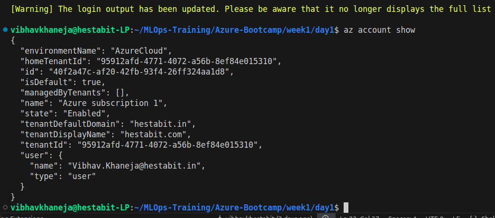
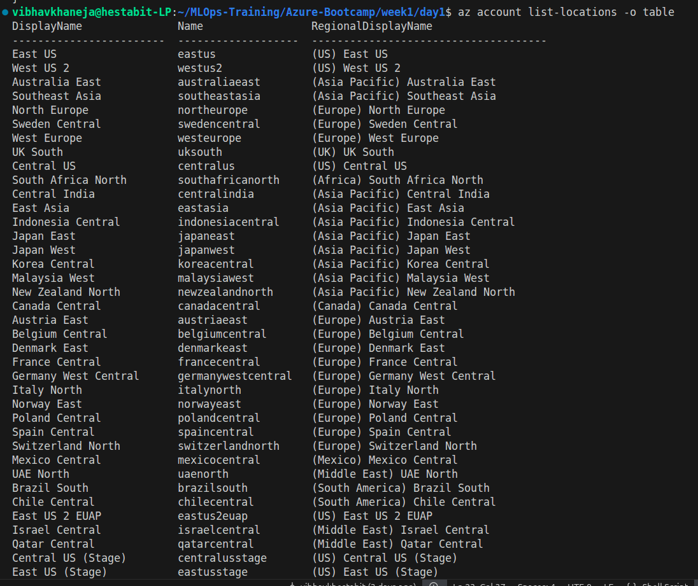
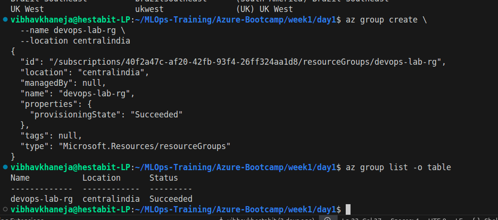
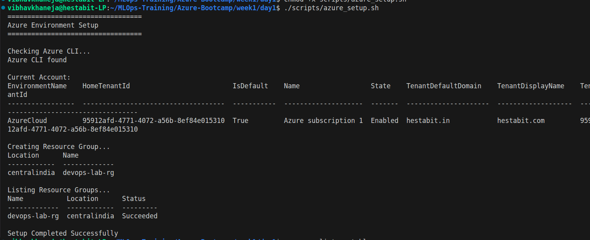

# Week 1 - Day 1: Azure Orientation

## Objective

The goal of Day 1 was to understand Azure fundamentals, set up an Azure environment, learn how Azure resources are organized, and create the first Azure resource using both the Azure Portal and Azure CLI.

---

## Learning Outcomes

By the end of Day 1, I was able to:

* Create and access an Azure account
* Understand Azure subscription and billing concepts
* Install and use Azure CLI
* Authenticate Azure CLI using Azure credentials
* Explore Azure account information
* Understand Azure regions and datacenter locations
* Create and manage Azure Resource Groups
* Build a simple automation script using Azure CLI

---

## Key Concepts Learned

### Tenant

A Tenant represents an Azure organization and acts as the identity boundary for users, groups, and subscriptions.

Example:

Tenant
└── Subscription
└── Resource Groups
└── Resources

---

### Subscription

A Subscription is the billing and management boundary within Azure. All resources are billed against a subscription.

Current Subscription:

* Name: Azure subscription 1
* State: Enabled

---

### Resource Group

A Resource Group is a logical container used to organize Azure resources.

Benefits:

* Simplified management
* Easier cleanup
* Role-based access control
* Cost tracking

Created Resource Group:

* Name: devops-lab-rg
* Region: centralindia

---

### Azure Regions

Azure regions are physical Microsoft datacenters distributed globally.

Important regions explored:

* centralindia
* southindia
* westindia
* eastus
* westus2

For this bootcamp, centralindia was selected as the default region.

---

### Azure Portal vs Azure CLI

Azure resources can be managed through:

1. Azure Portal (GUI)
2. Azure CLI (Command Line Interface)

As DevOps engineers, Azure CLI provides automation and Infrastructure-as-Code capabilities that are preferred for production environments.

---

## Exercises Completed

### Exercise 1.1

Created Azure account and activated free Azure credits.

Status: Completed

### Exercise 1.2

Verified Azure CLI installation and authenticated using Azure CLI.

Status: Completed

### Exercise 1.3

Created Resource Group using Azure CLI.

Resource Group:

devops-lab-rg

Status: Completed

### Exercise 1.4

Listed all Azure regions using Azure CLI.

Status: Completed

### Exercise 1.5

Created automation script:

scripts/azure_setup.sh

Status: Completed

---

## Script Created

azure_setup.sh

Purpose:

* Verify Azure CLI installation
* Display Azure account information
* Create Resource Group
* List existing Resource Groups

---

## Commands Practiced

* az version
* az login
* az account show
* az account list-locations
* az group create
* az group list

---

## Screenshots

---

## Day 1 Summary

Day 1 introduced the Azure ecosystem and foundational concepts required for cloud administration. I learned how Azure organizes resources using tenants, subscriptions, and resource groups, explored global Azure regions, and used Azure CLI to create and manage cloud resources. These concepts form the foundation for upcoming exercises involving virtual machines, networking, storage, containers, Kubernetes, and AI services.
