# Week 1 - Day 2

# Azure Virtual Machines & Networking

## Objective

The objective of Day 2 was to understand how Azure provisions and manages Virtual Machines along with the networking infrastructure required to securely access and expose applications running inside those machines.

Unlike local virtualization platforms such as VirtualBox or VMware, Azure provisions compute, storage, networking, security, and public connectivity as managed cloud resources. The goal was to create a Linux Virtual Machine, connect to it through SSH, install Nginx, and make the application accessible over the internet.

---

# Architecture

```text
Internet
    │
    ▼
Public IP Address
    │
    ▼
Network Security Group (Firewall)
    │
    ▼
Network Interface
    │
    ▼
Subnet (10.0.1.0/24)
    │
    ▼
Virtual Network (10.0.0.0/16)
    │
    ▼
Ubuntu Virtual Machine
    │
    ▼
Nginx Web Server
```

---

# Exercise 2.1 - Virtual Network and Subnet

A Virtual Network (VNet) is Azure's equivalent of a private network inside the cloud.

Created:

```text
VNet:
  devops-vnet
  10.0.0.0/16

Subnet:
  web-subnet
  10.0.1.0/24
```

Purpose:

* Provides private communication between Azure resources.
* Defines IP address ranges.
* Isolates workloads.
* Acts similarly to networking inside a data center.

Learning:

A VNet is the foundation of nearly every Azure deployment. Virtual Machines, databases, Kubernetes clusters, and storage services can all be connected through VNets.

---

# Exercise 2.2 - Virtual Machine Creation

Created:

```text
VM Name:
  devops-vm

OS:
  Ubuntu 22.04 LTS

Size:
  Standard_B2ats_v2
```

During VM creation Azure automatically provisioned:

* Virtual Machine
* Managed Disk
* Public IP Address
* Network Interface
* Network Security Group
* OS Disk

Learning:

A Virtual Machine is not a single resource. It is a collection of multiple Azure services working together.

When running:

```bash
az vm create
```

Azure orchestrates the entire infrastructure stack automatically.

---

# Exercise 2.3 - Network Security Group (NSG)

An NSG acts as a cloud firewall.

Purpose:

* Controls inbound traffic.
* Controls outbound traffic.
* Defines which ports are accessible.

Rules used:

```text
22/TCP  -> SSH
80/TCP  -> HTTP
```

Learning:

Without NSG rules, services may be running but remain inaccessible from the internet.

Security in Azure is implemented at the network layer before traffic reaches the operating system.

---

# Exercise 2.4 - SSH Access

Connected to the VM using:

```bash
ssh azureuser@<PUBLIC_IP>
```

Verified:

```bash
whoami
hostname
pwd
free -h
df -h
```

Learning:

The VM behaves exactly like a remote Linux server.

Skills learned during Linux administration and DevOps are directly transferable to cloud environments.

---

# Exercise 2.5 - Nginx Installation

Installed:

```bash
sudo apt update
sudo apt install nginx -y
```

Verified:

```bash
systemctl status nginx
```

Result:

```text
Active: running
```

Opened port 80 using Azure CLI and accessed the application from a browser.

Learning:

Cloud Virtual Machines are real servers.

Any software that runs on a traditional Linux machine can run on an Azure VM.

---

# Exercise 2.6 - Understanding Azure Resources

Resource inspection revealed that Azure automatically created several supporting resources.

Examples:

```text
Virtual Machine
Managed Disk
Network Interface
Public IP
Network Security Group
Virtual Network
Subnet
```

Learning:

Cloud infrastructure is built from modular resources.

Understanding these resources is essential for troubleshooting, automation, cost optimization, and architecture design.

---

# Exercise 2.7 - Docker Nginx vs Azure VM Nginx

## Docker Deployment

```text
Host Machine
    │
    ▼
Docker Engine
    │
    ▼
Nginx Container
```

Characteristics:

* Starts in seconds.
* Lightweight.
* Shares host OS kernel.
* Ideal for microservices.
* Lower operational cost.
* Easy scaling and replacement.

---

## Azure VM Deployment

```text
Azure Infrastructure
    │
    ▼
Virtual Machine
    │
    ▼
Ubuntu OS
    │
    ▼
Nginx
```

Characteristics:

* Full operating system.
* Higher resource consumption.
* Greater isolation.
* Longer startup times.
* Suitable for legacy applications and custom server environments.

---

## Comparison

| Feature        | Docker Container | Azure VM               |
| -------------- | ---------------- | ---------------------- |
| Startup Time   | Seconds          | Minutes                |
| Includes OS    | No               | Yes                    |
| Resource Usage | Low              | Higher                 |
| Isolation      | Process Level    | VM Level               |
| Cost           | Lower            | Higher                 |
| Scaling        | Easy             | Slower                 |
| Maintenance    | Minimal          | OS Management Required |

---

# Key Concepts Learned

* Azure Subscription
* Resource Groups
* Regions
* Virtual Networks
* Subnets
* Virtual Machines
* Public IP Addresses
* Network Security Groups
* SSH Authentication
* Nginx Deployment
* Cloud Networking Fundamentals
* Infrastructure Provisioning via CLI

---

# Real-World Relevance

The workflow completed in this lab closely resembles the first steps performed by cloud engineers, DevOps engineers, and platform engineers when deploying infrastructure in Azure.

These concepts form the foundation for:

* Azure Kubernetes Service (AKS)
* Load Balancers
* Application Gateways
* Azure Storage
* Managed Databases
* Infrastructure as Code (Terraform/Bicep)
* Production Cloud Architectures

---

# Screenshots

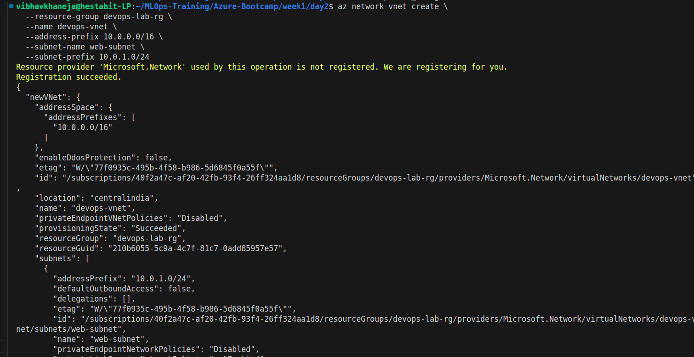
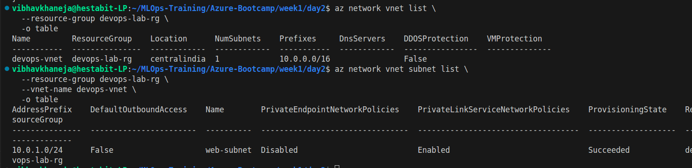
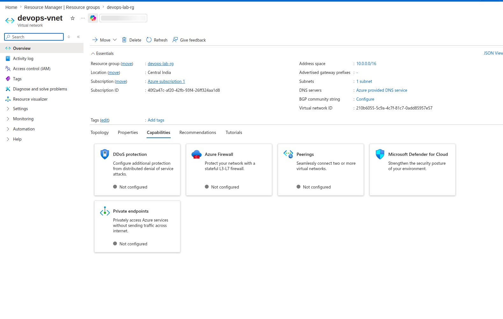
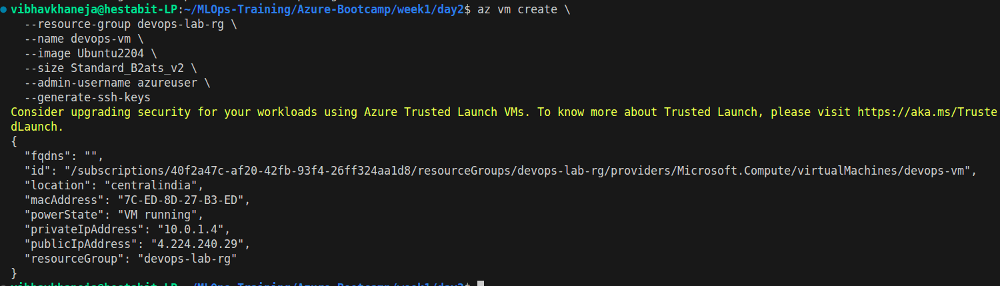
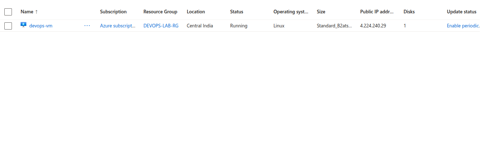
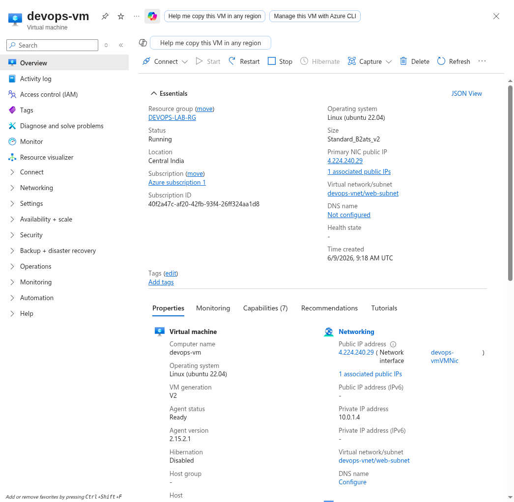
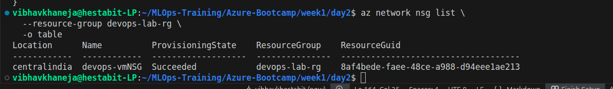
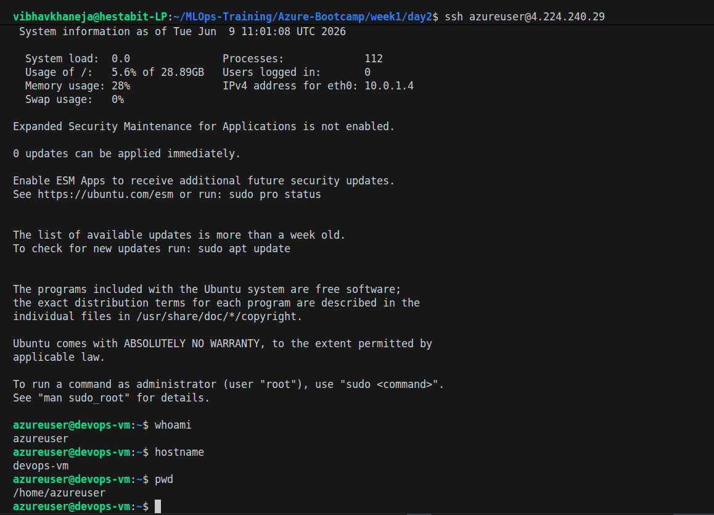
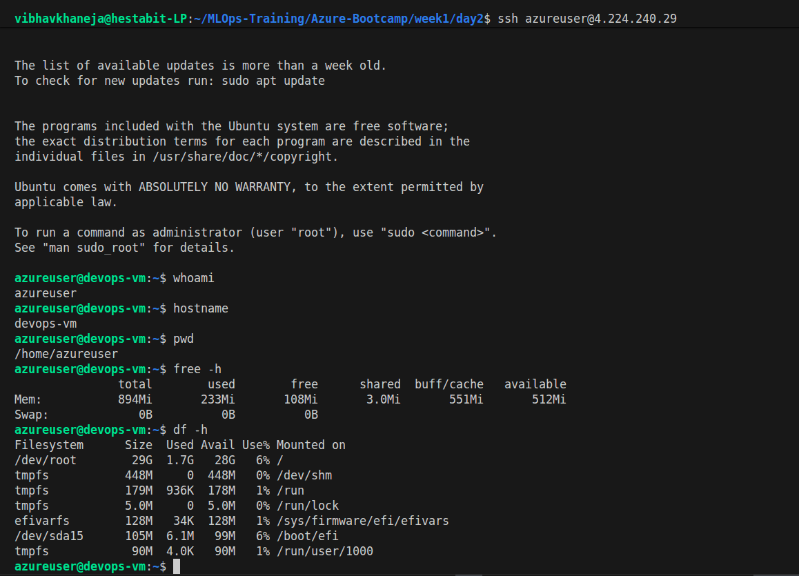
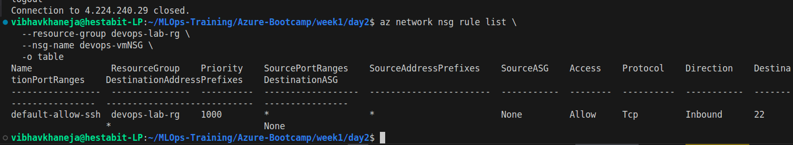
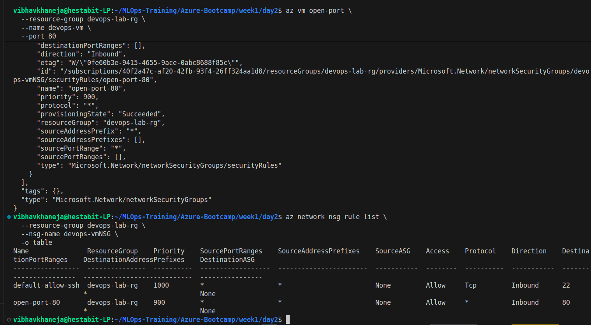
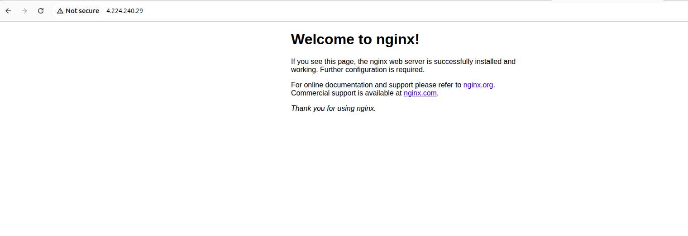
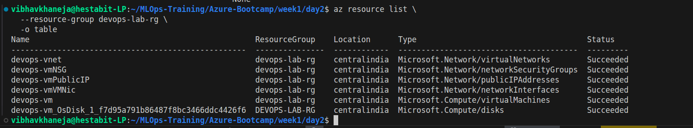
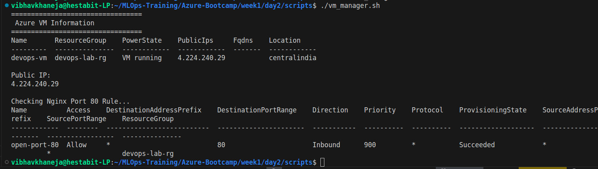

# Cost Management Notes

Since this environment was created for learning:

When not actively using the VM:

```bash
az vm deallocate \
  --resource-group devops-lab-rg \
  --name devops-vm
```

After completing all exercises:

```bash
az group delete \
  --name devops-lab-rg \
  --yes
```

Always delete unused resources to avoid unnecessary consumption of Azure credits.
