# Day 3 - Azure Storage

## Objective

The goal of Day 3 was to understand Azure Storage services and learn how cloud applications store, retrieve, share, and manage files.

Throughout this lab we worked with:

* Azure Storage Accounts
* Blob Storage
* Blob Containers
* File Upload and Download Operations
* Shared Access Signatures (SAS)
* Azure File Shares
* Storage Tiers (Hot, Cool, Archive)
* Storage Automation using Azure CLI

By the end of the exercises we successfully created a Storage Account, uploaded files, generated secure access URLs, mounted Azure File Shares on a Virtual Machine, and automated common storage operations using a Bash script.

---

# Azure Storage Overview

Azure Storage is Microsoft's cloud-based stora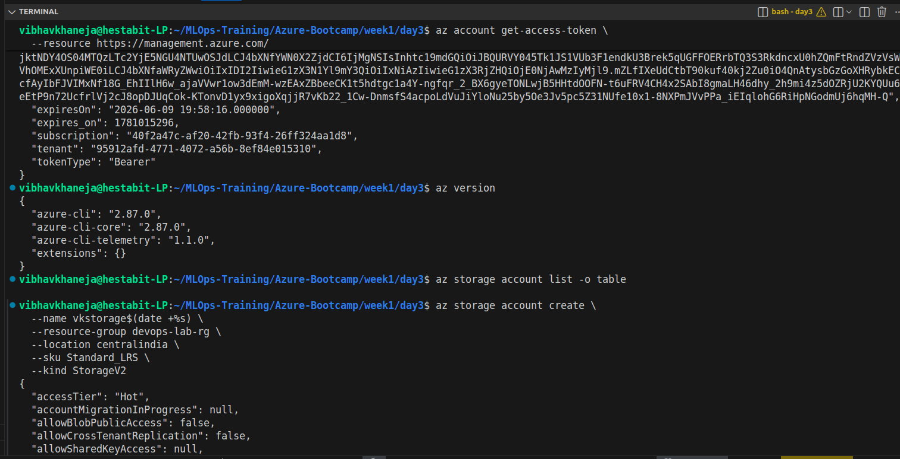

ge platform that provides highly available, scalable, durable, and secure storage services.

Azure Storage supports multiple storage services:

| Service       | Purpose                                                        |
| ------------- | -------------------------------------------------------------- |
| Blob Storage  | Store unstructured data such as files, images, videos, backups |
| File Shares   | SMB/NFS network shares for VMs and applications                |
| Queue Storage | Message queues for application communication                   |
| Table Storage | NoSQL key-value data storage                                   |
| Managed Disks | Storage used by Azure Virtual Machines                         |

In this lab we focused primarily on Blob Storage and Azure File Shares.

---

# Exercise 3.1 - Create a Storage Account

## Purpose

A Storage Account acts as the top-level container for all Azure Storage services.

Every blob, file share, queue, and table belongs to a storage account.

Architecture:

Storage Account
├── Blob Containers
├── File Shares
├── Queues
└── Tables

### Configuration Used

* Location: Central India
* SKU: Standard_LRS
* Kind: StorageV2

### Understanding the Settings

#### Standard_LRS

Locally Redundant Storage (LRS)

Azure keeps three copies of data inside a single datacenter.

Benefits:

* Lowest cost
* High durability
* Ideal for learning environments

#### StorageV2

General Purpose v2 Storage Account

Supports:

* Blob Storage
* File Shares
* Lifecycle Policies
* Tiering
* SAS Tokens

This is the recommended storage account type for most workloads.

---

# Exercise 3.2 - Create Container and Upload Blob

## What is a Blob?

A Blob (Binary Large Object) is any file stored inside Azure Blob Storage.

Examples:

* Images
* Videos
* PDFs
* Text Files
* Backup Archives
* Application Assets

### Blob Storage Structure

Storage Account
└── Container
├── file1.txt
├── image.png
└── backup.zip

### Container Created

training-container

### File Uploaded

sample.txt

The upload operation demonstrated how applications can store files inside Azure without managing physical storage infrastructure.

---

# Exercise 3.3 - Generate a SAS URL

## What is SAS?

SAS stands for Shared Access Signature.

It is a secure, temporary access token that grants limited access to Azure Storage resources.

Instead of exposing account keys, Azure generates a signed URL that can be shared safely.

Example:

https://storageaccount.blob.core.windows.net/container/file.txt?<sas-token>

### Benefits

* Time-limited access
* Permission-based access
* No account key exposure
* Easy sharing of files

### Permissions

Common permissions:

* Read (r)
* Write (w)
* Delete (d)
* List (l)

### What We Did

Generated a read-only SAS URL for sample.txt and opened it directly in a browser.

This verified that users can access blobs securely without requiring Azure authentication.

---

# Exercise 3.4 - Azure File Share

## What is Azure Files?

Azure Files provides managed SMB file shares that can be mounted by:

* Linux VMs
* Windows VMs
* Containers
* Applications

Unlike Blob Storage, Azure Files behaves like a traditional network drive.

### Architecture

Storage Account
└── File Share
└── Mounted on VM

### What We Performed

Created:

training-share

Mounted it on the Day 2 VM:

/azurefiles

Created:

test.txt

Verification was completed both:

* Inside the VM
* Through Azure Portal

### Why Azure Files Matter

Useful for:

* Shared application data
* Lift-and-shift migrations
* Centralized file storage
* Multi-VM shared access

---

# Exercise 3.5 - Storage Automation Script

## storage_ops.sh

Purpose:

Automate repetitive Azure Storage tasks.

### Workflow

1. Create sample file
2. Retrieve storage account key
3. Upload blob
4. List blobs
5. Generate SAS URL
6. Cleanup local files

### Benefits

Automation provides:

* Faster deployments
* Reduced human error
* Repeatability
* Infrastructure consistency

This is the same philosophy used in DevOps pipelines and Infrastructure as Code.

---

# Exercise 3.6 - Storage Tiers

Azure Blob Storage offers different storage tiers depending on access frequency.

## Hot Tier

Designed for frequently accessed data.

Examples:

* Application assets
* Website images
* Active project files

Characteristics:

* Highest storage cost
* Lowest retrieval cost

---

## Cool Tier

Designed for infrequently accessed data.

Examples:

* Monthly backups
* Reports
* Historical logs

Characteristics:

* Lower storage cost
* Higher retrieval cost

---

## Archive Tier

Designed for rarely accessed data.

Examples:

* Compliance records
* Long-term backups
* Regulatory archives

Characteristics:

* Lowest storage cost
* Highest retrieval cost
* Retrieval may take hours

---

# Tier Comparison

| Tier    | Storage Cost | Retrieval Cost | Usage Pattern     |
| ------- | ------------ | -------------- | ----------------- |
| Hot     | High         | Low            | Frequent access   |
| Cool    | Medium       | Medium         | Occasional access |
| Archive | Very Low     | High           | Rare access       |

---

# Key Concepts Learned

## Blob Storage

Object storage service for unstructured data.

## Containers

Logical folders used to organize blobs.

## SAS Tokens

Secure, temporary access mechanisms.

## Azure Files

Managed SMB network file shares.

## Storage Tiers

Cost optimization based on access patterns.

## Automation

Using Azure CLI and shell scripts to perform repeatable operations.

---

# Learning Outcomes Achieved

Successfully learned:

✓ Create Azure Storage Accounts

✓ Create Blob Containers

✓ Upload Files to Blob Storage

✓ Generate SAS URLs

✓ Access Files through Browser

✓ Create Azure File Shares

✓ Mount Azure File Shares on Linux VM

✓ Automate Storage Operations

✓ Understand Storage Tiering Strategies

✓ Explore Cost Optimization Concepts

---

# Screenshots

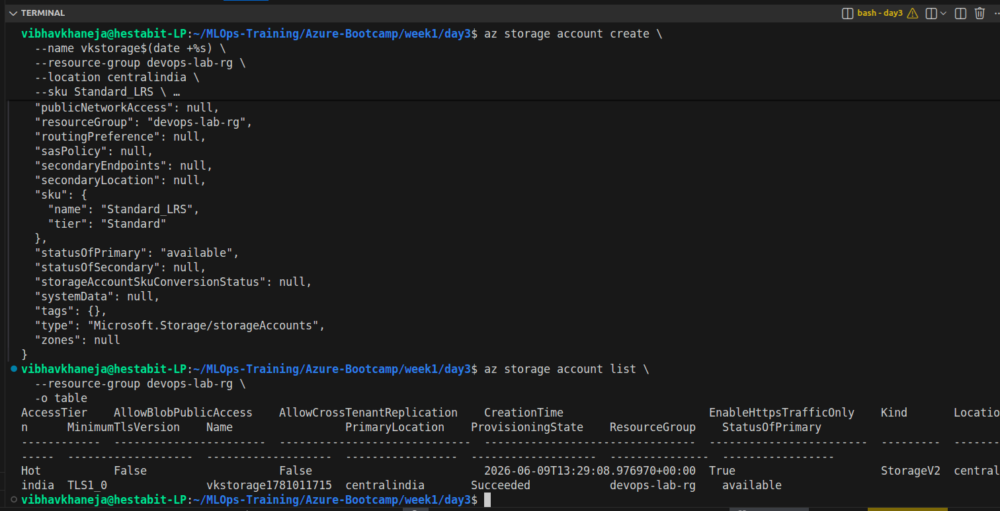
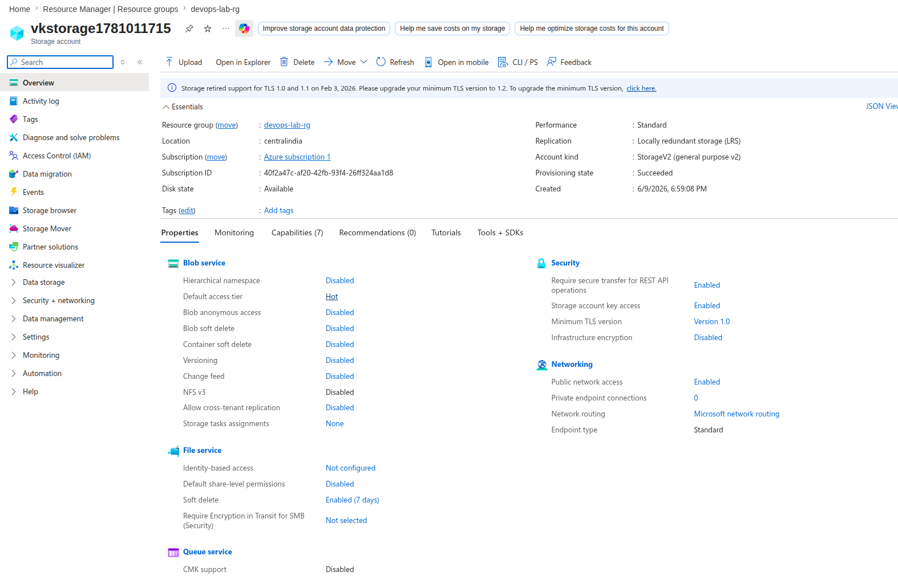
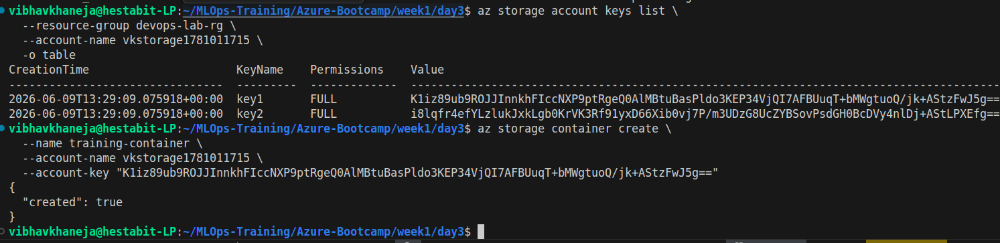
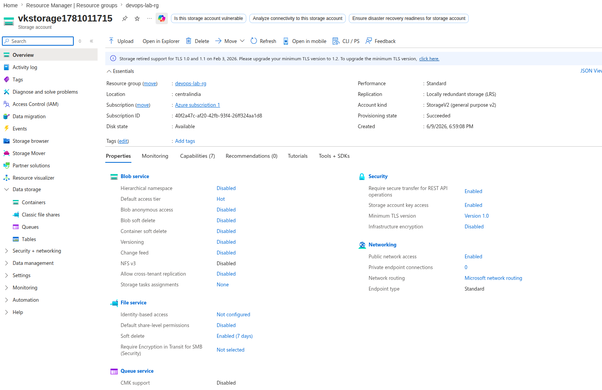
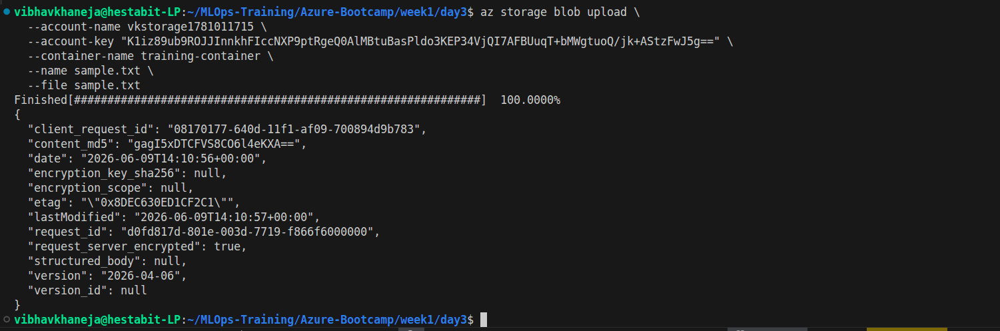
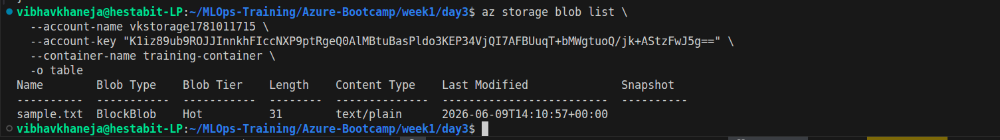
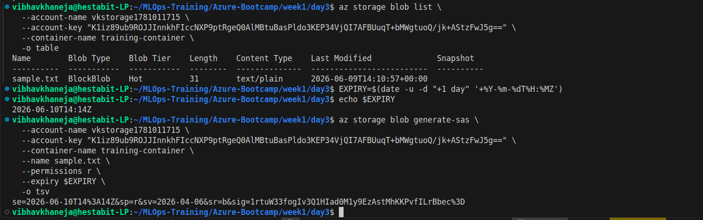
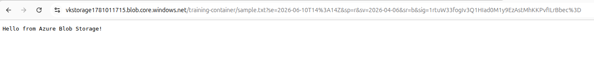
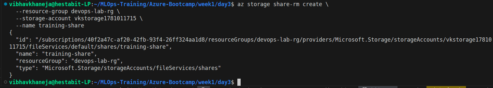
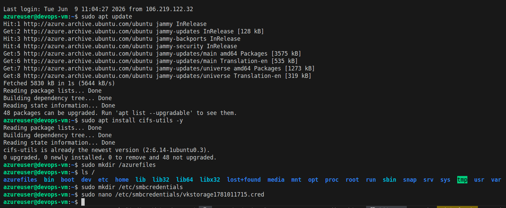
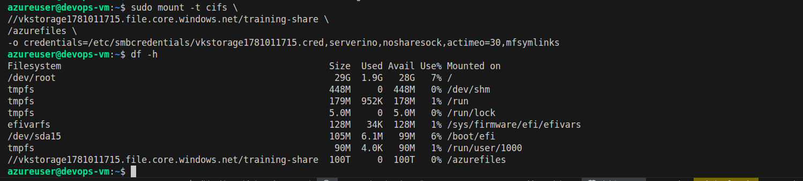
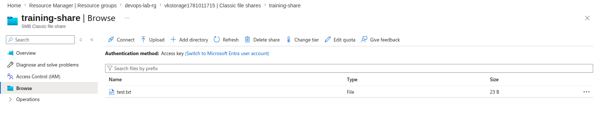
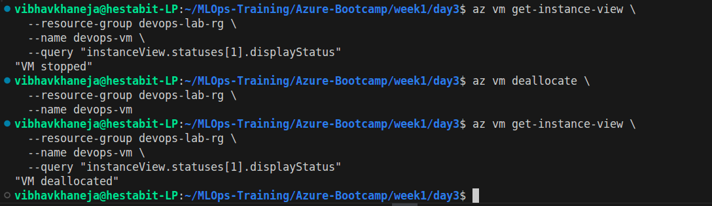
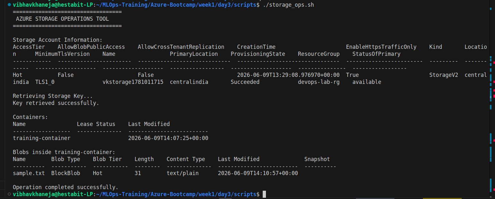
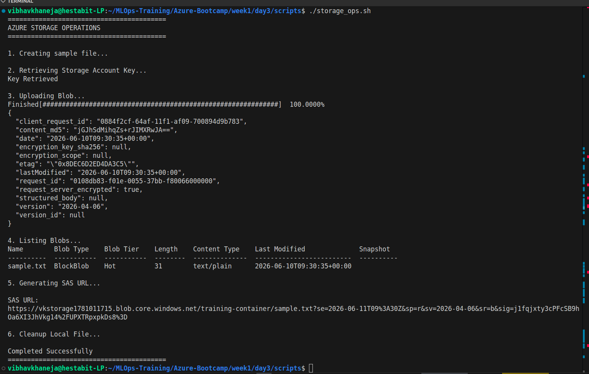

# Resources Created

Resource Group:
devops-lab-rg

Storage Account:
vkstorage1781011715

Container:
training-container

File Share:
training-share

Virtual Machine:
devops-vm

Script:
storage_ops.sh

---

# Real World Relevance

The concepts learned in Day 3 are used extensively in:

* DevOps Pipelines
* Backup Systems
* CI/CD Artifact Storage
* Data Lakes
* Web Applications
* Kubernetes Persistent Storage
* Enterprise File Sharing
* Disaster Recovery Solutions

These storage services form a critical component of modern cloud-native architectures.
