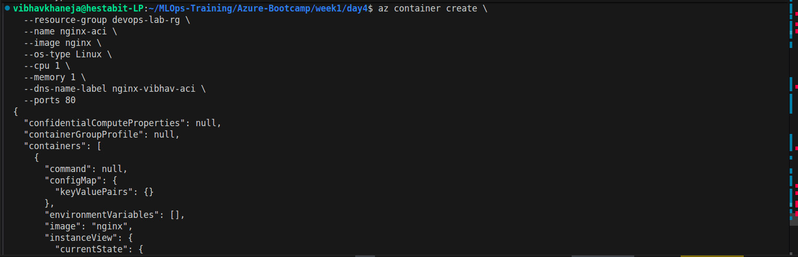
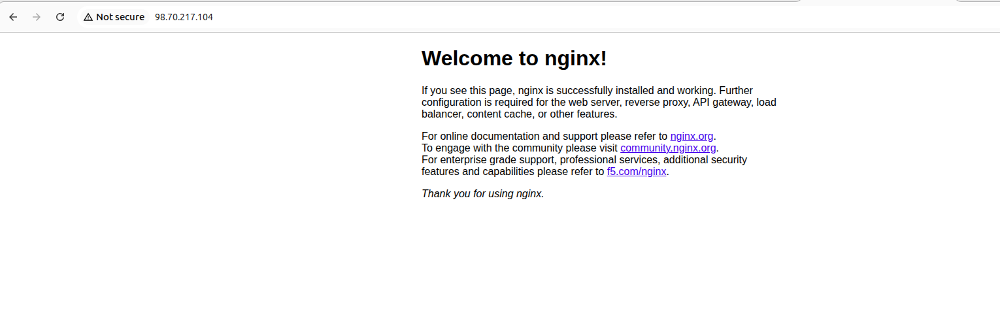
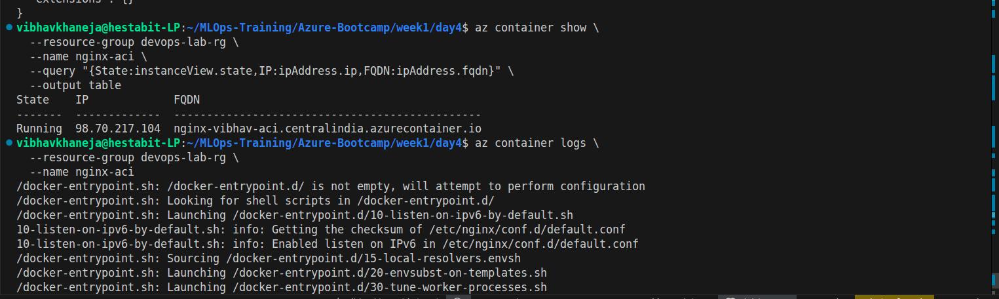
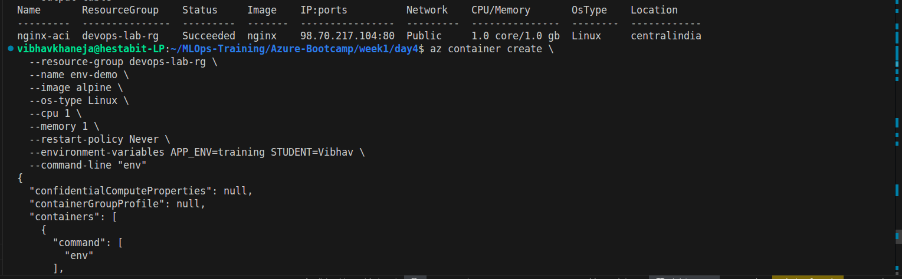
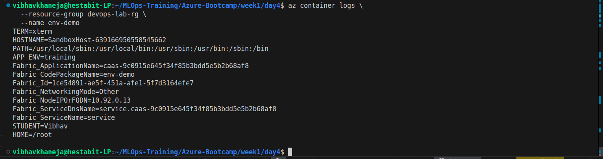
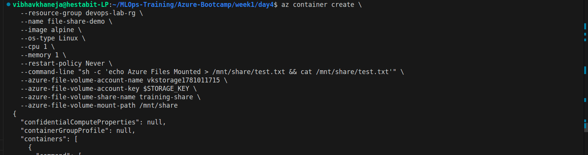
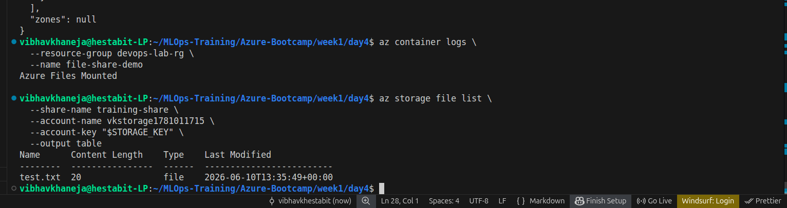
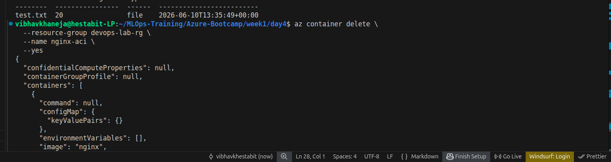
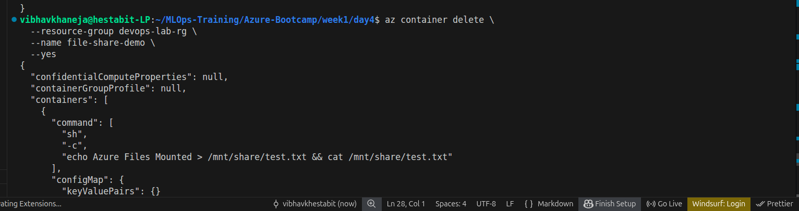

# Day 4 – Azure Container Instances (ACI)

## Overview

Day 4 focused on Azure Container Instances (ACI), Microsoft's serverless container platform. The objective was to deploy Docker containers directly to Azure without provisioning virtual machines or setting up container orchestration platforms such as Kubernetes.

This day served as a bridge between Docker fundamentals and cloud-native container deployment. Instead of running containers locally with Docker, we learned how Azure manages the underlying infrastructure while allowing us to focus only on the container image and runtime configuration.

By the end of the lab, we successfully deployed containers to Azure, exposed them through public endpoints, streamed container logs, injected runtime environment variables, and mounted persistent Azure File Shares into running containers.

---

# Learning Objectives

* Understand Azure Container Instances (ACI)
* Deploy public container images directly to Azure
* Expose applications through public IP addresses
* Stream and inspect container logs
* Inject environment variables at runtime
* Mount Azure Files into containers
* Understand ephemeral vs persistent storage
* Compare Docker containers with Azure Container Instances
* Learn the concept of Container Groups and Sidecar Containers

---

# What is Azure Container Instances?

Azure Container Instances (ACI) is a serverless container service that allows applications to run directly in Azure without managing:

* Virtual Machines
* Operating Systems
* Docker Hosts
* Kubernetes Clusters

Traditional container deployment:

```text
Application
    ↓
Docker
    ↓
Virtual Machine
    ↓
Cloud Infrastructure
```

ACI deployment:

```text
Application
    ↓
Container Image
    ↓
Azure Container Instances
```

Azure automatically manages all infrastructure components behind the scenes.

---

# Exercise 4.1 – Deploy a Public Container

## Objective

Deploy a public Docker image to Azure using Azure Container Instances.

## Implementation

We deployed the official Nginx image:

```bash
az container create \
  --resource-group devops-lab-rg \
  --name nginx-aci \
  --image nginx \
  --os-type Linux \
  --cpu 1 \
  --memory 1 \
  --dns-name-label nginx-vibhav-aci \
  --ports 80
```

## Result

Azure created:

* Container Group
* Public IP Address
* DNS Endpoint
* Running Nginx Container

Application became accessible through:

```text
http://<public-ip>
```

and

```text
http://<dns-name>.azurecontainer.io
```

## Key Learning

Unlike Docker running locally, Azure requires explicit resource allocation:

* CPU
* Memory
* Operating System

because Azure must reserve cloud resources before launching a container.

---

# Exercise 4.2 – Port Exposure and Log Streaming

## Objective

Understand how applications running inside containers are exposed to the internet and how logs can be collected.

## Implementation

Container details were inspected using:

```bash
az container show
```

Logs were viewed using:

```bash
az container logs
```

## Observations

Nginx startup logs showed:

* Container initialization
* Nginx startup sequence
* Incoming HTTP requests
* Browser requests for favicon

Example:

```text
GET / HTTP/1.1 200
```

## Key Learning

Instead of SSH-ing into a VM and checking log files manually, Azure provides direct access to container logs through the platform.

This is a core cloud-native operational pattern.

---

# Exercise 4.3 – Environment Variables

## Objective

Inject configuration into containers without modifying the image.

## Implementation

Environment variables were passed during container creation:

```bash
--environment-variables \
APP_ENV=training \
STUDENT=Vibhav
```

Container logs confirmed:

```text
APP_ENV=training
STUDENT=Vibhav
```

## Why This Matters

Container images should remain immutable.

Different environments can use the same image:

```text
Development
Testing
Production
```

while receiving different configuration values through environment variables.

## Key Learning

Runtime configuration should be separated from application code.

This concept directly maps to:

* Docker Compose
* Kubernetes ConfigMaps
* Kubernetes Secrets
* AKS Deployments
* CI/CD Pipelines

---

# Exercise 4.4 – Azure Files Volume Mount

## Objective

Persist container data beyond the lifetime of the container.

## The Problem

Containers use ephemeral storage.

```text
Container Created
       ↓
Data Written
       ↓
Container Deleted
       ↓
Data Lost
```

## Solution

Mount Azure Files into the container.

Existing Day 3 resources:

```text
Storage Account:
vkstorage1781011715

File Share:
training-share
```

were reused.

Container mounted the share at:

```text
/mnt/share
```

and created:

```text
test.txt
```

## Verification

Container logs:

```text
Azure Files Mounted
```

Azure Files listing:

```text
test.txt
```

## Architecture

```text
Azure Files Share
(training-share)
        │
        ▼
Container
└── /mnt/share
```

## Key Learning

This exercise demonstrated the difference between:

### Ephemeral Storage

```text
Container deleted
      ↓
Data deleted
```

### Persistent Storage

```text
Container deleted
      ↓
Azure Files remain
      ↓
Data preserved
```

This concept is fundamental for cloud-native applications and directly connects to Kubernetes Persistent Volumes.

---

# Exercise 4.5 – Docker vs Azure Container Instances

## Docker

```bash
docker run -d -p 80:80 nginx
```

## Azure Container Instances

```bash
az container create ...
```

## Comparison

| Docker                | Azure Container Instances |
| --------------------- | ------------------------- |
| Container Image       | Container Image           |
| Docker Engine         | Azure Managed Runtime     |
| Local Host            | Azure Infrastructure      |
| docker logs           | az container logs         |
| docker inspect        | az container show         |
| Volume Mount          | Azure Files Mount         |
| Environment Variables | Environment Variables     |

## Key Learning

Docker requires infrastructure management.

ACI abstracts infrastructure management and focuses only on running containers.

---

# Exercise 4.6 – Container Groups and Sidecar Pattern

## Concept

Multiple containers can run inside a single Container Group.

```text
Container Group
├── Main Application
└── Sidecar Container
```

Both containers can share:

* Network
* Storage
* Lifecycle

## Example Use Cases

* Log Collectors
* Monitoring Agents
* Reverse Proxies
* Configuration Helpers

## Connection to Kubernetes

ACI Container Groups are conceptually similar to Kubernetes Pods.

```text
ACI Container Group
        ≈
Kubernetes Pod
```

The Sidecar Pattern was previously implemented during Kubernetes training and therefore understood conceptually without additional deployment.

---

# Screenshots











---

# Important Concepts Learned

## Azure Container Instances (ACI)

Serverless platform for running containers without managing infrastructure.

---

## Container Group

A logical grouping of one or more containers sharing resources.

---

## Environment Variable Injection

Passing runtime configuration without rebuilding images.

---

## Log Streaming

Viewing application logs directly through Azure.

---

## Ephemeral Storage

Storage that exists only while the container exists.

---

## Persistent Storage

Storage that survives container deletion.

Implemented using Azure Files.

---

# Day 4 Architecture Summary

```text
Azure Container Instances
│
├── Nginx Container
│   ├── Public IP
│   ├── DNS Name
│   └── Port 80
│
├── Environment Variable Demo
│   ├── APP_ENV=training
│   └── STUDENT=Vibhav
│
└── Azure Files Demo
    ├── training-share
    └── /mnt/share
```

---

# Cleanup Performed

All temporary Azure Container Instances were deleted:

* nginx-aci
* env-demo
* file-share-demo

Resources retained:

* Resource Group
* Storage Account
* Azure File Share
* Deallocated Virtual Machine

---

# Conclusion

Day 4 introduced Azure Container Instances as a lightweight and serverless approach to container deployment. We successfully deployed containers to Azure, exposed services publicly, streamed logs, injected environment variables, and mounted persistent Azure storage.

The most important takeaway from this lab is the distinction between ephemeral container storage and persistent cloud storage. Understanding this concept is critical for designing reliable cloud-native applications and provides a strong foundation for future topics such as Azure Container Registry (ACR), Azure Kubernetes Service (AKS), Persistent Volumes, and CI/CD pipelines.
