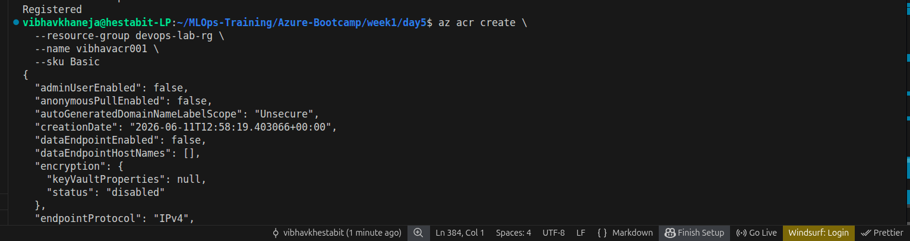
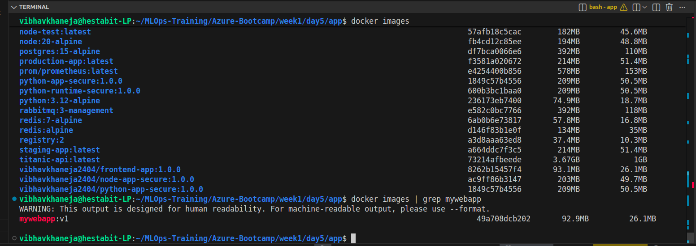
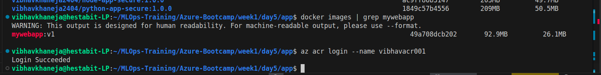
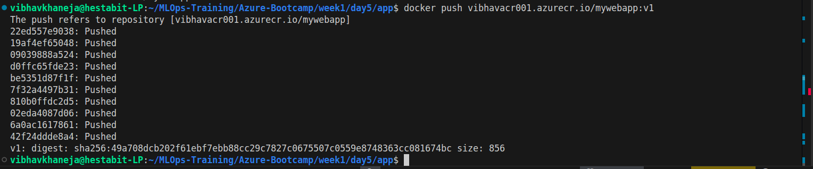
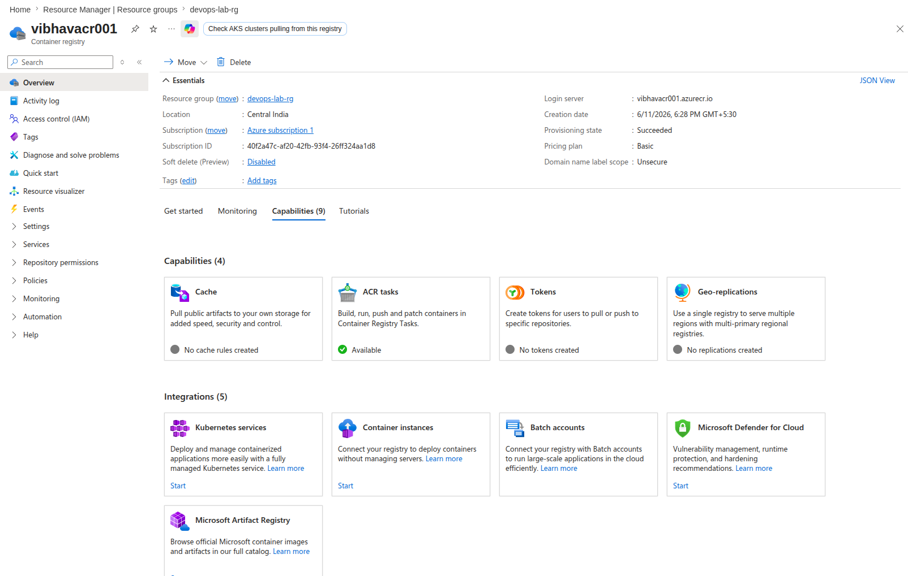
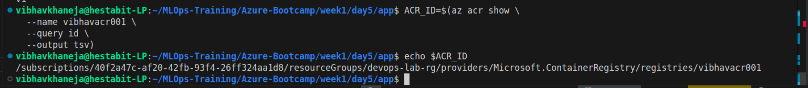
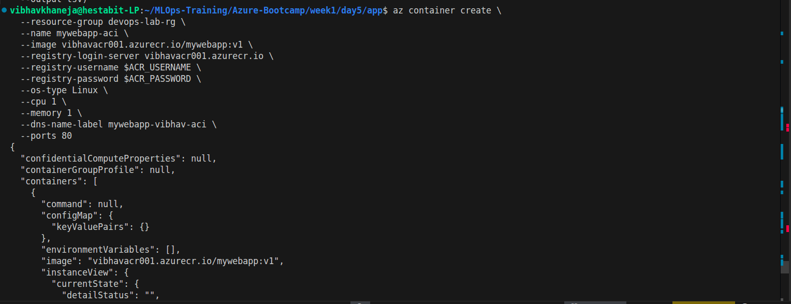
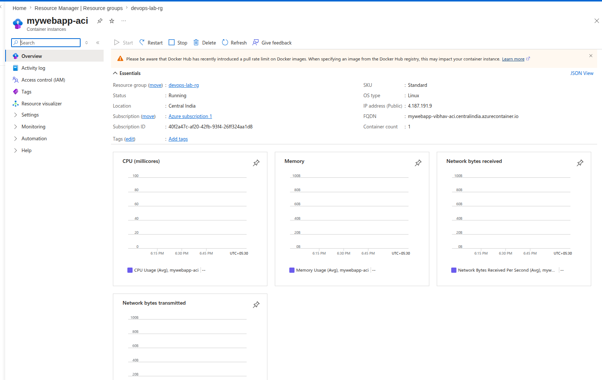
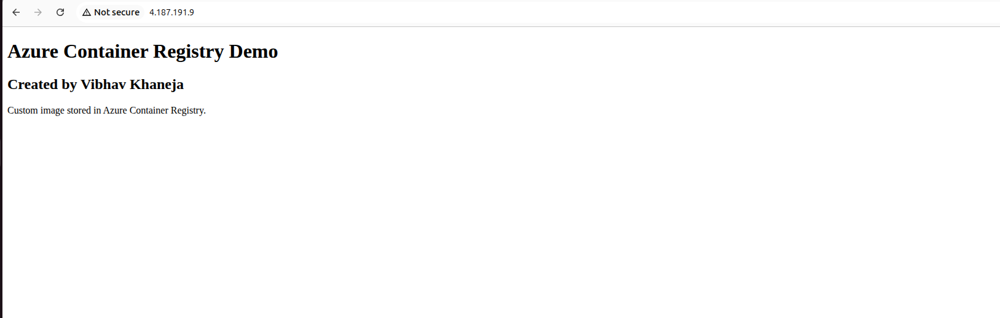
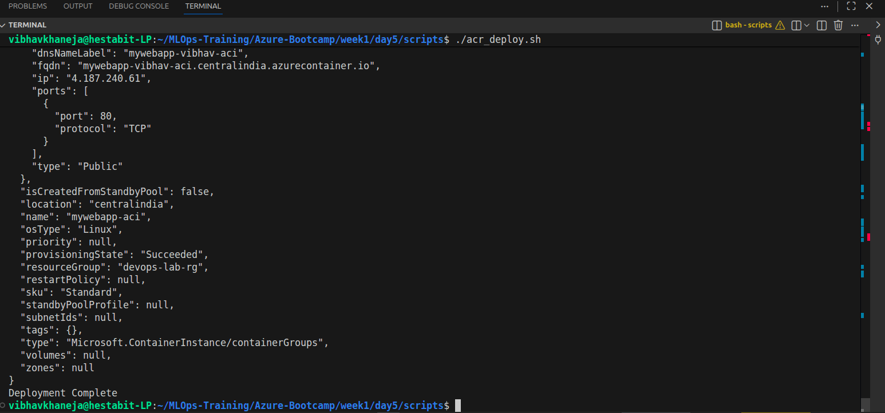

# Day 5 - Azure Container Registry (ACR)

## Objective

The objective of Day 5 was to move beyond public Docker images and learn how to build, store, and deploy our own container images using Azure Container Registry (ACR). We created a private registry in Azure, built a custom Docker image, pushed it to the registry, and deployed it to Azure Container Instances (ACI).

This exercise represents the foundation of modern cloud-native application delivery. Instead of deploying pre-built public images, we became responsible for packaging and publishing our own application images.

---

# Learning Outcomes

By the end of Day 5 we were able to:

* Create an Azure Container Registry (ACR)
* Build a custom Docker image using a Dockerfile
* Tag container images for private registries
* Authenticate Docker with Azure Container Registry
* Push images to ACR
* Store and manage image versions using tags
* Deploy private images from ACR to Azure Container Instances
* Understand the difference between public and private container registries
* Automate the deployment workflow using a shell script
* Understand where vulnerability scanning fits into a production CI/CD pipeline

---

# Architecture Overview

```text
Custom Web Application
          │
          ▼
      Dockerfile
          │
          ▼
    Docker Build
          │
          ▼
      mywebapp:v1
          │
          ▼
Azure Container Registry
(vibhavacr001)
          │
          ▼
Azure Container Instance
(mywebapp-aci)
          │
          ▼
Public URL
```

---

# Exercise 5.1 - Creating Azure Container Registry

We created a private Azure Container Registry named:

```text
vibhavacr001
```

using the Basic SKU.

ACR serves as Azure's managed Docker registry service. It functions similarly to Docker Hub but is intended for private organizational workloads. Images stored inside ACR can be securely consumed by Azure services such as ACI, AKS, Azure App Service, and Azure DevOps pipelines.

---

# Exercise 5.2 - Building a Custom Docker Image

A simple web application was created using:

```html
index.html
```

and packaged using:

```dockerfile
FROM nginx:alpine

COPY index.html /usr/share/nginx/html/index.html

EXPOSE 80
```

The image was built locally:

```bash
docker build -t mywebapp:v1 .
```

This produced a reusable container image containing our application and all required runtime dependencies.

---

# Exercise 5.3 - Tagging and Pushing to ACR

Container registries require images to be tagged with the registry hostname.

Local image:

```text
mywebapp:v1
```

Tagged image:

```text
vibhavacr001.azurecr.io/mywebapp:v1
```

After authentication using:

```bash
az acr login
```

the image was pushed into ACR using:

```bash
docker push
```

The registry now permanently stores the image and makes it available for deployment from Azure services.

---

# Exercise 5.4 - Deploying from ACR to ACI

The custom image stored in ACR was deployed into Azure Container Instances.

Deployment included:

* Private image pull
* Registry authentication
* Public IP allocation
* Public DNS endpoint creation
* Runtime container execution

The application became accessible through:

```text
http://mywebapp-vibhav-aci.centralindia.azurecontainer.io
```

This demonstrated the complete path from source code to a publicly accessible cloud application.

---

# Exercise 5.5 - Deployment Automation

To reduce manual effort, deployment steps were automated inside:

```text
scripts/acr_deploy.sh
```

The script performs:

1. Docker build
2. Image tagging
3. ACR authentication
4. Image push
5. ACI deployment

This introduces the Infrastructure-as-Code mindset where deployments become repeatable and predictable.

---

# Exercise 5.6 - Vulnerability Scanning Concept

Production environments rarely deploy images directly after building them.

A typical enterprise workflow looks like:

```text
Source Code
      │
      ▼
Docker Build
      │
      ▼
Security Scan
      │
      ▼
Push to Registry
      │
      ▼
Deploy
```

Tools such as Trivy scan container images for:

* Critical vulnerabilities
* High severity vulnerabilities
* Outdated operating system packages
* Known CVEs

If severe vulnerabilities are discovered, deployment pipelines can automatically fail and prevent insecure releases.

Although a full Trivy scan was not available in the current environment, the placement and purpose of vulnerability scanning within the deployment lifecycle were successfully understood.

---

# Key Concepts Learned

## Azure Container Registry (ACR)

A managed private Docker registry provided by Azure.

---

## Image Tagging

The process of assigning registry-qualified names to images before pushing them to remote registries.

Example:

```text
vibhavacr001.azurecr.io/mywebapp:v1
```

---

## Private Container Registry

A secure location where organizations store internal container images that are not publicly accessible.

---

## Container Deployment Pipeline

A repeatable process:

```text
Build
→ Tag
→ Push
→ Deploy
```

that forms the basis of modern DevOps and CI/CD systems.

---

## Managed Identity (Concept)

Managed Identity allows Azure services to authenticate with other Azure services without storing usernames or passwords.

Example:

```text
ACI
 ↓
Managed Identity
 ↓
ACR
```

Although Day 5 deployment used registry credentials, the managed identity pattern was introduced as the preferred production approach.

---

# Screenshots












# Resources Retained for Day 6

The following resources are intentionally being preserved:

```text
devops-vm (Deallocated)
Azure Container Registry
Storage Account
Azure File Share
Virtual Network
Public IP
Network Security Group
```

These resources will be reused during the Week 1 Mini Project.

---

# Conclusion

Day 5 connected Docker fundamentals with Azure-native container delivery. We learned how organizations package applications, store them in private registries, and deploy them to cloud environments. This completed the final major building block required before the Week 1 Mini Project, where storage, container registries, Azure Container Instances, and automation will be combined into a complete end-to-end deployment workflow.
