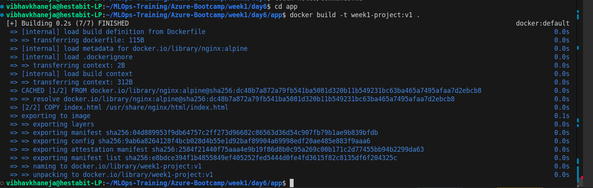
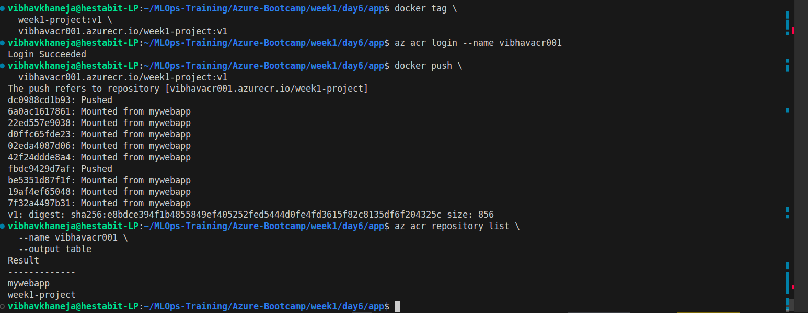
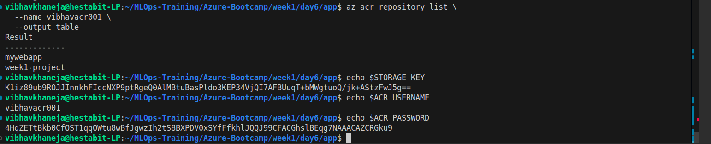
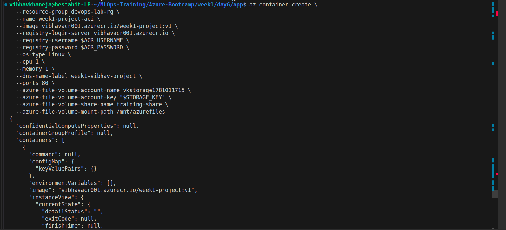
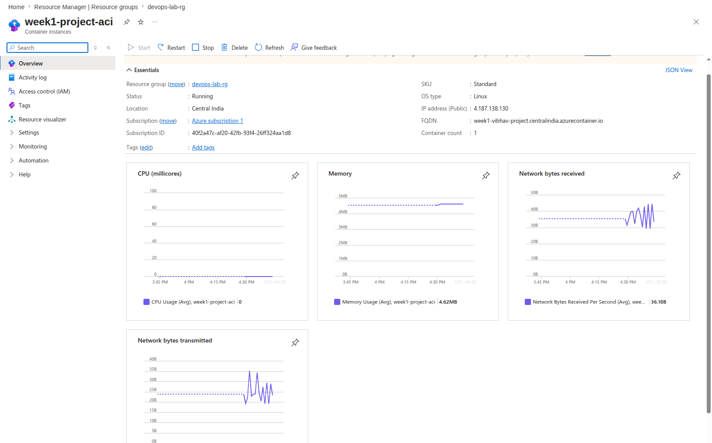
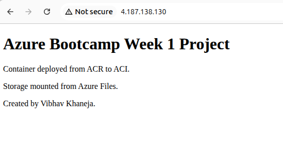
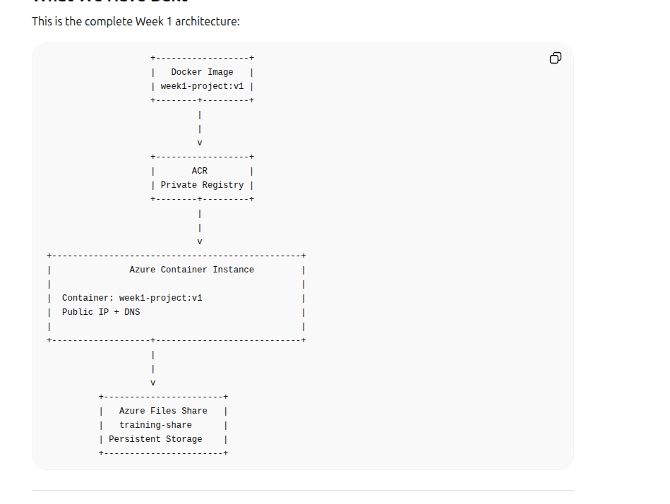
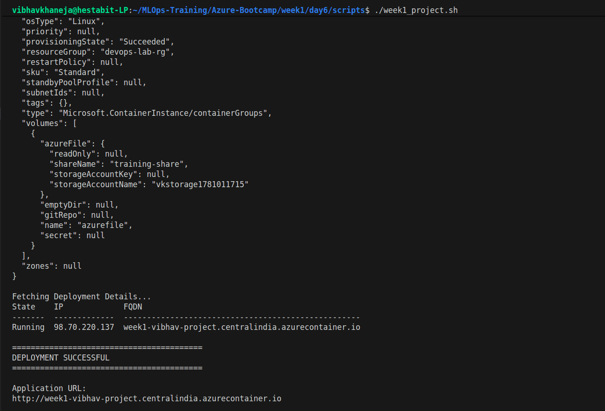

# Azure Bootcamp - Week 1 Mini Project

## Project Overview

This project demonstrates a complete cloud-native deployment workflow using Microsoft Azure services. The goal was to build a custom Docker image, store it in Azure Container Registry (ACR), deploy it to Azure Container Instances (ACI), mount persistent Azure Files storage, and make the application accessible from the public internet.

This mini project combines all concepts learned during Week 1 of the Azure Bootcamp:

* Azure Resource Groups
* Azure Virtual Machines
* Azure Storage Accounts
* Azure Files
* Azure Container Instances (ACI)
* Azure Container Registry (ACR)
* Docker Containers
* Azure CLI Automation

---

## Learning Objectives

By completing this project, we learned how to:

* Build and containerize applications using Docker
* Store images in a private Azure Container Registry
* Deploy containers without managing virtual machines
* Mount persistent Azure File Shares into containers
* Expose applications publicly using Azure Container Instances
* Automate deployments using Bash scripts
* Understand the boundary between developer responsibilities and cloud provider responsibilities

---

## Architecture Diagram

```text
                     ┌─────────────────────┐
                     │    Local Machine    │
                     │  Docker Build       │
                     └──────────┬──────────┘
                                │
                                ▼
                     ┌─────────────────────┐
                     │ Azure Container     │
                     │ Registry (ACR)      │
                     └──────────┬──────────┘
                                │
                                ▼
                     ┌─────────────────────┐
                     │ Azure Container     │
                     │ Instance (ACI)      │
                     └──────────┬──────────┘
                                │
                  ┌─────────────┴─────────────┐
                  │                           │
                  ▼                           ▼

       ┌──────────────────┐      ┌──────────────────┐
       │ Azure Files      │      │ Public Internet  │
       │ Persistent Data  │      │ Public URL       │
       └──────────────────┘      └──────────────────┘
```

---

## Project Components

### Resource Group

Resource Group used:

```text
devops-lab-rg
```

Acts as a logical container for all Azure resources.

---

### Azure Container Registry (ACR)

Registry Name:

```text
vibhavacr001
```

Purpose:

* Stores private Docker images
* Central image repository
* Source for ACI deployments

Repository:

```text
week1-project:v1
```

---

### Azure Storage Account

Storage Account:

```text
vkstorage1781011715
```

Provides persistent cloud storage.

---

### Azure File Share

File Share:

```text
training-share
```

Mounted inside the container at:

```text
/mnt/azurefiles
```

Purpose:

* Persistent storage
* Data survives container deletion
* Shared storage across containers

---

### Azure Container Instance (ACI)

Container Name:

```text
week1-project-aci
```

Purpose:

* Run containers without managing VMs
* Fast deployment
* Public internet access

---

## Deployment Workflow

### Step 1

Build Docker Image

```bash
docker build -t week1-project:v1 .
```

---

### Step 2

Tag for ACR

```bash
docker tag week1-project:v1 \
vibhavacr001.azurecr.io/week1-project:v1
```

---

### Step 3

Push to ACR

```bash
docker push \
vibhavacr001.azurecr.io/week1-project:v1
```

---

### Step 4

Deploy to ACI

Container pulls image directly from ACR.

---

### Step 5

Mount Azure File Share

Persistent storage attached to container.

---

### Step 6

Verify Deployment

Access application:

```text
http://week1-vibhav-project.centralindia.azurecontainer.io
```

---

## Automation Script

Script:

```text
scripts/week1_project.sh
```

Automates:

* Docker build
* Docker tag
* ACR login
* Docker push
* Storage key retrieval
* Container deployment
* Azure Files mounting
* Deployment verification

---

## Application Output

Expected page:

```html
Azure Bootcamp Week 1 Project

Container deployed from ACR to ACI.

Storage mounted from Azure Files.

Created by Vibhav Khaneja.
```

---

## Key Learnings

### Azure Container Registry (ACR)

Private cloud registry used to store Docker images securely.

### Azure Container Instances (ACI)

Serverless container platform that removes the need to manage virtual machines.

### Azure Files

Provides persistent shared storage that survives container restarts and deletions.

### Automation

Infrastructure and deployment processes can be fully automated using Azure CLI and Bash scripts.

---

## Production Concepts Introduced

* Container Lifecycle
* Image Registries
* Persistent Storage
* Infrastructure Automation
* Public Cloud Deployments
* Resource Reusability
* Idempotent Deployment Scripts

---

# Screenshots










## Week 1 Conclusion

Week 1 covered the complete journey from infrastructure provisioning to application deployment.

We built a Dockerized application, stored it in Azure Container Registry, deployed it to Azure Container Instances, attached persistent Azure Files storage, exposed it publicly, and automated the entire workflow using Bash scripts.

This project serves as the foundation for Week 2, where these containerized workloads will be deployed to Azure Kubernetes Service (AKS) with CI/CD pipelines and monitoring.
