# Azure Bootcamp - Week 2 Day 1
# Azure Kubernetes Service (AKS) Fundamentals

## Objective

The goal of Day 1 was to transition from local Kubernetes (Minikube) to managed Kubernetes using Azure Kubernetes Service (AKS).

We learned how Azure provisions and manages Kubernetes infrastructure while allowing us to focus only on application workloads.

---

# Architecture

Before AKS:

Laptop
│
└── Minikube
└── Kubernetes

After AKS:

Azure Subscription
│
├── AKS Cluster
│
├── VM Scale Set
│
├── Load Balancer
│
├── Virtual Network
│
├── Network Security Group
│
├── Managed Identity
│
└── Azure Container Registry

---

# Exercise 1.1 - Create AKS Cluster

Created:

- Resource Group
- AKS Cluster
- Node Pool
- Worker Node

Configuration:

| Property | Value |
|-----------|----------|
| Cluster Name | aks-bootcamp |
| Region | Central India |
| Node Count | 1 |
| VM Size | Standard_B2pls_v2 |
| Kubernetes Version | 1.34 |
| Pricing Tier | Free |

---

# What Azure Created Automatically

AKS created an additional managed resource group:

MC_aks-bootcamp-rg_aks-bootcamp_centralindia

Inside it Azure automatically provisioned:

- Virtual Machine Scale Set
- Load Balancer
- Virtual Network
- Network Security Group
- Public IP Address
- Managed Identity

This is one of the biggest differences from Minikube.

---

# Exercise 1.2 - Connect to AKS

Connected kubectl using:

```bash
az aks get-credentials
```

This merged AKS credentials into the local kubeconfig file.

After this, kubectl commands targeted the AKS cluster instead of Minikube.

---

# Exercise 1.3 - Explore the Cluster

## Worker Node

```bash
kubectl get nodes
```

Output:

aks-nodepool1-59258045-vmss000000

Important learning:

A Kubernetes node in AKS is actually a real Azure VM running inside a Virtual Machine Scale Set (VMSS).

---

## Namespaces

```bash
kubectl get namespaces
```

Namespaces discovered:

- default
- kube-system
- kube-public
- kube-node-lease

---

## System Pods

```bash
kubectl get pods -n kube-system
```

AKS already runs several components before deploying any application.

### CoreDNS

Provides DNS resolution inside the cluster.

Example:

frontend-service
↓
CoreDNS
↓
backend-service

---

### Metrics Server

Collects:

- CPU Usage
- Memory Usage

Used by:

- kubectl top
- Horizontal Pod Autoscaler (HPA)

---

### Azure CNS

Azure Container Networking Service.

Provides pod networking integration with Azure.

---

### Azure File CSI Driver

Connects Kubernetes Persistent Volumes to Azure Files.

---

### Azure Disk CSI Driver

Connects Kubernetes Persistent Volumes to Azure Managed Disks.

---

### Kube Proxy

Handles Kubernetes service networking and traffic routing.

---

# Metrics Verification

```bash
kubectl top nodes
```

Confirmed that Metrics Server was operational.

This allows future autoscaling features.

---

# Exercise 1.4 - Azure Container Registry

Created:

aksbootcampacr01

Purpose:

Store container images for AKS workloads.

Registry Endpoint:

aksbootcampacr01.azurecr.io

---

# AKS to ACR Integration

Connected AKS with ACR:

```bash
az aks update --attach-acr
```

Azure automatically granted:

AcrPull Role

to:

aks-bootcamp-agentpool Managed Identity

Result:

AKS can pull private container images without imagePullSecrets.

---

# Exercise 1.5 - Automation Script

Created:

scripts/aks_cluster.sh

Features:

- Resource Group Validation
- AKS Validation
- ACR Validation
- Credential Configuration
- Cluster Health Checks
- Discovery Commands

The script is idempotent and can be executed repeatedly.

---

# Exercise 1.6 - AKS vs Minikube

| Feature | Minikube | AKS |
|----------|----------|----------|
| Environment | Local Laptop | Azure Cloud |
| Control Plane | User Managed | Azure Managed |
| Nodes | Local VM | Azure VMs |
| Scaling | Manual | Managed |
| Networking | Local | Azure Networking |
| Load Balancer | Limited | Native Azure LB |
| Identity | None | Managed Identity |
| Registry Integration | Manual | ACR Integration |
| Production Ready | No | Yes |

---

# Key Learnings

## Managed Kubernetes

AKS removes the burden of managing:

- API Server
- Scheduler
- Controller Manager
- etcd

Azure handles these components automatically.

---

## Worker Nodes Are Real Azure VMs

The node discovered through kubectl is backed by a VM Scale Set instance.

This means Kubernetes workloads run on actual Azure infrastructure.

---

## Kubernetes + Azure Integration

AKS extends Kubernetes with:

- Azure Networking
- Azure Storage
- Azure Identity
- Azure Load Balancers

making it a fully managed cloud platform.

---

# Screenshots

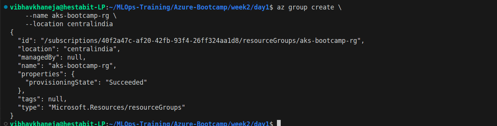
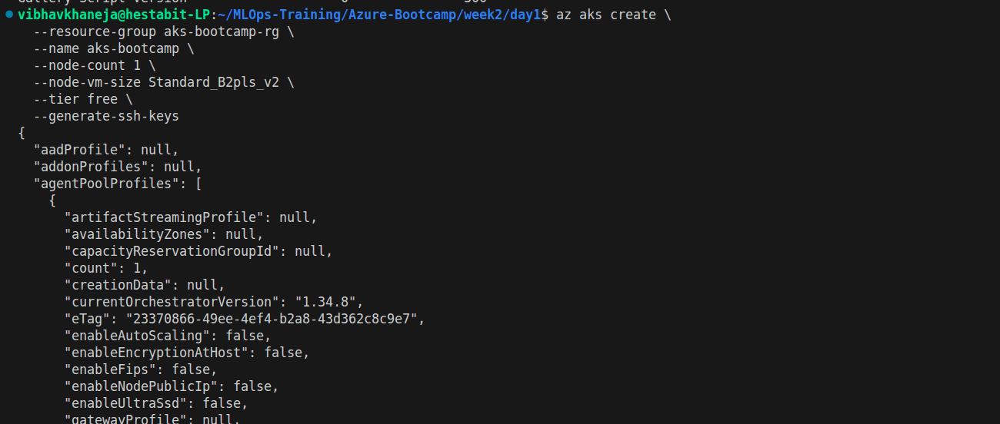
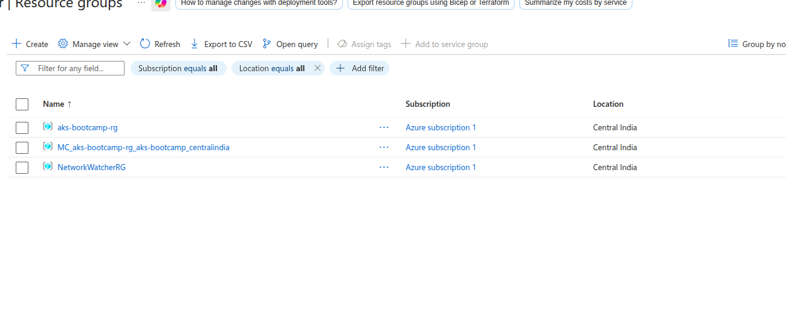
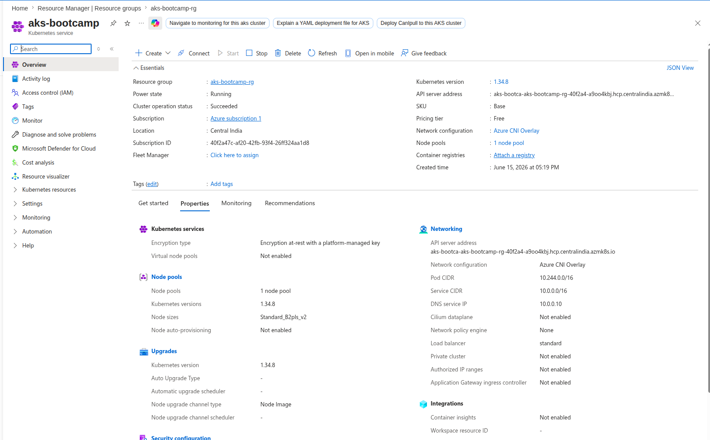
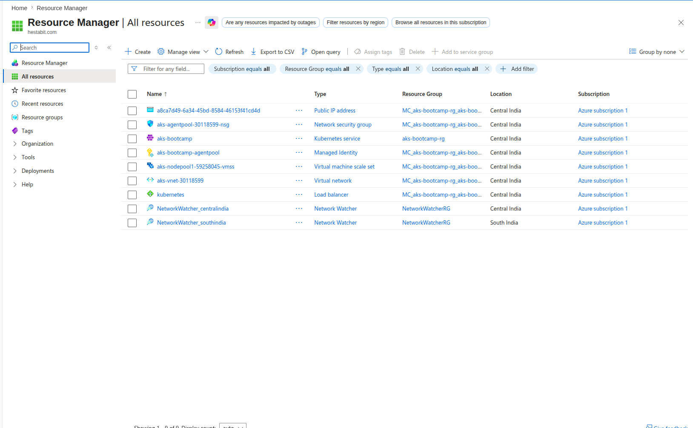
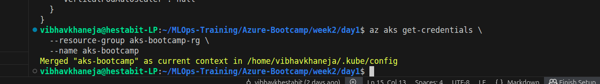
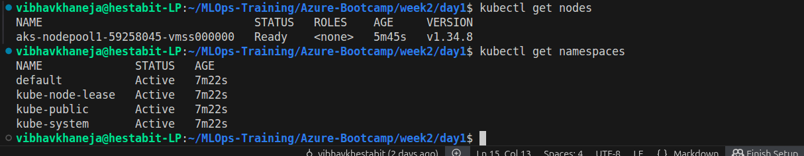
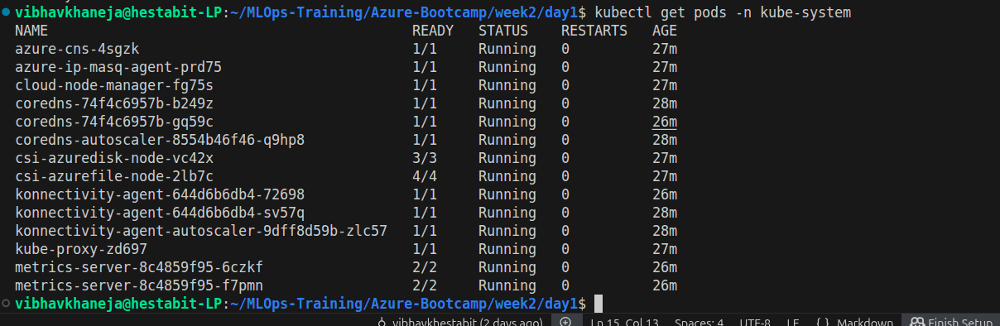
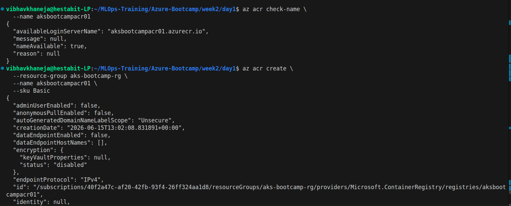
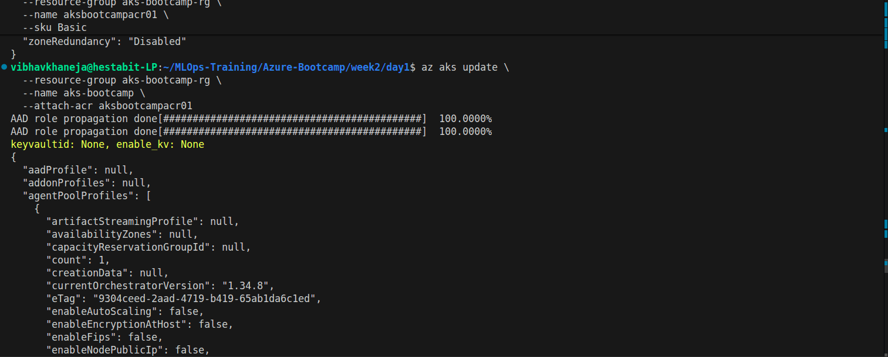
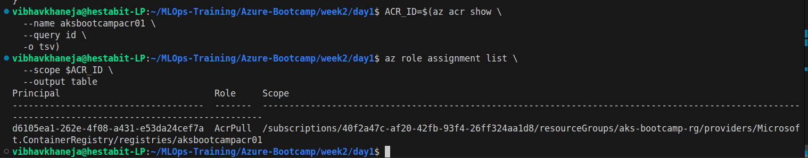
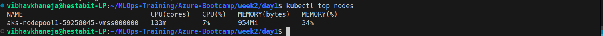
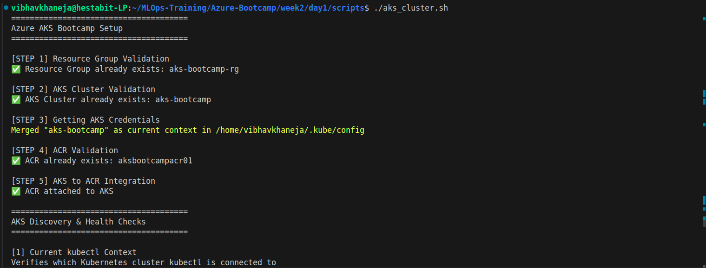
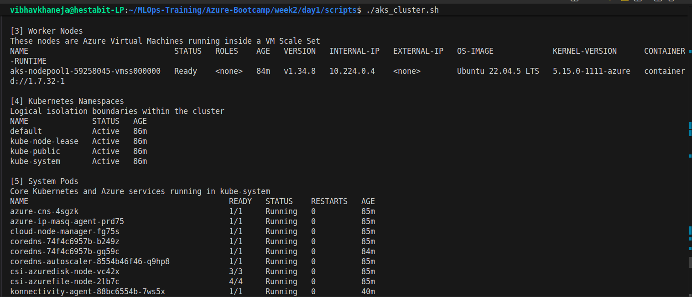
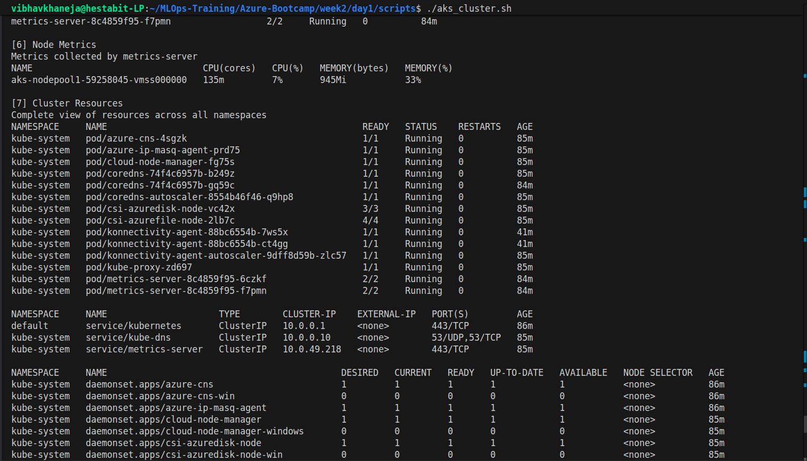
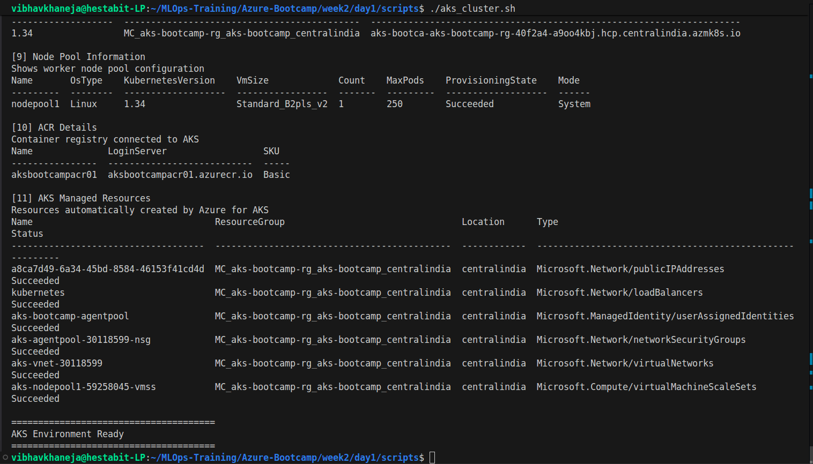

# Day 1 Conclusion

Day 1 introduced Azure Kubernetes Service and demonstrated how managed Kubernetes differs from local Kubernetes environments.

We created an AKS cluster, connected it to Azure Container Registry, explored system components, inspected node metrics, and understood the Azure infrastructure automatically provisioned behind the scenes.

The biggest takeaway was understanding that AKS is not just Kubernetes running in the cloud; it is Kubernetes deeply integrated with Azure networking, identity, storage, and scaling services.