# Azure Bootcamp - Week 2 Day 2

# AKS Workloads

## Objective

The objective of Day 2 was to deploy Kubernetes workloads onto Azure Kubernetes Service (AKS) and understand how Kubernetes networking behaves in a cloud environment.

Unlike Minikube, where applications are exposed using local networking techniques such as NodePort and port forwarding, AKS integrates directly with Azure networking resources such as Public IPs and Load Balancers.

Throughout this lab we deployed an NGINX application, exposed it through an Azure Load Balancer, installed an NGINX Ingress Controller, configured Ingress routing, manually scaled workloads, and implemented Horizontal Pod Autoscaling (HPA).

---

# Exercise 2.1 - Deploy Application to AKS

A Kubernetes Deployment was created using an NGINX container image.

Architecture:

Deployment
↓
ReplicaSet
↓
Pods

The Deployment defined the desired state of the application.

Responsibilities:

* Deployment manages application lifecycle
* ReplicaSet maintains pod count
* Pods run containers

Observations:

* Deployment created a ReplicaSet automatically
* ReplicaSet created 2 Pods
* Pods received IP addresses from the AKS Pod CIDR

Example:

Pod 1 → 10.244.0.41

Pod 2 → 10.244.0.189

---

# Exercise 2.2 - Expose Application with Azure LoadBalancer

A Service of type LoadBalancer was created.

Architecture:

Internet
↓
Azure Public IP
↓
Azure Load Balancer
↓
Kubernetes Service
↓
Endpoints
↓
Pods

Service Type:

LoadBalancer

Key Learning:

When a Kubernetes Service is created with:

type: LoadBalancer

AKS automatically communicates with Azure and provisions:

* Public IP
* Azure Load Balancer
* Backend Pool
* Load Balancer Rules

Result:

Application became publicly accessible through an Azure Public IP.

---

# Service Discovery

The Service used a selector:

app=nginx

Kubernetes automatically matched:

Pods
↓
Labels
↓
Endpoints

Example:

Service
↓
Selector app=nginx
↓
Endpoints

10.244.0.41:80

10.244.0.189:80

No pod IPs were hardcoded.

This demonstrates Kubernetes Service Discovery.

---

# Exercise 2.3 - Install NGINX Ingress Controller

The NGINX Ingress Controller was installed using Helm.

Helm installed:

* Deployment
* Service
* ConfigMaps
* RBAC Objects
* Ingress Controller Pods

Architecture:

Internet
↓
Ingress Public IP
↓
Ingress Controller
↓
Services
↓
Pods

Key Learning:

Ingress is not built into Kubernetes.

Ingress Controller is simply another application running inside the cluster.

---

# Why Ingress Exists

Without Ingress:

frontend-service → Public IP #1

backend-service → Public IP #2

grafana-service → Public IP #3

With Ingress:

One Public IP
↓
Ingress Controller
↓
Routing Rules

/app → frontend

/api → backend

/grafana → grafana

This significantly reduces infrastructure complexity and cost.

---

# Exercise 2.4 - Configure Ingress Routing

An Ingress resource was created.

Routing Rule:

/
↓
nginx-service
↓
Pods

Traffic Flow:

Browser
↓
Ingress Public IP
↓
Ingress Controller
↓
Ingress Rule
↓
Service
↓
Pods

Result:

Application became accessible through the Ingress Controller.

---

# Exercise 2.5 - Manual Scaling

Deployment replicas were increased from:

2 → 3

Command:

kubectl scale deployment nginx-deployment --replicas=3

Architecture:

Deployment
↓
ReplicaSet
↓
3 Pods

Observations:

All Pods were scheduled on the same node because the cluster contained only one worker node.

Node:

aks-nodepool1-xxxxx

Future multi-node clusters would distribute Pods across nodes.

---

# Exercise 2.6 - Horizontal Pod Autoscaler (HPA)

Resource requests and limits were added.

Example:

CPU Request: 100m

CPU Limit: 200m

Memory Request: 128Mi

Memory Limit: 256Mi

HPA Configuration:

Minimum Pods: 3

Maximum Pods: 10

Target CPU Utilization: 50%

Architecture:

Metrics Server
↓
CPU Metrics
↓
HPA
↓
Deployment
↓
ReplicaSet
↓
Pods

Load Generation:

A BusyBox pod continuously generated HTTP requests against the application.

Observed Result:

CPU Usage:

1%
↓
32%

HPA successfully consumed live metrics and evaluated scaling decisions.

Although scaling was not triggered, the exercise verified that:

* Metrics Server was functioning
* HPA was functioning
* CPU metrics were available
* Replica calculations were occurring

---

# AKS Networking Deep Dive

Node IP

10.224.x.x

Assigned to Azure Virtual Machines

---

Pod IP

10.244.x.x

Assigned from Pod CIDR

Used for Pod-to-Pod communication

---

Service IP

10.0.x.x

Assigned from Service CIDR

Provides stable access to Pods

---

Public IP

20.x.x.x

Azure-managed Internet-facing address

Used for external access

---

Traffic Flow Example

Internet
↓
20.x.x.x
(Public IP)

↓

Azure Load Balancer

↓

10.0.x.x
(Service IP)

↓

10.244.x.x
(Pod IP)

↓

Container

---

# AKS vs Minikube

Minikube:

* Local Kubernetes cluster
* Single machine
* Local networking
* Manual exposure methods
* No cloud integrations

AKS:

* Managed Kubernetes service
* Azure-managed control plane
* Azure Load Balancers
* Azure Public IPs
* Azure Container Registry integration
* Automatic upgrades and scaling capabilities

Azure Handles:

* Control Plane
* API Server
* etcd
* High Availability
* Cloud Networking
* Load Balancers
* Managed Identities

Engineers Manage:

* Deployments
* Services
* Ingress
* Applications
* Scaling Policies

---

# Key Learnings

* Deployment manages ReplicaSets
* ReplicaSets manage Pods
* Services provide stable access to Pods
* Endpoints map Services to Pods
* LoadBalancer Services automatically provision Azure networking resources
* Ingress provides centralized routing
* Helm simplifies application installation
* HPA enables automatic scaling based on metrics
* AKS integrates Kubernetes with Azure infrastructure
* Kubernetes networking consists of Node IPs, Pod IPs, Service IPs, and Public IPs

---

# Screenshots

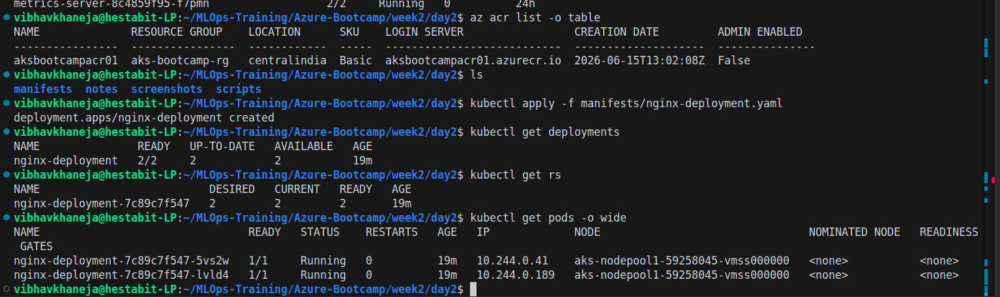
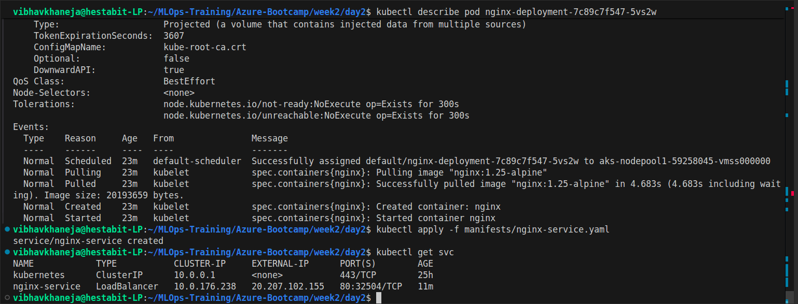
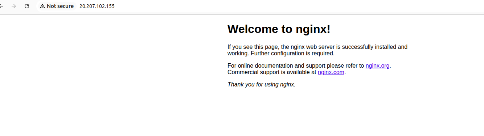
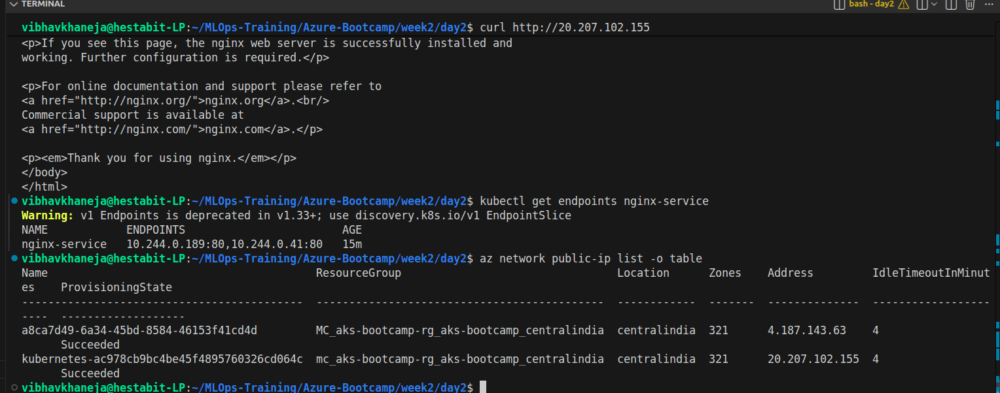
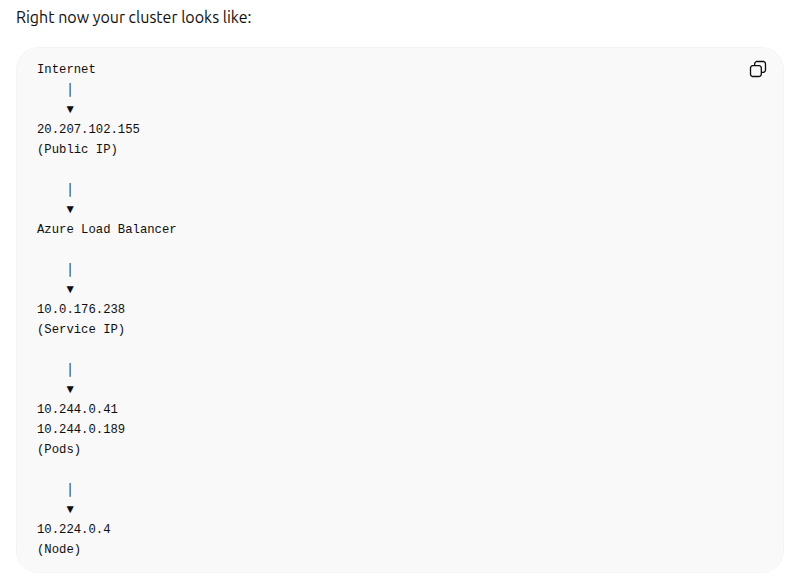
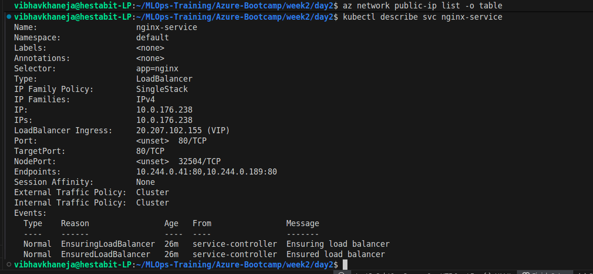
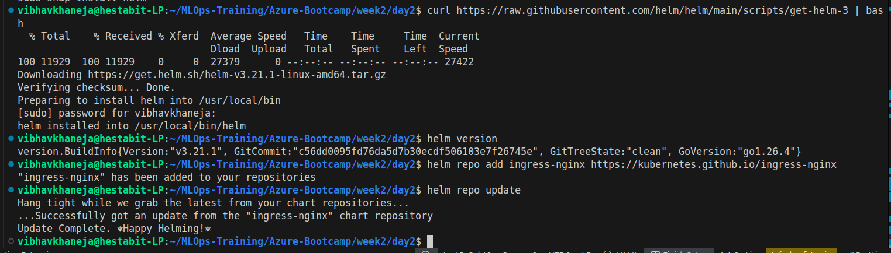
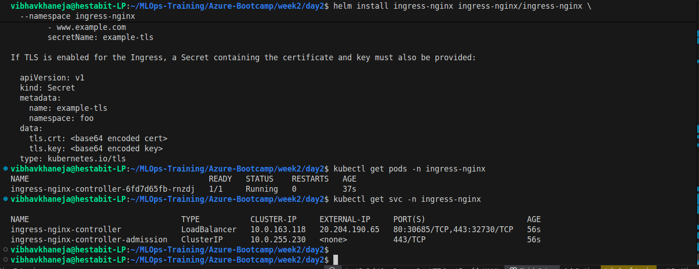
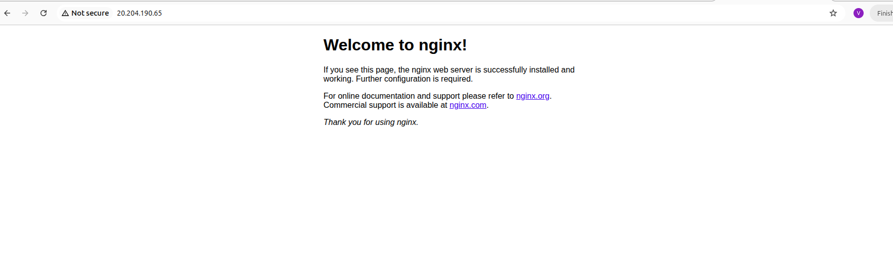
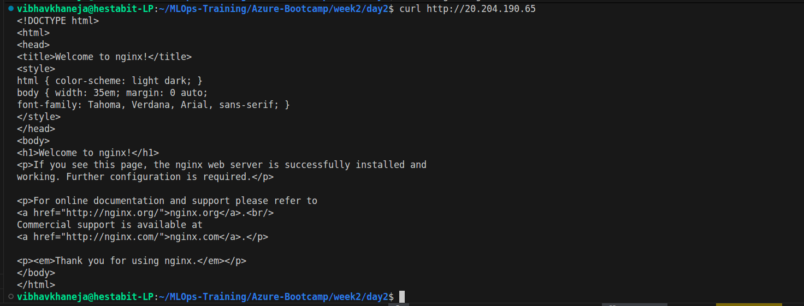
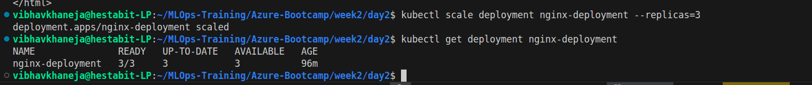
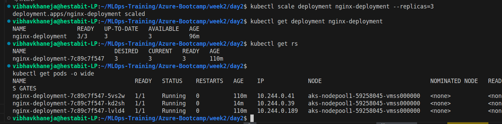
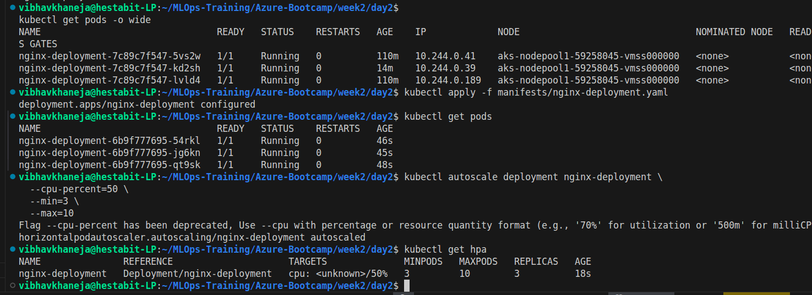
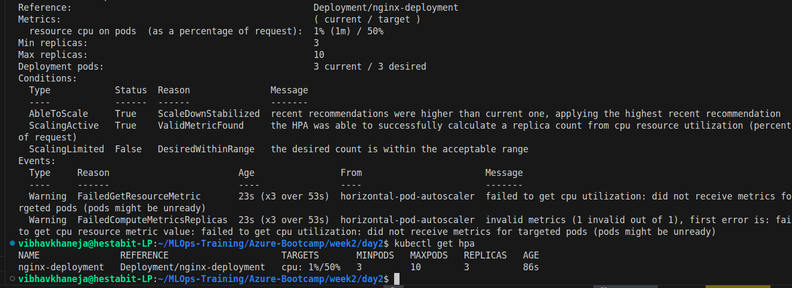
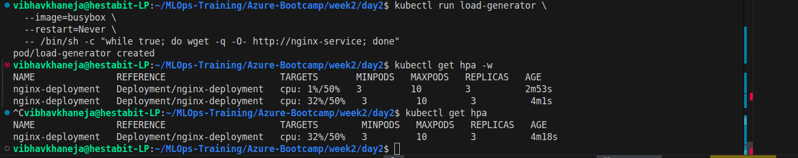

# Day 2 Outcome

Successfully deployed workloads onto AKS and exposed them through Azure networking.

Completed:

✅ Deployment

✅ Service

✅ Azure Load Balancer

✅ Ingress Controller

✅ Ingress Routing

✅ Manual Scaling

✅ Horizontal Pod Autoscaling

Environment cleaned up successfully after completion.
