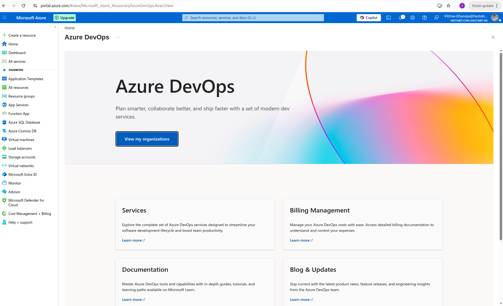
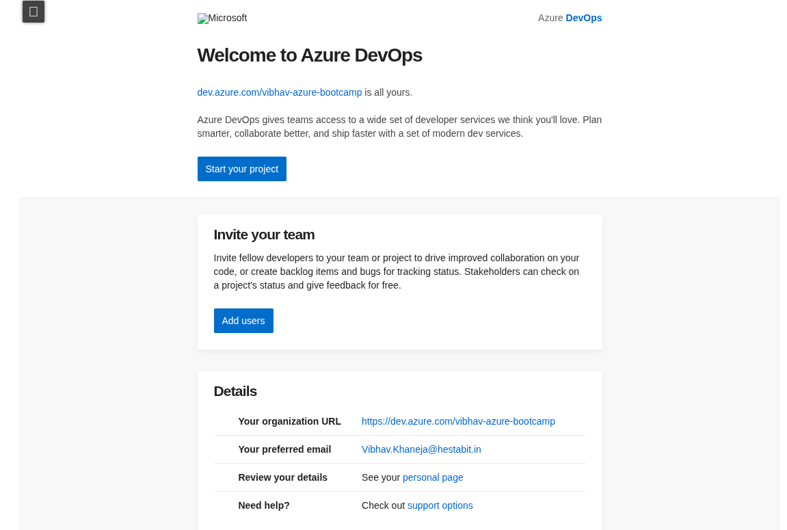
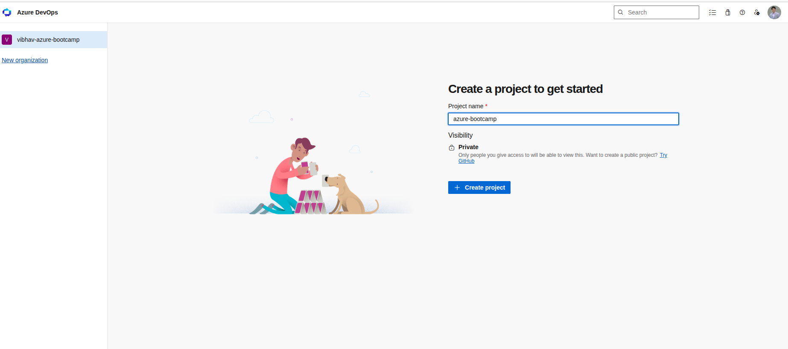
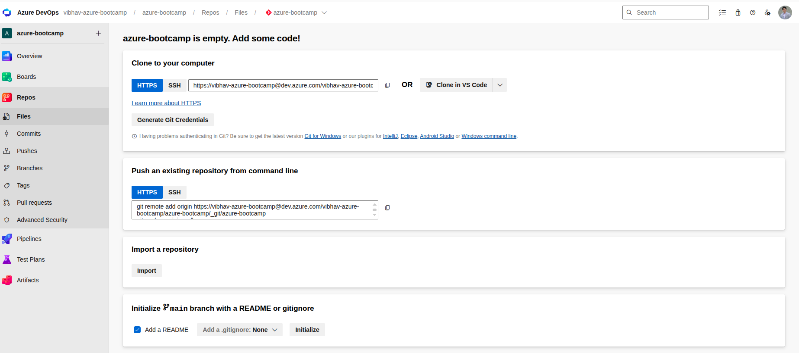
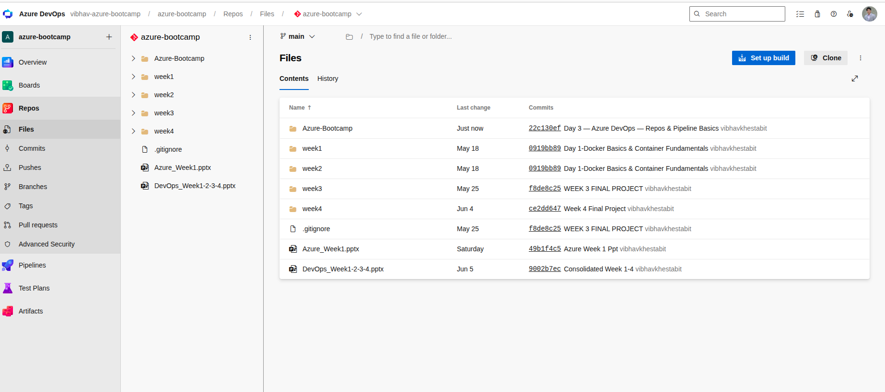
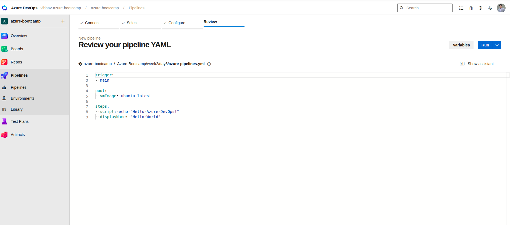
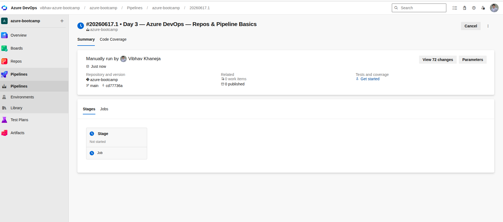
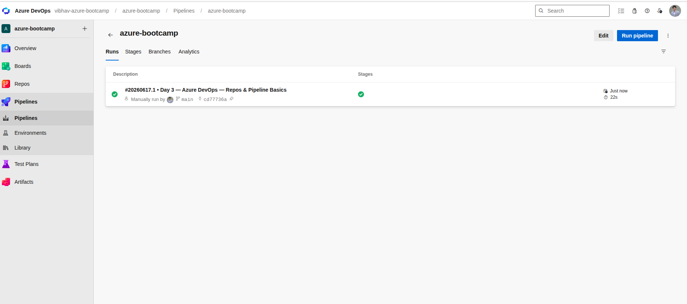
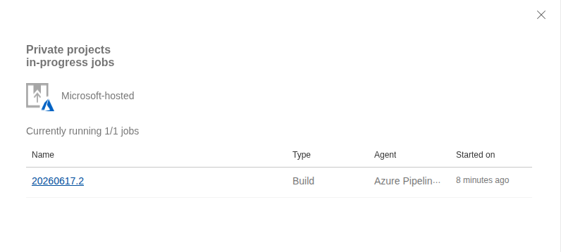

# Week 2 Day 3 — Azure DevOps: Repos & Pipeline Basics

## Overview

On Day 3, we shifted from manually executing commands to automating software validation using Azure DevOps. We created an Azure DevOps Organization and Project, configured Azure Repos as a remote Git repository, connected our local codebase, and built our first CI (Continuous Integration) pipeline using YAML.

The pipeline automatically runs whenever code is pushed to the main branch, demonstrating the core principle of CI: validate code changes continuously and automatically.

---

## Learning Objectives

* Understand Azure DevOps Organizations and Projects
* Learn the purpose of Azure Repos
* Connect a local Git repository to Azure DevOps
* Understand Personal Access Tokens (PATs)
* Create and configure YAML-based pipelines
* Use Microsoft-hosted build agents
* Install dependencies automatically
* Execute automated unit tests
* Explore pipeline runs, logs, and execution history

---

## Azure DevOps Architecture

```text
Developer
    │
    ▼
Git Push
    │
    ▼
Azure Repos
    │
    ▼
Pipeline Trigger
    │
    ▼
Microsoft Hosted Agent
    │
    ▼
Install Dependencies
    │
    ▼
Run Tests
    │
    ▼
Success / Failure
```

---

## Azure Repos

Azure Repos is Microsoft's Git repository hosting service.

It provides:

* Source code management
* Commit history
* Branch management
* Pull requests
* Integration with Azure Pipelines

In this exercise, Azure Repos served as the remote repository that automatically triggered pipelines when new code was pushed.

---

## Azure Pipelines

Azure Pipelines is Azure DevOps' automation engine.

A pipeline is a series of automated tasks executed whenever a specified event occurs.

For this exercise:

```text
Code Push
    ↓
Pipeline Trigger
    ↓
Install Python
    ↓
Install Dependencies
    ↓
Run Tests
```

---

## Hosted Agents

The pipeline executed on Microsoft-hosted agents.

Azure automatically:

1. Creates a temporary Ubuntu virtual machine
2. Downloads the repository
3. Executes pipeline steps
4. Stores logs
5. Destroys the machine

Benefits:

* No infrastructure maintenance
* Consistent execution environment
* Scalable build system
* Secure isolated execution

---

## YAML Pipeline

Pipeline configuration was stored inside:

```text
azure-pipelines.yml
```

Benefits:

* Version controlled
* Repeatable
* Auditable
* Infrastructure-as-Code mindset

Pipeline:

```yaml
trigger:
- main

pool:
  vmImage: ubuntu-latest

steps:

- task: UsePythonVersion@0
  inputs:
    versionSpec: '3.11'
  displayName: 'Use Python 3.11'

- script: |
    python -m pip install --upgrade pip
    pip install -r Azure-Bootcamp/week2/day3/app/requirements.txt
  displayName: 'Install Dependencies'

- script: |
    cd Azure-Bootcamp/week2/day3/app
    pytest -v
  displayName: 'Run Unit Tests'
```

---

## Continuous Integration (CI)

Before CI:

```text
Developer
    ↓
Runs tests manually
```

After CI:

```text
Developer
    ↓
git push
    ↓
Pipeline
    ↓
Automatic validation
```

Advantages:

* Faster feedback
* Early bug detection
* Consistent testing
* Reduced human error
* Increased deployment confidence

---

## Authentication

Azure DevOps Git operations required authentication.

We used a Personal Access Token (PAT) instead of a Microsoft account password.

PAT advantages:

* Limited permissions
* Revocable
* Safer than password sharing
* Common enterprise practice

---

## Key Concepts Learned

### Azure Organization

Top-level container for Azure DevOps resources.

### Project

Logical workspace containing repositories, pipelines, boards, and artifacts.

### Azure Repo

Git repository hosted by Azure DevOps.

### Pipeline

Automated workflow triggered by events.

### Agent

Machine responsible for executing pipeline tasks.

### Trigger

Event that starts a pipeline.

### YAML

Configuration-as-code format used to define pipeline behavior.

### Continuous Integration

Practice of automatically validating code changes after every commit.

---

## Screenshots











## Outcome

Successfully:

* Created Azure DevOps Organization
* Created Azure DevOps Project
* Created Azure Repo
* Connected local repository
* Configured PAT authentication
* Built a YAML pipeline
* Triggered automated pipeline runs
* Installed dependencies automatically
* Executed unit tests automatically
* Achieved successful CI pipeline execution

Day 3 established the foundation required for Day 4, where the pipeline will evolve from running tests to building Docker images, pushing them to Azure Container Registry (ACR), and deploying applications to Azure Kubernetes Service (AKS).

## Day 3 Conclusion

Today we learned how modern DevOps teams automate software validation using Azure DevOps. We created an Azure DevOps Organization and Project, connected Azure Repos to our existing Git workflow, and authenticated securely using Personal Access Tokens (PATs). We explored how Azure Repos acts as a Git repository hosting platform while Azure Pipelines serves as the automation engine responsible for executing CI/CD workflows.

We then built our first YAML-based pipeline and configured it to trigger automatically whenever code was pushed to the main branch. The pipeline executed on a Microsoft-hosted Ubuntu agent, installed project dependencies, and ran automated unit tests without requiring any manual intervention. Through this process, we learned key concepts such as hosted agents, pipeline triggers, YAML configuration, automated testing, and Continuous Integration (CI). This foundation prepares us for Day 4, where the pipeline will evolve from testing code to building Docker images, pushing them to Azure Container Registry (ACR), and deploying applications automatically to Azure Kubernetes Service (AKS).
