# Azure Bootcamp - Week 2 Day 5

# AKS Monitoring & Alerts

## Overview

In this exercise we implemented monitoring and observability for our Azure Kubernetes Service (AKS) cluster using Azure Monitor and Log Analytics Workspace. After successfully deploying our Flask application to AKS through Azure DevOps pipelines on Day 4, the next step was to gain visibility into cluster health, application performance, and operational events.

We integrated AKS with Azure Monitor, collected logs and metrics using Azure Monitor Agents (AMA), queried telemetry using Kusto Query Language (KQL), and configured automated alerting. Finally, we validated the entire monitoring pipeline by generating artificial CPU load inside the cluster and successfully triggering an Azure Monitor alert notification.

---

# Learning Objectives

By completing this exercise we learned:

* How Azure Monitor integrates with AKS.
* Purpose of Log Analytics Workspace.
* Difference between logs and metrics.
* How Azure Monitor Agents collect telemetry.
* Basic KQL query development.
* Monitoring Kubernetes workloads.
* Creating Azure Monitor Alert Rules.
* Configuring Action Groups and Email Notifications.
* Troubleshooting Kubernetes failures using monitoring tools.
* Understanding architecture compatibility issues (ARM vs AMD64).

---

# Existing Infrastructure

The following resources were already available from previous exercises:

| Resource                 | Name                 |
| ------------------------ | -------------------- |
| Resource Group           | rg-azure-devops-day4 |
| AKS Cluster              | aks-day4             |
| Azure Container Registry | vibhavacrday4        |
| Azure DevOps Repository  | Azure-Bootcamp       |
| Flask Application        | Running in AKS       |
| Load Balancer Service    | flask-app-service    |

Cluster verification:

```bash
kubectl get nodes
kubectl get pods
kubectl get svc
```

Verified:

* AKS cluster healthy
* Node Ready state
* Flask application running
* LoadBalancer service exposed

---

# Monitoring Architecture

AKS Cluster
│
├── Flask Application
│
├── Azure Monitor Agent (AMA)
│
▼
Log Analytics Workspace
│
├── KubePodInventory
├── InsightsMetrics
├── Container Logs
├── Kubernetes Events
│
▼
Azure Monitor
│
▼
Alert Rule
│
▼
Action Group
│
▼
Email Notification

---

# Step 1 - Create Log Analytics Workspace

A Log Analytics Workspace acts as the central storage location for monitoring data.

Created:

```text
law-aks-day5
```

Purpose:

* Store logs
* Store metrics
* Run KQL queries
* Support Azure Monitor alerts

Verification:

```bash
az monitor log-analytics workspace list \
--resource-group rg-azure-devops-day4 \
-o table
```

---

# Step 2 - Enable AKS Monitoring

Initially monitoring enablement failed:

```text
MissingSubscriptionRegistration
Microsoft.Insights
```

Cause:

The Azure subscription was not registered for Azure Monitor services.

Resolution:

```bash
az provider register \
--namespace Microsoft.Insights
```

After registration:

```bash
az aks enable-addons \
--resource-group rg-azure-devops-day4 \
--name aks-day4 \
--addons monitoring \
--workspace-resource-id $WORKSPACE_ID
```

Monitoring addon enabled successfully.

---

# Step 3 - Verify Azure Monitor Agents

Verification:

```bash
kubectl get pods -n kube-system
```

Observed:

```text
ama-logs
ama-logs-rs
```

These agents continuously collect:

* Pod inventory
* Container logs
* CPU metrics
* Memory metrics
* Kubernetes events

and send telemetry to Log Analytics Workspace.

---

# Step 4 - Explore Monitoring Data Using KQL

Accessed:

Azure Portal → Log Analytics Workspace → Logs

Initial query:

```kql
KubePodInventory
| take 10
```

This verified successful telemetry ingestion.

Important observation:

The actual schema used:

```text
Name
Namespace
PodStatus
ContainerRestartCount
ClusterName
```

instead of the expected:

```text
PodName
```

This highlighted the importance of inspecting table schemas before writing queries.

---

# Step 5 - Create Operational Queries

## Pod Restart Monitoring

```kql
KubePodInventory
| where TimeGenerated > ago(24h)
| where ContainerRestartCount > 0
```

Purpose:

Identify unstable containers.

---

## Failed Pod Detection

```kql
KubePodInventory
| where PodStatus != "Running"
```

Purpose:

Detect failed or pending workloads.

---

## CPU Metrics Exploration

```kql
InsightsMetrics
| where Name contains "cpu"
```

Purpose:

Investigate cluster CPU usage.

---

# Step 6 - Configure Alerting

Created:

## Action Group

```text
aks-day5-alerts
```

Purpose:

Define notification actions.

Configured:

```text
Email Notification
```

---

## Alert Rule

```text
aks-day5-high-cpu-alert
```

Condition:

```text
CPU Usage Percentage > 80%
```

Evaluation:

```text
Average CPU
Last 5 Minutes
```

This allows Azure Monitor to automatically detect high CPU utilization.

---

# Step 7 - Generate CPU Load

To validate alerting, a stress workload was deployed.

Manifest:

```yaml
apiVersion: v1
kind: Pod
metadata:
  name: stress-pod
```

Initial Issue:

```text
CrashLoopBackOff
exec format error
```

Root Cause:

Architecture mismatch between container binary and AKS node architecture.

This was similar to the ARM/AMD64 Buildx issue encountered during Day 4.

Resolution:

Replaced the image with an Alpine-based stress-ng workload.

Successful execution:

```bash
kubectl top pod
```

Output:

```text
stress-pod ≈ 1500m CPU
```

Node metrics:

```bash
kubectl top node
```

Output:

```text
CPU Usage ≈ 105%
```

---

# Step 8 - Alert Verification

Azure Monitor detected sustained CPU utilization above the configured threshold.

Received email notification:

```text
Azure Monitor alert rule
aks-day5-high-cpu-alert
was triggered for aks-day4
```

This confirmed successful end-to-end alerting.

---

# Key Learnings

## Logs vs Metrics

Logs:

```text
What happened?
```

Metrics:

```text
How much CPU, Memory, Network is being consumed?
```

---

## kubectl vs Azure Monitor

kubectl:

```text
Real-time cluster state
```

Azure Monitor:

```text
Historical telemetry and alerting
```

---

## Action Group vs Alert Rule

Action Group:

```text
Who should be notified?
```

Alert Rule:

```text
When should notification occur?
```

---

## Architecture Compatibility

Day 4:

ARM Build Machine
↓
AMD64 AKS Nodes
↓
Docker Buildx

Day 5:

AMD64 AKS Nodes
↓
Wrong Architecture Binary
↓
exec format error

Understanding architecture compatibility is critical in containerized environments.

---

# Troubleshooting Summary

| Issue                           | Cause                             | Resolution                |
| ------------------------------- | --------------------------------- | ------------------------- |
| MissingSubscriptionRegistration | Microsoft.Insights not registered | Register provider         |
| KQL query failed                | Incorrect column name             | Inspect schema            |
| CrashLoopBackOff                | Architecture mismatch             | Use compatible image      |
| No alerts visible               | Alert evaluation delay            | Wait for metric ingestion |

---

# Screenshots

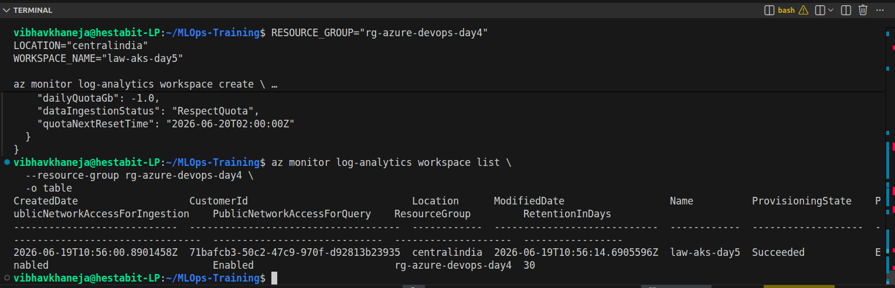
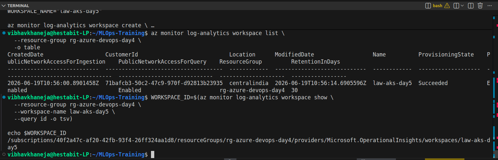
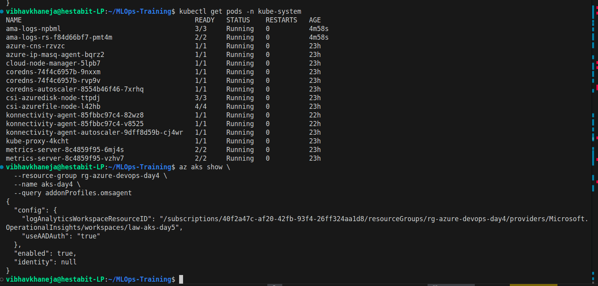
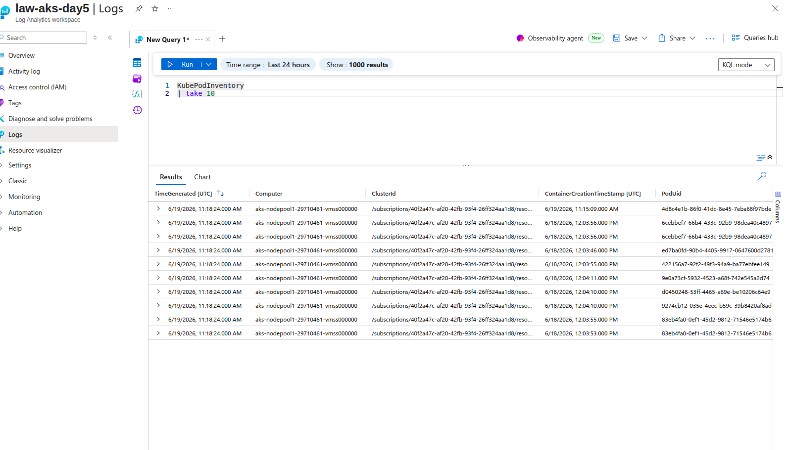
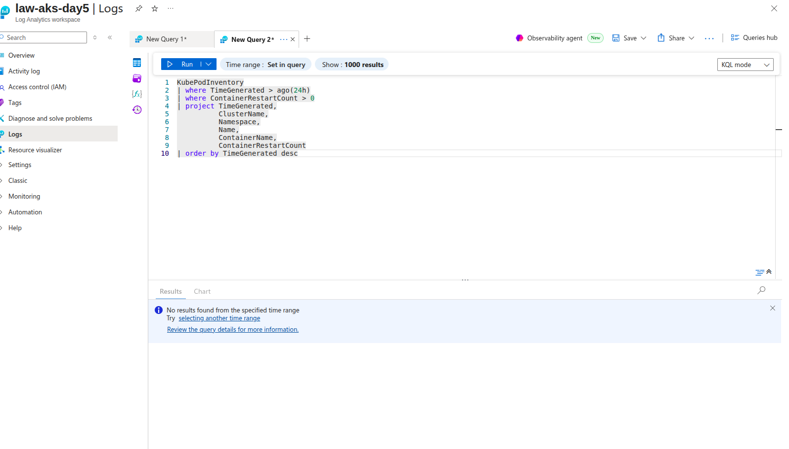
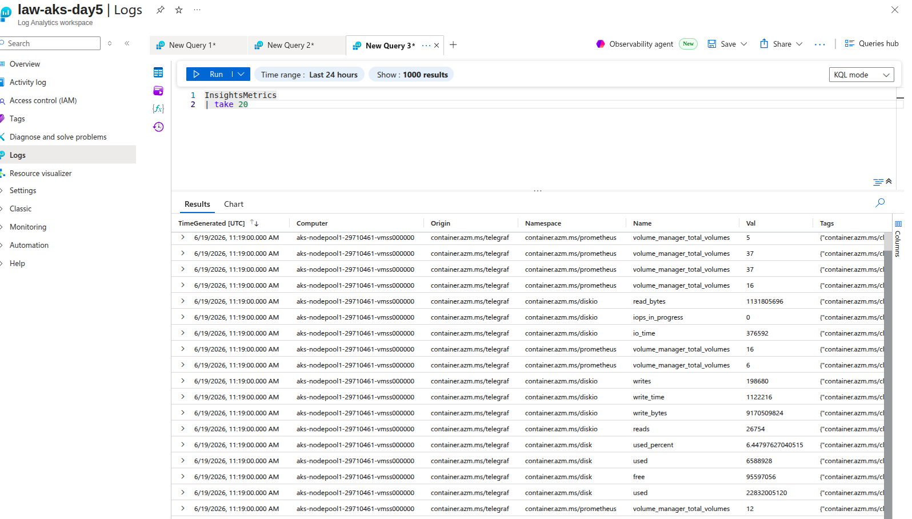
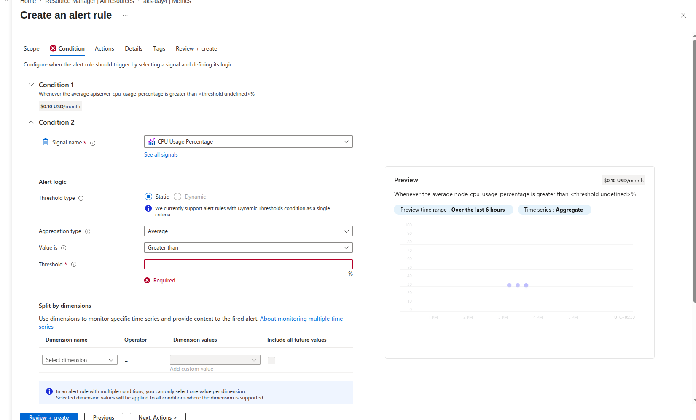
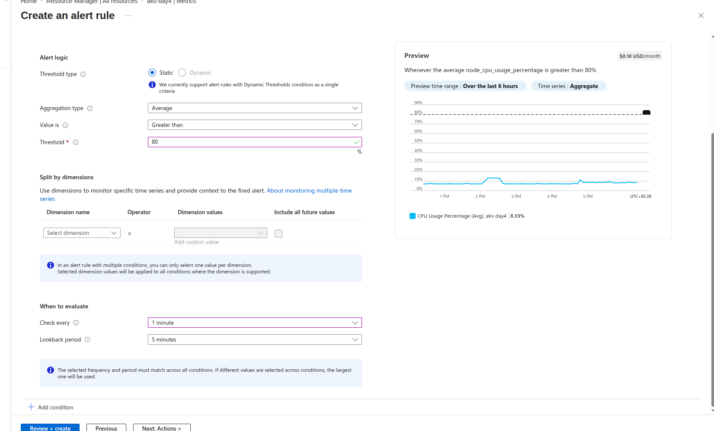
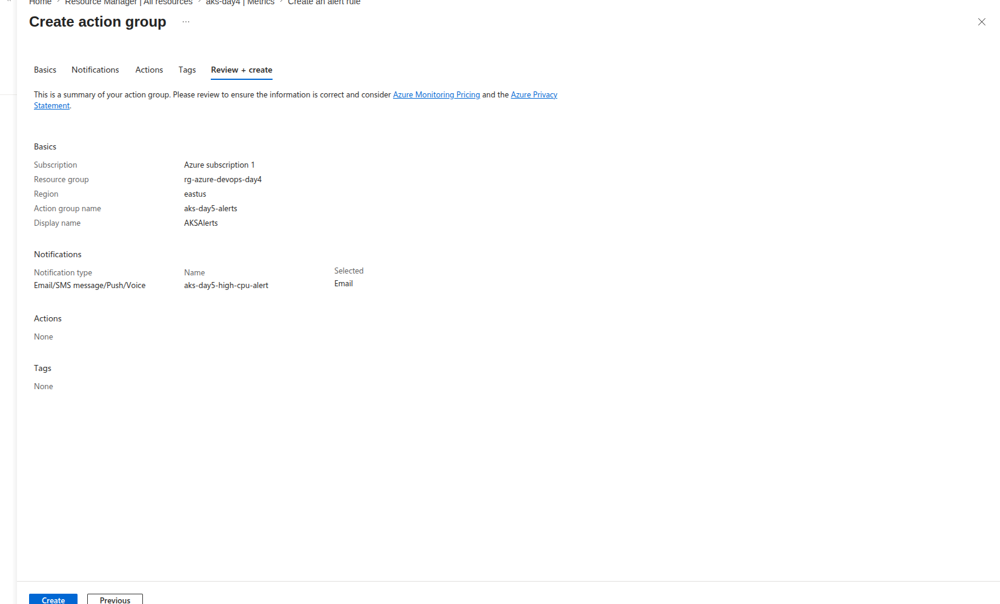
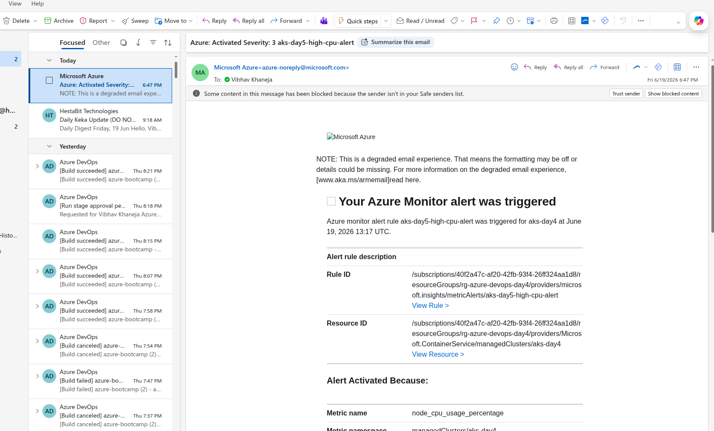
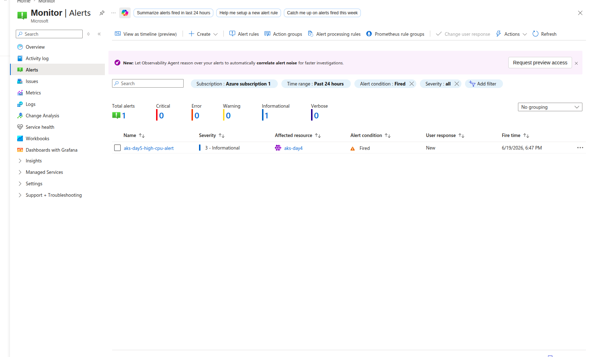
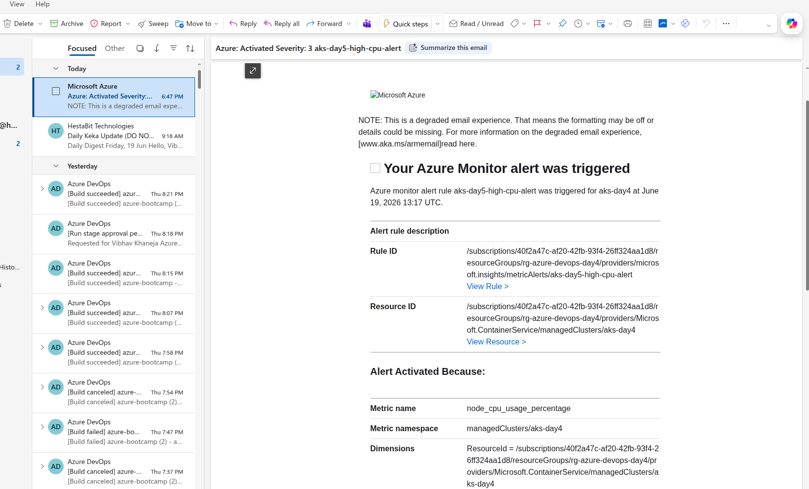
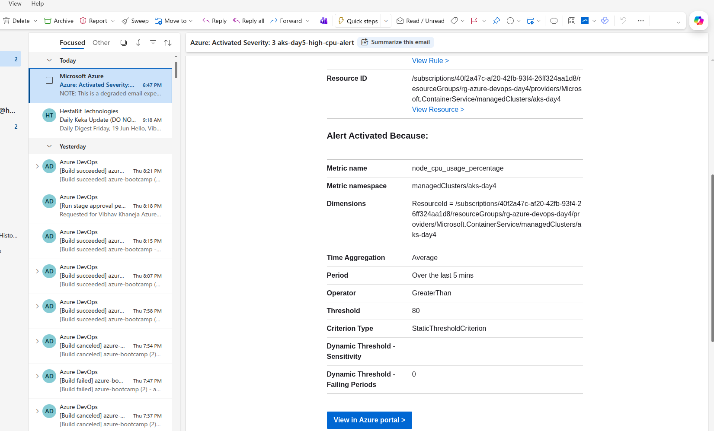
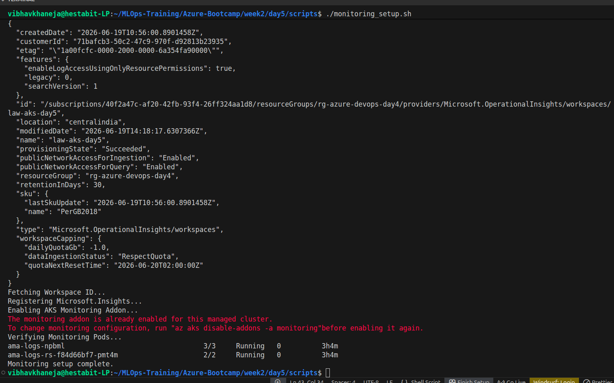

# Conclusion

In this exercise we successfully implemented production-style monitoring and alerting for Azure Kubernetes Service. We integrated Azure Monitor with AKS, configured a Log Analytics Workspace, explored telemetry using KQL, created automated alerting, diagnosed container failures, generated synthetic CPU load, and validated alert delivery through email notifications.

This exercise demonstrated the complete observability lifecycle used by DevOps and Site Reliability Engineering teams to monitor, troubleshoot, and maintain Kubernetes workloads running in production environments.
