# Week 2 Day 6 – Security & RBAC

## Objective

The goal of this lab was to understand how security is implemented in Azure and AKS using:

* Azure Role Based Access Control (RBAC)
* Service Principals
* Azure Key Vault
* Managed Identities
* Secrets Store CSI Driver
* Microsoft Defender for Containers

---

# Architecture

```text
Application Pod
       ↓
Secrets Store CSI Driver
       ↓
Managed Identity
       ↓
Azure Key Vault
       ↓
Secret
```

---

# Exercise 6.1 – Azure RBAC

Azure RBAC controls:

```text
Who
Can Do What
On Which Resource
```

Permissions can be assigned at:

* Subscription
* Resource Group
* Individual Resource

Two built-in roles were explored:

### Reader

* Can view resources
* Cannot modify resources

### Contributor

* Can create and modify resources
* Cannot grant permissions to others

---

# Exercise 6.2 – Service Principals

Two Service Principals were created:

* sp-reader-day6
* sp-contributor-day6

Role assignments were scoped to:

```text
rg-azure-devops-day4
```

This demonstrated the Principle of Least Privilege.

---

# Exercise 6.3 – Azure Key Vault

An Azure Key Vault was created to securely store secrets.

Secret created:

```text
db-password
```

Benefits:

* No secrets in Git
* No secrets in YAML
* No secrets inside container images
* Easy secret rotation

---

# Azure Management Plane vs Data Plane

Management Plane:

* Create Key Vault
* Delete Key Vault
* Configure Key Vault

Data Plane:

* Read secrets
* Write secrets
* Read certificates
* Read keys

The lab demonstrated the difference by requiring a separate Key Vault Administrator role assignment.

---

# Exercise 6.4 – Key Vault Integration with AKS

The Azure Key Vault Secrets Provider addon was enabled.

AKS automatically created:

* User Assigned Managed Identity
* Secrets Store CSI Driver
* Azure Key Vault Provider

A SecretProviderClass was created and a pod successfully mounted:

```text
/mnt/secrets-store/db-password
```

The application consumed the secret directly from Azure Key Vault without creating Kubernetes Secrets.

---

# Why This Architecture Is Important

```text
Key Vault
     ↓
Managed Identity
     ↓
CSI Driver
     ↓
Pod
```

This architecture is considered a production-grade approach to secret management in Kubernetes.

---

# Exercise 6.5 – Microsoft Defender for Containers

The Microsoft.Security resource provider was registered and the Defender for Containers pricing model was explored.

Current pricing tier:

```text
Free
```

The Standard pricing tier provides:

* Vulnerability assessment
* Runtime threat detection
* Security recommendations
* Container image scanning
* Compliance reports

The pricing tier was intentionally left unchanged to avoid unnecessary charges because all Week 2 resources are being cleaned up after completing the bootcamp.

---

# Exercise 6.6 – Security Hardening Script

A reusable shell script was created that:

* Registers Microsoft.KeyVault
* Creates Azure Key Vault
* Creates secrets
* Enables the Key Vault CSI addon
* Configures Key Vault permissions

The script was written to be idempotent and can be executed multiple times safely.

---

# Screenshots

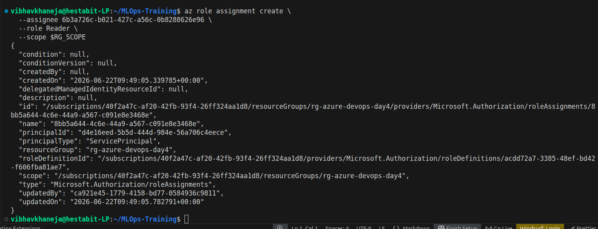
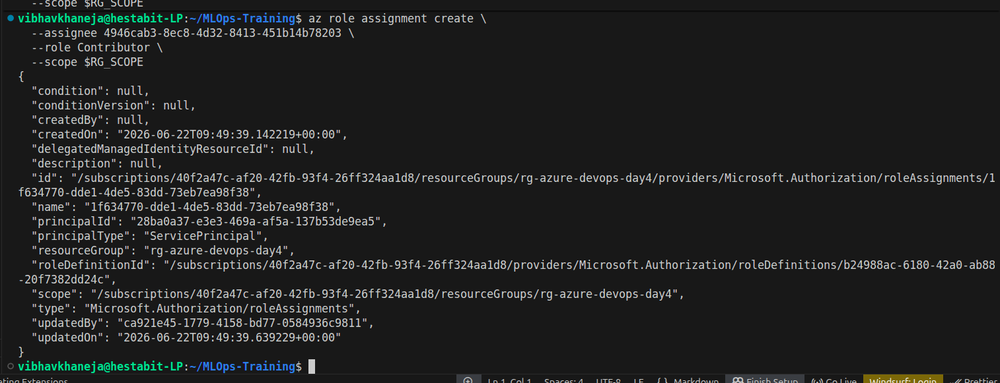
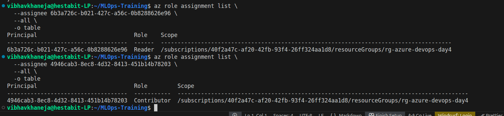
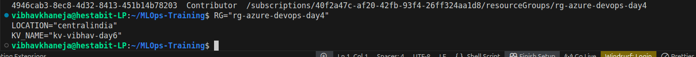
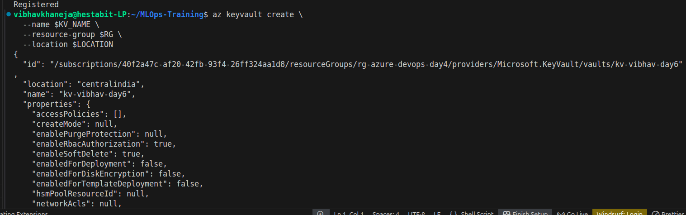
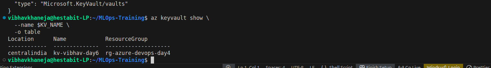
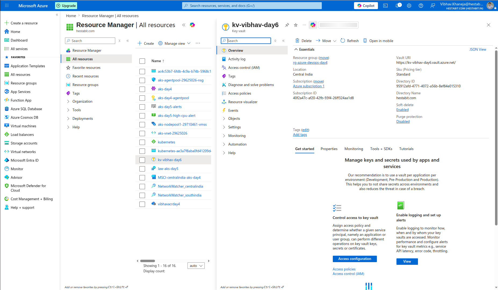
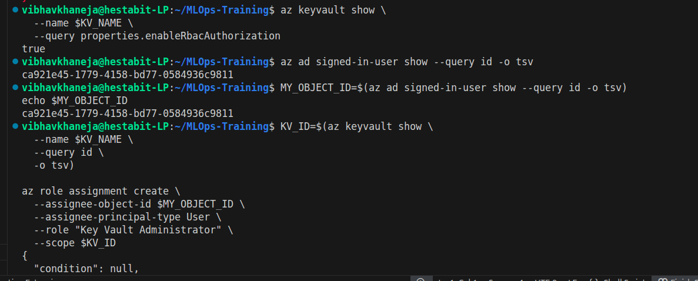
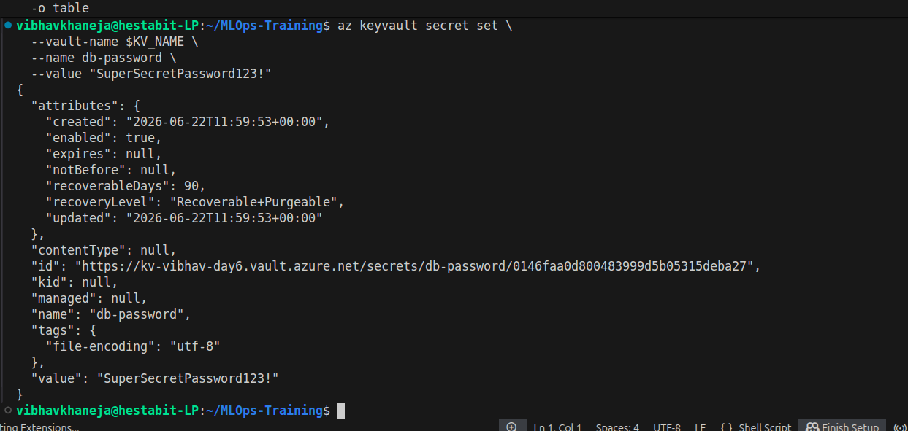
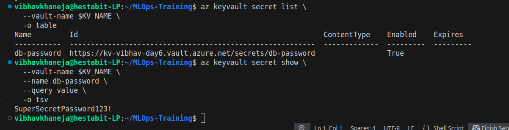
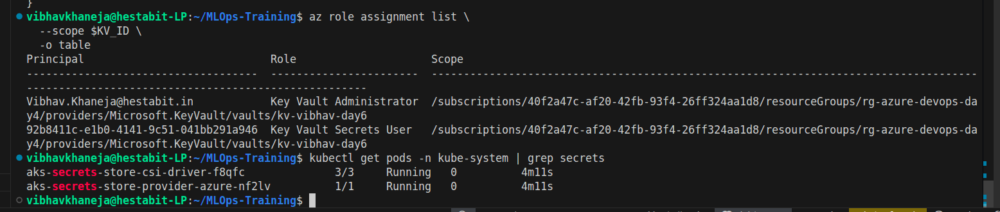
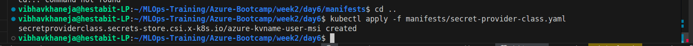
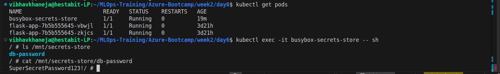
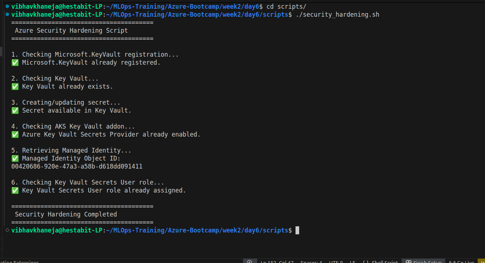


# Key Learnings

* Azure RBAC follows the Principle of Least Privilege.
* Service Principals provide non-human identities for automation.
* Key Vault separates secret management from application code.
* Managed Identities eliminate the need to store credentials.
* AKS can securely consume secrets directly from Azure Key Vault.
* Defender for Containers provides security posture management and threat detection for AKS environments.
