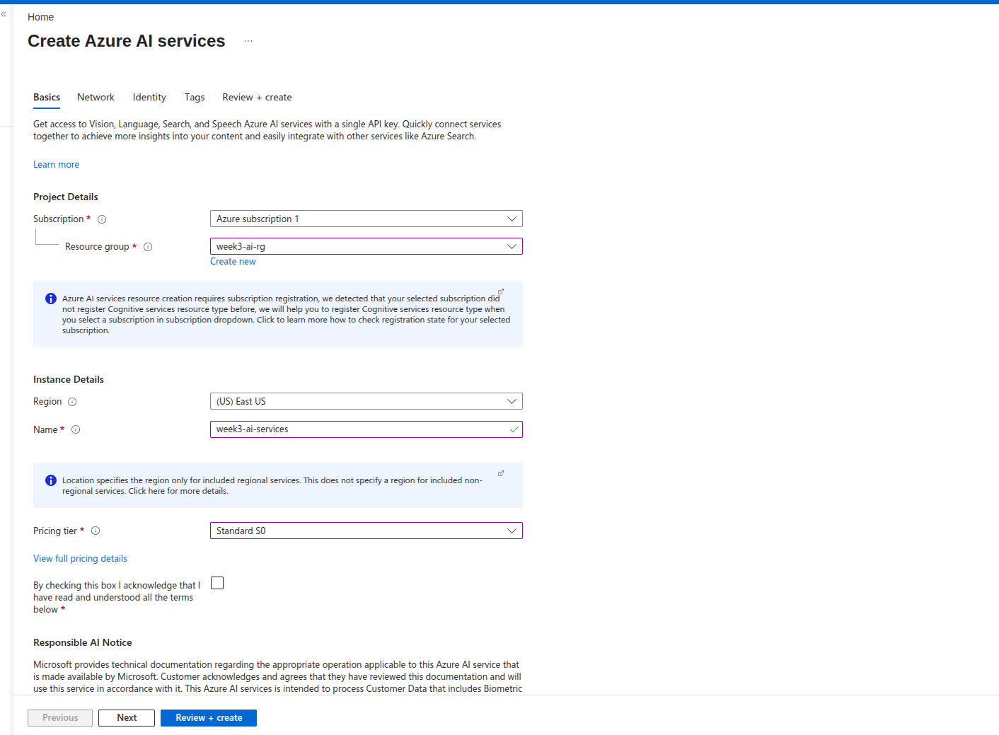
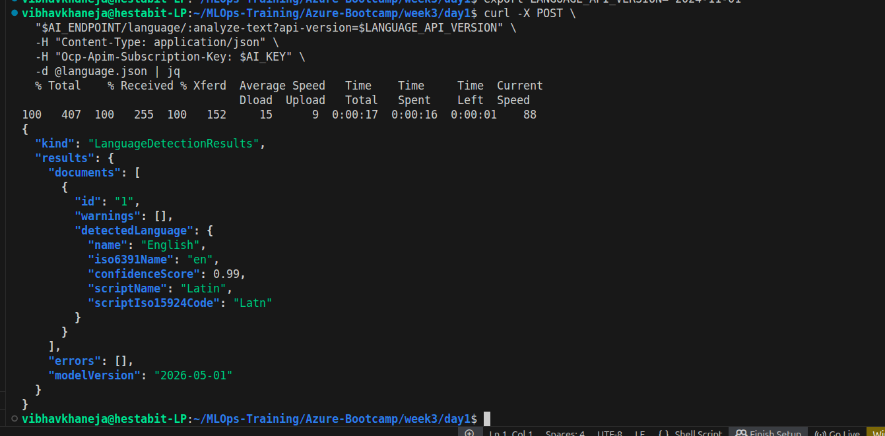
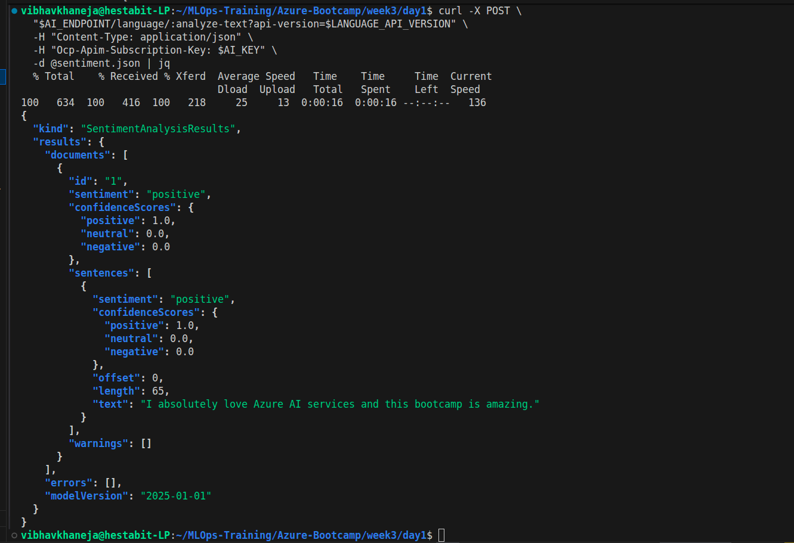
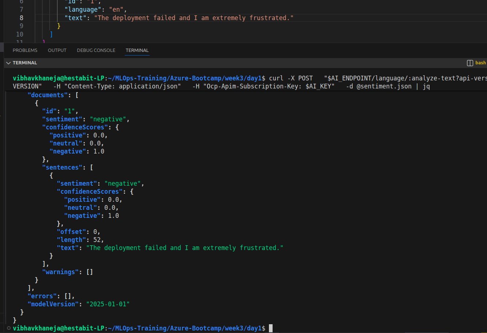
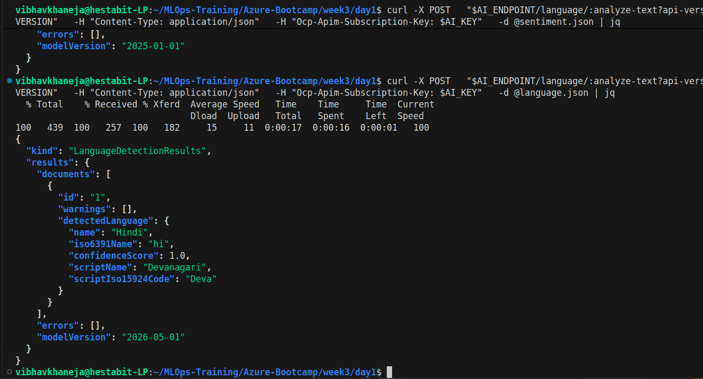
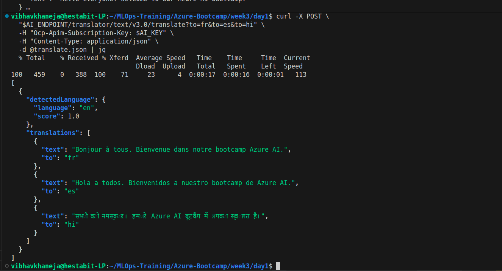
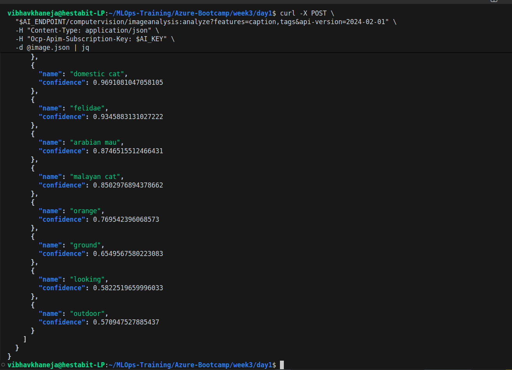
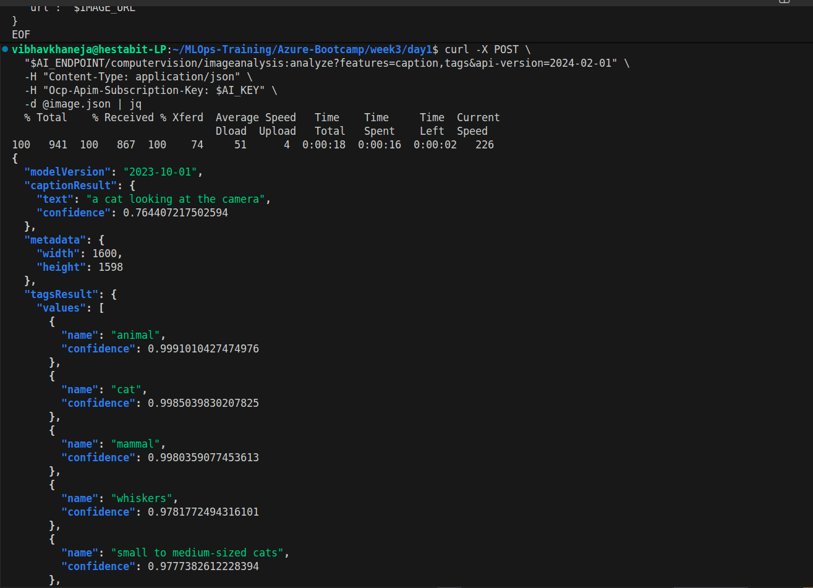
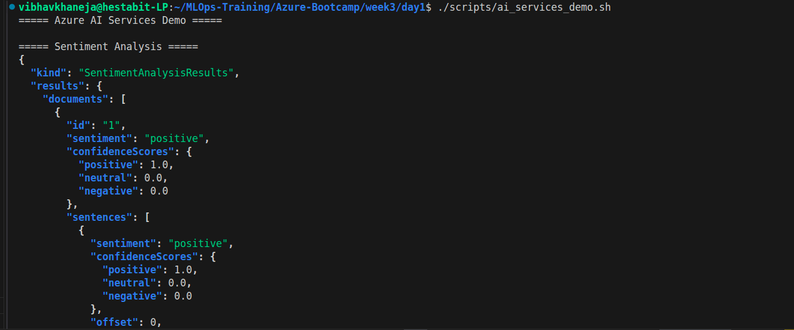
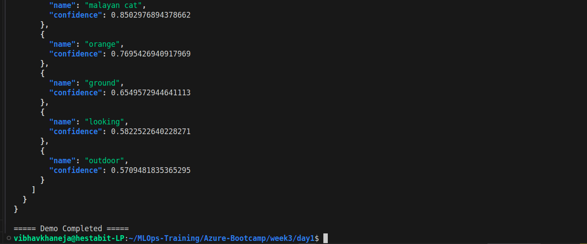

# Week 3 - Day 1: Azure AI Services Overview

# Objective

The objective of Day 1 was to explore Azure AI Services and understand how modern applications can consume Artificial Intelligence capabilities through pre-trained APIs without training machine learning models from scratch.

Azure AI Services provides managed APIs for:

* Language Processing
* Translation
* Computer Vision
* Speech Processing
* Document Intelligence
* Decision Making

Instead of building and training models ourselves, we can simply send HTTP requests and receive intelligent responses in JSON format.

---

# Learning Outcomes

By the end of this day, we were able to:

* Create an Azure AI Services Multi-Service Account.
* Understand API Keys and Endpoints.
* Consume AI services using REST APIs.
* Detect languages automatically.
* Perform sentiment analysis.
* Translate text into multiple languages.
* Analyze images using Computer Vision.
* Understand API Versioning.
* Compare SDK vs REST approaches.
* Automate multiple API calls using Bash scripting.

---

# Architecture

```text
Application
      ↓
HTTPS Request
      ↓
Azure AI Services Endpoint
      ↓
Pre-trained AI Models
      ↓
JSON Response
```

---

# What is Azure AI Services?

Azure AI Services (formerly Cognitive Services) is a collection of pre-trained AI APIs that allow developers to add intelligence to applications without needing expertise in Machine Learning.

Examples:

```text
Language → Sentiment Analysis
Vision → Image Captioning
Translator → Multi-language Translation
Speech → Speech to Text
Document Intelligence → Invoice Extraction
```

---

# Why Azure AI Services?

Without Azure AI:

```text
Collect Data
↓
Train Models
↓
Tune Hyperparameters
↓
Deploy Models
↓
Maintain Infrastructure
```

With Azure AI:

```text
HTTP Request
↓
JSON Response
```

Microsoft manages the models and infrastructure.

---

# Resource Created

## Resource Group

```text
week3-ai-rg
```

## Azure AI Services Resource

```text
week3-ai-services
```

Region:

```text
East US
```

SKU:

```text
S0
```

---

# Resource Architecture

```text
week3-ai-rg
│
└── week3-ai-services
        ├── Language APIs
        ├── Translator APIs
        ├── Vision APIs
        ├── Speech APIs
        └── Document Intelligence APIs
```

---

# API Keys and Endpoints

Endpoint:

```text
https://week3-ai-services.cognitiveservices.azure.com/
```

Think of it as:

```text
Server Address
```

API Key:

```text
Password / Authentication Token
```

---

# Multi-Service Account

One Azure AI Services resource provides access to:

| Service               | Purpose                 |
| --------------------- | ----------------------- |
| Language              | NLP tasks               |
| Translator            | Text Translation        |
| Vision                | Image Analysis          |
| Speech                | Speech Processing       |
| Document Intelligence | OCR and Form Extraction |

---

# Exercise 1.2 - Text Analytics API

## Language Detection

Input:

```text
Hola amigo, how are you?
```

Output:

```text
English
Confidence Score: 0.99
```

---

## Sentiment Analysis

Input:

```text
I absolutely love Azure AI services and this bootcamp is amazing.
```

Output:

```text
Positive
Confidence Score: 1.0
```

---

# Sentiment Categories

| Sentiment | Meaning                             |
| --------- | ----------------------------------- |
| Positive  | Happy, satisfied, appreciation      |
| Neutral   | Factual statement                   |
| Negative  | Frustration, anger, dissatisfaction |
| Mixed     | Combination of sentiments           |

---

# Example Sentiments

## Positive

```text
I love Azure AI Services.
```

## Neutral

```text
Today is Wednesday.
```

## Negative

```text
The deployment failed and I am frustrated.
```

## Mixed

```text
Azure is amazing but debugging YAML is painful.
```

---

# Confidence Scores

The model returns probabilities:

```json
{
  "positive": 0.98,
  "neutral": 0.01,
  "negative": 0.01
}
```

Higher confidence means the model is more certain about its prediction.

---

# Language Codes (ISO 639-1)

| Language             | Code    |
| -------------------- | ------- |
| English              | en      |
| Spanish              | es      |
| French               | fr      |
| Hindi                | hi      |
| German               | de      |
| Japanese             | ja      |
| Chinese (Simplified) | zh-Hans |
| Korean               | ko      |
| Italian              | it      |
| Portuguese           | pt      |

These codes are widely used in:

* Translation APIs
* Localization (i18n)
* Web Applications
* Mobile Applications

---

# Exercise 1.3 - Translator API

Input:

```text
Hello everyone. Welcome to our Azure AI bootcamp.
```

Translations:

* French (fr)
* Spanish (es)
* Hindi (hi)

---

# Translator Architecture

```text
Input Text
      ↓
Translator API
      ↓
Language Detection
      ↓
Translation Model
      ↓
Translated Text
```

---

# Benefits

One API call:

```text
?to=fr&to=es&to=hi
```

produces:

```text
French
Spanish
Hindi
```

This is more efficient than making three separate requests.

---

# Real World Use Cases

* Chat Applications
* Documentation Translation
* Global E-commerce
* Customer Support Systems
* Multi-language Websites

---

# Exercise 1.4 - Computer Vision API

Input:

```text
Image URL
```

Output:

* Caption
* Tags
* Confidence Scores
* Metadata

---

# Example Output

Caption:

```text
a cat looking at the camera
```

Tags:

```text
animal
cat
mammal
domestic cat
whiskers
```

---

# Computer Vision Architecture

```text
Image URL
      ↓
Azure Vision API
      ↓
Deep Learning Model
      ↓
Objects + Captions + Tags
```

---

# Real World Use Cases

* Accessibility Captions
* Image Search
* Product Categorization
* Social Media Applications
* Content Moderation
* OCR Systems

---

# API Version vs Model Version

## API Version

Controls:

* Endpoint Schema
* Request Format
* Response Format

Example:

```text
2024-11-01
```

---

## Model Version

Controls:

* AI Intelligence
* Accuracy
* Predictions

Example:

```text
2026-05-01
```

---

# Important Learning

During the exercises, we encountered:

```text
API Version Retired
```

This highlighted an important cloud engineering lesson:

* APIs evolve continuously.
* Preview APIs may be retired.
* Applications should pin API versions.
* Production systems must monitor deprecation notices.

---

# SDK vs REST

## REST Approach

Pros:

* Lightweight
* Language independent
* Easy to debug

Cons:

* Manual payload creation
* Manual authentication handling

---

## SDK Approach

Pros:

* Cleaner code
* Built-in authentication
* Better abstractions

Cons:

* Additional dependencies
* SDK version management

---

# Script Created

```text
scripts/ai_services_demo.sh
```

The script executes:

1. Sentiment Analysis
2. Translation
3. Computer Vision Analysis

in sequence.

---

# Key Concepts Learned

* Azure AI Services
* Cognitive Services
* REST APIs
* JSON
* API Keys
* Endpoints
* Multi-Service Accounts
* Language Detection
* Sentiment Analysis
* Translation
* Computer Vision
* API Versioning
* SDK vs REST


# Screenshots













---

# Conclusion

Day 1 introduced us to the world of managed AI services on Azure.

Instead of building machine learning models from scratch, we learned how modern cloud applications can consume pre-trained AI capabilities through simple REST APIs.

This day laid the foundation for the remainder of Week 3, where we will move from consuming AI APIs to building, training, and deploying Machine Learning solutions using Azure Machine Learning and Azure OpenAI services.
