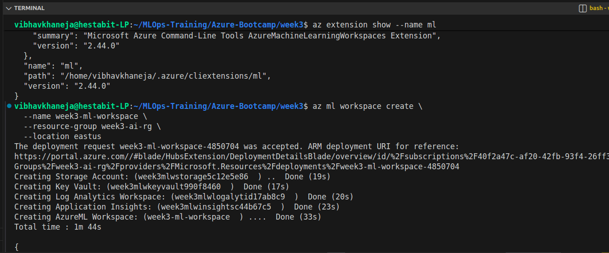
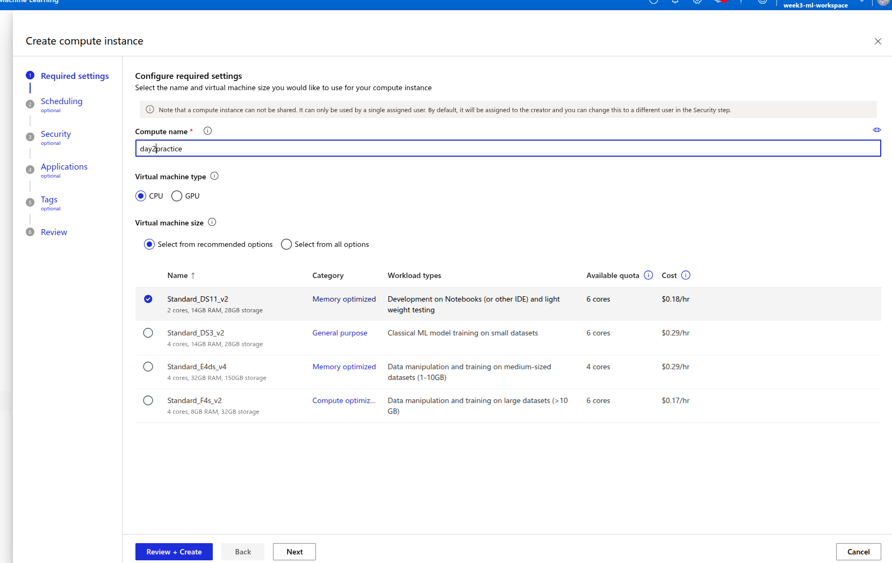
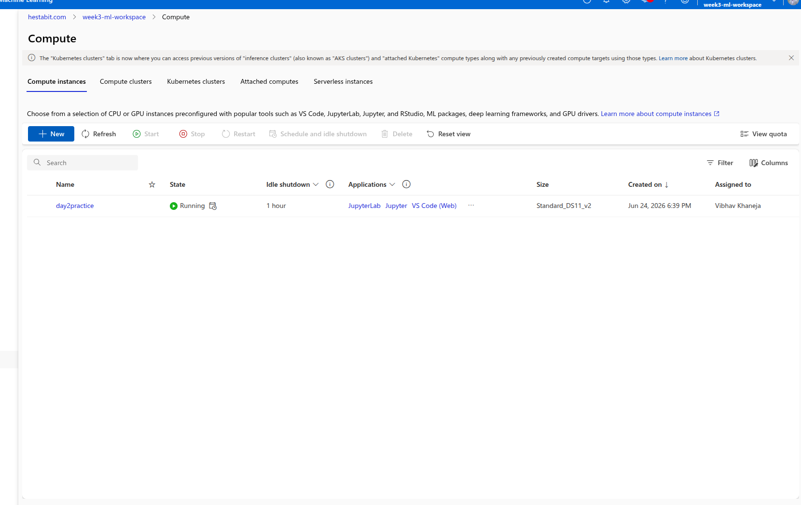
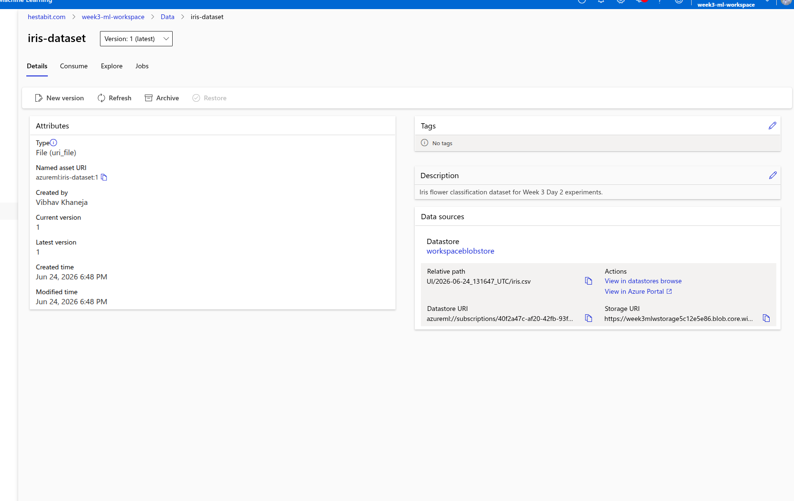
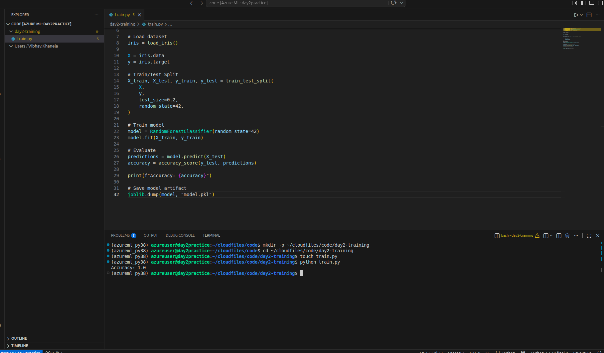
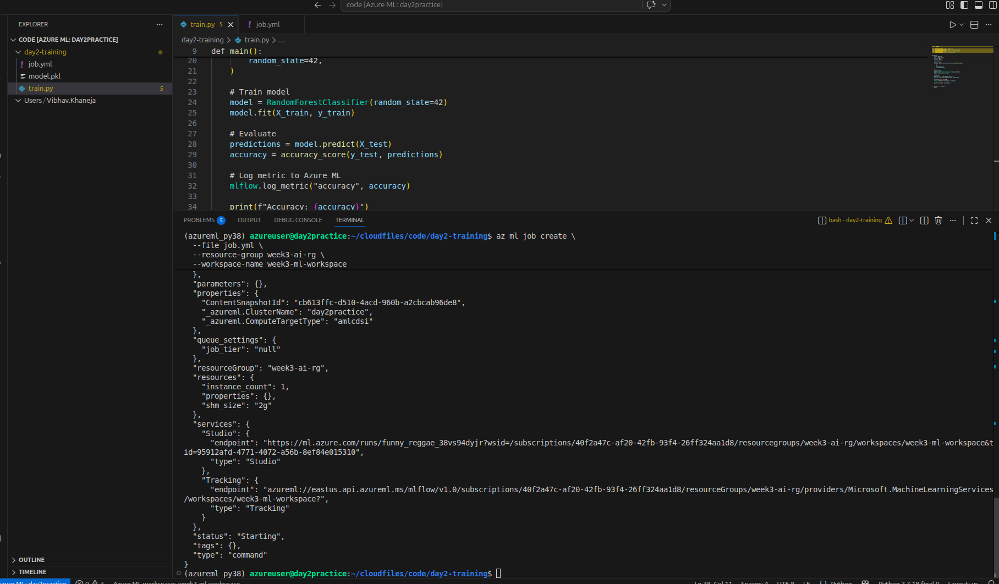

# Week 3 - Day 2
# Azure Machine Learning Workspace

## Objective

The objective of Day 2 was to understand the core building blocks of Azure Machine Learning and set up an environment capable of training, tracking, and managing machine learning experiments in the cloud.

Unlike Azure AI Services from Day 1, where we consumed pre-built APIs, Azure Machine Learning allows us to build, train, track, and deploy our own machine learning models.

---

# Learning Outcomes

By the end of this day, we were able to:

- Create an Azure Machine Learning Workspace.
- Understand all resources automatically created with the workspace.
- Create a Compute Instance for development.
- Upload and register datasets.
- Train a machine learning model.
- Submit jobs to Azure ML.
- Track experiments and runs.
- Understand MLflow integration.
- Compare Compute Instances and Compute Clusters.
- Understand the role of environments and dependencies.

---

# Architecture Overview

```text
Local Machine
      |
      |
Azure ML Workspace
      |
      |---- Compute Instance
      |
      |---- Datasets
      |
      |---- Experiments
      |
      |---- Models
      |
      |---- Artifacts
      |
      |---- MLflow Tracking
```

---

# What is an Azure ML Workspace?

The Azure ML Workspace is the central management hub for all machine learning activities.

It stores and manages:

- Experiments
- Datasets
- Compute resources
- Models
- Environments
- Logs
- Metrics
- Endpoints

Think of it as:

> "A GitHub repository for Machine Learning assets."

Everything related to ML development lives inside the workspace.

---

# Resources Automatically Created

Creating an Azure ML Workspace also creates supporting Azure services.

## Storage Account

Purpose:

- Stores datasets
- Stores artifacts
- Stores models
- Stores logs

Example:

- iris.csv
- model.pkl

---

## Key Vault

Purpose:

- Stores secrets
- Stores credentials
- Stores connection strings
- Stores API keys

Without exposing them in code.

---

## Application Insights

Purpose:

- Monitoring
- Telemetry
- Logging
- Diagnostics

---

## Log Analytics Workspace

Purpose:

- Collect logs
- Collect metrics
- Query logs
- Troubleshooting

---

# Compute Instance

A Compute Instance is a managed cloud VM designed for development work.

It provides:

- JupyterLab
- Jupyter Notebook
- VS Code in browser
- Python environments
- Persistent storage

Think of it as:

> Your personal cloud laptop for ML development.

---

# Compute Instance Used

| Property | Value |
|-----------|--------|
| Name | day2practice |
| Size | Standard_DS11_v2 |
| vCPU | 2 |
| RAM | 14 GB |
| Storage | 28 GB |
| Pricing | Approximately \$0.18/hour |

---

# Why We Deleted It

Compute Instances continuously incur cost while running.

Since our goal is learning:

- Start Compute
- Practice
- Stop Compute
- Delete Compute

This keeps Azure costs extremely low.

---

# Dataset Registration

Dataset used:

```text
iris.csv
```

The dataset was uploaded and registered as:

```text
iris-dataset
```

Type:

```text
uri_file
```

Registration means:

Azure ML now knows:

- where the dataset lives
- its version
- its metadata

without hardcoding paths.

---

# Iris Dataset

The Iris dataset contains:

- 150 flower samples
- 3 flower species

Species:

1. Setosa
2. Versicolor
3. Virginica

Features:

1. Sepal Length
2. Sepal Width
3. Petal Length
4. Petal Width

Target:

Flower Species Classification.

---

# Training Script

We created:

```text
train.py
```

The script:

1. Loads Iris dataset
2. Splits data
3. Trains Random Forest model
4. Calculates accuracy
5. Saves model
6. Logs metrics using MLflow

---

# Random Forest Classifier

Random Forest is an ensemble algorithm.

Instead of one tree:

```text
Tree 1
Tree 2
Tree 3
Tree 4
...
Tree N
```

All trees vote.

Final prediction:

Majority Vote.

Advantages:

- High accuracy
- Less overfitting
- Handles non-linear data
- Easy to use

---

# MLflow

MLflow is an experiment tracking framework.

It can track:

- Parameters
- Metrics
- Models
- Artifacts
- Runs

Example:

```python
mlflow.log_metric("accuracy", accuracy)
```

This stores the metric inside Azure ML.

---

# Experiments

An experiment is a collection of runs.

Example:

```text
Experiment
│
├── Run 1
├── Run 2
├── Run 3
```

This makes model comparison easy.

---

# Artifacts

Artifacts are files generated during training.

Examples:

- model.pkl
- logs
- predictions
- plots

---

# Environments

An environment defines:

- Python version
- Libraries
- Dependencies

Our environment:

```yaml
python=3.10
scikit-learn
mlflow
joblib
```

Benefits:

- Reproducibility
- Portability
- Consistency

---

# Compute Instance vs Compute Cluster

## Compute Instance

Purpose:

Development.

Examples:

- Jupyter notebooks
- Data exploration
- Small experiments

Characteristics:

- Single VM
- Persistent
- Manual start/stop

---

## Compute Cluster

Purpose:

Training jobs.

Characteristics:

- Auto scales
- Multiple VMs
- Cost efficient
- Automatically shuts down

---

# Comparison

| Feature | Compute Instance | Compute Cluster |
|---------|-----------------|----------------|
| Purpose | Development | Training |
| Autoscaling | No | Yes |
| Multi-node | No | Yes |
| Persistent | Yes | No |
| Jupyter | Yes | No |
| Cost | Higher if left running | Lower due to autoscaling |

---

# Azure ML Workflow Learned Today

```text
Create Workspace
        ↓
Create Compute
        ↓
Upload Dataset
        ↓
Write Training Script
        ↓
Create Environment
        ↓
Submit Job
        ↓
Track Experiment
        ↓
View Metrics
        ↓
Store Artifacts
```

---

# Screenshots








# Key Takeaways

Azure Machine Learning is not a machine learning framework like Scikit-Learn or TensorFlow.

It is an MLOps platform that provides:

- Infrastructure
- Experiment Tracking
- Dataset Management
- Compute Resources
- Model Registry
- Deployment Capabilities
- Monitoring

Today we successfully understood how Azure ML organizes the entire machine learning lifecycle and how cloud-native ML experimentation works.