# Week 3 - Day 3

# Training & Deploying ML Models with Azure Machine Learning

## Objective

The goal of Day 3 was to experience an end-to-end Machine Learning workflow using Azure Machine Learning's AutoML capabilities. Instead of manually selecting algorithms and writing training code, we leveraged Azure AutoML to automatically train, evaluate, register, and deploy a machine learning model as a REST API.

By the end of this day, we had a fully deployed machine learning endpoint capable of receiving JSON requests and returning predictions in real time.

---

# Learning Outcomes

* Understand Azure AutoML workflows.
* Train multiple machine learning models automatically.
* Evaluate model performance using various metrics.
* Register the best-performing model in Azure ML Model Registry.
* Deploy a model as a Managed Online Endpoint.
* Invoke the endpoint using REST APIs and `curl`.
* Automate deployment steps using shell scripts.
* Understand the complete lifecycle of an ML model from training to inference.

---

# Architecture

```text
CSV Dataset
     ↓
MLTable Dataset Asset
     ↓
Azure AutoML Job
     ↓
Train Multiple Algorithms
     ↓
Evaluate Metrics
     ↓
Best Model Selected
     ↓
Model Registry
     ↓
Managed Online Endpoint
     ↓
REST API Predictions
```

---

# Exercise 3.1 – Run AutoML on a Tabular Dataset

We used the Iris Flower Classification dataset stored as an MLTable asset inside Azure Machine Learning.

Dataset:

* iris.csv
* 150 records
* 4 features
* Target column: species

Features:

* sepal_length
* sepal_width
* petal_length
* petal_width

Target:

* species

Task Type:

```yaml
classification
```

AutoML automatically performed:

* Data validation
* Data splitting
* Feature engineering
* Algorithm selection
* Hyperparameter tuning
* Model evaluation

---

# How Azure AutoML Trained Models

Azure automatically trained multiple algorithms, including:

1. K-Nearest Neighbors (KNN)
2. Extreme Random Trees
3. LightGBM
4. XGBoost
5. Additional preprocessing pipelines

AutoML evaluated every model and ranked them according to:

```yaml
primary_metric: accuracy
```

---

# Exercise 3.2 – Review AutoML Results

## Best Models

| Model                     | Accuracy |
| ------------------------- | -------- |
| StandardScaler + KNN      | 0.96     |
| MaxAbsScaler + ExtraTrees | 0.96     |
| LightGBM                  | 0.946    |
| XGBoost                   | 0.946    |

---

# Final Metrics

Accuracy:

```text
0.9600
```

AUC Macro:

```text
0.9846
```

Balanced Accuracy:

```text
0.9646
```

Precision:

```text
0.9535
```

Recall:

```text
0.9646
```

F1 Score:

```text
0.9554
```

---

# Understanding the Child Jobs

The AutoML run created several child jobs.

### Setup Job

Prepared environment and dependencies.

### Featurization Job

Analyzed the dataset and generated preprocessing steps.

### Training Jobs

Each child job trained a different algorithm and produced metrics.

### Worker Jobs

Executed model training on compute resources.

---

# How Azure Split the Dataset

Azure AutoML automatically performed:

```text
Training Data
       ↓
Cross Validation Folds
       ↓
Train Model
       ↓
Validate Model
       ↓
Compute Metrics
```

This allows Azure to compare multiple models fairly.

---

# Exercise 3.3 – Register the Best Model

Best model selected:

```text
iris-knn-model
Version: 1
Type: mlflow_model
```

The model was stored inside Azure ML Model Registry and can now be:

* Versioned
* Reused
* Deployed
* Shared

---

# Exercise 3.4 – Deploy the Model

We created:

* Managed Online Endpoint
* Deployment named:

```text
blue
```

Endpoint:

```text
vibhav-iris-endpoint-01
```

The deployment exposes a REST API endpoint that can be consumed by applications.

---

# Exercise 3.5 – Test the Endpoint

Request:

```json
{
  "input_data": {
    "columns": [
      "sepal_length",
      "sepal_width",
      "petal_length",
      "petal_width"
    ],
    "data": [
      [5.1, 3.5, 1.4, 0.2]
    ]
  }
}
```

Prediction:

```json
["setosa"]
```

This confirmed that the endpoint was successfully serving predictions.

---

# Exercise 3.6 – Deployment Automation

Created:

```text
scripts/model_deploy.sh
```

The script performs:

1. Check endpoint existence.
2. Check deployment existence.
3. Run smoke test.
4. Display scoring URI.

This introduces Infrastructure as Code concepts for ML deployments.

---

# Key Concepts Learned

## AutoML

Automatically trains and evaluates many algorithms.

## Model Registry

Stores versioned machine learning models.

## Managed Online Endpoint

Hosts models as scalable REST APIs.

## Deployment

A specific model version running behind an endpoint.

## Scoring URI

Public API used to obtain predictions.

---

# Screenshots

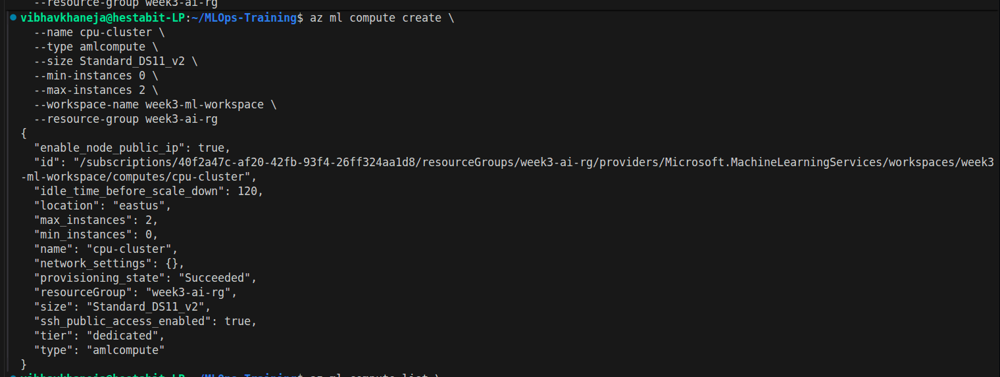
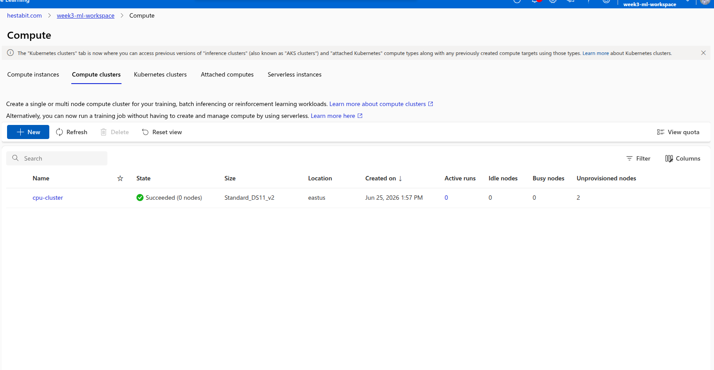
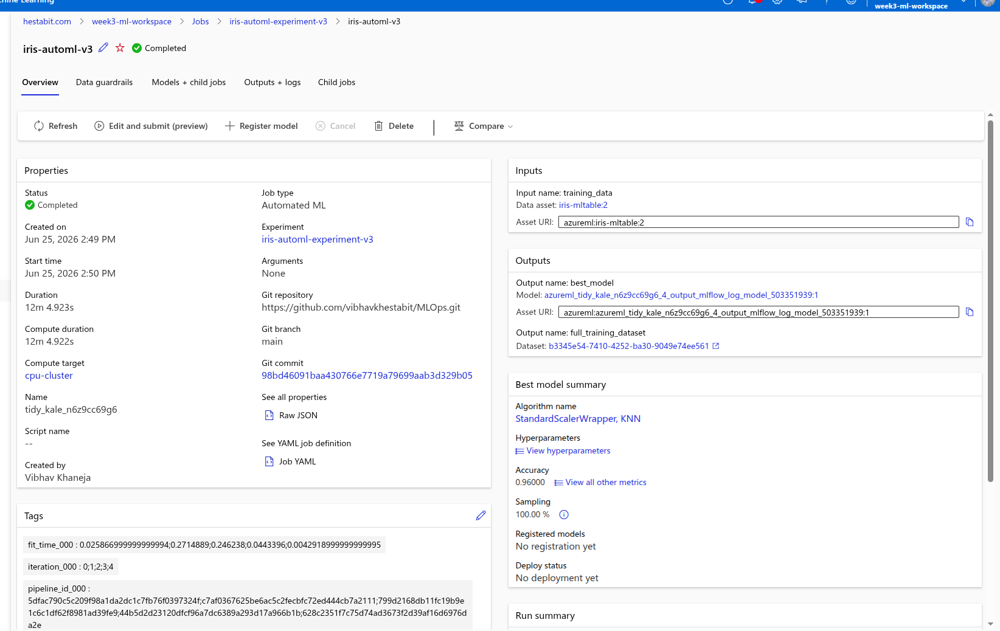
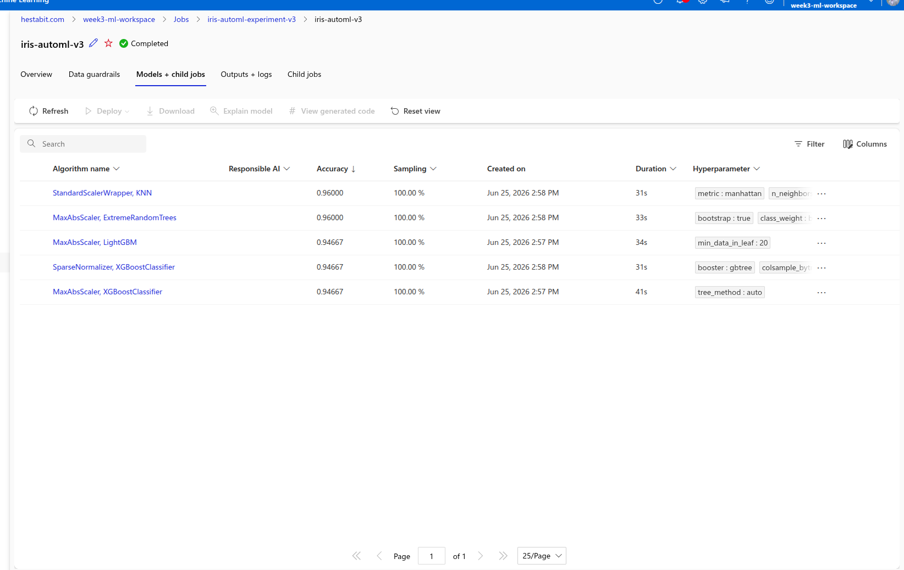
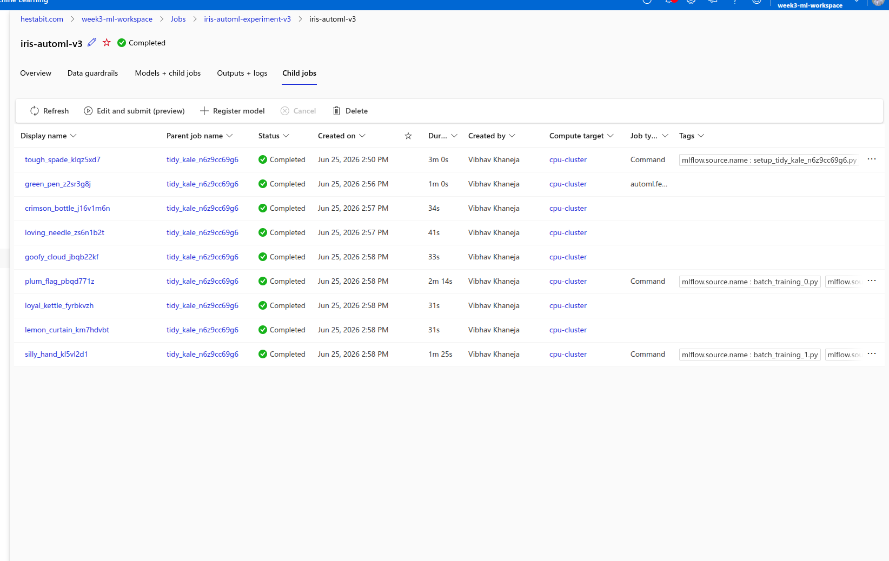
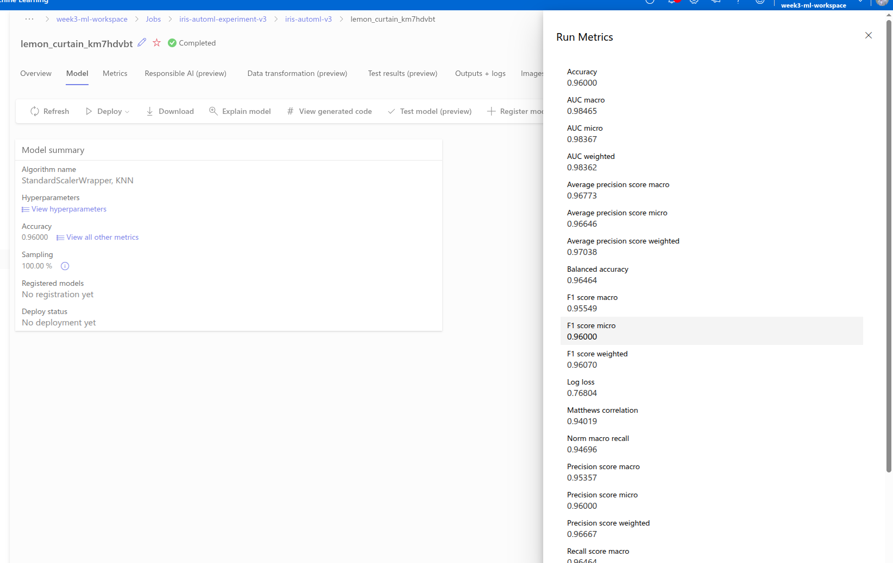
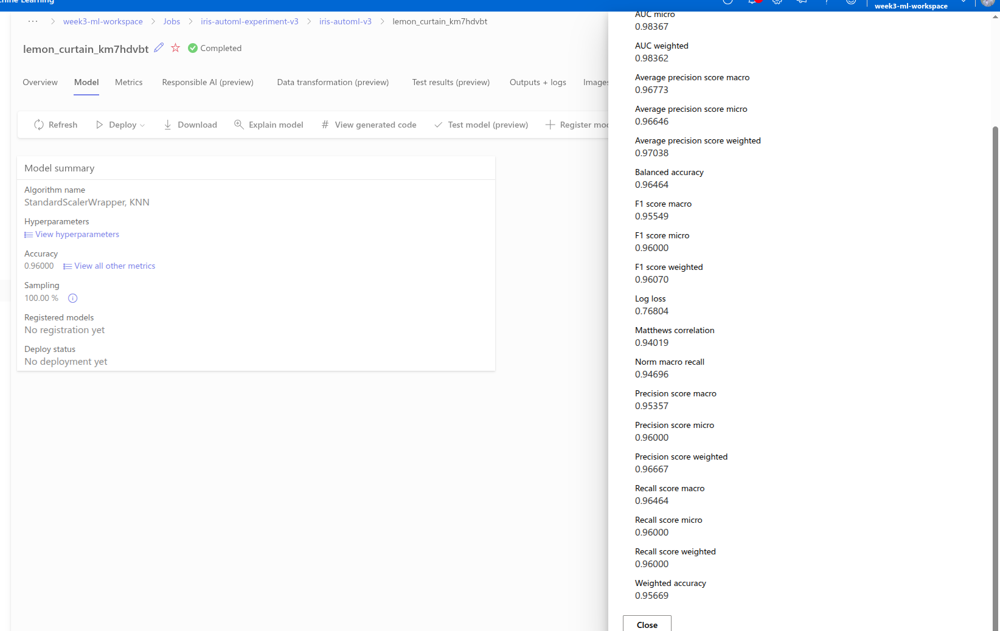
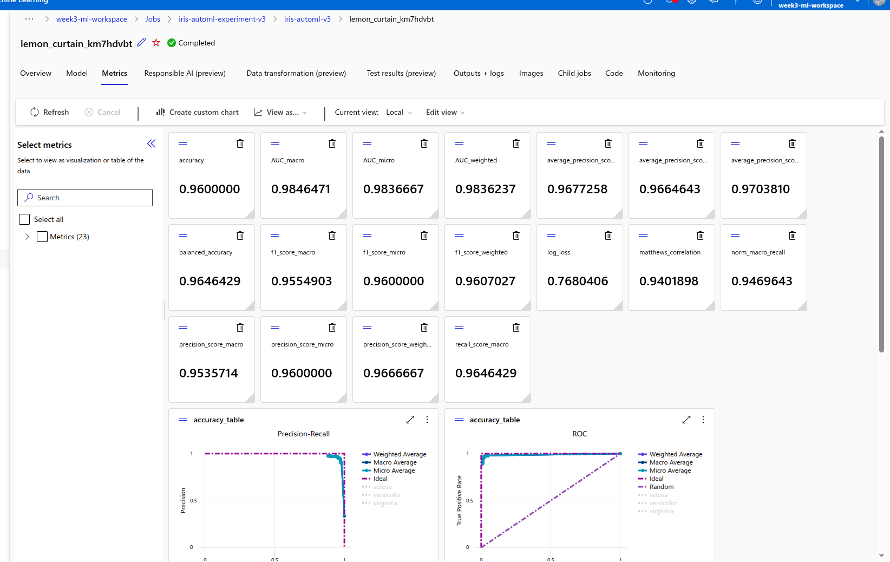
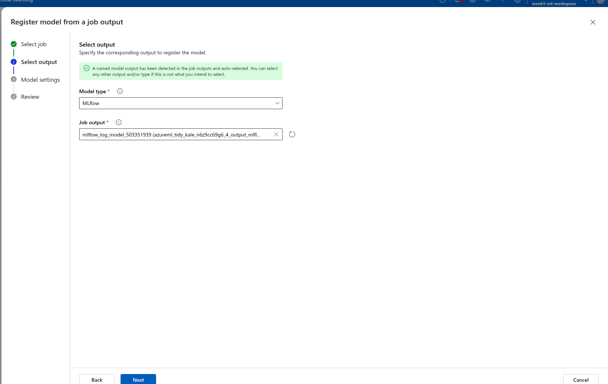
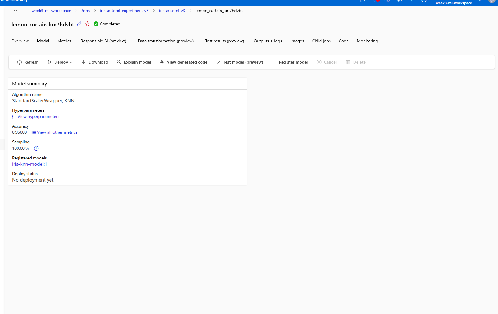
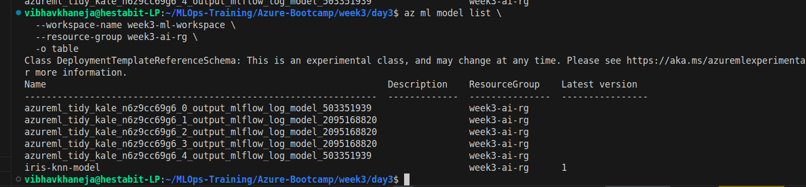
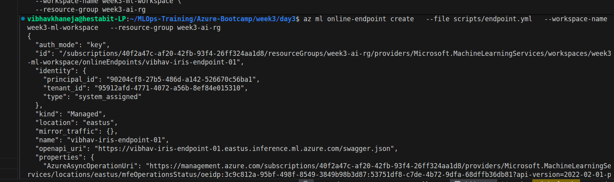
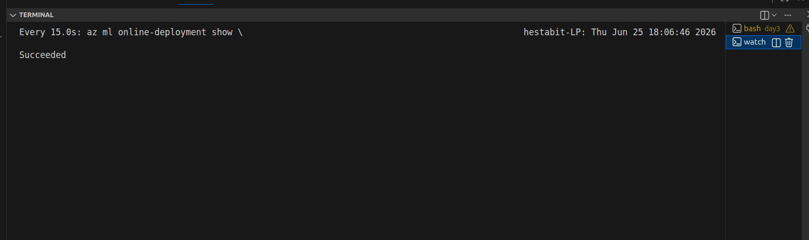
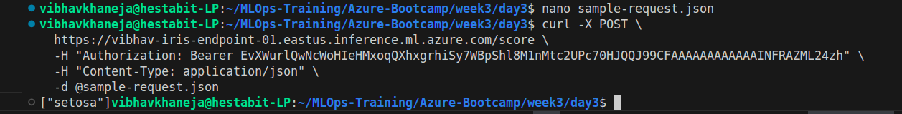
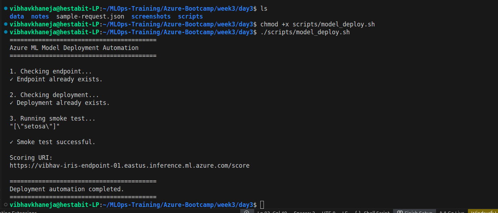


# Real World MLOps Flow

```text
Data
 ↓
Training
 ↓
Evaluation
 ↓
Model Registry
 ↓
Deployment
 ↓
Inference Endpoint
 ↓
Monitoring
```

---

# Conclusion

Day 3 introduced the complete machine learning lifecycle on Azure. We successfully trained multiple models using AutoML, analyzed their performance, registered the best model, deployed it as a real-time endpoint, and consumed predictions through a REST API.

This was our first experience with production-style machine learning workflows where a trained model becomes a deployable service that applications can consume in real time.
