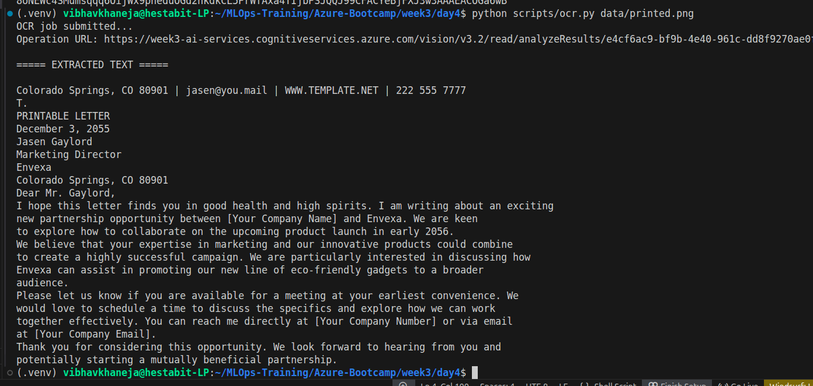
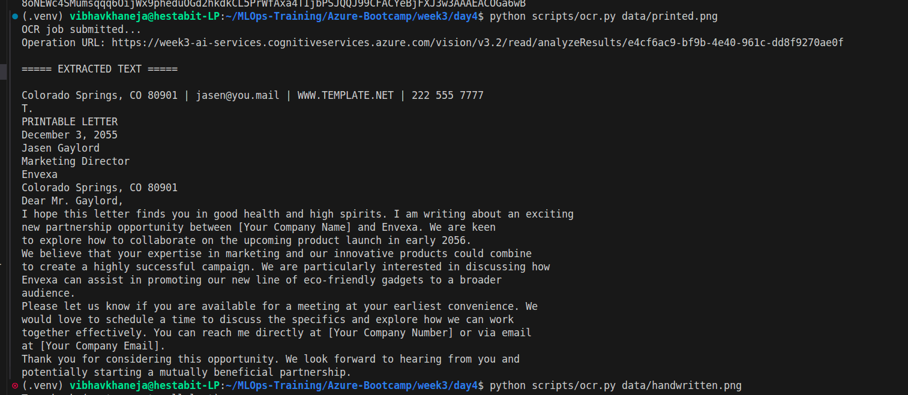
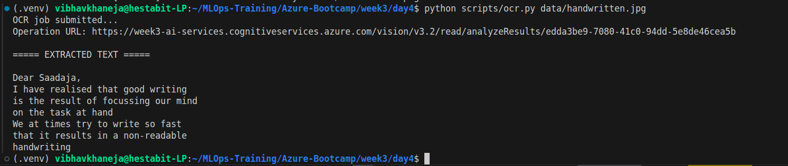
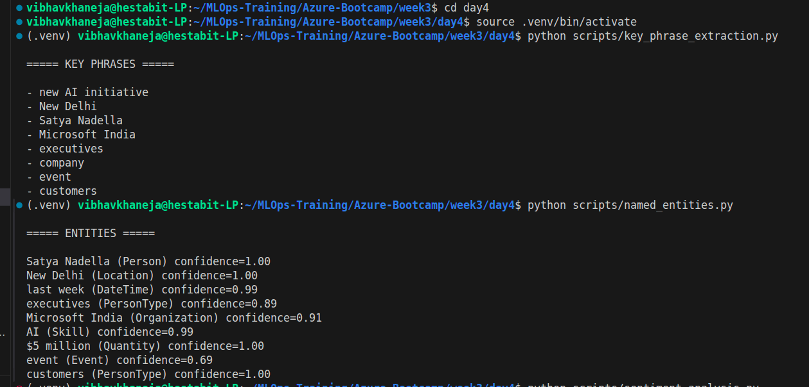
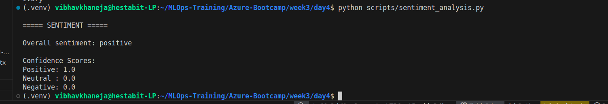
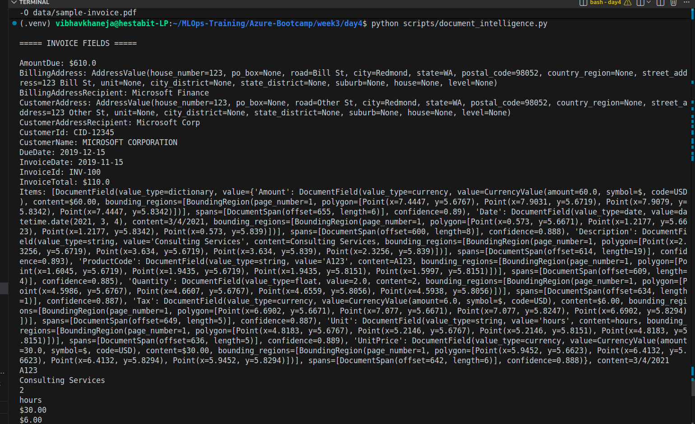
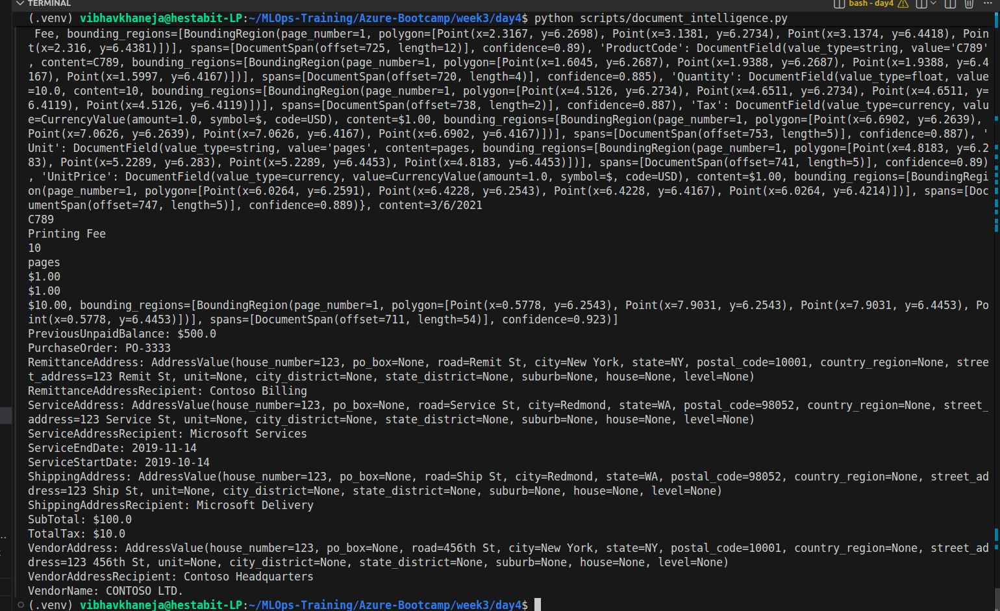
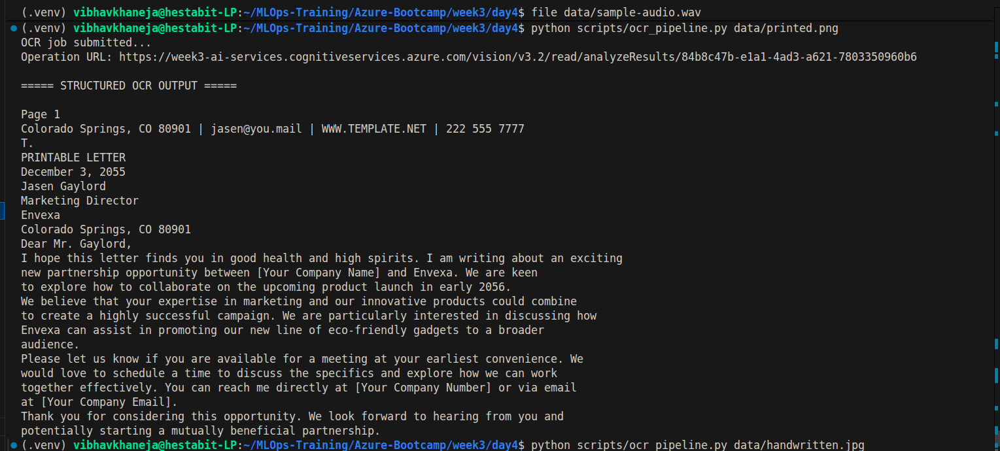
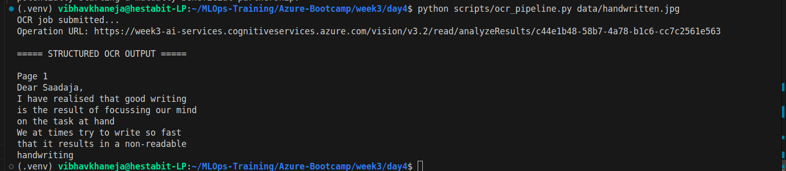

# Week 3 - Day 4

# Computer Vision & Language APIs (Deep Dive)

## Objective

The objective of Day 4 was to explore Azure's pre-trained AI services and understand how to integrate Computer Vision, Language Services, Document Intelligence, and Speech Services into Python applications without training any machine learning models.

---

# Learning Outcomes

By the end of this day, we were able to:

* Perform Optical Character Recognition (OCR) on printed and handwritten text.
* Extract key phrases from text using Azure Language Service.
* Perform Named Entity Recognition (NER).
* Analyze sentiment from text.
* Parse structured information from invoices using Document Intelligence.
* Understand Speech-to-Text service integration and audio requirements.
* Build a reusable OCR pipeline in Python.
* Containerize the application using Docker.

---

# Architecture

```text
Image/PDF/Text
      │
      ▼
Azure AI Services
      │
      ├── Computer Vision (OCR)
      ├── Language Service
      ├── Document Intelligence
      └── Speech Service
      │
      ▼
Python Scripts
      │
      ▼
Structured Output
      │
      ▼
Docker Container
```

---

# Project Structure

```text
week3/
└── day4/
    ├── data/
    │   ├── printed.png
    │   ├── handwritten.jpg
    │   ├── invoice.pdf
    │   └── sample-audio.wav
    │
    ├── scripts/
    │   ├── set_env.sh
    │   ├── ocr.py
    │   ├── ocr_pipeline.py
    │   ├── key_phrase_extraction.py
    │   ├── named_entities.py
    │   ├── sentiment_analysis.py
    │   ├── document_intelligence.py
    │   └── speech_to_text.py
    │
    ├── requirements.txt
    ├── Dockerfile
    └── notes/
        ├── README.md
        └── commands.md
```

---

# Exercise 4.1 – OCR using Computer Vision

### Objective

Extract text from printed and handwritten images.

### Services Used

* Azure AI Vision Service
* Read API

### Outcome

Successfully extracted text from:

* Printed document
* Handwritten note

---

# Exercise 4.2 – Language Service

### Objective

Extract meaningful information from text.

### Tasks Performed

* Key Phrase Extraction
* Named Entity Recognition
* Sentiment Analysis

### Outcome

Successfully identified:

* Organizations
* Persons
* Locations
* Dates
* Overall sentiment

---

# Exercise 4.3 – Document Intelligence

### Objective

Extract structured information from an invoice PDF.

### Fields Extracted

* Vendor Name
* Invoice Number
* Invoice Date
* Purchase Order
* Subtotal
* Tax
* Total Amount
* Addresses

### Outcome

Successfully parsed invoice information without writing custom extraction rules.

---

# Exercise 4.4 – Speech-to-Text

### Objective

Convert audio into text.

### Status

Speech Service and SDK configuration were completed successfully.

The transcription step could not be demonstrated because a valid PCM WAV sample was unavailable in the environment. The issue was isolated to the input audio file and not to Azure configuration.

---

# Exercise 4.5 – OCR Pipeline

### Objective

Create a reusable Python application that:

1. Accepts an image.
2. Sends it to Azure OCR API.
3. Prints structured extracted text.

### Outcome

Successfully built a reusable OCR pipeline.

---

# Exercise 4.6 – Containerisation

### Objective

Package the OCR application into a Docker container.

### Outcome

Successfully created:

* requirements.txt
* Dockerfile

The application can be deployed to:

* Azure Container Instances (ACI)
* Azure Kubernetes Service (AKS)
* Azure ML Endpoints

---

# Key Concepts Learned

## Computer Vision

Allows applications to understand images and extract information.

## OCR

Converts images containing text into machine-readable text.

## Language Service

Extracts insights from unstructured text.

## Document Intelligence

Extracts structured data from forms and invoices.

## Speech Service

Converts spoken language into text and vice versa.

## Containerisation

Packages applications with all dependencies into portable units.

---

# Screenshots











# Conclusion

Day 4 demonstrated the power of Azure's pre-trained AI services. Without training any machine learning models, we were able to build real-world AI features such as OCR, entity extraction, document processing, and sentiment analysis.

This day also reinforced an important engineering principle:

> AI systems are not only about model training. A large number of production AI applications are built by orchestrating existing cloud AI services together with Python applications and containers.
