# README.md

# Azure Bootcamp – Week 3 Day 5

# Azure OpenAI Service

## Objective

The goal of Day 5 was to explore Azure OpenAI Service and learn how Large Language Models can be integrated into cloud-native applications. We deployed GPT and Embedding models, interacted with them through APIs, built prompt-engineering examples, generated semantic embeddings, implemented vector similarity search, and finally created a Retrieval Augmented Generation (RAG) application.

---

# Learning Outcomes

By the end of this day we were able to:

* Provision and configure Azure OpenAI resources.
* Deploy GPT models and Embedding models.
* Interact with Azure OpenAI through REST APIs and Python SDK.
* Design effective system prompts.
* Build a DevOps troubleshooting assistant.
* Generate embeddings and calculate semantic similarity.
* Build a Question Answering application.
* Implement Retrieval Augmented Generation (RAG).

---

# Folder Structure

```text
week3/
└── day5/
    ├── notes/
    │   ├── README.md
    │   └── commands.md
    ├── scripts/
    │   ├── set_env.sh
    │   ├── chat_completion_curl.sh
    │   ├── chat_completion.py
    │   ├── devops_assistant.py
    │   ├── devops_assistant_2.py
    │   ├── embeddings_demo.py
    │   ├── cosine_similarity.py
    │   ├── readme_qa.py
    │   ├── build_chunks.py
    │   ├── build_embeddings.py
    │   └── rag_qa.py
    ├── vector_store/
    │   ├── chunks.json
    │   └── embeddings.npy
    ├── data/
    │   └── week1_readme.md
    ├── screenshots/
    └── requirements.txt
```

---

# Architecture

```text
Azure OpenAI Resource
        │
        ├── gpt-5-mini
        │       │
        │       ├── Chat Completion API
        │       ├── DevOps Assistant
        │       └── README Q&A Application
        │
        └── text-embedding-3-small
                │
                ├── Embeddings Demo
                ├── Cosine Similarity
                └── RAG Application
```

---

# Exercises Performed

## Exercise 5.1

Created an Azure OpenAI resource and explored supported models, locations, and quotas.

---

## Exercise 5.2

Deployed:

* gpt-5-mini
* text-embedding-3-small

and tested them successfully in Azure AI Foundry.

---

## Exercise 5.3

Implemented Chat Completion APIs using:

* cURL
* Python SDK

and generated responses directly from Azure-hosted models.

---

## Exercise 5.4

Built a DevOps Assistant persona capable of:

* explaining Kubernetes failures,
* identifying root causes,
* suggesting fixes,
* generating troubleshooting commands.

Example scenarios:

* ImagePullBackOff
* CrashLoopBackOff
* Architecture mismatch errors.

---

## Exercise 5.5

Generated text embeddings and computed cosine similarity between semantically related snippets.

Example:

```text
docker run nginx
docker container run nginx
```

Similarity Score:

```text
0.8841
```

This demonstrated how embeddings capture semantic meaning instead of exact text matching.

---

## Exercise 5.6

Built a Question Answering application over our Week 1 README.

The application answered project-related questions using GPT and provided concise summaries of our previous work.

---

## Exercise 5.7

Implemented a Retrieval Augmented Generation (RAG) system.

Pipeline:

```text
Documents
    ↓
Chunking
    ↓
Embeddings
    ↓
Vector Store
    ↓
Similarity Search
    ↓
GPT Response Generation
```

This is the same architecture that will be reused during the Week 3 Capstone project.

---

# Resources Created

| Resource               | Purpose                    |
| ---------------------- | -------------------------- |
| week3-openai           | Azure OpenAI Resource      |
| gpt-5-mini             | Chat Model Deployment      |
| text-embedding-3-small | Embedding Model Deployment |
| vector_store           | Local Vector Database      |

---

# Key Concepts Learned

## Prompt Engineering

Instructions provided to the model significantly affect the quality and format of responses.

---

## Embeddings

Embeddings transform text into high-dimensional vectors where semantically similar content lies closer together.

---

## Cosine Similarity

Measures similarity between two vectors.

Values:

* 1 → identical meaning
* 0 → unrelated
* -1 → opposite meaning

---

## Retrieval Augmented Generation (RAG)

RAG combines:

* semantic search,
* vector databases,
* large language models,

to generate context-aware answers from private data.

# Screenshots

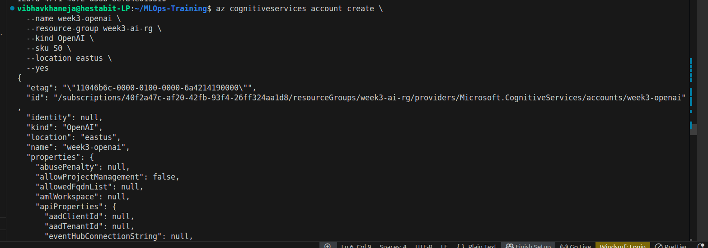
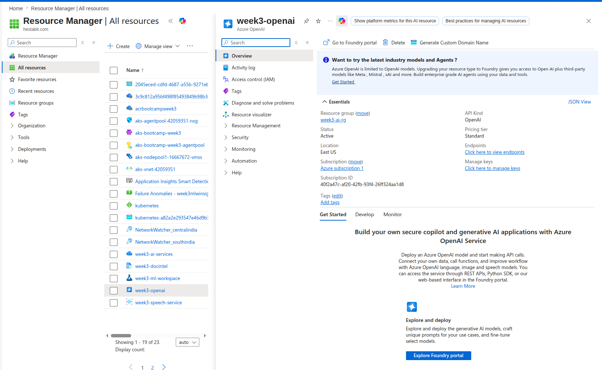
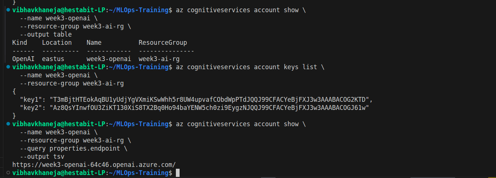
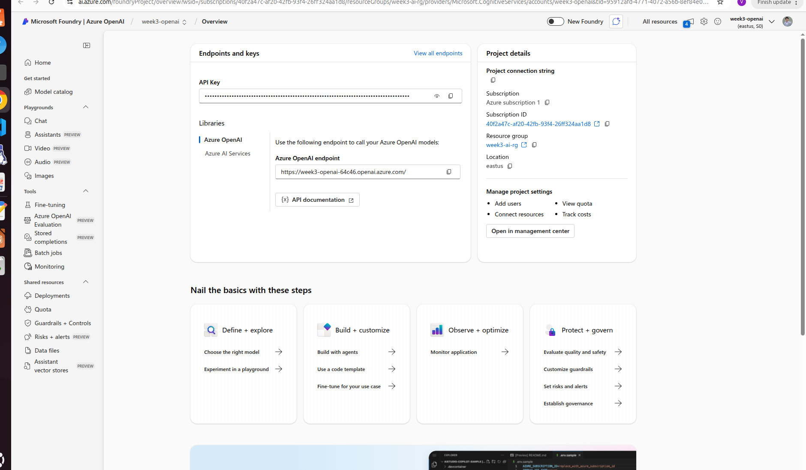
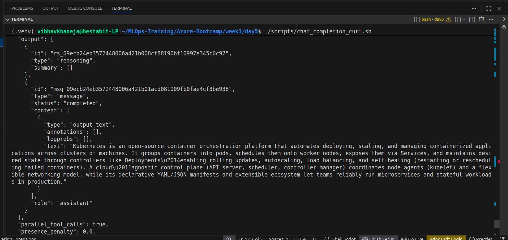
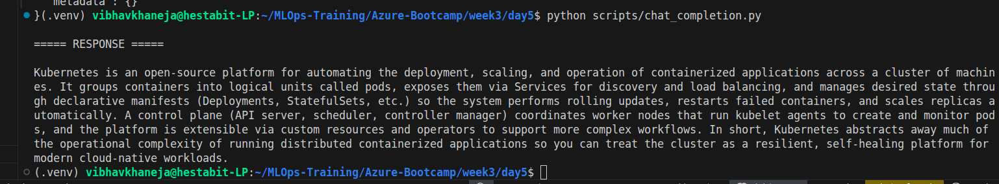
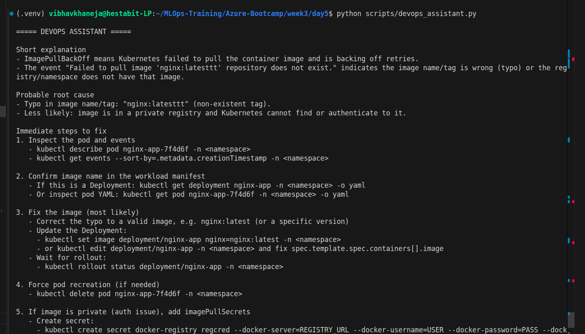
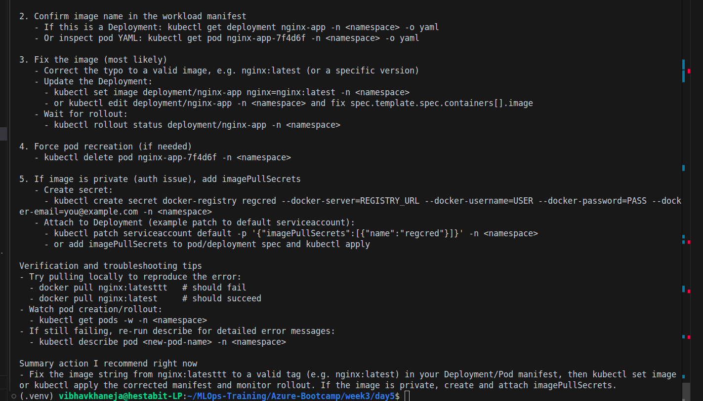
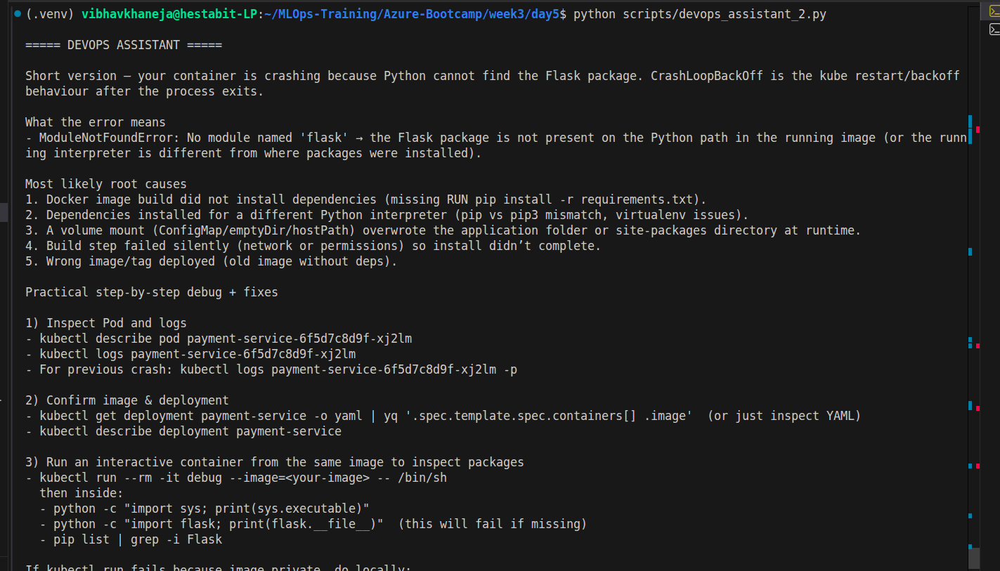
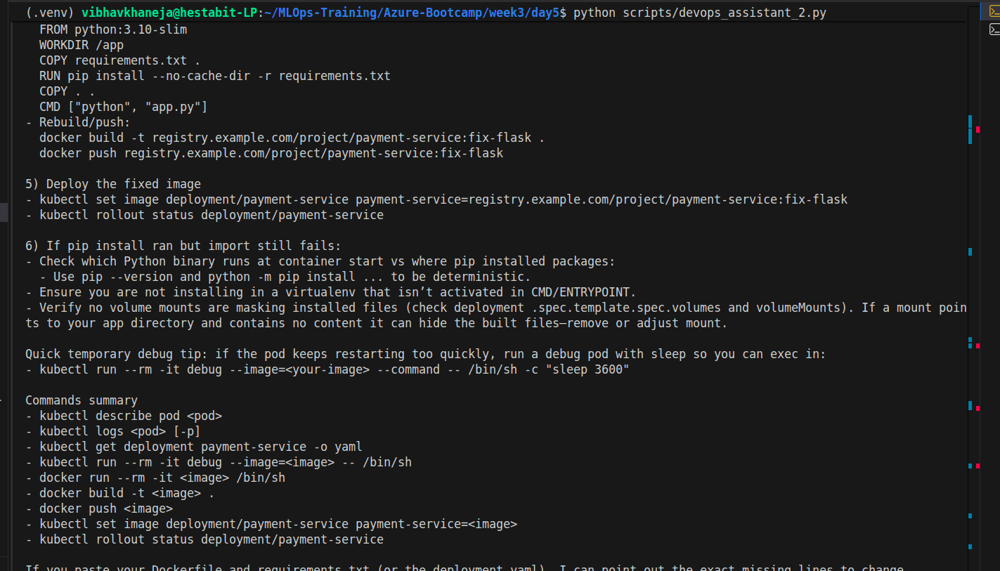
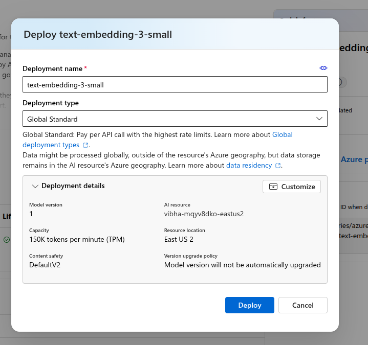
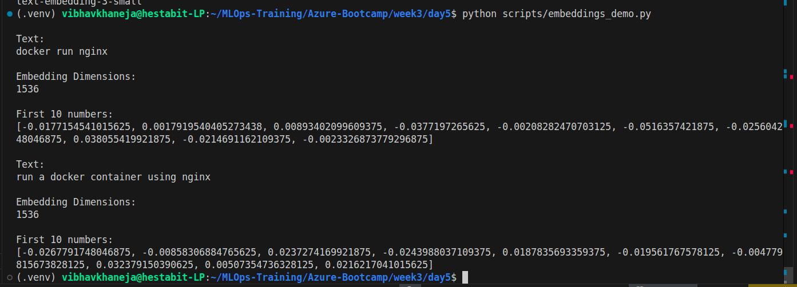
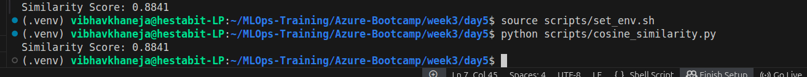
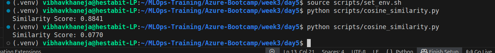
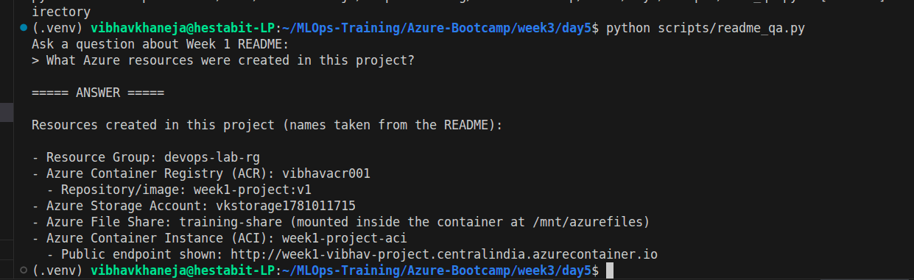
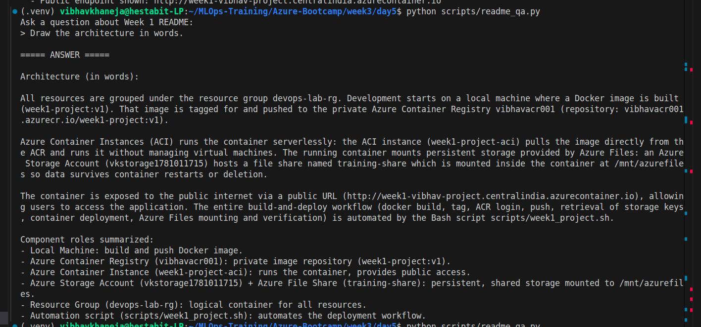
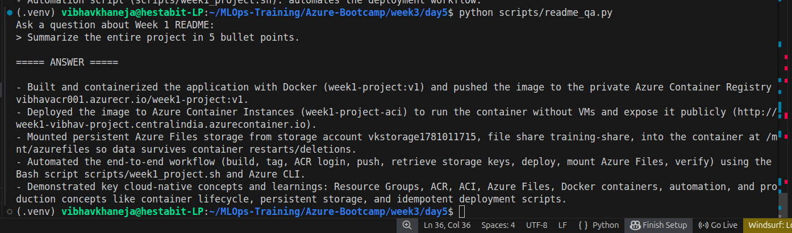
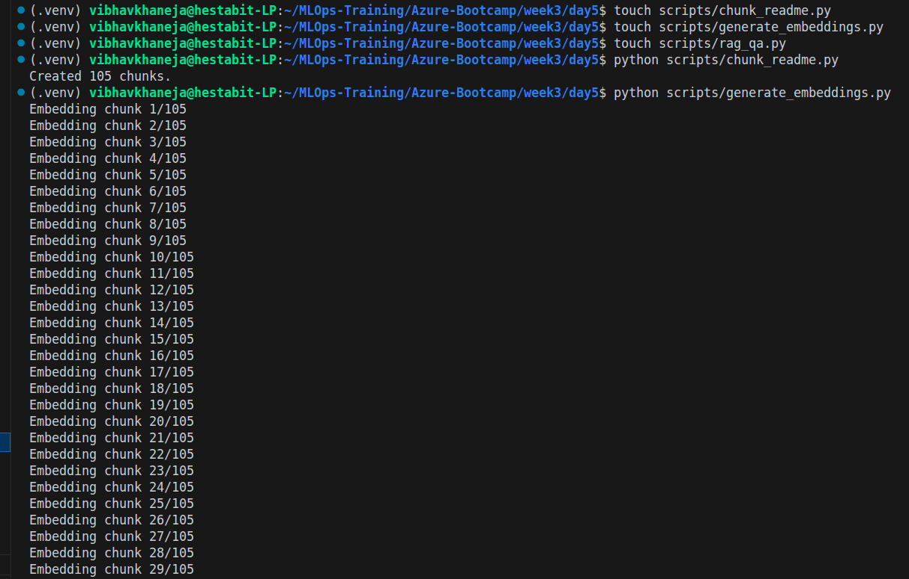
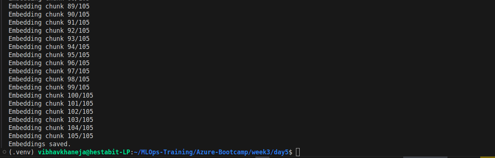
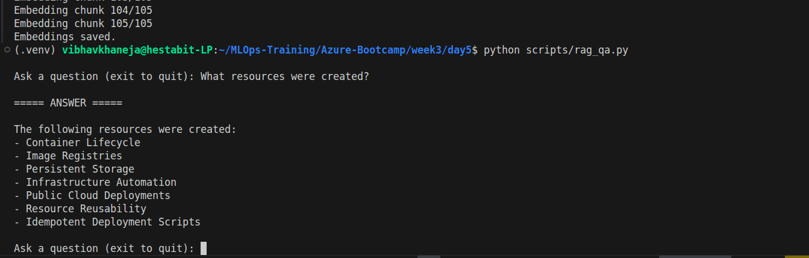
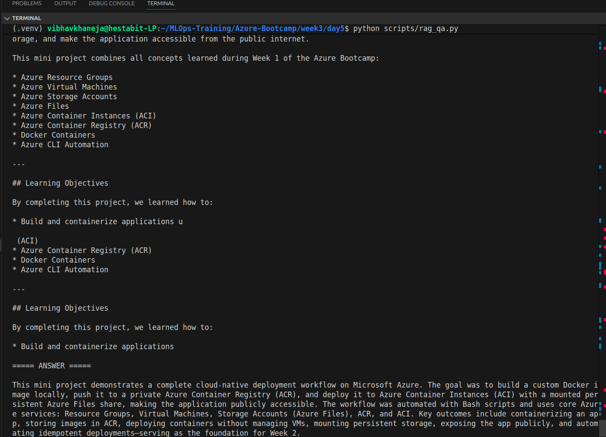
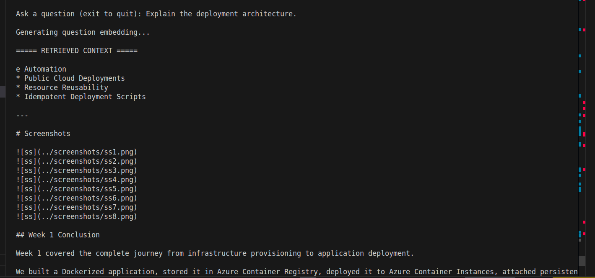
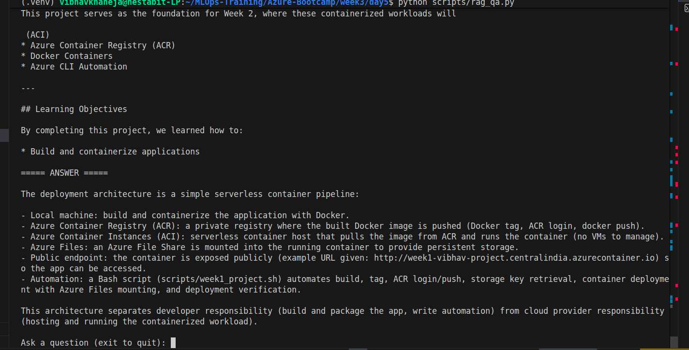


---

# Conclusion

Today marked our transition from simply consuming cloud infrastructure to embedding intelligence inside applications. We learned how to integrate Large Language Models into software systems, generate embeddings, perform semantic search, and build Retrieval Augmented Generation pipelines.

The concepts learned today form the foundation of our Week 3 Capstone, where we will build an AI-powered DevOps application capable of analysing server logs, identifying root causes, and providing intelligent remediation suggestions using Azure OpenAI.
