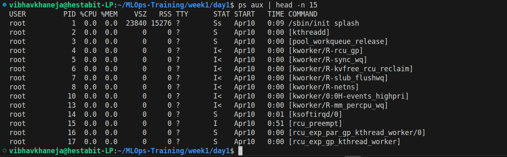
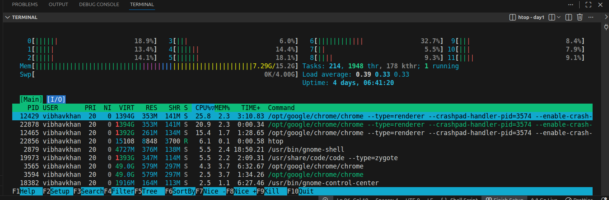
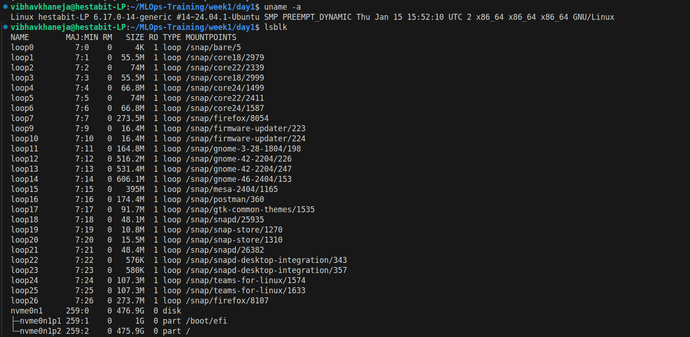
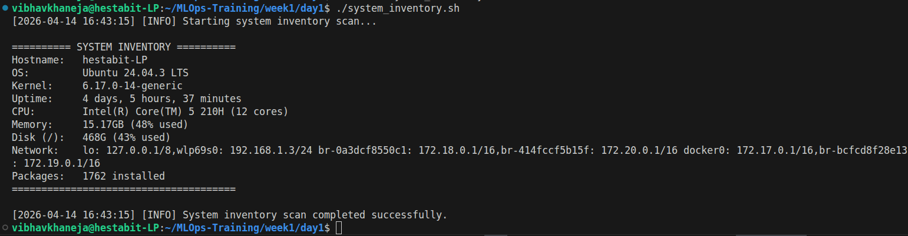
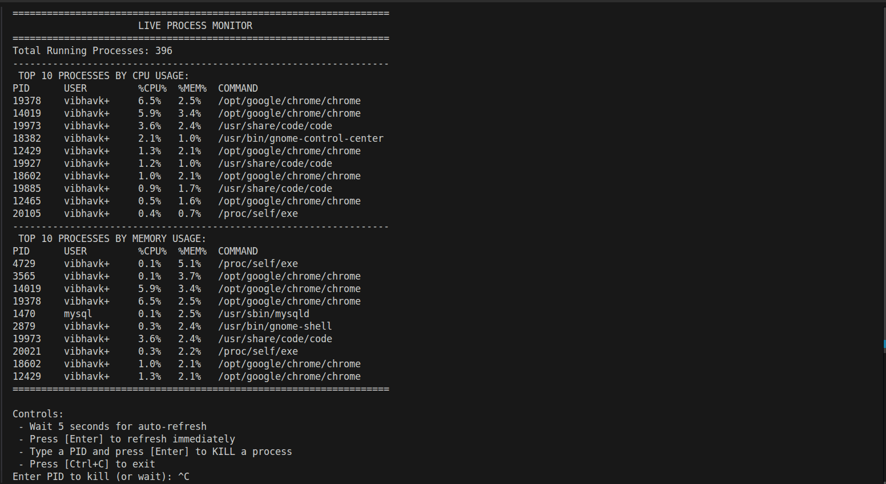
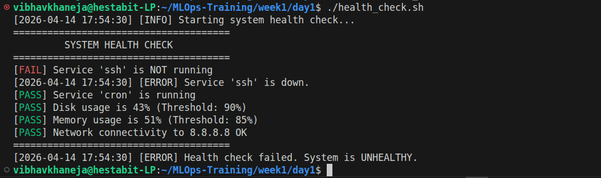
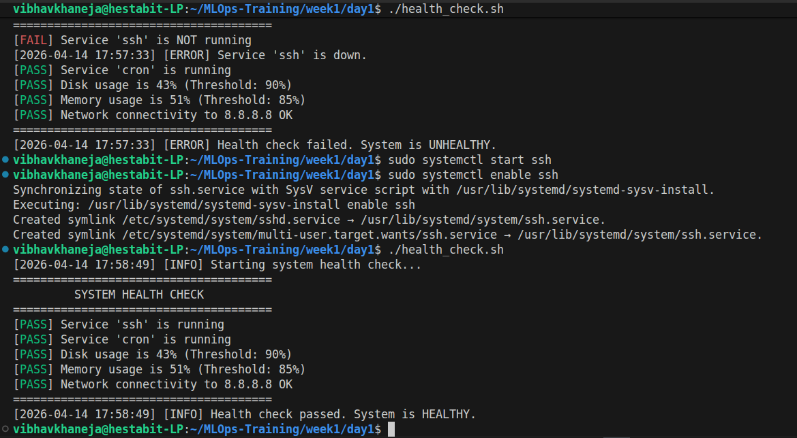

# System Engineering & Linux Fundamentals

## Overview

I started with System Engineering & Linux Basics and fundamentals to begin the journey of MLOps, as clearing and understanding Linux is the first step of the journey. We created 3 scripts which were health_check, process_monitor and system_inventory to deeply analyze our system informarion, system resources and how to deal with process.

Before writing and starting off with any scripts i initalized understood the minimum requirements for completing a script which must include 
- set -eou pipefail which makes our bash script fail fast and loud at the very furst error it fins or any unmatched/undefined variable or any broken pipeline preventing it to destroy our system and not to blindly continue with the scripts even if it catches errors.
- Metadata about the user which includes details about the script, author, descriptio, data and usage
- Declaring of exit codes Success/Perfect script as 0 and Failure/Errors as 1
- Logging Infrastucture to keep a record of everything which helps us immensely while debugging

## System Infrastructure & Resource Audit Summary

To ensure a stable MLOps environment, we performed a comprehensive audit using Linux utility commands to bridge the gap between high-level OS identity and low-level hardware performance.
We established System Identity (uname, hostnamectl) and verified Hardware Architecture (lscpu, lspci), specifically auditing CPU cores and GPU availability for model training. Resource Health was monitored by analyzing memory efficiency (free -h, vmstat) and disk storage (df -h, lsblk), using deep-directory analysis (du -sh) to clear storage bottlenecks.
Finally, we managed Workloads and Services by inspecting the process table (ps aux, htop) to terminate resource-heavy tasks (pkill) and used systemctl to ensure critical background services like Docker remain active. By correlating these metrics with Uptime and Load Averages, we can maintain a high-performance, persistent environment for model deployment.





## Script 1: system_inventory.sh

The goal for this first script was simple: I wanted a way to get a complete snapshot of my server’s health without hunting through five different commands every time I log in.

I built system_inventory.sh to act as a one-stop-shop for system data. Instead of raw, messy output, it gives me a clean, formatted table of everything that actually matters for MLOps:

1) Identity: Confirms the OS, Hostname, and Kernel version so I know exactly what environment my models are running in.
2) Resources: Calculates RAM and Disk usage on the fly, showing both the total capacity and the percentage used so I can spot a full drive before it crashes my training.
3) Performance: Pulls live uptime and CPU core counts (nproc) to gauge the machine's current workload.
4) Network: Automatically finds all active IP addresses, which is a lifesaver when I'm trying to figure out which Docker bridge or local IP my API is listening on.

Why I wrote it this way: I used a lot of piping (|) and text processing tools like awk, sed, and grep. This allows the script to reach into system files (like /etc/os-release) and extract just the clean text I want, while throwing away the extra noise. I also added a logs/ feature so I can track how these stats change over time.



## Script 2: process_checker.sh

For the second task, I wanted something more dynamic than a static report. I built process_monitor.sh to act as a live dashboard for my server's active workload.

Instead of just running a command once, this script creates a continuous Task Manager experience. It automatically refreshes every 5 seconds to show me the top 10 processes eating up my CPU and Memory. I also added an interactive, Kill Switch—if I see a rogue Python script or a frozen process, I can just type its PID directly into the prompt to terminate it immediately.

I used a while true loop combined with read -t 5. This allows the script to sleep for 5 seconds to save resources, but still stay awake enough to listen for my keyboard input if I need to stop a process.



## Script 3: health_check.sh

The final piece of the puzzle was health_check.sh. While the first two scripts are for human eyes, this one is built for automation.
This script is the judge for the server's health. It checks four critical areas:
1. Critical Services: Are ssh and cron actually running?
2. Disk Thresholds: Is the hard drive over 90% full?
3. Memory Safety: Is the RAM usage over 85%?
4. Connectivity: Can the server actually talk to the internet (pinging 8.8.8.8)?
The most important part of this script isn't the text it prints, but the Exit Code it sends back to the system. If even one check fails, the script exits with code 1. In a real production pipeline, this would tell the system: Stop! Don't deploy the model yet; the server is unhealthy. It’s the ultimate safety net for reliable deployments.

The real time usecase/execution of this script was done as in default ssh is not installed so our script returned unhealthy and returned 1 exit code, after we installed ssh and started and enabled it then only our System Health was successful and we got our desired 0 exit code.




## Usage Instructions

- Each script is designed to be standalone and includes a help menu accessible via -h or --help.

1) Script 1: System Inventory (system_inventory.sh)
- Role: Gathers a static snapshot of the server's hardware, OS, and network configuration.
- How to run: ./system_inventory.sh
- Usecase: CPU model/cores, RAM availability (GB and %), Disk usage, Kernel version, and active Network IPs.

2) Live Process Monitor (process_monitor.sh)
- Role: A live, interactive dashboard to monitor resource-heavy tasks and manage rogue processes.
- How to run: ./process_monitor.sh
- Interactive Controls:
1. Refresh: The dashboard auto-updates every 5 seconds. Press Enter to refresh manually.
2. Kill Process: Type a specific PID (Process ID) and press Enter to terminate it.
3. Exit: Press Ctrl+C to close the dashboard.

3) Script 3: System Health Check (health_check.sh)
- Role: An automated judge of system stability, designed for use in CI/CD pipelines.
- ./health_check.sh
- Safety Thresholds: 
* Fails if Disk > 90% or RAM > 85%.
* Fails if ssh or cron services are inactive.
* Fails if internet connectivity (8.8.8.8) is lost.

**Returns Exit Code 0 on success and 1 on any failure.**

### Technical Concepts Covered
- Today’s training focused on bridging the gap between basic Linux commands and enterprise-grade automation.
- The Strict Mode Blueprint: Every script utilizes set -euo pipefail to ensure the program crashes immediately on errors rather than continuing with corrupted data.
- Data Pipelining: Chaining tiny, specialized tools (grep, sed, awk) to extract specific data from raw system logs.
- I/O Redirection: Using > and >> to capture script outputs into the reports/ and logs/ directories for historical auditing.
- Exit Codes: Understanding that in MLOps, scripts talk to other scripts using numbers (0 for success, 1 for error), allowing for automated stop/go decisions during deployment.

### Generating a Baseline Report

```
# Create the reports folder if it doesn't exist
mkdir -p reports

# Generate the dated report
REPORT_FILE="reports/baseline-$(date +%Y%m%d).txt"
echo "=== BASELINE REPORT ===" > "$REPORT_FILE"
./system_inventory.sh >> "$REPORT_FILE"
./health_check.sh >> "$REPORT_FILE"
cat logs/process.log >> "$REPORT_FILE"

echo "Report generated: $REPORT_FILE"
```