# DAY 2 — Filesystem, Permissions & User Management
## Core System Administration Concepts

The overarching theme of this module is the transition from manual, error-prone configuration to **Automated System Administration**. In enterprise environments, scaling infrastructure requires scripts that can provision users, structure directories, and deploy security keys reliably across dozens of servers in seconds. Central to this architecture is the **Principle of Least Privilege**: giving users and automated services exactly the permissions they need to execute their tasks, and absolutely nothing more. 

Security in system engineering is built on the philosophy of "Trust, but Verify." We cannot rely on users to perfectly manage their own file permissions, which is why automated security auditing is a mandatory practice. By leveraging advanced shell commands to relentlessly scan for vulnerabilities—like world-writable directories, misconfigured 777 files, and orphaned data—we establish a robotic security perimeter that alerts administrators before an exploit can occur. 

Finally, a robust system architecture prepares for both internal and external threats through **Disaster Recovery and Surveillance**. By locking down the default root account, enforcing granular, role-based `sudo` policies, actively monitoring user command history, and running automated, chronologically retained backups of critical system state, we ensure the server remains both highly transparent and instantly recoverable.

## Exercise 1: Automated User Provisioning (`user_provision.sh`)
**Objective:** Replace manual user creation with a scalable HR automation script that reads from a CSV/text file.

* **Key Mechanisms:**
  * Utilized a `while IFS=:` loop to parse a structured text file (`users.txt`).
  * Executed `useradd -m` to generate users and their isolated `/home` directories.
  * Applied `chpasswd` for automated password assignment.
  * Generated and enforced strict ownership (`chown`) and permissions (`chmod 700`) on `.ssh` directories to secure remote access.
* **Deliverable:** Fully functional `user_provision.sh` script and the accompanying `users.txt` database.

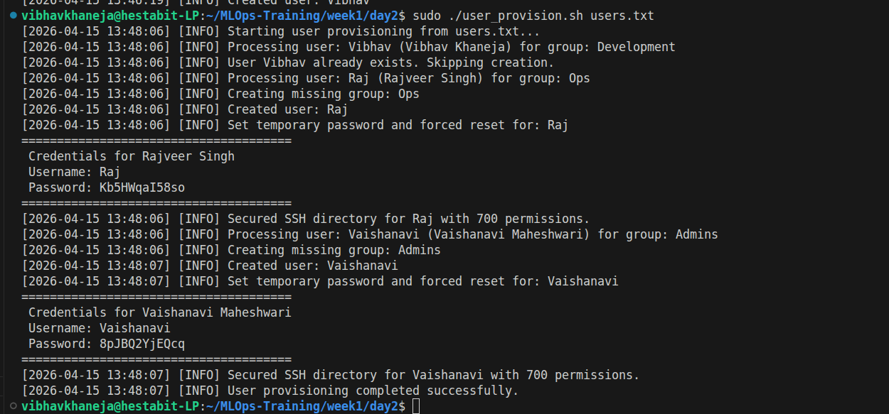
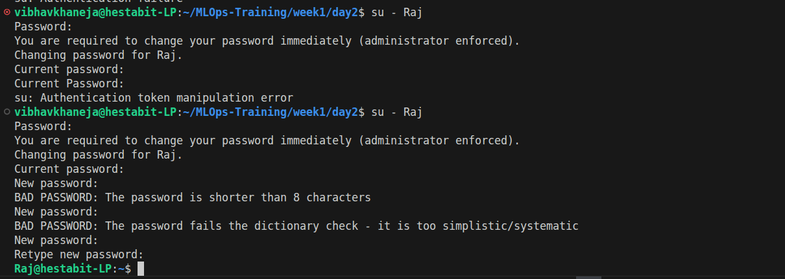
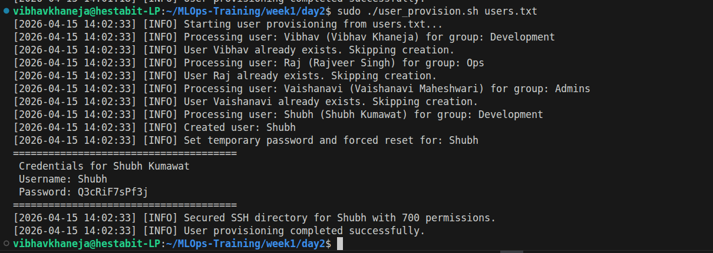
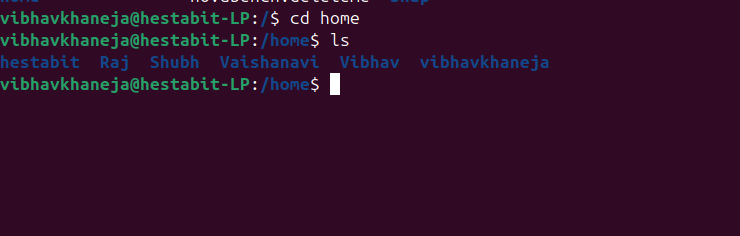
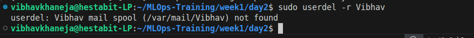
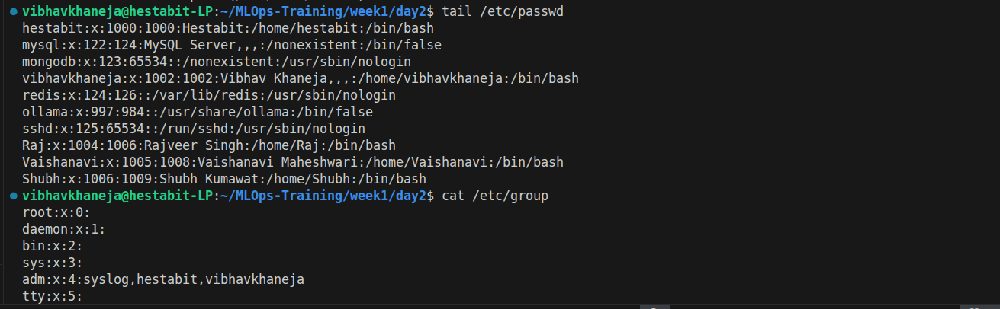

## Exercise 2: Automated Security Auditing (`permission_audit.sh`)
**Objective:** Build a read-only security robot that scans critical directories for known permission vulnerabilities and generates a formatted report.

* **Key Mechanisms:**
  * Mastered the `find` command with explicit flags (`-type f`, `-type d`).
  * Used exact permission matching (`-perm 777`) to flag wide-open files.
  * Used comparative permission matching (`-perm -0002`) to find world-writable directories, recommending the Sticky Bit (`+t`) as a fix.
  * Hunted for privilege escalation risks (SUID/SGID) using `-perm -4000 -o -perm -2000`.
  * Redirected outputs using `>` (overwrite) for headers and `>>` (append) for loops.
* **Deliverable:** `permission_audit.sh` script and the generated `reports/permission_audit.txt` file.

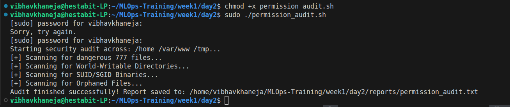
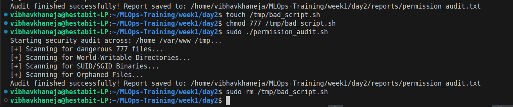

## Exercise 3: Role-Based Access Control (Sudo Policies)
**Objective:** Define the "Master Laws" of the server, stripping power from the default root account and granting precise, limited power to specific groups.

* **Key Mechanisms:**
  * Used `sudo passwd -l root` to scramble the root hash, preventing brute-force direct logins.
  * Used `visudo` to safely write custom policies inside `/etc/sudoers.d/custom_policies`.
  * Granted full administrative privileges to the `Ops` group.
  * Granted restricted, password-less privileges to the `Development` group (`NOPASSWD: /bin/systemctl restart nginx`).
* **Deliverables:** `/etc/sudoers.d/custom_policies` file and screenshots verifying access using `sudo -l -U [username]`.

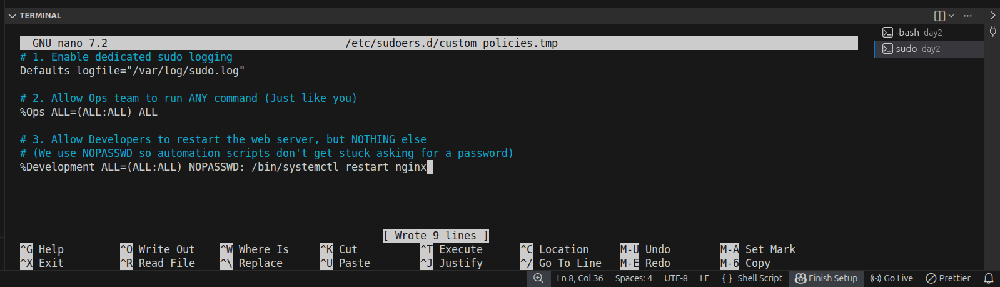
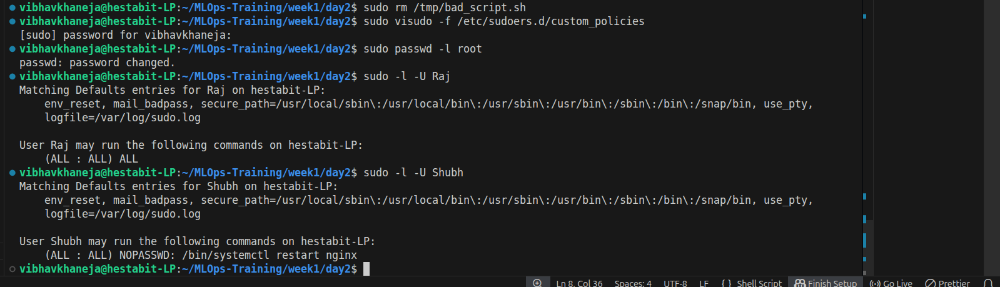

## Exercise 4: Disaster Recovery (`backup_system.sh`)
**Objective:** Engineer an automated backup engine that compresses critical server data and manages its own hard drive footprint.

* **Key Mechanisms:**
  * Utilized the `tar` (Tape Archive) utility with `-czf` to compress multiple directories (`/etc`, `/var/log`, `/home`) into a single `.tar.gz` file.
  * Implemented dynamic timestamping (`date '+%Y-%m-%d_%H-%M-%S'`) to prevent file overwrites.
  * Secured the resulting archive to root-only access (`chmod 600`).
  * Built a retention policy using `find -mtime +7 -exec rm {} \;` to automatically delete backups older than 7 days.
* **Deliverable:** A tested, highly-efficient `backup_system.sh` script and a verified `.tar.gz` output in the `/backup` directory.

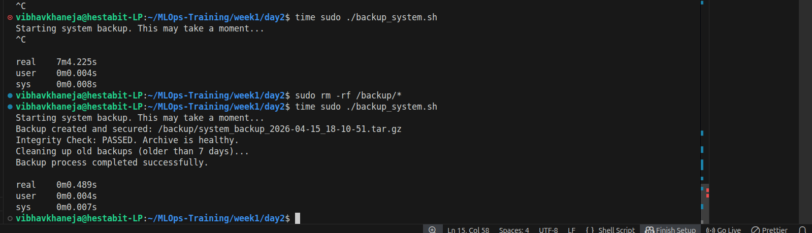

## Exercise 5: User Activity Surveillance (`user_activity_monitor.sh`)
**Objective:** Construct a surveillance script to monitor current logins, historical access, and detect dormant/ghost accounts.

* **Key Mechanisms:**
  * Captured active sessions using the `w` command.
  * Pulled historical login records using the `last` command.
  * Wrote a loop to iterate through `/home/*` directories, utilizing `tail` to read the last 5 entries of each user's hidden `.bash_history` file.
  * Hunted for inactive ghost accounts by parsing `lastlog -b 90`.
* **Deliverables:** `user_activity_monitor.sh` script and the final `user_activity_report.txt`.

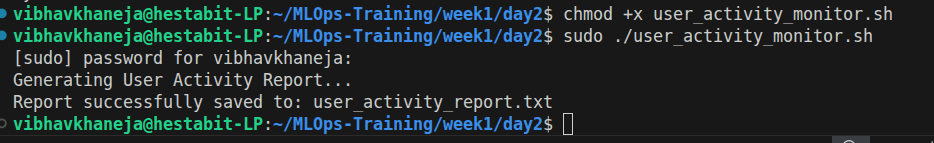