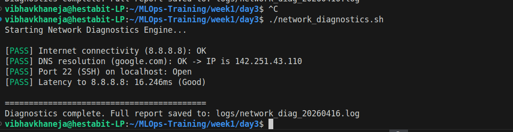
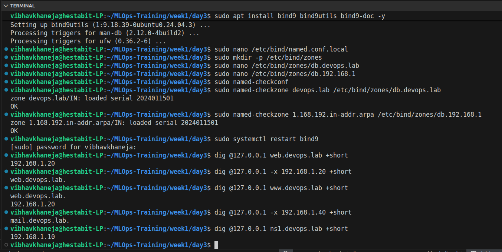
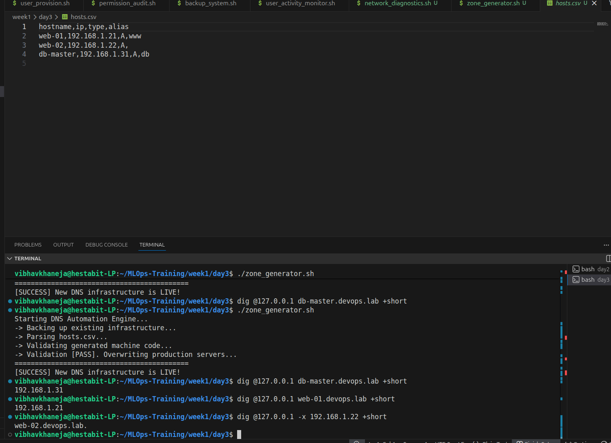
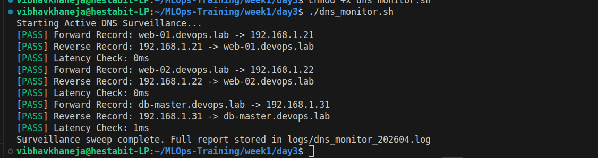
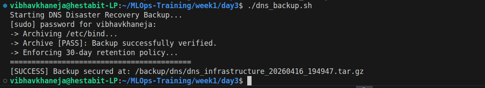

# DAY 3 — Networking, DNS Infrastructure & Automation

## Core Network Engineering Concepts

The overarching theme of this module is the transition from managing isolated, single-node systems to engineering **interconnected, self-resolving infrastructure**. In an enterprise MLOps environment, applications, databases, and APIs must communicate flawlessly. Hardcoding IP addresses into software is a massive liability. Instead, we build an **Authoritative Domain Name System (DNS)**—a local "phonebook" that allows our code to route traffic dynamically using human-readable names like `db.devops.lab`. 

Moving beyond manual configuration, Day 3 introduces the foundational DevOps concept of **Infrastructure as Code (IaC)**. Humans are prone to syntax errors; a single misplaced semicolon in a DNS zone file can cause a catastrophic network outage. By engineering automation scripts that translate simple CSV files into strict machine code, we remove the human element from production deployments. 

Finally, a resilient network is a monitored network. We apply the philosophy of **Active Surveillance and Disaster Recovery** to our routing layer. By building scripts that continuously interrogate the DNS server for accuracy, measure millisecond latency spikes, and automatically archive the configuration state, we ensure our network remains highly available, aggressively audited, and instantly recoverable.

## Exercise 1: Automated Network Diagnostics (`network_diagnostics.sh`)
**Objective:** Engineer a rapid-response diagnostic tool to systematically isolate network failures without flooding the terminal with messy command output.

* **Engineering Mechanisms:**
  * Executed `ping -c 3` to verify base-level ICMP internet routing.
  * Utilized `dig +short` to validate external DNS resolution cleanly.
  * Deployed `nc -zv` (Netcat) to perform zero-I/O port scanning, verifying if specific local services (like SSH on Port 22) were actively listening.
  * Built custom Bash functions utilizing `tee -a` and ANSI color codes (`\e[32m`) to split the data stream: printing clean `[PASS]/[FAIL]` alerts to the terminal while silently redirecting verbose forensic data (`ip route`, `ss -tuln`) into timestamped log files.
* **Deliverables:** `network_diagnostics.sh` script and a generated `network_diag_YYYYMMDD.log` report.

## Exercise 2: Authoritative BIND9 DNS Server Deployment
**Objective:** Sever reliance on external DNS providers by installing and configuring a local BIND9 server to act as the ultimate routing authority for the `devops.lab` private network.

* **Engineering Mechanisms:**
  * Installed the `bind9` daemon and utility packages.
  * Configured `/etc/bind/named.conf.local` to formally declare master authority over both forward and reverse routing zones.
  * Hand-coded the **Forward Zone** (`db.devops.lab`) to translate hostnames to IPv4 addresses (A Records) and create aliases (CNAMEs).
  * Hand-coded the **Reverse Zone** (`db.192.168.1`) utilizing PTR records to establish IP-to-hostname verification, a critical mechanism for security auditing and spam prevention.
  * Validated all strict syntax using `named-checkconf` and `named-checkzone` prior to executing `systemctl restart bind9`, preventing fatal runtime crashes.
* **Deliverables:** Configured `named.conf.local`, `db.devops.lab`, and `db.192.168.1` files, alongside screenshots of successful `dig` queries proving local resolution.

## Exercise 3: Infrastructure as Code - Zone Generator (`zone_generator.sh`)
**Objective:** Eliminate manual configuration errors by engineering a script that translates a simple, human-friendly CSV database into production-ready DNS machine code.

* **Engineering Mechanisms:**
  * Utilized `tail -n +2` and a `while IFS=, read` loop to aggressively parse a structured `hosts.csv` file into isolated variables.
  * Implemented `mktemp` to generate highly secure, hidden temporary workspaces, ensuring production files were never modified while in a partially built state.
  * Deployed `cat <<EOF` (Here-Docs) to dynamically inject standard SOA headers and auto-incrementing daily serial numbers (`date +%Y%m%d01`).
  * **Automated Security Remediation:** Engineered the script to automatically apply `chmod 644` to the newly generated zone files before moving (`mv`) them to `/etc/bind/zones/`, resolving a critical "Permission Denied" error where the `bind` user was locked out of reading `mktemp` files.
* **Deliverables:** `hosts.csv` database, `zone_generator.sh` script, and successful `dig` query outputs proving the automated deployment worked.

## Exercise 4: Active DNS Surveillance (`dns_monitor.sh`)
**Objective:** Deploy an automated security camera that actively cross-references the live network against the master CSV database to detect unauthorized routing changes or severe latency.

* **Engineering Mechanisms:**
  * Engineered a polling loop to interrogate the local DNS daemon (`@127.0.0.1`) for every entry in the master CSV.
  * Implemented strict string comparison operators (`==`) to verify forward IP resolution matched perfectly.
  * Handled specific DNS syntax quirks by actively checking for the trailing absolute dot (`.`) during Reverse PTR verification.
  * Utilized `grep` and `awk` to extract raw query response times, throwing mathematical alerts (`-gt 100`) if server latency spiked to unacceptable levels.
* **Deliverables:** `dns_monitor.sh` script and the timestamped `dns_monitor.log` file showing straight `[PASS]` metrics.

## Exercise 5: DNS Disaster Recovery (`dns_backup.sh`)
**Objective:** Engineer a targeted, self-managing backup protocol specifically designed to secure the critical BIND9 infrastructure and prevent disk exhaustion.

* **Engineering Mechanisms:**
  * Compressed the entire `/etc/bind` configuration directory using `tar -czf` into a timestamped `.tar.gz` archive.
  * **Integrity Validation:** Immediately executed a silent dry-run of the archive (`tar -tzf`) to mathematically verify the zip file was not corrupted during creation.
  * Secured the disaster recovery vault to root-only access (`chmod 600`).
  * Enforced a strict 30-day lifecycle retention policy utilizing the `find -mtime +30 -exec rm {} \;` command chain to autonomously delete obsolete backups.
* **Deliverables:** `dns_backup.sh` script and verification of the compressed archive inside the `/backup/dns/` directory.

