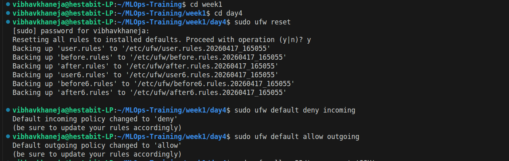
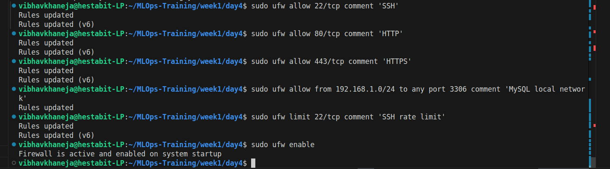
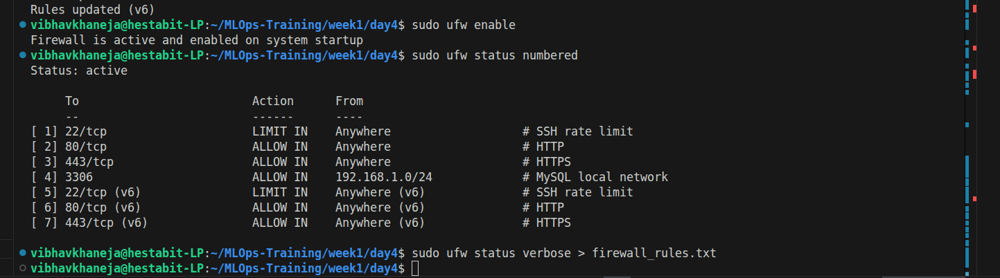
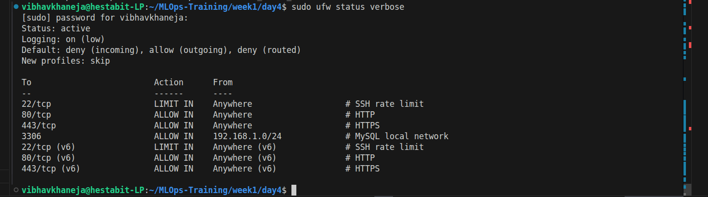
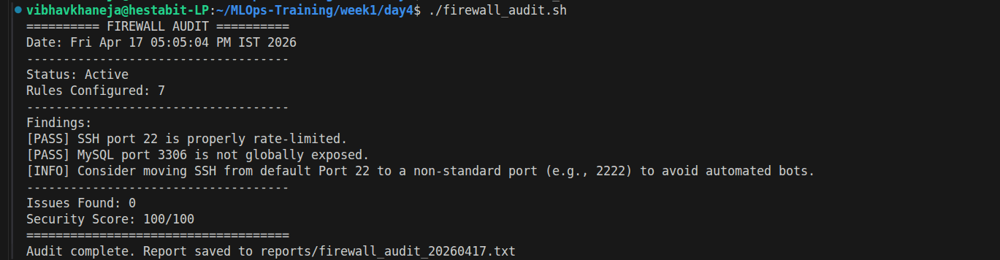
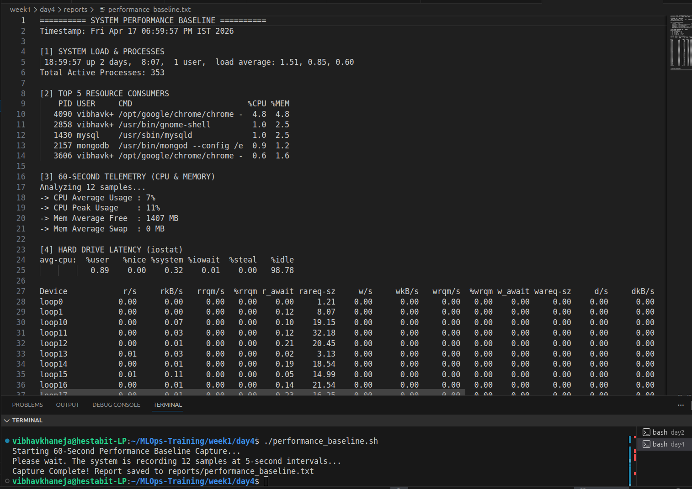
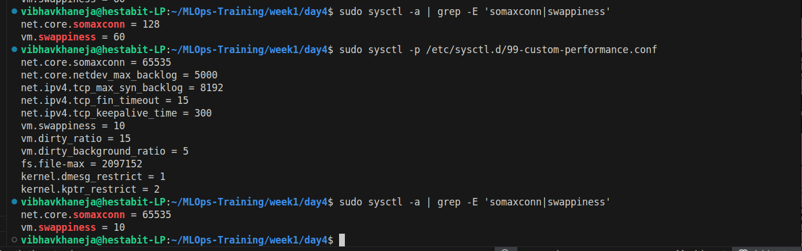
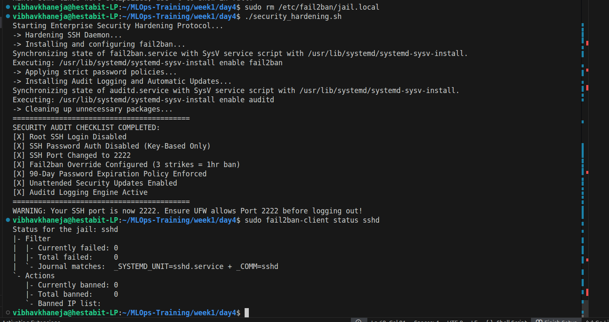

# DAY 4 — Security, Firewall Configuration & Performance Tuning

## Core Security & Optimization Concepts

The overarching theme of Day 4 is transforming a vulnerable, factory-default OS into a hardened, high-performance MLOps fortress. We establish a "Zero Trust" architecture using UFW to drop unauthorized traffic and actively block botnets. Beyond passive walls, we use automation to deploy active AI guards (fail2ban) and rewrite core system files for strict SSH and password policies. Finally, we baseline system health and rewrite the Linux Kernel's default DNA (sysctl) to massively expand network queues and prioritize fast physical RAM, preparing the infrastructure for enterprise data pipelines.

### Configure UFW Firewall

Established a strict "Zero Trust" perimeter by defining explicit ingress/egress rules.
- Key Actions: **Applied default deny incoming**.
1) Opened standard web ports (80/tcp, 443/tcp).
2) Isolated the MySQL database (3306/tcp) strictly to the 192.168.1.0/24 subnet.
3) Applied a rate limit to SSH to automatically drop brute-force bot connections.

## Automated Firewall Audit (firewall_audit.sh)
Engineered a static analysis script to automatically evaluate the live firewall configuration and calculate a mathematical security score.

- Key Actions: **Extracted raw firewall state into system memory**.
1) Utilized grep -E (Regex) to actively hunt for vulnerabilities (e.g., exposed databases or legacy unencrypted ports like 21/tcp).
2) Automatically deducted points and flagged [CRITICAL] issues in a generated text report.

## System Performance Baseline (performance_baseline.sh)
Captured a 60-second real-time telemetry snapshot of CPU, Memory, Disk I/O, and Network health to establish a baseline before tuning.
- Key Actions: **Deployed uptime and ps -eo to identify load averages and top resource-consuming applications**.
1) Piped vmstat into awk to capture 12 samples over 60 seconds, calculating true average/peak CPU and Swap usage.
2) Analyzed bare-metal disk latency using iostat -x.

- Kernel Tuning & Optimization

Injected high-performance networking and memory management rules directly into the Linux Kernel to support MLOps scale.
Key Actions: **Increased net.core.somaxconn (from 128 to 65535) to prevent dropped packets during massive API traffic bursts**.
1) Reduced vm.swappiness (from 60 to 10), commanding the Kernel to prioritize physical RAM and avoid writing to the slow hard drive.
2) Enabled kernel.dmesg_restrict to hide valuable kernel memory addresses from potential attackers.

## Automated Security Hardening (security_hardening.sh)
Autonomously deployed strict corporate password policies, locked down the SSH daemon, and installed an active AI intrusion prevention system.
Key Actions: **Utilized sed -i to programmatically disable root login, strip password authentication, and move SSH to Port 2222**.
1) Created a targeted /etc/fail2ban/jail.local override file to issue 1-hour IP bans after 3 failed SSH attempts.
2) Enforced a 90-day password expiration lifecycle and installed auditd for unalterable forensic logging.

