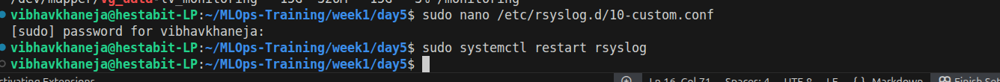
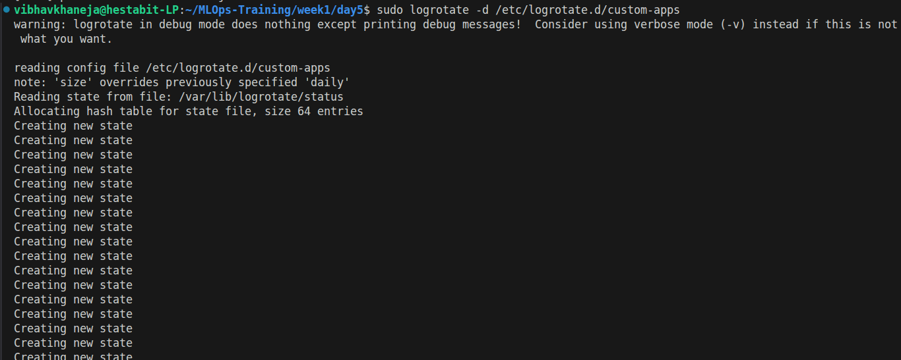
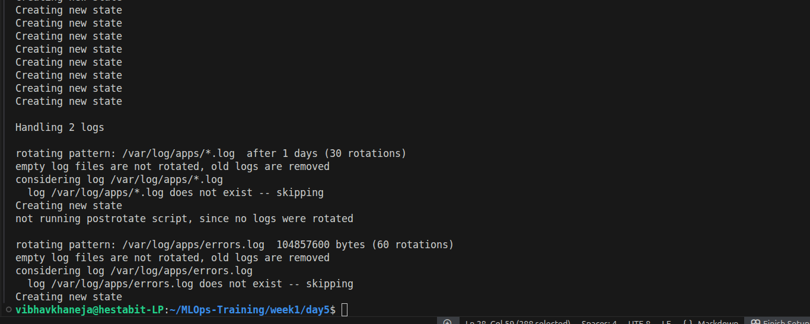
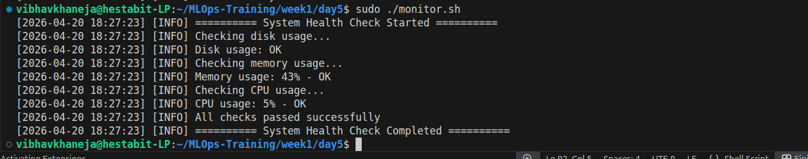
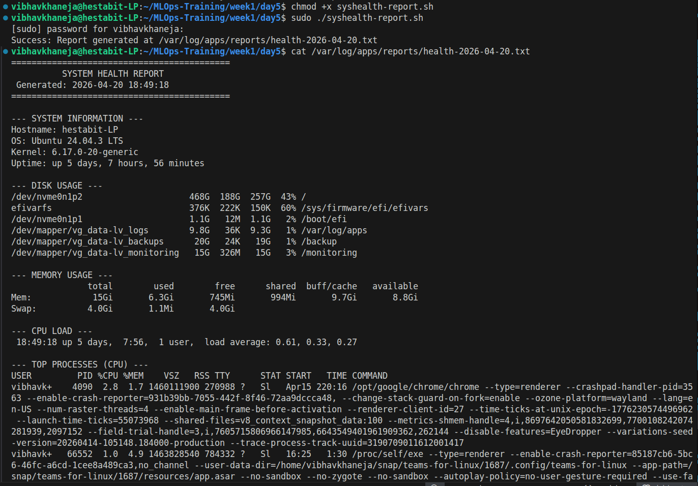
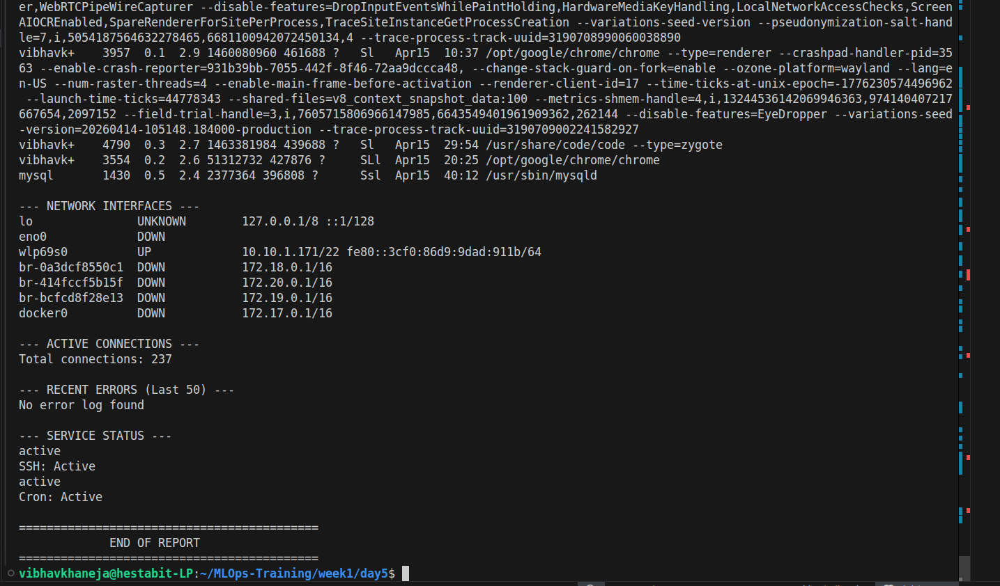
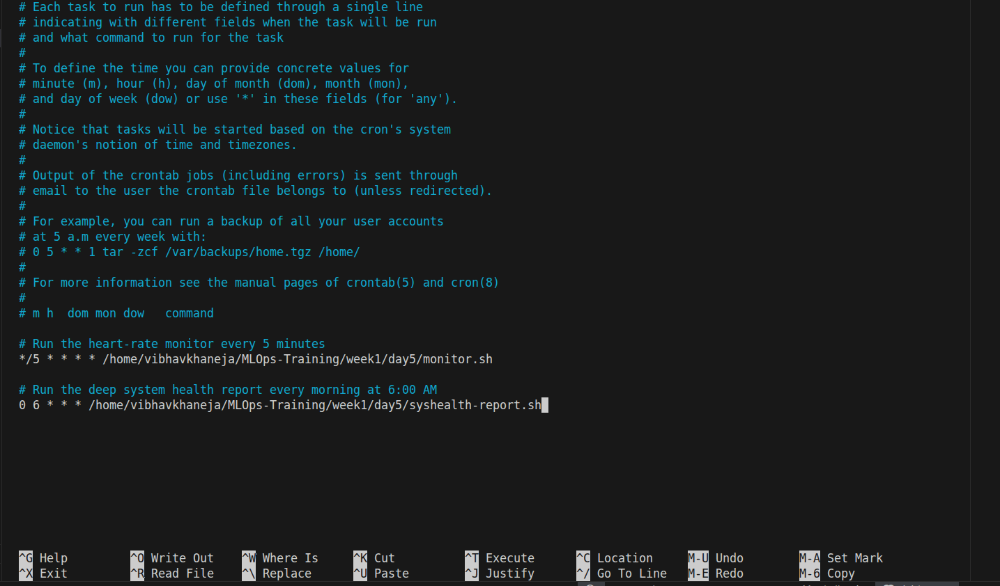
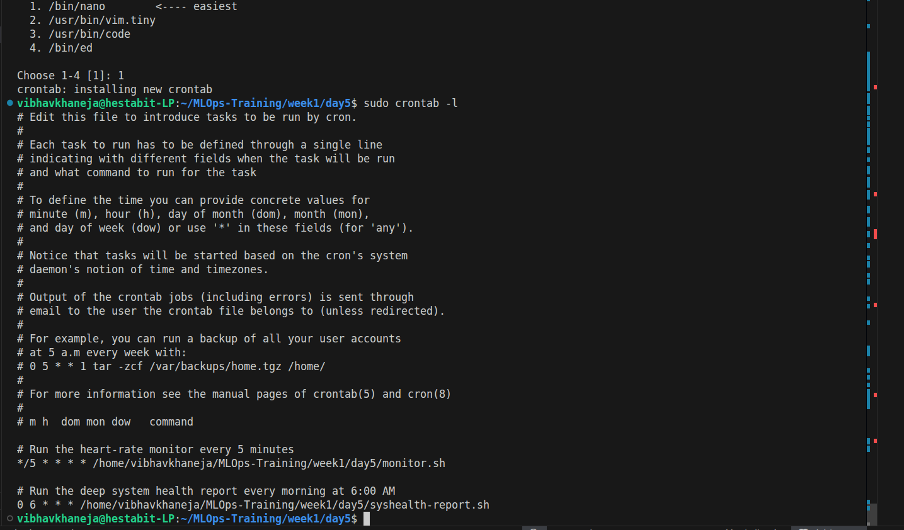
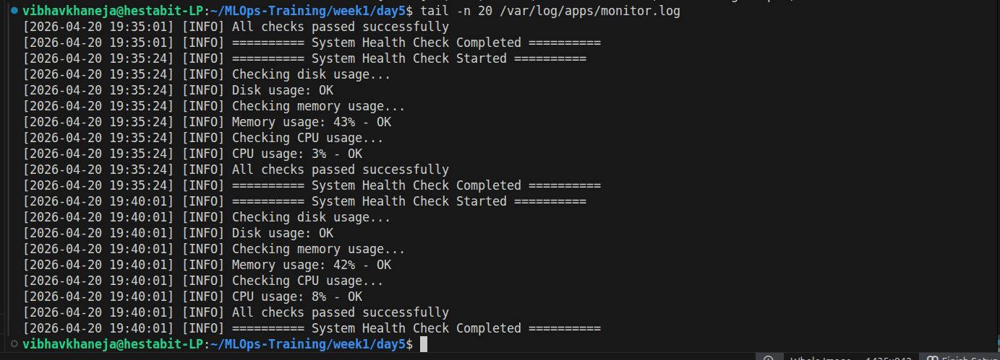
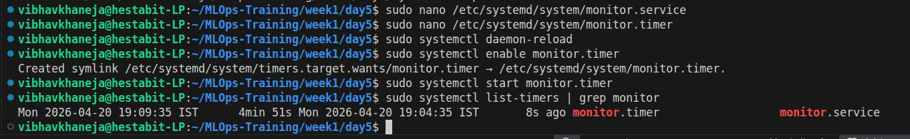

# Storage Management, Logging, Monitoring & Automation

## Overview
Day 5 represents the final evolution of the Week 1 MLOps Infrastructure. Having secured the network and kernel on Day 4, the objective of Day 5 was to make the server **resilient, self-aware, and fully autonomous**. 
This was achieved by implementing elastic storage (LVM) to prevent hard drive exhaustion, centralizing system logs for rapid debugging, and deploying automated health-monitoring robots via `systemd` to alert administrators before fatal crashes occur.

## 1. Storage Architecture: Logical Volume Management (LVM)
Traditional hard drives are rigid; if a partition fills up, the server crashes. LVM solves this by abstracting physical disks into a fluid, resizable pool of storage.

* **Theoretical Flow:**
  1. **Physical Volumes (PV):** Raw block storage devices (in our lab, simulated via 25GB loopback files `virtual_drive_b` and `virtual_drive_c` to protect the host machine).
  2. **Volume Group (VG):** The raw PVs were pooled together into a single 50GB entity called `vg_data`.
  3. **Logical Volumes (LV):** Virtual drives were carved from the pool, formatted, and mounted to specific system paths:
     * `lv_logs` (10G, ext4) -> Mounted at `/var/log/apps`
     * `lv_backups` (20G, ext4) -> Mounted at `/backup`
     * `lv_monitoring` (15G, xfs) -> Mounted at `/monitoring`
* **Enterprise Benefit:** Critical application logs are physically isolated. If an application spams the logs and fills the 10GB drive, it cannot crash the core OS or overwrite backup data.

## 2. Centralized Logging Infrastructure (`rsyslog`)
By default, Linux dumps all system events into a single, chaotic file (`/var/log/syslog`). We engineered a custom routing engine to neatly file data.

* **Implementation:** Created `/etc/rsyslog.d/10-custom.conf`.
* **Logic:** Instructed the `rsyslog` daemon to intercept specific facilities (e.g., `local0.*` for apps, `auth.*` for security, and `*.err` for global errors) and write them directly into our new, dedicated LVM drive at `/var/log/apps/`.

## 3. Log Retention & Rotation (`logrotate`)
A 10GB log drive will eventually fill up and crash the logging daemon. We deployed an automated "janitor" to manage disk space.

* **Implementation:** Created rules inside `/etc/logrotate.d/custom-apps`.
* **Logic:** Every night at midnight, the system compresses yesterday's text logs into tiny `.gz` files. 
* **Retention Policy:** Standard application logs are retained for 30 days. Critical error logs are retained for 60 days. Anything older is autonomously deleted, mathematically guaranteeing the drive will never reach 100% capacity.

## 4. Active Health Monitoring (`monitor.sh`)
Engineered a lightweight, Bash-based "heart rate monitor" to actively interrogate the server hardware.

* **Implementation:** A script utilizing `df`, `free`, and `top` paired with `awk` to extract exact percentages.
* **Logic:** If CPU, Memory, or Disk usage exceeds a strict **80% threshold**, the script triggers a `[CRITICAL]` alert and writes it to `/var/log/apps/alerts.log`. Otherwise, it logs a healthy `[INFO]` status.

## 5. Forensic System Auditing (`syshealth-report.sh`)
Unlike active monitoring, this script acts as a daily "blood panel," taking a deep snapshot of the server for historical auditing.

* **Implementation:** A highly formatted script utilizing `systemctl`, `ss`, and `uptime`.
* **Logic:** Captures the top 6 CPU/RAM consuming processes, active network connections, daemon statuses, and the last 50 system errors. It outputs a dated text file (e.g., `health-2026-04-20.txt`) into the LVM storage array.

## 6. Legacy Automation (Cron)
To ensure the server runs without human intervention, we scheduled the heavy reporting script to run daily using Linux's legacy scheduling daemon.

* **Implementation:** Added `0 6 * * * /path/to/syshealth-report.sh` directly into the `root` user's crontab (`sudo crontab -e`).
* **Logic:** The deep system audit runs automatically at 6:00 AM every morning. Running it via the root crontab prevents permission denial errors when querying kernel-level metrics.

## 7. Modern Enterprise Automation (systemd Timers)
While Cron is effective for simple tasks, it fails silently. We deployed `systemd` timers for our critical 5-minute health monitor so the OS kernel actively tracks its success/failure state.

* **Implementation:** Created `monitor.service` (the execution logic) and `monitor.timer` (the schedule logic) in `/etc/systemd/system/`.
* **Logic:** Instructs the Linux kernel to fire `monitor.sh` every 5 minutes (`OnUnitActiveSec=5min`). If the script crashes due to a syntax error, `systemd` catches the failure and logs the exact trace in `journalctl`.

