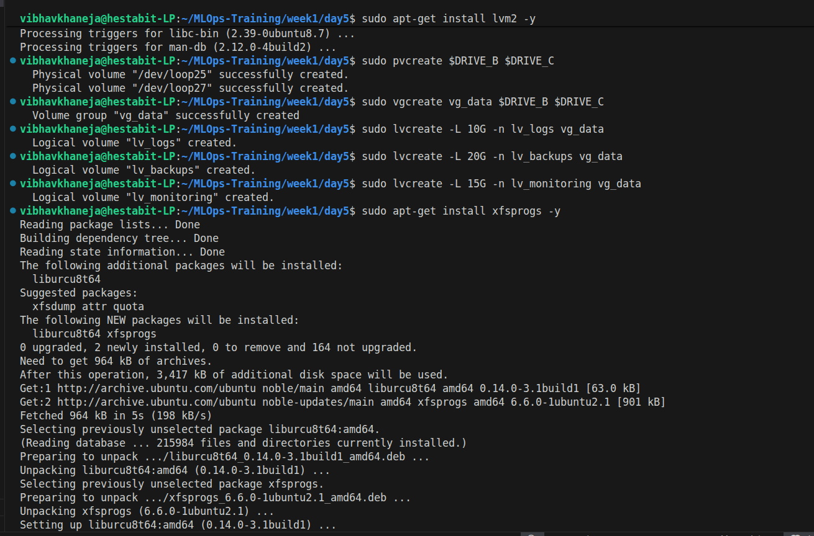
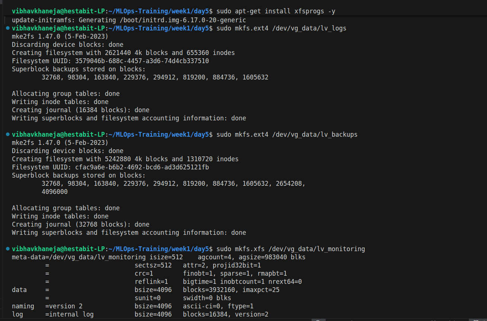
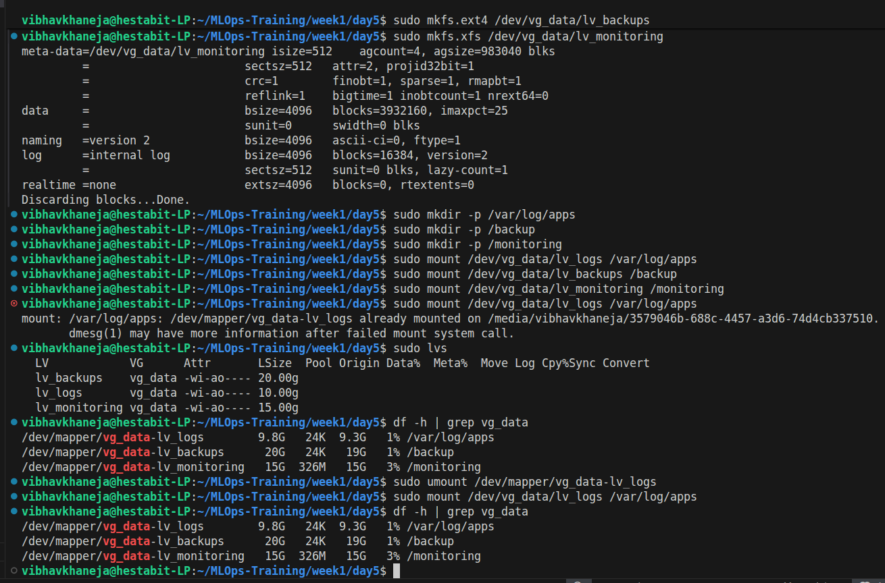

# LVM Setup Guide & Architecture

## Storage Architecture (LVM)
Logical Volume Management (LVM) was implemented to provide elastic, resizable storage independent of the underlying physical hardware limits.

### Lab Environment Setup (Virtual Drives)
To safely simulate enterprise infrastructure on a single-drive workstation, virtual loopback devices were utilized.
* `sudo truncate -s 25G /virtual_drive_b.img` : Created 25GB sparse files (zero real disk usage).
* `sudo losetup -f --show /virtual_drive_b.img` : Attached files to Linux loopback hardware.

### 1. Physical Volumes (PV)
* **Action:** Initialized raw block storage into LVM-compatible Physical Volumes.
* **Command:** `sudo pvcreate /dev/loop25 /dev/loop27`
* **Purpose:** Prepares the raw, unformatted disks to be absorbed into a larger storage pool.

### 2. Volume Group (VG)
* **Action:** Pooled the physical volumes together into a single, unified 50GB storage entity.
* **Command:** `sudo vgcreate vg_data /dev/loop25 /dev/loop27`
* **Purpose:** Abstracts the physical hardware. We no longer care about individual disks; we only manage the fluid pool.

### 3. Logical Volumes (LV)
* **Action:** Carved specific, purpose-built virtual drives out of the `vg_data` pool, formatted them with file systems, and mounted them to the OS.
* **Commands:**
  * `sudo lvcreate -L 10G -n lv_logs vg_data` (Carves the drive)
  * `sudo mkfs.ext4 /dev/vg_data/lv_logs` (Formats the drive)
  * `sudo mount /dev/vg_data/lv_logs /var/log/apps` (Attaches the drive)
* **Final Architecture:**
  * `lv_logs` (10G) - ext4, mounted at `/var/log/apps`,  `sudo mount /dev/vg_data/lv_logs /var/log/apps`
  * `lv_backups` (20G) - ext4, mounted at `/backup`, `sudo mount /dev/vg_data/lv_backups /backup`
  * `lv_monitoring` (15G) - xfs (optimized for large files), mounted at `/monitoring`, ` sudo mount /dev/vg_data/lv_monitoring /monitoring`

