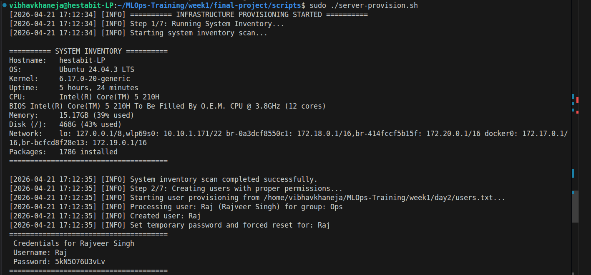
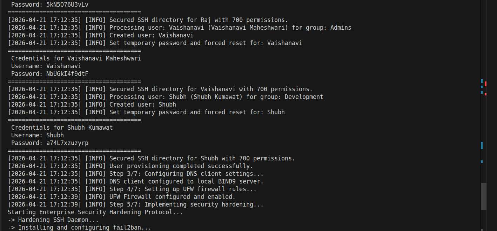
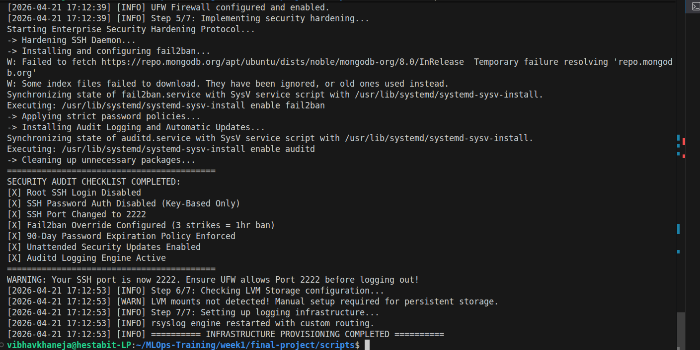
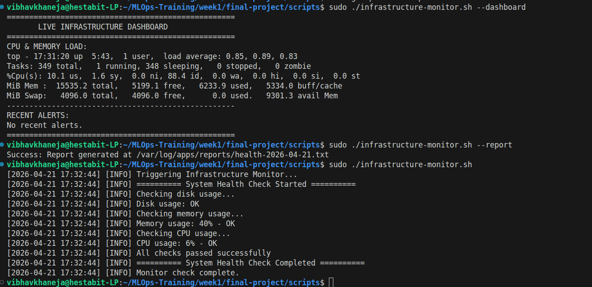
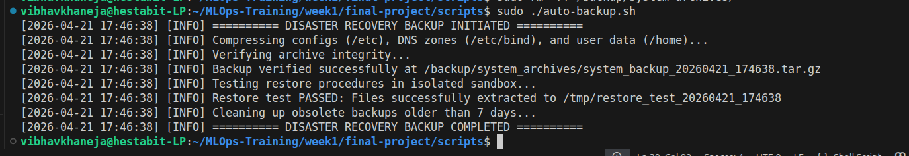

# MLOps Bootcamp - Week 1: Infrastructure & Automation
**Author:** Vibhav Khaneja  

## Overview
This repository contains all the scripts and configurations we built during the first week of the bootcamp. The main goal here was simple: stop doing things manually. We started by writing basic scripts to check system health, and by the end of the week, we had a fully automated, self-monitoring, and secure server that practically runs itself. 

Here is a breakdown of how we built it, day by day.

## Day 1: System Baseline & Monitoring
Day 1 was all about getting the lay of the land. Before we could automate or secure anything, we needed to know exactly what hardware and processes we were dealing with. We built scripts to act as our eyes and ears, giving us a baseline of the system's health so we wouldn't be flying blind later on.
* `system_inventory.sh`: Grabs a quick snapshot of the OS, CPU, Memory, and Network state.
* `process_monitor.sh`: A live-updating tracker to see exactly what is eating up our CPU and RAM.
* `health_check.sh`: A quick pass/fail script to make sure critical services are actually running.

## Day 2: Users & File Permissions
With our baseline set, we tackled user access. Hand-creating users is a pain and a massive security risk if you mess up the permissions. We scripted out an automated provisioning system so we could onboard people safely, and we audited the file system to make sure nobody had access to things they shouldn't.
* `user_provision.sh`: Automates bulk user creation, assigns groups, and locks down SSH directories.
* `permission_audit.sh`: Scans the server for dangerous 777 permissions and world-writable folders.
* `backup_system.sh`: Our first draft at taking backups of critical configuration files.

## Day 3: DNS & Networking
Day 3 shifted gears into networking. Instead of relying on external DNS servers, we took control of our own routing by standing up an authoritative BIND9 server. We also built some diagnostic tools so we wouldn't have to guess why a network connection was failing.
* `network_diagnostics.sh`: Pings key servers, checks DNS resolution, and tests open ports.
* `zone_generator.sh`: Automatically creates the forward and reverse lookup files for our DNS server.
* `dns_monitor.sh` & `dns_backup.sh`: Keeps an eye on our DNS records and backs them up in case the server goes down.

## Day 4: Firewalls & Security Hardening
This was the day we locked the front door. We tightened up the kernel for better performance under load, moved SSH off the default port, and set up a strict UFW firewall. We also brought in `fail2ban` to automatically block malicious bots trying to brute-force their way into the server.
* `security_hardening.sh`: Disables root login, enforces key-based SSH, and wires up `fail2ban`.
* `firewall_audit.sh`: Double-checks our UFW rules to make sure we didn't leave any ports wide open.
* `performance_baseline.sh`: Takes a deep snapshot of system metrics before and after we tweak the kernel.

## Day 5: Elastic Storage & Automation
Finally, we made the server bulletproof. We set up LVM (Logical Volume Management) to create flexible, isolated hard drives—this ensures that if an app goes crazy and fills up the log folder, it won't crash the whole OS. We then built automated background robots using systemd and cron to watch the server's health while we sleep.
* `monitor.sh`: Runs every 5 minutes in the background and screams if CPU/RAM/Disk hits 80%.
* `syshealth-report.sh`: Runs once a day to give us a detailed historical snapshot of the server.
* **LVM & Rsyslog:** We physically separated our custom app logs onto a dedicated 10GB drive and set up `logrotate` to automatically delete old logs before they fill up the disk.

## The Final Project: Master Orchestration
Running a dozen different scripts is exactly what we were trying to avoid. In the `final_project/scripts` folder, we tied everything together. 

**To provision a brand new server from scratch:**
```
sudo ./server-provision.sh
```
This runs all the steps from Day 1 to Day 5 sequentially. It creates the users, hardens the firewall, sets the DNS, and wires up the logging engine in about 45 seconds.






**To check the live dashboard:**
```
sudo ./infrastructure-monitor.sh --dashboard
```


**Disaster Recovery Procedures**
If the server gets compromised, corrupted, or we need to migrate to new hardware, follow these steps to recover the system.
1. Taking the Backup
We have an automated script that securely compresses the /etc configurations, SSH keys, UFW firewall rules, and BIND DNS zones into a single archive.
```
sudo ./auto-backup.sh
```
Note: This script automatically tests the archive in a temporary sandbox to mathematically prove the backup isn't corrupted.

2. Restoring the System
If you need to restore files from the archive on a new machine:

Locate the latest backup in /backup/system_archives/.

Extract the specific directory you need to a temporary folder first to verify it:
tar -xzf system_backup_YYYYMMDD.tar.gz -C /tmp/recovery etc/bind

Once verified, copy the files into their actual system locations and restart the relevant service (e.g., sudo systemctl restart bind9).

