# Day 1: Multi-Language Runtime & Version Management

**Core Mindset:** "You are not deploying applications. You are architecting systems that survive production."

## 1. Architectural Overview

The foundation of any resilient production system is strict environment isolation. When bridging a Node.js gateway with a Python-based multimodal ingestion pipeline, relying on global, OS-level package managers (like `apt install nodejs` or the system default Python) introduces severe risk. An OS update can inadvertently upgrade a runtime, instantly breaking pinned dependencies and bringing down the application.

Day 1 focuses on stripping away global reliance and implementing dedicated, user-space version managers (`nvm`, `pyenv`) and explicit repository controls (Ondrej PPA for PHP). This ensures that every component of the stack executes in a perfectly predictable, isolated environment.

## 2. The Runtime Environments

### Node.js (via NVM)
Node Version Manager (`nvm`) handles our JavaScript runtimes. It operates entirely within the user directory (`~/.nvm`), bypassing the need for root privileges during routine updates.

* **The Concept:** `nvm` intercepts the `node` and `npm` commands via shell aliases, routing them to the specific binary requested by the project.
* **Production Value:** Allows a legacy Express API to run on `v18.19.0` simultaneously with a modern Next.js frontend on `v20.11.0` on the exact same server, without conflict.
* **Key Implementations:** * Automated installation via `node_installer.sh`.
    * `.nvmrc` files used to lock project-specific versions.

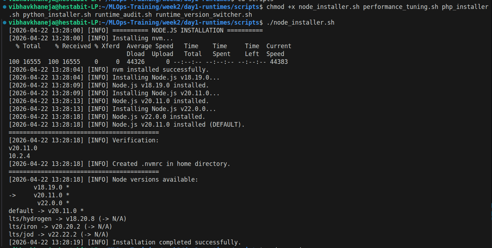
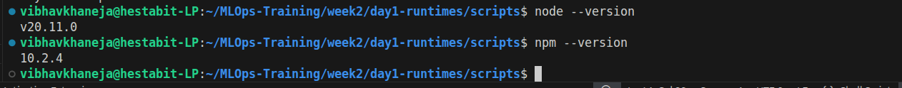

### Python (via Pyenv & Virtualenv)
Python's ecosystem is notorious for dependency conflicts, especially when dealing with heavy data science and machine learning libraries (like PyTorch or FAISS). 

* **The Concept:** `pyenv` builds Python from source and uses "shims"—lightweight executables that intercept Python commands and route them to the correct compiled version. `virtualenv` further isolates the actual packages (`pip` installs) from one another.
* **Production Value:** Ensures that an Advanced RAG pipeline requiring Python 3.11 does not overwrite the global packages used by an older system utility running on Python 3.9.
* **Key Implementations:**
    * Automated compilation via `python_installer.sh`.
    * Strict separation using `virtualenv` and `pipenv`.

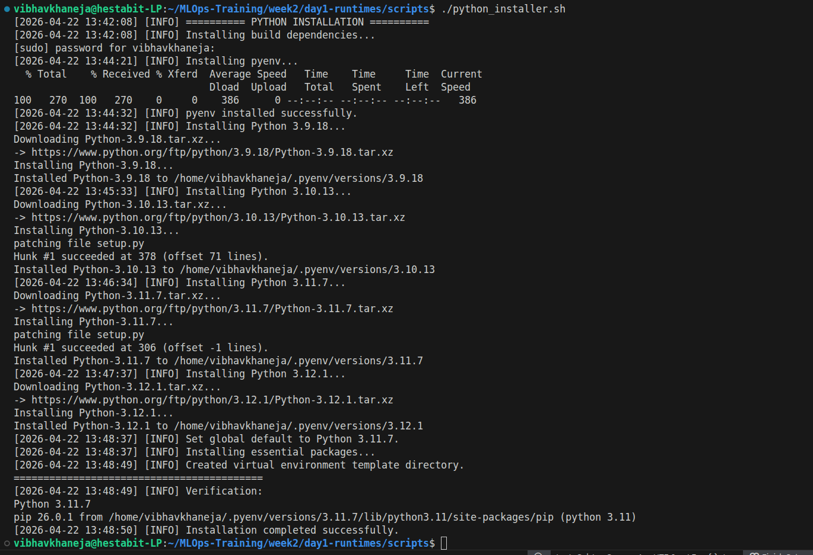
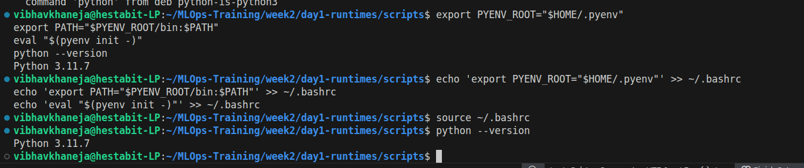

### PHP (via Ondrej PPA & PHP-FPM)
Unlike Node and Python, PHP in production is typically managed as a system service rather than a user-space binary.

* **The Concept:** We bypass the default Ubuntu repositories—which often contain outdated PHP versions—and hook directly into the `ppa:ondrej/php` repository. We pair this with FastCGI Process Manager (`php-fpm`).
* **Production Value:** PHP-FPM handles heavy traffic far more efficiently than traditional Apache mod_php by maintaining a pool of worker processes ready to execute code.
* **Key Implementations:**
    * Side-by-side installations of 7.4, 8.1, 8.2, and 8.3 via `php_installer.sh`.
    * `update-alternatives` used to manage the default CLI path.

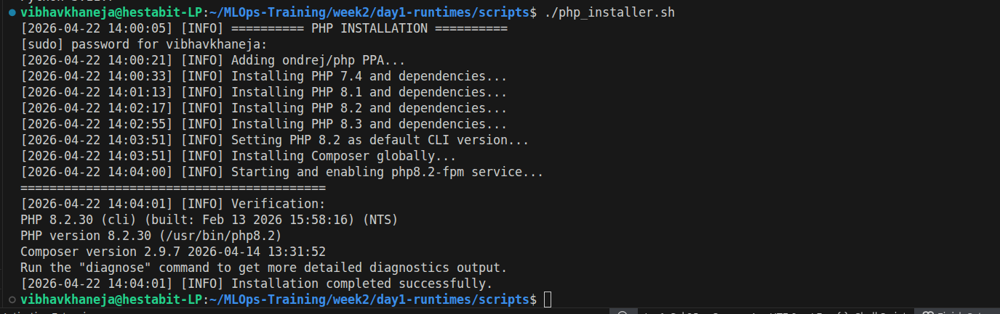
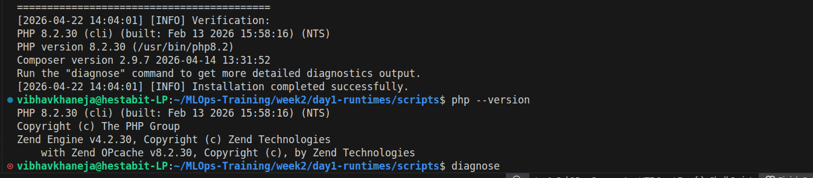

## 3. Environment Variable Precedence

The success of user-space managers relies entirely on the Linux `$PATH` variable. 

* **How it Works:** When you type `python`, Linux searches through the directories listed in `$PATH` from left to right. 
* **The Subshell Trap:** If a script installs a tool but does not export the new `$PATH` to `~/.bashrc` (or if `source ~/.bashrc` is not run), the terminal will fall back to the system default, causing "command not found" or version mismatch errors.
* **Resolution:** Our setup explicitly prepends `~/.pyenv/bin` and `~/.nvm` to the `$PATH`, ensuring our isolated environments always intercept commands before the OS defaults.

## 4. Runtime Version Switching

The runtime_version_switcher.sh script serves as a centralized, interactive control plane for dynamically transitioning between isolated runtime environments without manual path manipulation. To overcome the inherent limitation of Linux executing scripts in non-interactive subshells—which bypass standard .bashrc profile initializations—the script explicitly injects the nvm and pyenv startup hooks directly into its execution flow. This specific architectural workaround ensures the script can successfully recognize the version managers, allowing it to seamlessly re-route system calls to specific Node.js, Python, or PHP binaries using nvm use, pyenv global, and update-alternatives respectively, all while maintaining a strict audit trail of environment state changes in a dedicated log file.

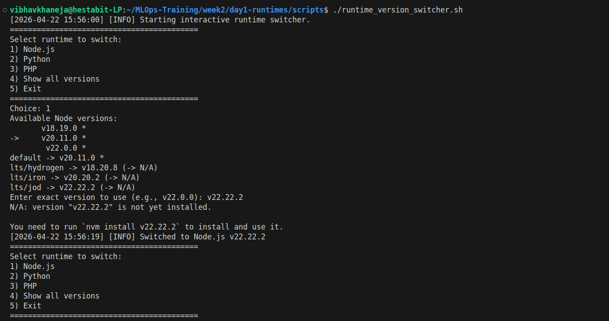
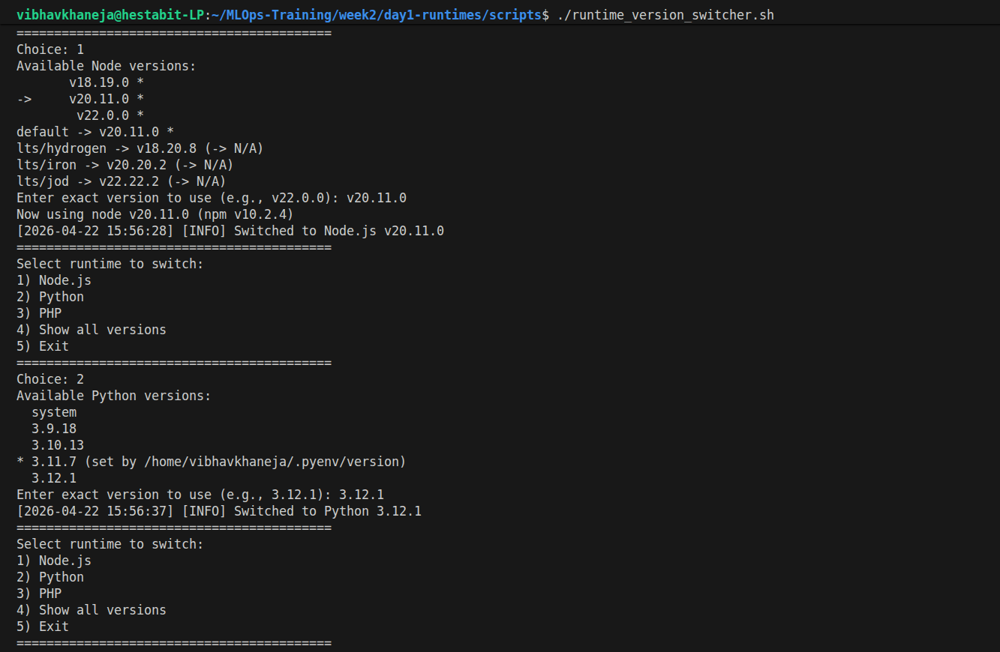
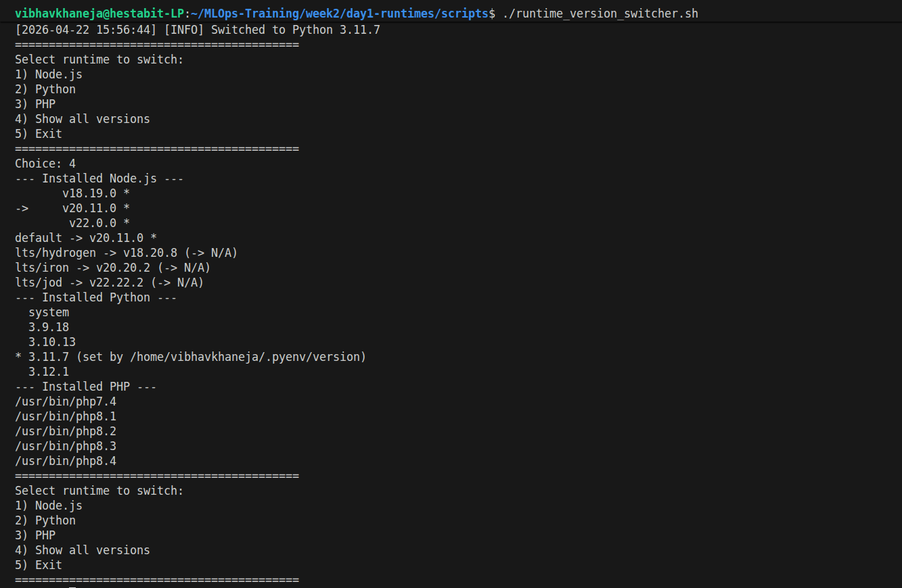

## 5. Production Performance Tuning

Default runtimes are configured to consume minimal resources, which is fatal for data-intensive workloads. The `performance_tuning.sh` script overrides these safe defaults with production-grade ceilings.

### Node.js Tuning (`NODE_OPTIONS`)
* `--max-old-space-size=4096`: Increases the V8 engine garbage collection heap from its default ~1.5GB to 4GB. This prevents `OOM (Out of Memory)` crashes when processing massive JSON arrays or buffering heavy files.
* `--max-http-header-size=16384`: Expands the allowable header size to 16KB, preventing 431 errors when routing requests with bloated JWT authentication payloads.

### Python Tuning (`.bashrc` exports)
* `PYTHONOPTIMIZE=1`: Strips out `assert` statements and debug code, slightly reducing compiled bytecode size.
* `PYTHONUNBUFFERED=1`: Forces Python to flush `stdout` and `stderr` instantly. This ensures that logs stream to our observability tools in true real-time, rather than being held in a buffer where they could be lost during a hard crash.

### PHP Tuning (`php.ini`)
* `memory_limit = 256M`: Bumps the memory limit to handle larger datasets while keeping a ceiling to prevent runaway scripts.
* `max_execution_time = 300`: Allows background jobs and API calls up to 5 minutes to complete, accommodating slow third-party service interactions.
* `opcache.enable=1`: Caches precompiled script bytecode in shared RAM, eliminating the need to re-parse scripts on every single request.

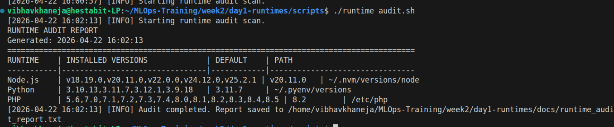
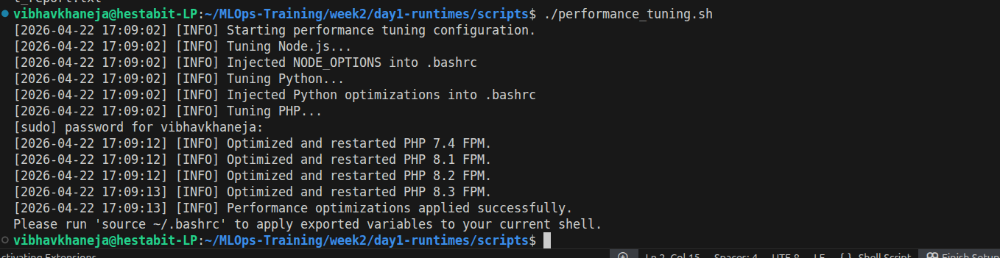
