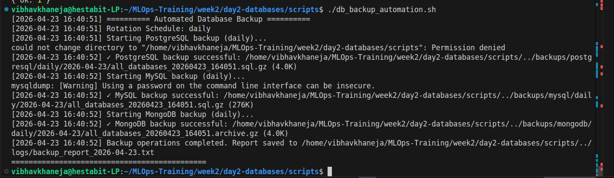
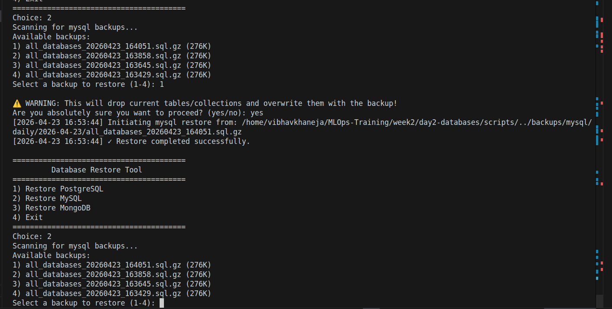

# Backup & Recovery Procedures
**Automation Script:** `db_backup_automation.sh`
**Recovery Script:** `db_restore.sh`

## 1. Backup Strategy
Backups are executed daily via the root crontab at 02:00 AM. 

* **PostgreSQL:** Uses `pg_dumpall` to capture all databases and global roles. 
* **MySQL:** Uses `mysqldump` with the `--single-transaction` flag. This is strictly required to prevent table-locking during the backup phase.
* **MongoDB:** Uses `mongodump` with administrative credentials to capture a complete BSON archive.
* **Compression Pipeline:** To preserve disk IO, all dumps are piped directly into `gzip` rather than writing raw files to disk first.
* **Rotation:** Scripts dynamically route files into `daily/`, `weekly/`, or `monthly/` directories based on the execution date.

## 2. Recovery Procedure
Disaster recovery is executed interactively using the `db_restore.sh` tool.

**The Safety Net (Pre-Restore Snapshot):**
Never execute a restore on a live system without an immediate fallback. Upon selecting a backup file to restore, the script will automatically pause and generate a `pre_restore_[TIMESTAMP].gz` snapshot of the current state. If the selected backup is corrupted, the engineer can revert to the pre-restore snapshot instantly.

**Execution Flow:**
1. Run `sudo ./db_restore.sh`.
2. Select the target database engine.
3. The script will dynamically scan the `backups/` directory and present a chronologically sorted list of available archives.
4. Data is streamed via `zcat` directly into the database engine.
5. **MongoDB Exception:** The `--drop` flag is utilized during `mongorestore` to ensure the current collections are completely wiped before data insertion, preventing duplicate key collisions.

