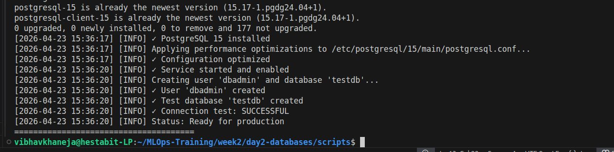
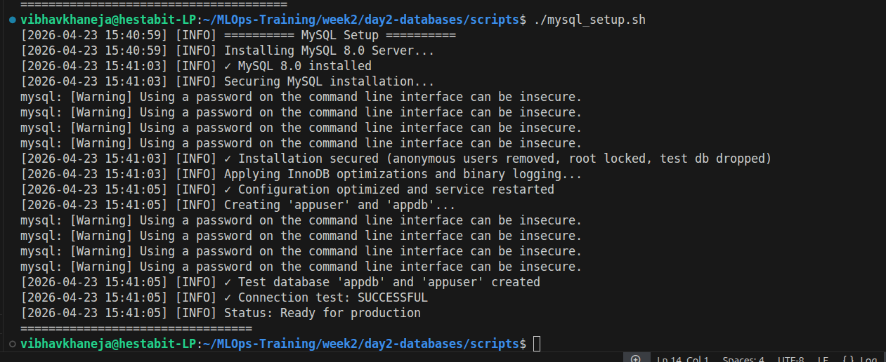
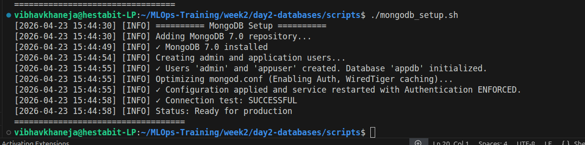

# Database Setup & Installation Guide
**Environment:** Ubuntu Linux (Target: 8GB RAM constraint)

## Overview
This guide details the automated installation of the three core database engines. All installations are handled via bash scripts located in the `scripts/` directory.

## 1. PostgreSQL 15 (`postgresql_setup.sh`)
**Process:**
1. Imports the official `apt.postgresql.org` repository to ensure the latest minor version is fetched.
2. Installs `postgresql-15` and `postgresql-client-15`.
3. Injects performance optimizations into `/etc/postgresql/15/main/postgresql.conf`.
4. Creates the `dbadmin` user and `testdb` database.
5. Enables the `postgresql` systemd service for persistence across reboots.

## 2. MySQL 8.0 (`mysql_setup.sh`)
**Process:**
1. Installs `mysql-server` from the Ubuntu repositories.
2. Executes raw SQL to lock down the installation (removes anonymous users, disables remote root).
3. Injects custom InnoDB memory overrides into `/etc/mysql/mysql.conf.d/99-custom-opt.cnf`.
4. Creates the `appuser` and `appdb` database.
5. Restarts the daemon to apply binary logging capabilities.

## 3. MongoDB 7.0 (`mongodb_setup.sh`)
**Process:**
1. Imports the official MongoDB GPG keys and repository lists.
2. Installs `mongodb-org` and the `mongodb-database-tools` package (for backup utilities).
3. **Bootstraps:** Starts the service temporarily *without* authentication to create the root admin.
4. **Secures:** Edits `/etc/mongod.conf` to bind the IP and enforce authorization.
5. Restarts the service, rendering it inaccessible without proper credentials.

