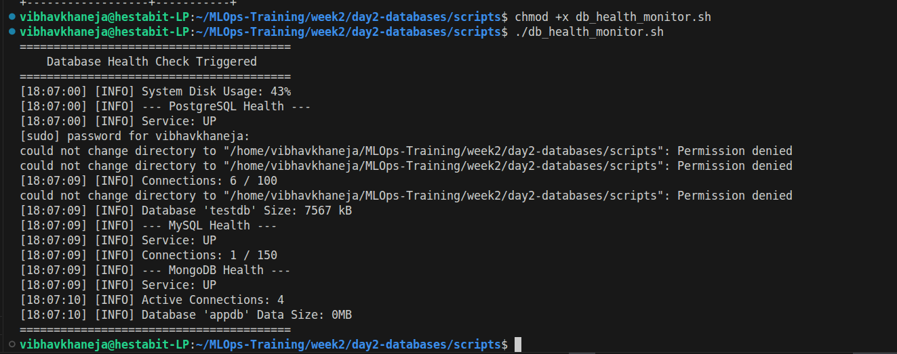
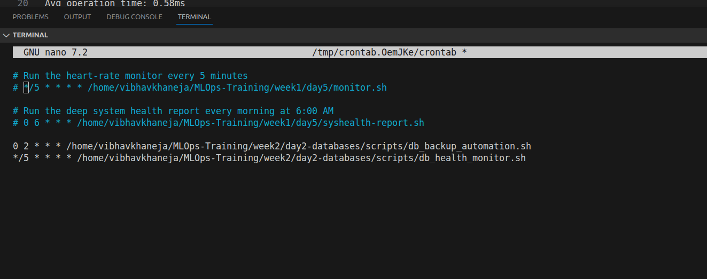

# Database Health & Monitoring Guide
**Monitoring Script:** `db_health_monitor.sh`
**Execution Schedule:** `*/5 * * * *` (Every 5 minutes via root cron)

## 1. Core Metrics Tracked
The health monitor evaluates system-level and engine-specific vitals to provide early warnings of resource exhaustion.

* **System Storage:** Monitors the root partition. Alerts if disk usage exceeds **85%**.
* **Service State:** Validates the systemctl status (`is-active`) of `postgresql`, `mysql`, and `mongod`.
* **Connection Pooling:** * Queries current active connections versus configured `max_connections`.
  * Triggers an alert if active connections exceed **80%** of the maximum threshold.

## 2. Query Architecture
To ensure the monitoring script doesn't artificially inflate connection counts or leave hanging sessions, it utilizes lightweight, non-interactive queries:
* **PostgreSQL:** `SELECT count(*) FROM pg_stat_activity;`
* **MySQL:** `SHOW STATUS LIKE 'Threads_connected';`
* **MongoDB:** `db.serverStatus().connections` via `mongosh --quiet`.

## 3. Log Management
All health checks are appended to daily rotation logs located at `logs/db_health_YYYY-MM-DD.log`. Any line containing `[ALERT]` should trigger immediate engineer investigation.

