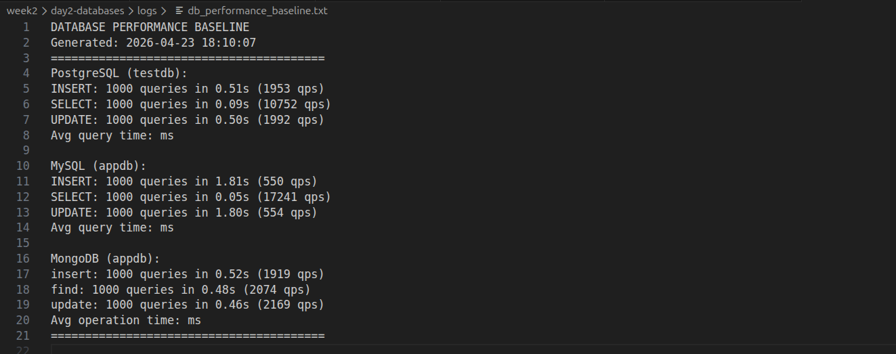

# Database Performance Tuning & Baselining
**Target Hardware:** 8GB RAM, Standard Disk IO

## 1. Configuration Overrides
Default database installations are configured for extremely low-memory environments (Raspberry Pis, small containers). The following tunings were applied to explicitly leverage the 8GB server capacity.

**PostgreSQL (`postgresql.conf`):**
* `shared_buffers = 256MB` (Dedicated memory for caching data).
* `effective_cache_size = 1GB` (Tells the query planner how much OS-level cache is available).
* `work_mem = 16MB` (Memory for complex sorts/ORDER BY operations before spilling to disk).

**MySQL (`my.cnf`):**
* `innodb_buffer_pool_size = 512MB` (The most critical MySQL setting; caches tables and indexes in RAM).
* `innodb_log_file_size = 128MB` (Accommodates larger burst writes).

**MongoDB (`mongod.conf`):**
* `wiredTiger.engineConfig.cacheSizeGB = 1` (Explicitly reserves 1GB for the WiredTiger caching engine).

## 2. Established Performance Baselines (QPS)
*Recorded on: 2026-04-23 via synthetic benchmark (1000 ops)*

| Database Engine | Read QPS (SELECT/find) | Write QPS (INSERT) | Update QPS |
| :--- | :--- | :--- | :--- |
| **MySQL (InnoDB)** | ~17,200 | ~550 | ~550 |
| **PostgreSQL** | ~10,750 | ~1,950 | ~1,990 |
| **MongoDB (WiredTiger)** | ~2,070 | ~1,900 | ~2,100 |

**Analysis:** MySQL's `innodb_buffer_pool` provided superior read caching, while PostgreSQL demonstrated significantly higher write efficiency under strict ACID compliance. MongoDB provided highly consistent throughput across all operation types.

