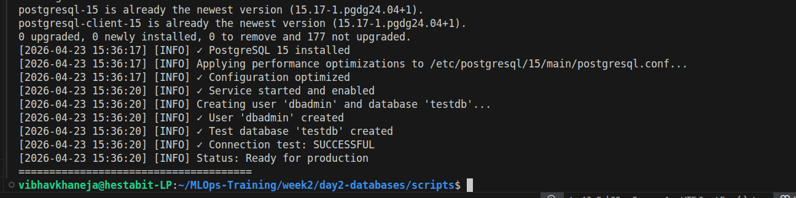
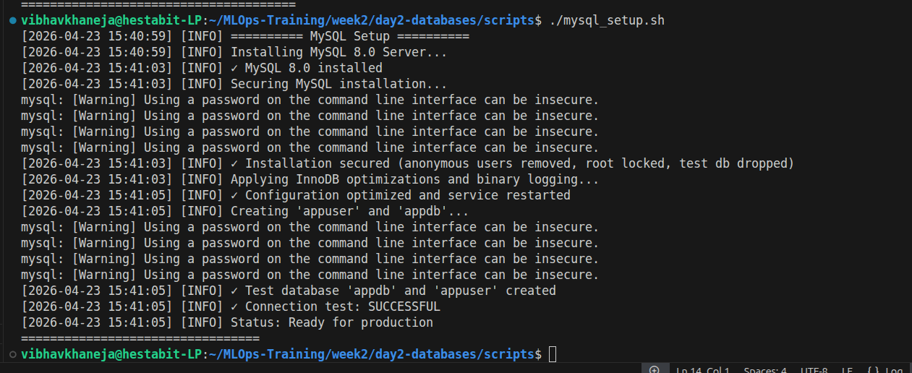
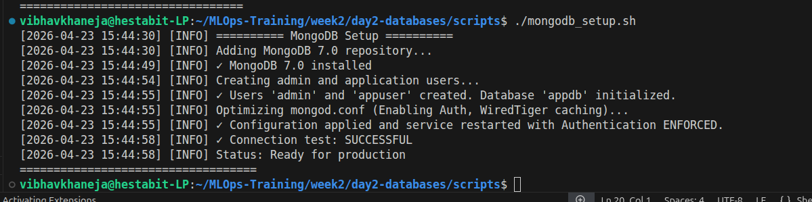
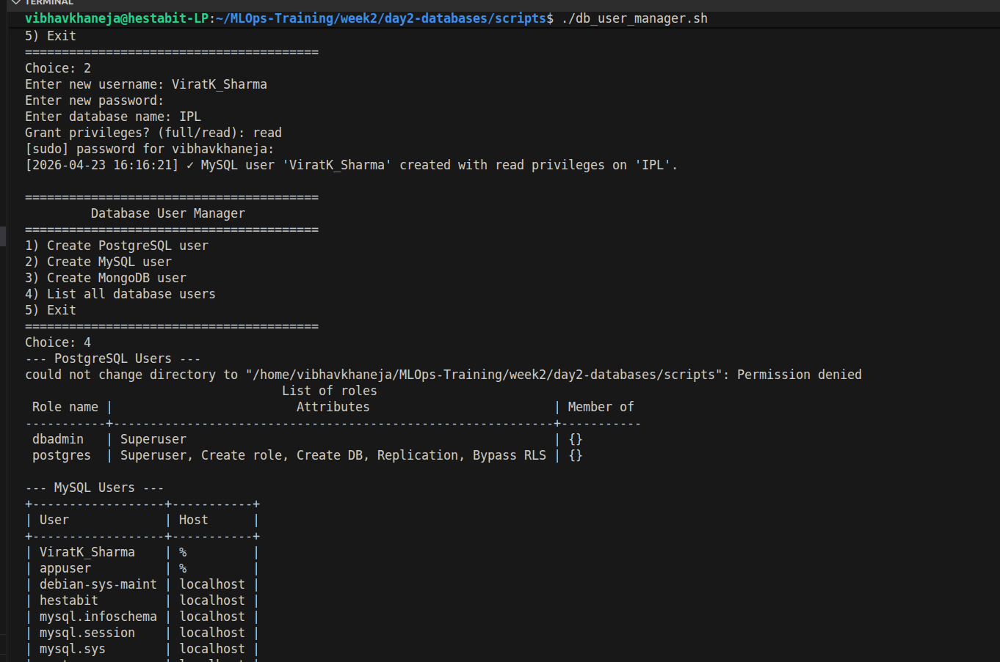
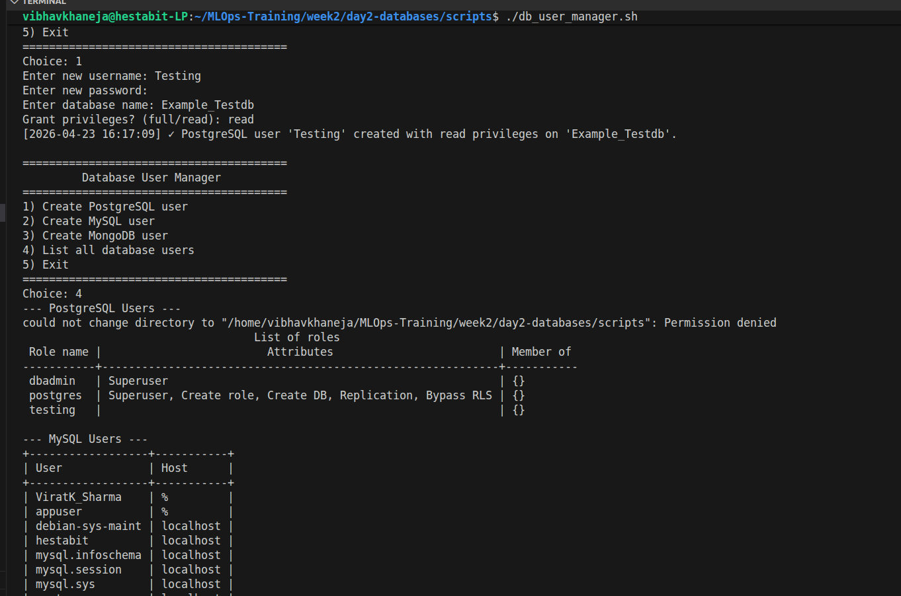
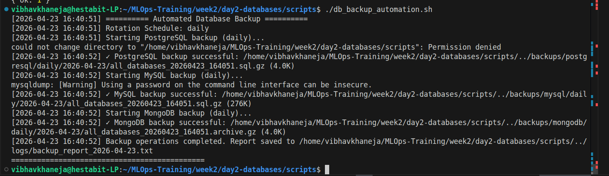
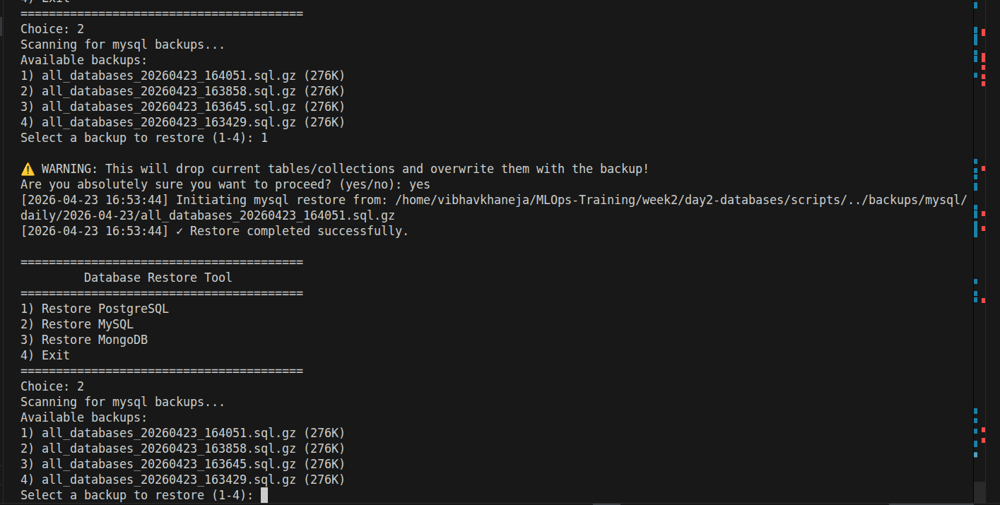
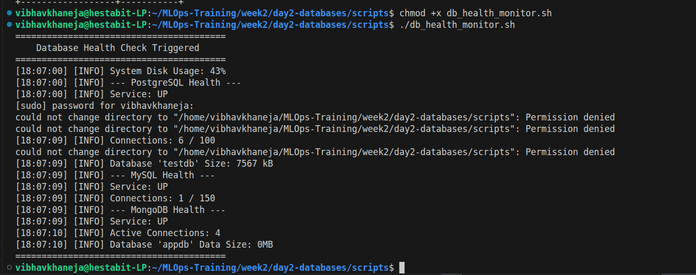
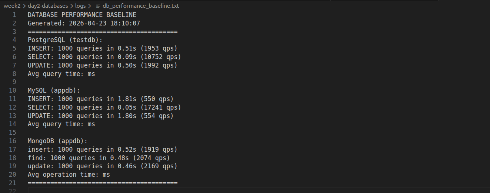
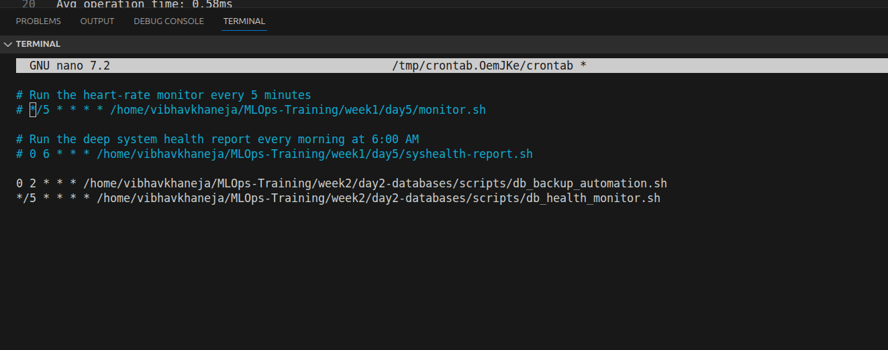

# Day 2: Database Installation, Security & Disaster Recovery
**Author:** Vibhav Khaneja | **Project:** DevOps Launchpad Week 2

## The Mindset: Servers are Ephemeral, Data is Permanent
The objective of Day 2 was to master the persistence layer. While application servers can be destroyed and recreated instantly, a database failure can destroy a business. 

The mindset for this day was focused on **Security, Reliability, and Observability**. We moved past simply installing database engines and focused on hardening them, establishing strict access controls, and building automated disaster recovery pipelines.

## Core Database Engines Implemented

We provisioned three distinct database technologies to support our multi-language microservices architecture:
1.  **PostgreSQL (Relational/Object-Relational):** Highly compliant ACID database used for complex data integrity (Targeted for the Express.js API).
2.  **MySQL / MariaDB (Relational):** Highly optimized for fast read-heavy workloads (Targeted for the Laravel and FastAPI backends).
3.  **MongoDB (NoSQL/Document):** Scalable, schema-less document store optimized for rapid JSON data ingestion (Targeted for Next.js architectures).

## Deep Dive: Database Automation & SRE Scripts

Default database installations are configured for low-resource developer machines, not production servers. The `scripts/` directory contains our automation to transform these defaults into enterprise-grade data stores.

### 1. Provisioning & Kernel Optimization (`*_setup.sh`)
*   **The Objective:** Install the databases and immediately apply production-grade memory and connection tuning.
*   **The Mechanics:** The `postgresql_setup.sh`, `mysql_setup.sh`, and `mongodb_setup.sh` scripts do more than run `apt install`. 
They dynamically generate optimized configuration files (`postgresql.conf`, `my.cnf`, `mongod.conf`).
*   **The "Why":** 
    *   For MySQL, we tuned `innodb_buffer_pool_size` to ensure indexes and row data are cached in RAM, drastically reducing disk I/O.
    *   For PostgreSQL, we adjusted `shared_buffers` and `max_connections` to prevent the database from exhausting server memory under high concurrency.
    *   We also ran secure installation protocols (like removing anonymous users and disabling remote root logins).

### 2. Identity & Access Management (`db_user_manager.sh`)
*   **The Objective:** Enforce the **Principle of Least Privilege**.
*   **The Mechanics:** An interactive CLI tool that standardizes user creation across all three database types.
*   **The "Why":** Applications should *never* connect to a database using the `root` or `postgres` superuser accounts. This script generates dedicated application users scoped exclusively to their specific databases with restricted read/write permissions, mitigating the blast radius of a potential SQL injection attack.

### 3. Automated Disaster Recovery (`db_backup_automation.sh`)
*   **The Objective:** Guarantee data survival in the event of hardware failure or catastrophic user error.
*   **The Mechanics:** Designed to be run via a Linux `cron` job (e.g., at 2:00 AM daily). It executes engine-specific logical backups:
    *   `pg_dump` for PostgreSQL
    *   `mysqldump --single-transaction` for MySQL (ensuring no table locks during backup)
    *   `mongodump` for MongoDB
*   **The "Why":** The script implements a Grandfather-Father-Son rotation strategy. It automatically zips the backups and organizes them into daily, weekly, and monthly directories inside the `backups/` folder, ensuring we meet compliance retention policies without filling up the hard drive.

### 4. Mean Time To Recovery (`db_restore.sh`)
*   **The Objective:** Rapidly restore a corrupted database under immense pressure.
*   **The Mechanics:** Instead of forcing the engineer to type long, complex restore commands while the system is down, this interactive script dynamically parses the `backups/` directory, lists available timestamps, and safely pipes the `.sql.gz` or BSON files back into the database engine[cite: 1].
*   **The "Why":** In an outage, human error skyrockets. Automated restore scripts ensure predictable, verifiable recovery.

### 5. Observability & Profiling (`db_health_monitor.sh` & `db_performance.sh`)
*   **The Objective:** Detect database degradation *before* it causes an application outage.
*   **The Mechanics:** 
    *   The **Health Monitor** checks critical metrics like active connections vs. max connections, disk space limits, and replication lag.
    *   The **Performance Script** runs simulated INSERT/SELECT workloads to establish a baseline of queries-per-second (QPS) and average latency.
*   **The "Why":** If response times jump from 2ms to 200ms, the performance baseline proves whether the bottleneck is in the application code or the database engine.

## Directory Structure

*   `backups/`: The target directory for `db_backup_automation.sh`, organized by engine (`mongodb/`, `mysql/`, `postgresql/`) and retention tier (daily, weekly).
*   `configs/`: Backup copies of the highly tuned `my.cnf`, `postgresql.conf`, and `mongod.conf` templates.
*   `docs/`: Extensive Markdown guides detailing Backup/Recovery procedures, Security Audits, and Performance tuning methodologies.
*   `logs/`: Outputs from the automated health monitors and user management actions.
*   `scripts/`: The core automation logic for setup, IAM, backup, recovery, and performance profiling.