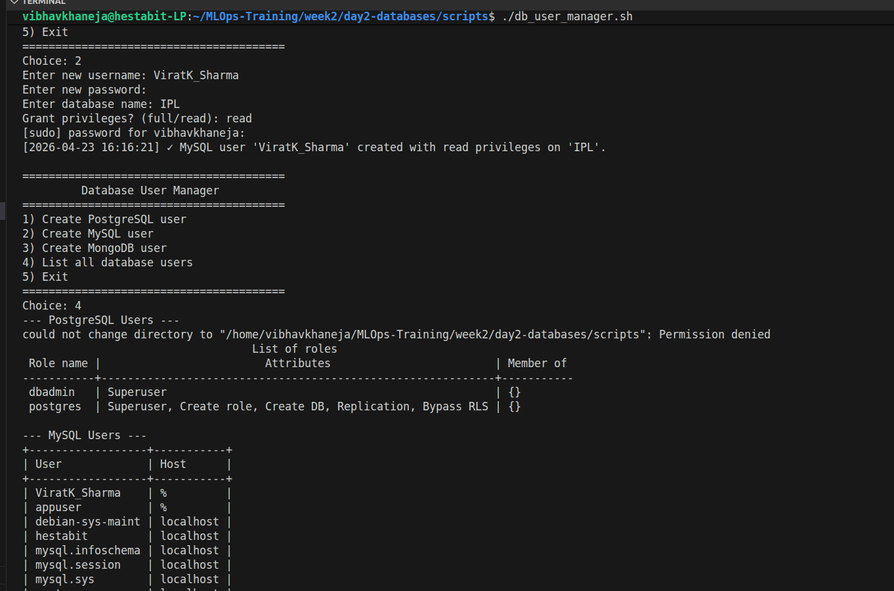
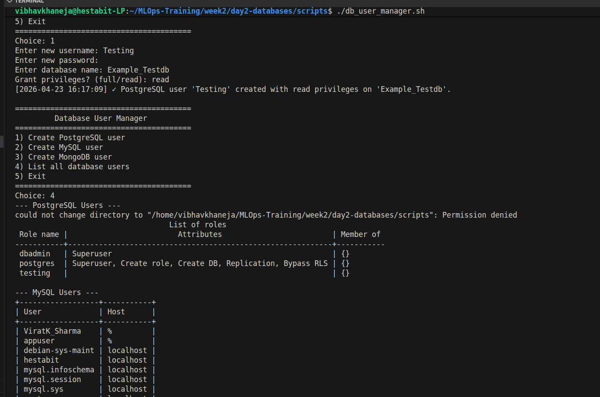

# Database Security Audit & Configuration Review
**Date:** 2026-04-23
**Target:** PostgreSQL 15, MySQL 8.0, MongoDB 7.0
**Auditor:** Vibhav Khaneja

## Overview
This document outlines the security hardening measures applied to the core database infrastructure during initial provisioning. All default, insecure configurations have been patched, and a centralized Role-Based Access Control (RBAC) script has been deployed.

## 1. PostgreSQL Security Configuration
* **Authentication Method:** Updated `pg_hba.conf` to enforce `scram-sha-256` password encryption for all network connections.
* **Network Binding:** Bound to local subnets appropriately; open internet access (`0.0.0.0/0`) is restricted.
* **Superuser Isolation:** The default `postgres` system user is restricted to local socket connections. A dedicated `dbadmin` superuser was provisioned for administrative tasks.

## 2. MySQL Security Configuration
* **Automated Hardening:** The equivalent of `mysql_secure_installation` was executed programmatically:
  * Removed all anonymous user accounts.
  * Disabled remote login for the `root` user (restricted strictly to `localhost`/`127.0.0.1`).
  * Dropped the default `test` database and removed privileges associated with it.
* **Password Policy:** Native password plugin utilized for application users.

## 3. MongoDB Security Configuration
* **Authentication Enforcement:** Bootstrapped without auth strictly to create the initial admin user, then immediately modified `mongod.conf` to set `security.authorization: "enabled"`.
* **RBAC Implementation:** * `admin` user granted `userAdminAnyDatabase` and `readWriteAnyDatabase`.
  * Crucially, the explicit `backup` role was granted to the admin user to permit authorized `mongodump` execution against the system `config` databases.

## 4. User Management Control Plane
* All user provisioning is handled via `db_user_manager.sh`. 
* **Privilege Separation:** The script enforces the Principle of Least Privilege by prompting administrators to explicitly define `read` or `full` privileges bound to specific databases, preventing blanket wildcard grants.

