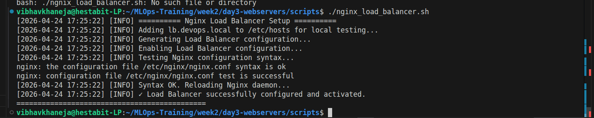
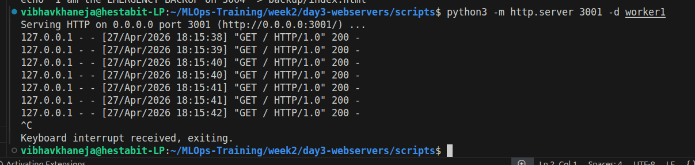
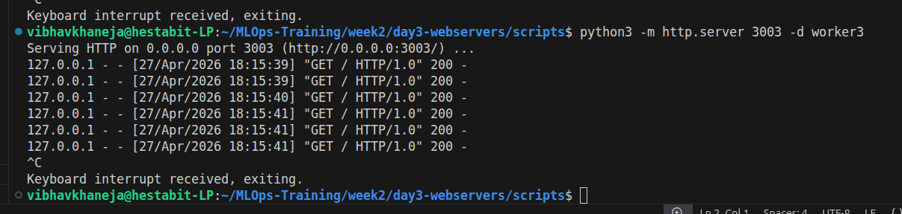
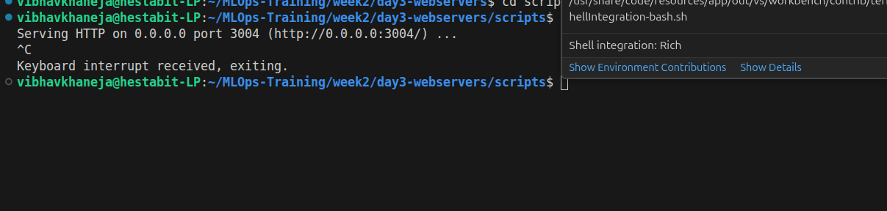

# High Availability & Load Balancing

## Overview
To achieve zero downtime and massive scale, a single application process is insufficient. Load balancing upgrades Nginx from a simple proxy into an intelligent traffic dispatcher, distributing incoming requests across a cluster of backend workers.

## Script 6: The Nginx Load Balancer
This configuration introduces an `upstream` cluster block containing three primary backend workers and one emergency fallback worker.

**Technical Highlights & Mechanisms:**
* **The Algorithm:** We abandoned the default round-robin approach in favor of `least_conn`. Nginx actively monitors the workload of all servers and routes new traffic to the worker with the fewest active connections.
* **The Safety Net (Emergency Backup):** A server flagged as `backup` sits entirely idle. Nginx will route zero traffic to this server unless it mathematically verifies that all primary workers are unresponsive.
* **Silent Error Handling:** The true magic of the load balancer is the `proxy_next_upstream` directive.
  * **500 (Internal Server Error):** The backend code crashed mid-request.
  * **502 (Bad Gateway):** The backend process is entirely dead.
  * **503 (Service Unavailable):** The backend is overwhelmed and rejecting traffic.
  * If a worker returns any of these codes, Nginx catches the error in mid-air, hides it from the user, and silently redirects the request to a healthy worker. The end-user experiences a slightly longer load time instead of a crashed application.

