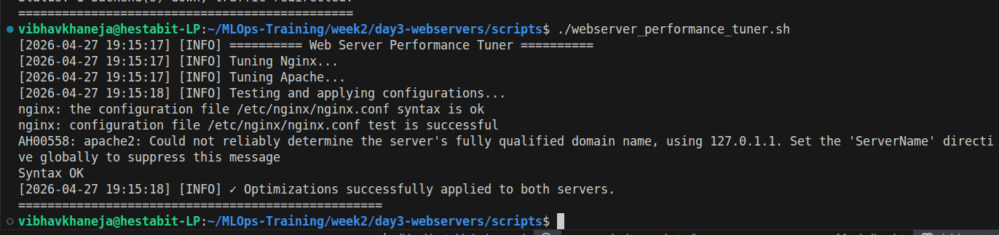

# Web Server Performance Tuning

## Overview
Default server configurations are built for compatibility, not speed. This guide documents the specific tuning parameters applied to Nginx and Apache to maximize throughput, optimize CPU usage, and eliminate disk bottlenecks.

## Script 8: The Performance Tuner
This script injects advanced configuration blocks into the core server files, utilizing strict testing before applying changes.

**Technical Highlights & Mechanisms:**
* **Buffer Sizing (RAM vs. Disk):** By explicitly declaring parameters like `client_body_buffer_size 16K` and `client_max_body_size 8m`, we construct larger data "trays" in the server's RAM. This ensures standard user requests are processed in memory, completely avoiding slow read/write operations to the physical hard drive.
* **Gzip Compression:** Text data is compressed before traveling across the network.
  * **The Sweet Spot:** We utilize `gzip_comp_level 6`. Levels 7-9 offer mathematically smaller files, but consume disproportionately high CPU cycles, resulting in diminished overall server performance.
  * **Efficiency Checks:** `gzip_min_length 256` prevents the server from wasting CPU cycles compressing micro-files where the computational cost outweighs the network transmission savings.
* **The Safety Net (`-t`):** Tuning core files is hazardous. The script runs `nginx -t` and `apachectl configtest` after injecting the new parameters. The daemon is only reloaded if the syntax test returns a perfect score, ensuring zero downtime from typographical errors.

