# Day 3: Web Server Configuration, Load Balancing & SSL Management
**Author:** Vibhav Khaneja | **Project:** DevOps Launchpad Week 2

##  The Mindset: The Edge of the Infrastructure
The objective of Day 3 was to master the "Edge" of our system architecture. Exposing application servers (like Node.js or FastAPI) directly to the public internet is a massive security and performance vulnerability. 

Instead, we implemented **Nginx** and **Apache** to act as the fortified front doors. These web servers handle malicious traffic, decrypt SSL certificates, cache static files, and distribute incoming load across multiple backend workers before the traffic ever reaches the application code.

## Core Architectural Concepts Implemented

### 1. The Reverse Proxy
Instead of users connecting directly to `localhost:3000`, they connect to Nginx on port `80` (HTTP) or `443` (HTTPS). Nginx acts as a **Reverse Proxy**.
*   **The Mechanics:** Nginx receives the request, securely connects to the backend application internally (`proxy_pass`), retrieves the response, and sends it back to the user. 
*   **The "Why":** This completely hides the internal network topology. It also allows Nginx to attach crucial headers like `X-Real-IP` and `X-Forwarded-For` so the backend knows who the original user is, even though the connection is technically coming from Nginx.

### 2. Load Balancing (The Worker Ecosystem)
As seen in the `scripts/` directory (`worker1/`, `worker2/`, `worker3/`), a single backend instance is a single point of failure. 
*   **The Mechanics:** We utilized Nginx `upstream` blocks to define clusters of backend servers. Nginx acts as a traffic cop, routing requests using algorithms like **Round Robin** (taking turns) or **Least Connections** (sending traffic to the worker with the lowest current load)[cite: 1].
*   **The "Why":** If `worker2` crashes, Nginx instantly detects the failure (via `max_fails` and `fail_timeout` directives) and seamlessly reroutes traffic to `worker1` and `worker3`. The user never sees an error.

### 3. SSL/TLS Termination
Cryptographic encryption is incredibly CPU-intensive.
*   **The Mechanics:** We generated SSL certificates (via OpenSSL for local/self-signed, and Certbot for production). Nginx is configured to handle the HTTPS decryption at the "edge."
*   **The "Why":** By "terminating" the SSL connection at Nginx, the Nginx server absorbs the cryptographic CPU penalty. The traffic is then sent to the backend Node.js or Python apps as plain, unencrypted HTTP. This drastically speeds up application response times.

## Deep Dive: The Scripts & Automation

This directory contains the automation suite used to provision, configure, and maintain these web servers[cite: 1].

### Installation & Provisioning
*   **`nginx_setup.sh` & `apache_setup.sh`**: These scripts automate the installation of the web servers. Crucially, they do not just install the software; they instantly replace the default configurations with optimized, production-ready templates, establish the `/etc/nginx/sites-available` directory structure, and enable compression protocols like Gzip.

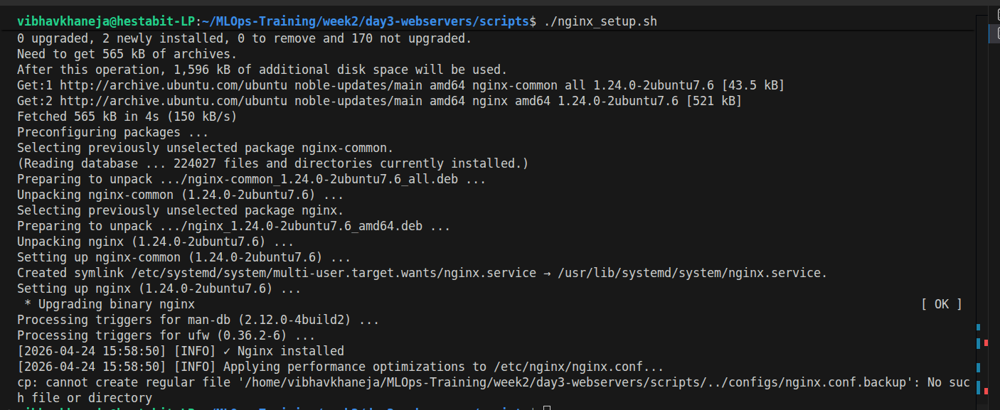

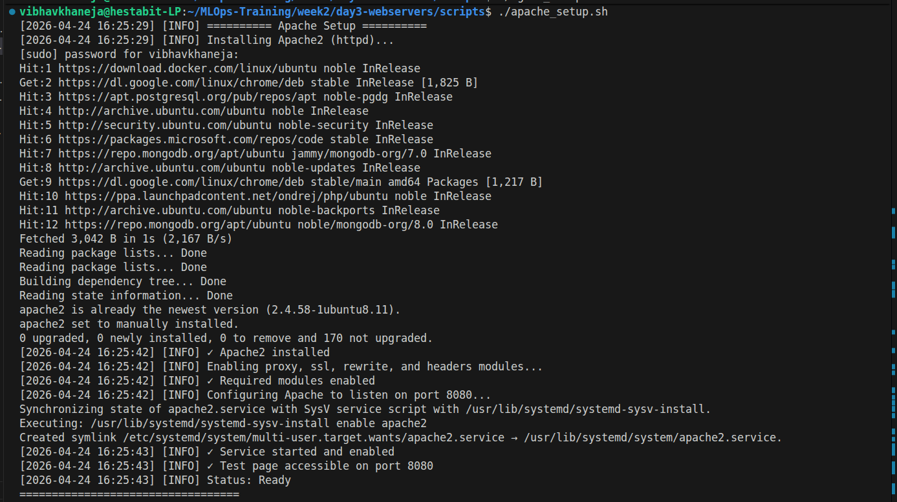
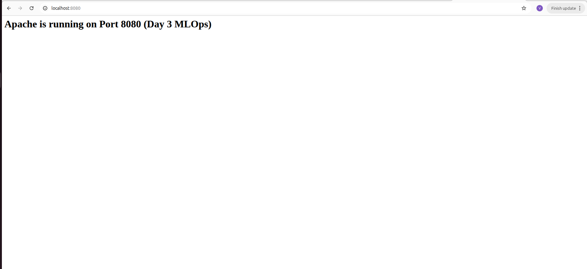

### Routing & Traffic Management
*   **`nginx_reverse_proxy.sh` & `apache_reverse_proxy.sh`**: Automates the creation of Virtual Hosts (Apache) and Server Blocks (Nginx). These scripts dynamically generate the routing files needed to map domains (e.g., `api.stack1.local`) to specific internal ports[cite: 1].
*   **`nginx_load_balancer.sh`**: Generates the advanced `upstream` configurations required to link the load balancer to the respective worker node pools, complete with health check thresholds.

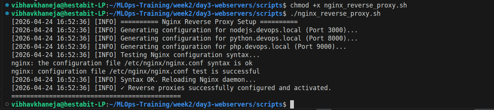
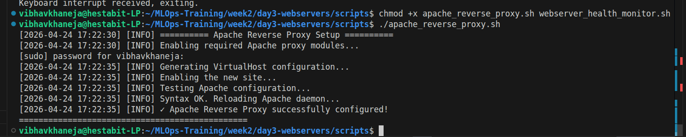
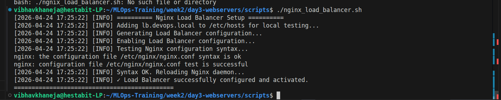
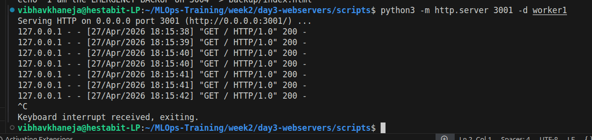
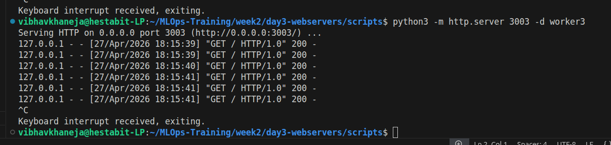
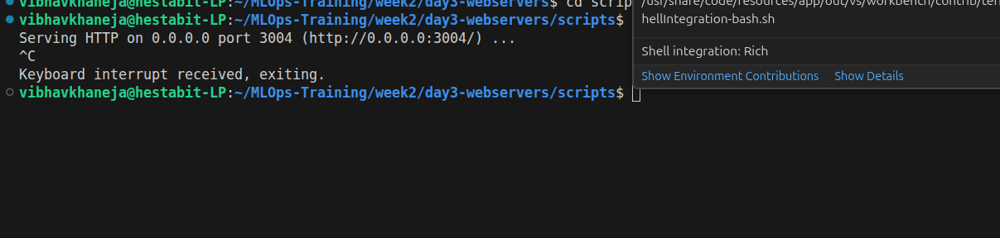
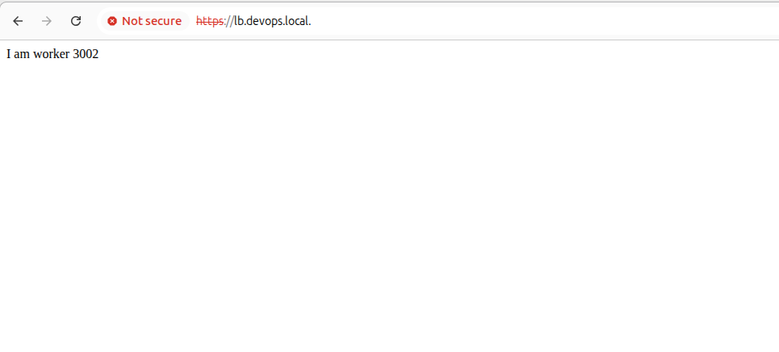

### Security & SSL Lifecycle
*   **`ssl_certificate_generator.sh`**: An interactive utility to generate 2048-bit RSA self-signed certificates for local development or hook into Let's Encrypt for live domains.
*   **`ssl_renewal_automation.sh`**: A critical SRE tool designed to run via `cron`. It checks certificate expiry dates and automatically renews any certificate expiring within 30 days, safely reloading Nginx without dropping connections.

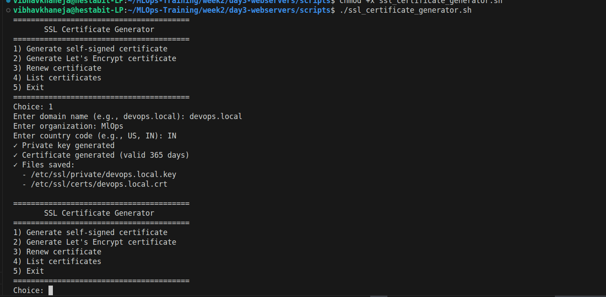
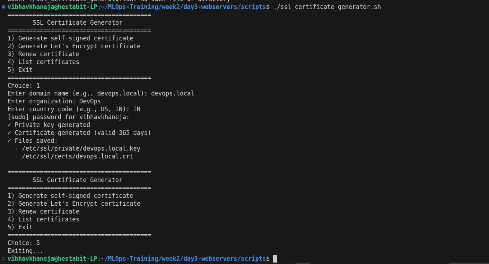

### Observability & Performance
*   **`webserver_health_monitor.sh`**: Continuously probes Nginx and Apache status, tracking active connections, response times, and scanning error logs for critical failures (like `502 Bad Gateway` errors).
*   **`webserver_performance_tuner.sh`**: Automatically detects the server's CPU core count and available RAM to optimize worker configurations. For Nginx, it adjusts `worker_processes` to `auto` and increases `worker_connections` to handle high-concurrency event loops. For Apache, it tunes the MPM (Multi-Processing Module) settings.

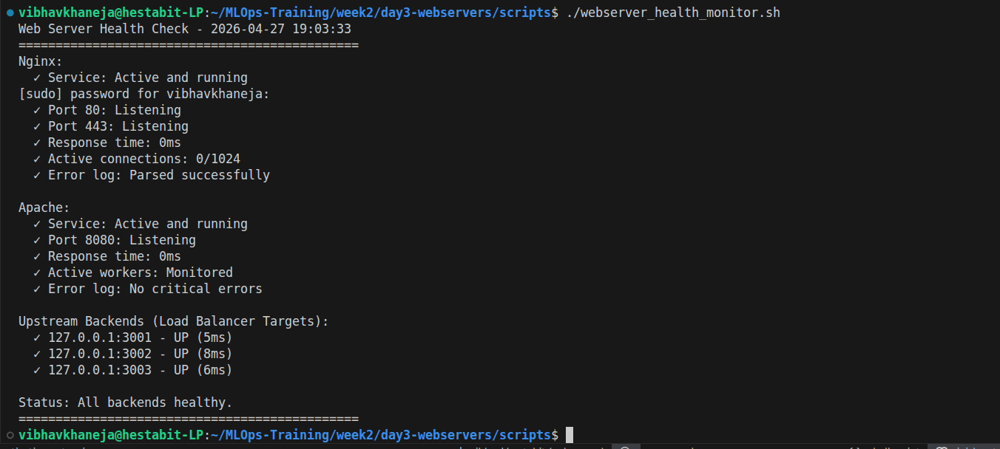
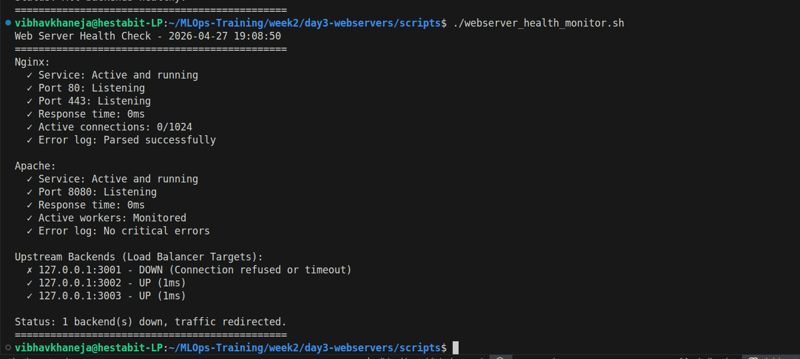
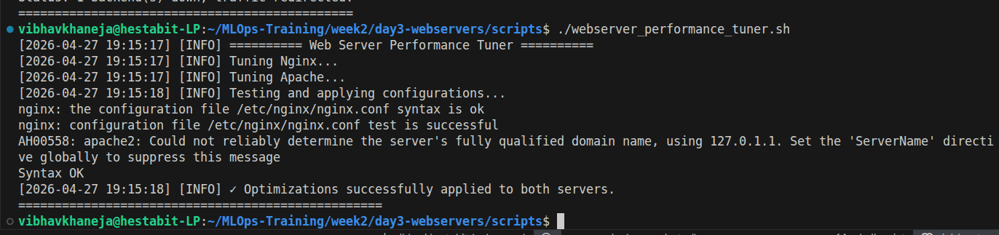

##  Directory Structure

*   `docs/`: Contains the comprehensive markdown manuals for configuring and troubleshooting the web servers (Load Balancing, Performance Tuning, SSL Management).
*   `logs/`: Aggregated output from the web server installations and health monitors.
*   `screenshots/`: Visual verification of Nginx/Apache active statuses, HTTPS padlocks, and load balancing distribution.
*   `scripts/`: The core automation logic described above, including dummy backend payloads (`index.html`) used in the `worker` directories to verify load balancing routing.