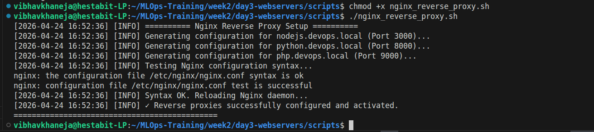
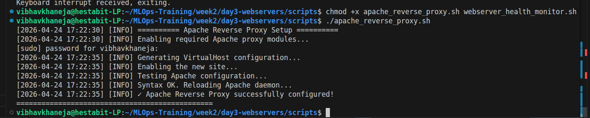

# Reverse Proxy Configuration Guide

## Overview
The reverse proxy layer is the shield wall of the infrastructure. Instead of exposing backend application workers (like Node.js or Python) directly to the public internet, Nginx and Apache intercept all traffic at the edge, inspect it, and silently forward it to the internal network.

## Script 4 & 5: Nginx and Apache Reverse Proxies
We configured both servers to act as reverse proxies, allowing us to route traffic securely regardless of the underlying web server technology. 

**Technical Highlights & Mechanisms:**
* **SSL Offloading:** Cryptography requires heavy CPU math. By configuring the proxy block to handle all SSL decryption at the front door, the internal traffic sent to the backend workers is plain-text. This frees up the backend applications to focus entirely on application logic.
* **Header Forwarding:** When a proxy acts as a middleman, the backend application believes all traffic originates from `127.0.0.1`. We utilize `proxy_set_header X-Real-IP` to stamp the user's true public IP address onto the request envelope before handing it to the backend.
* **WebSockets:** Standard HTTP requests open and close instantly. Modern real-time applications require continuous connections. The proxy configs explicitly include `Upgrade $http_upgrade` to allow long-lived WebSocket tunnels.
* **Apache Specifics:** In Apache, this requires enabling specific modules (`mod_proxy`, `mod_proxy_wstunnel`) and utilizing `ProxyPass` and `ProxyPassReverse` to handle the bi-directional traffic flow seamlessly.

