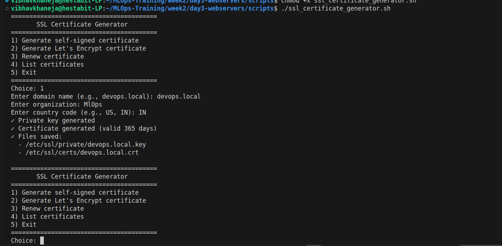
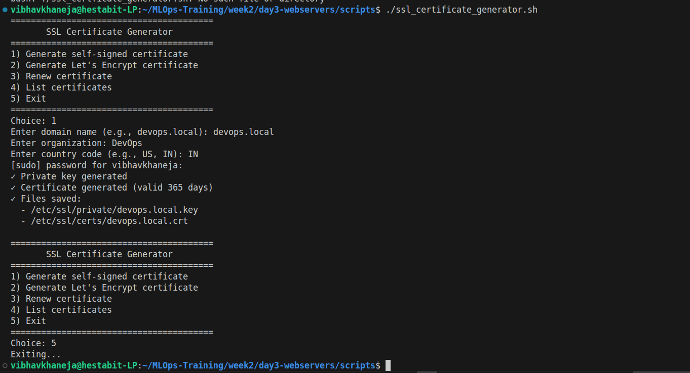
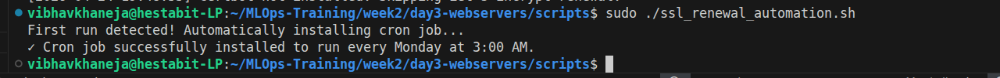
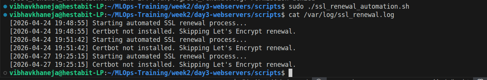

# Cryptography & SSL Certificate Management

## Overview
Security is non-negotiable. This documentation covers the mathematical foundation of our secure socket layer and the automation required to ensure those locks never expire.

## The Cryptographic Foundation
SSL relies on an asymmetric key pair:
* **The Private Key (`.key`):** A heavily guarded file stored deep within the server (`/etc/ssl/private/`). It is the only mathematical entity capable of unlocking the data.
* **The Public Certificate (`.crt`):** A public ledger distributed to any browser that connects, allowing users to encrypt data before sending it to the server.

## Script 3: Certificate Generation
We utilize OpenSSL to manually forge certificates for local testing environments.

**Technical Highlights:**
* **The OpenSSL Command:** `openssl req -x509 -nodes -days 365 -newkey rsa:2048`
  * `-x509`: Instructs Linux to act as its own Certificate Authority.
  * `-nodes`: "No DES" ensures the private key is not password-protected, allowing the web server to restart automatically without human intervention.
  * `-days 365`: Sets the expiration timeline.
  * `rsa:2048`: Generates an enterprise-grade, computationally secure mathematical lock.

## Script 9: Renewal Automation
Human error is the leading cause of expired SSL certificates. This script completely automates the Let's Encrypt `certbot` lifecycle.

**Technical Highlights:**
* **Absolute Pathing (`readlink`):** Cron jobs operate in a blind environment without a concept of the current working directory. The script uses `readlink -f $0` to dynamically determine its own absolute path for safe scheduling.
* **Idempotent Execution:** The script checks the root crontab before installing itself. It can be executed 1,000 times without ever creating duplicate cron jobs.
* **Silent Renewals:** The scheduled task runs `certbot renew --quiet`. It intelligently checks the expiration dates of all active certificates and only executes a renewal if a certificate is within 30 days of death.

