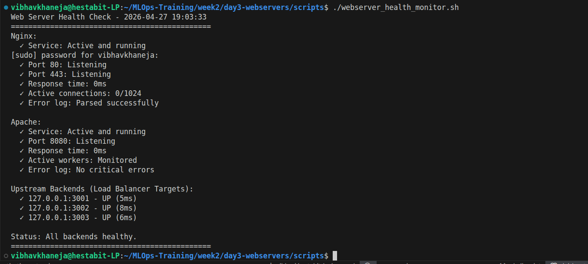
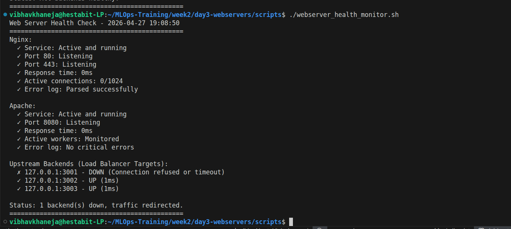

# Observability & Troubleshooting Guide

## Overview
An unmonitored server is a ticking time bomb. This document outlines the automated radar system engineered to provide a comprehensive, multi-layered health report of the entire infrastructure stack.

## Script 7: The "Triple-Check" Health Monitor
A single test is never enough to confirm server health. This script executes a rigorous three-step verification process for all systems.

**Technical Highlights & Mechanisms:**
1. **The Daemon Check (`systemctl`):** Asks the Linux system manager if the background process has crashed or is actively running.
2. **The Kernel Check (`ss`):** Queries the Linux kernel socket statistics (`ss -tulpn`) to mathematically verify that the application has successfully claimed and is listening on the expected network port.
3. **The Application Check (`curl`):** The ultimate test. The script acts as an end-user, silently executing a network request (`curl -s -o /dev/null`) and parsing the exact HTTP status code. If the code is not `200 OK`, the server is marked as degraded, regardless of what `systemctl` reports.

## Common Architecture Edge Cases
* **The "Lying" Radar:** When deploying multiple instances of lightweight file servers (like Python's `http.server`) from the exact same directory, they will all serve the identical `index.html` file. This creates a "ghost in the machine" scenario where load balancing appears to fail because the content never changes. **Solution:** Ensure test workers are isolated in their own physical directories before execution.
* **Connection Refused vs. Timeout:** A connection refused indicates the port is completely closed (the service is dead). A timeout indicates the port is open, but the application is locked in an infinite loop or paralyzed by high CPU usage.

