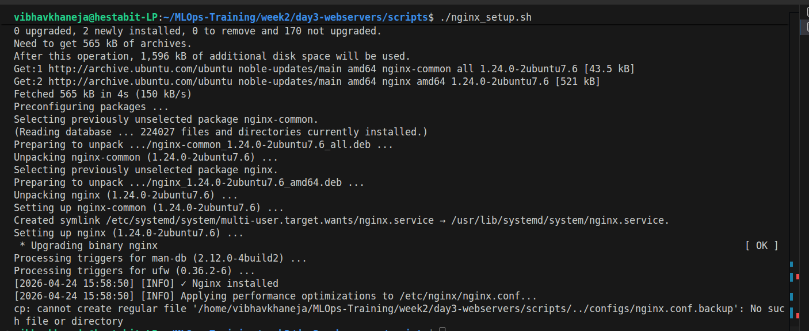
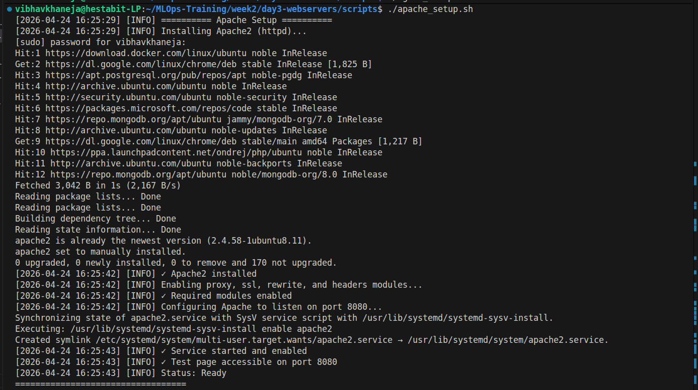
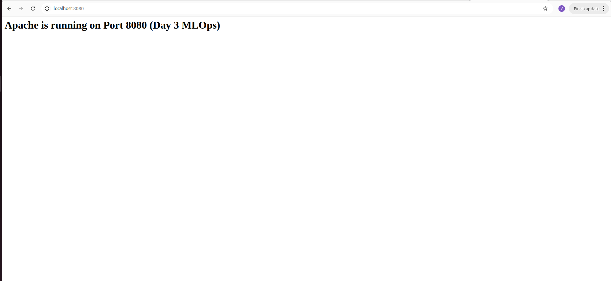

# Web Server Setup & Coexistence Guide

## Overview
A resilient infrastructure rarely relies on a single technology. This guide documents the installation and configuration of both Nginx and Apache on a single machine. The core objective is **coexistence**: strategically binding these powerful servers to different network ports so they operate in harmony rather than crashing into one another.

## Architectural Strategy
* **Nginx (The Front Door):** Installed to operate on standard Port 80 (HTTP). Nginx is optimized for asynchronous, event-driven performance, making it the perfect gateway to handle massive volumes of incoming traffic.
* **Apache (The Heavy Lifter):** Historically the backbone of the internet, Apache is essential for supporting complex routing and legacy languages (like sprawling PHP applications). To prevent conflicts with Nginx, Apache is explicitly bound to Port 8080.

## Script 1: Nginx Installation & Setup
The Nginx setup script automates the installation and creates a foundational static landing page. 

**Technical Highlights:**
* **Silent Execution:** The script utilizes flags like `-q` (quiet) for `grep` and `apt-get`, and `-s` (silent) for `curl` to suppress unnecessary terminal output, keeping the deployment logs clean and readable.
* **Log Rotation:** While not explicitly coded in our basic script, installing Nginx via the package manager automatically configures Linux log rotation, ensuring `/var/log/nginx/` does not consume the entire hard drive over time.

## Script 2: Apache Setup & Port Rebinding
Getting Apache to coexist with Nginx requires surgically modifying its core configuration files before starting the service.

**Technical Highlights:**
* **Stream Manipulation (`sed -i`):** The script uses the `sed -i` (stream editor, inline) command to instantly search the `ports.conf` file and rewrite `Listen 80` to `Listen 8080` without manual text editing.
* **VirtualHost Isolation:** The configuration utilizes `<VirtualHost *:8080>` blocks to strictly confine Apache's listening environment, ensuring Nginx retains absolute control over standard web traffic.

