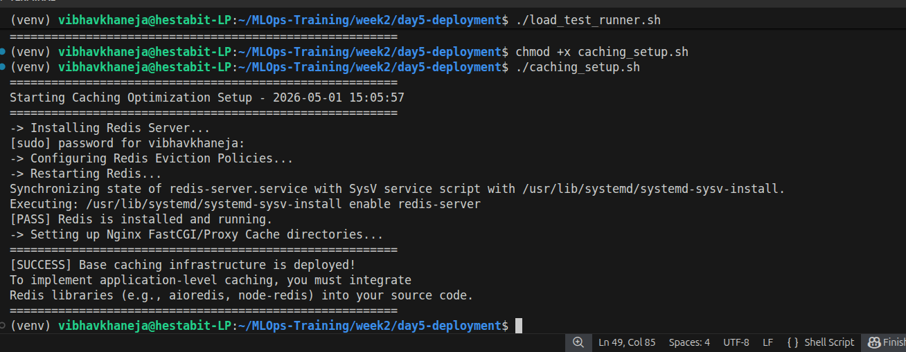

# In-Memory Caching Strategy
**Author:** Vibhav Khaneja 

## Overview
To improve response times and reduce database read-load, Redis has been integrated into the infrastructure as an in-memory caching layer.

## Redis Configuration
Redis is configured specifically as an ephemeral cache, not a persistent database.
*   **Memory Limit:** `maxmemory 256mb` (Ensures Redis does not consume all system RAM).
*   **Eviction Policy:** `maxmemory-policy allkeys-lru` 

*LRU (Least Recently Used) ensures that when the 256MB limit is reached, Redis automatically purges the oldest, least-accessed cached data to make room for new data, preventing Out-Of-Memory (OOM) crashes.*

## Implementation Areas
1.  **Application Level:** Node.js, Laravel, and FastAPI instances should utilize Redis clients to cache expensive database queries and API responses.
2.  **Web Server Level:** Nginx `proxy_cache` directories have been provisioned at `/var/cache/nginx` for future edge-caching of static frontend assets.

