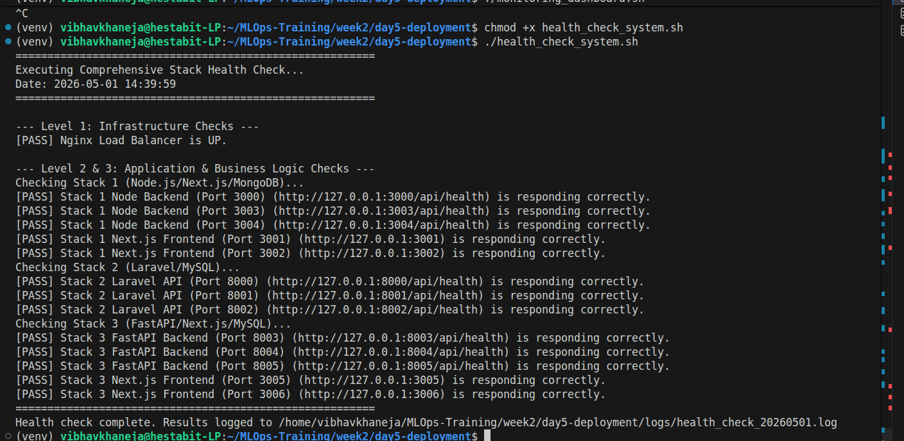
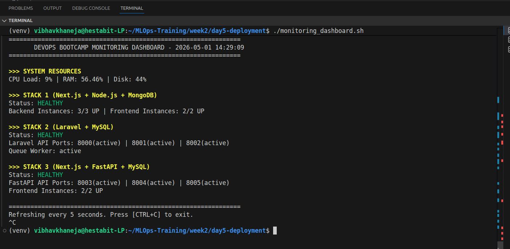
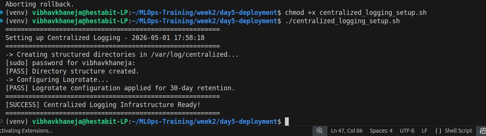

# System Monitoring & Logging Guide
**Author:** Vibhav Khaneja | **Project:** DevOps Launchpad Week 2

## Real-Time Dashboard
A custom Bash-based monitoring dashboard provides a unified view of system resources and application health across all three stacks.

**Launch Command:**
```
./scripts/monitoring_dashboard.sh
```

## Metrics Tracked:

1) **System Resources:** CPU load, RAM usage, and Disk space via top and free.
2) **PM2 Instances (Stacks 1 & 3):** Live tracking of active Node.js and Next.js frontend instances.
3) **Systemd Services (Stacks 2 & 3):** Active state of Laravel APIs, Python FastAPI backends, and queue workers.

## Centralized Logging

Logs from Nginx, PM2, and Systemd have been aggregated into a central directory to simplify debugging and auditing.
**Log Directory:** /var/log/centralized/

### Structure: Logs are categorized by stack and service (e.g., /var/log/centralized/stack1/nodejs-api/).

**Log Rotation (logrotate)**
To prevent disk exhaustion, log rotation is configured via /etc/logrotate.d/devops_centralized:
- Retention: 30 days.
- Compression: Enabled (gzip) for older logs.
- Execution: Runs daily.



