# Day 5: Full-Stack Deployment, Load Testing & Performance Optimization
**Author:** Vibhav Khaneja | **Project:** DevOps Launchpad Week 2

## The Mindset: Architecting for Production
The objective of Day 5 was a paradigm shift. We moved from application development to Site Reliability Engineering (SRE). The guiding principle for this phase was: *"You are not deploying applications. You are architecting systems that survive production."*

A production system must be highly available, fault-tolerant, performant under massive load, and capable of being updated without interrupting the user experience. This document explains the exact mechanics of how we achieved this across three distinct technology stacks.

##  The Baseline Architecture
Before implementing automation, we established the core routing and process management for three distinct ecosystems:

*   **Stack 1 (Node.js/Next.js/MongoDB):** Managed via **PM2** in cluster mode to utilize multiple CPU cores for a single-threaded runtime.

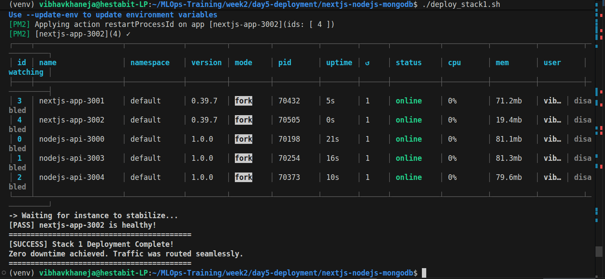
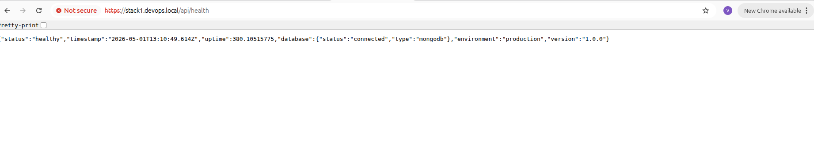
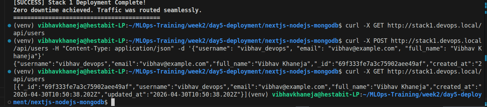

*   **Stack 2 (PHP Laravel/MySQL):** Managed via **Systemd** to handle blocking queue workers and monolithic PHP processing, backed by a MySQL Master-Slave replication setup.

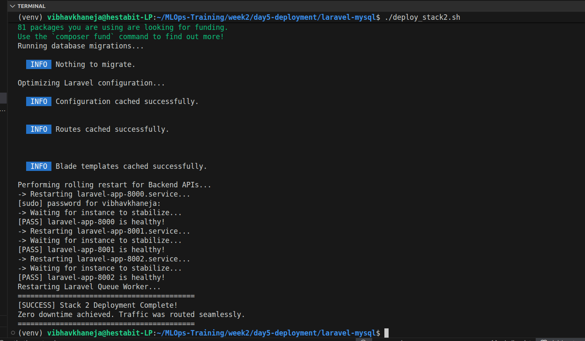
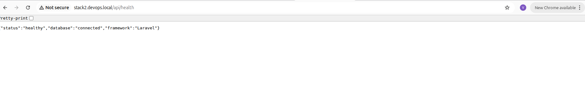
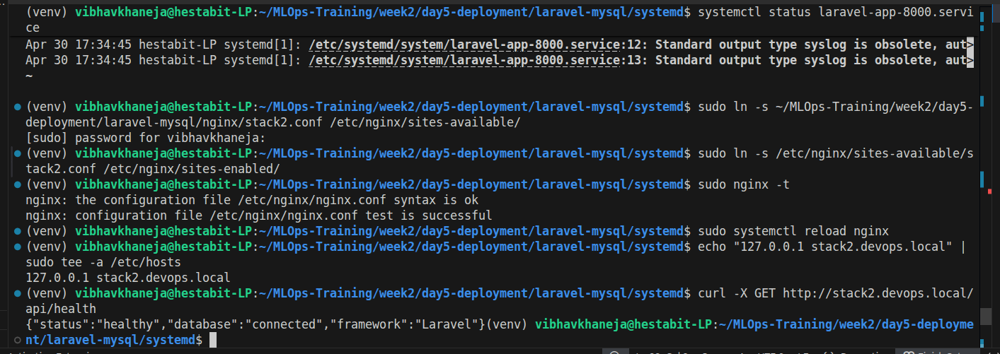

*   **Stack 3 (Python FastAPI/Next.js/MySQL):** A hybrid approach utilizing Systemd for the ASGI Python backend and PM2 for the React frontend, optimized for read-heavy database transactions.

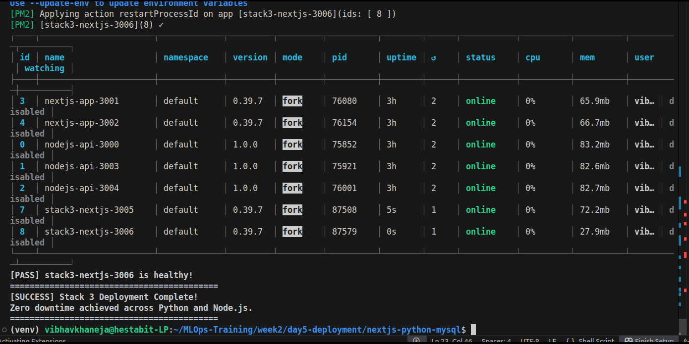
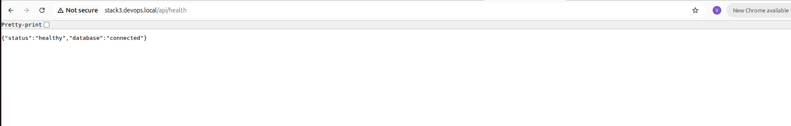

All incoming traffic is caught by an **Nginx Reverse Proxy & Load Balancer**, acting as the single point of entry and SSL terminator.

## Automation & Scripts

Instead of manually running commands, we built a suite of Bash scripts to automate the lifecycle of the servers. Here is the technical breakdown of how and why each script functions.

### 1. Automated Health Checks (`health_check_system.sh`)
*   **The Objective:** Ensure applications are actively serving traffic, preventing Nginx from routing users to "zombie" processes that are running but frozen.
*   **The Mechanics:** We utilized `curl` to probe the HTTP layer directly: 
    `curl -s -w "%{http_code}" -o /dev/null "$URL"`
    *   `-s` (silent) and `-o /dev/null` (discard output) hide the HTML body.
    *   `-w "%{http_code}"` extracts only the server's HTTP response (e.g., 200, 502).
*   **The "Why":** Checking `systemctl status` only tells you if the process is alive. Checking the HTTP status code tells you if the database connection, the business logic, and the web framework are all functioning correctly together.

### 2. Comprehensive Load Testing (`load_test_runner.sh`)
*   **The Objective:** Push the architecture to its breaking point to find bottlenecks before real users do.
*   **The Mechanics:** We automated **Apache Bench (`ab`)** to simulate massive traffic spikes:
    `ab -n 10000 -c 100 "$URL"`
    This command forces the server to handle 10,000 requests, strictly maintaining 100 concurrent connections at any given millisecond.
*   **The "Why" & Findings:** This exposed architectural differences. Stack 1 (Node.js) achieved massive throughput (>2,000 RPS) but dropped ~9% of connections under pressure due to event-loop blocking. Stack 2 (Laravel) was slower (~225 RPS) but perfectly stable. Stack 3 (FastAPI) achieved the best balance of high speed and 0% failure rate.

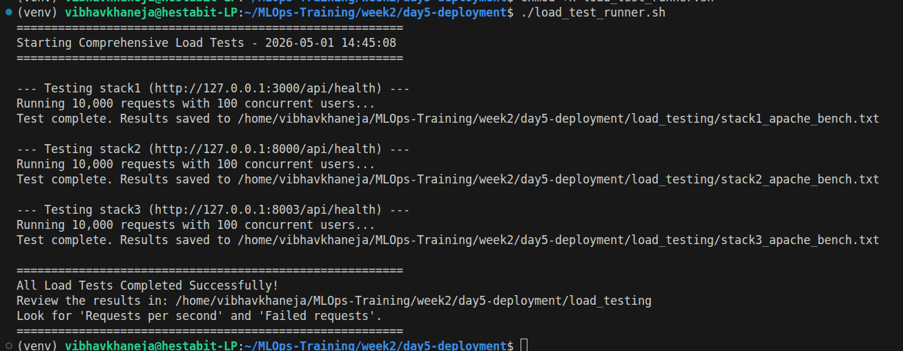

### 3. Caching Optimization (`caching_setup.sh`)
*   **The Objective:** Protect the databases from crashing under read-heavy loads by absorbing repeated queries in RAM.
*   **The Mechanics:** We installed **Redis** and dynamically edited its config using `sed`:
    `sed -i 's/# maxmemory-policy noeviction/maxmemory-policy allkeys-lru/' /etc/redis/redis.conf`
*   **The "Why":** By enforcing a strict memory limit (256MB) and the **LRU (Least Recently Used)** policy, Redis acts purely as a cache, not a database. If it runs out of RAM, it quietly deletes the oldest, least-accessed data instead of crashing the server with an Out-Of-Memory (OOM) error.

### 4. Zero-Downtime Deployment: Blue-Green (`zero_downtime_deploy.sh`)
*   **The Objective:** Release new code without a single user experiencing a dropped connection or a maintenance page.
*   **The Mechanics:** This script orchestrates a flawless handoff:
    1.  **State Detection:** Uses `grep` to read the active Nginx config and determine if the "Blue" or "Green" ports are currently live.
    2.  **Background Boot:** Uses PM2 to start the inactive instances invisibly.
    3.  **Gatekeeping:** Runs the `curl` health check loop against the new instances. If they fail, the script aborts, leaving the live environment untouched.
    4.  **Traffic Cutover:** Uses `sed` to rewrite the `proxy_pass` upstream in Nginx from `app_blue` to `app_green`.
    5.  **Graceful Reload:** Executes `systemctl reload nginx` (not `restart`). Nginx finishes serving current users on Blue, routes all new users to Green, and we safely spin down the Blue instances.
*   **The "Why":** This is the industry standard for high-availability deployments. It completely removes the risk associated with updating live software.

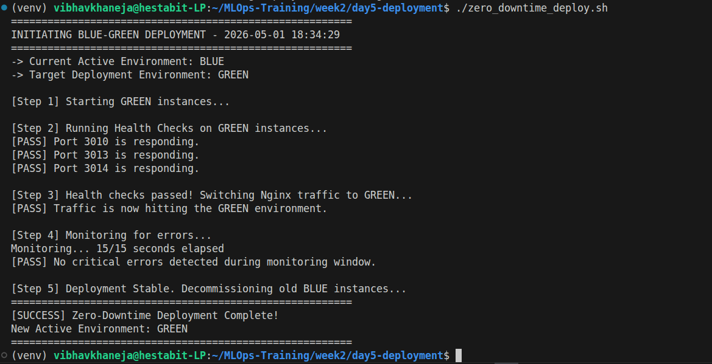

### 5. Universal Rollback (`rollback.sh`)
*   **The Objective:** Provide an emergency "undo" button to recover from catastrophic application failures or bad database migrations in seconds.
*   **The Mechanics:** The script uses dynamic array parsing in Bash:
    `BACKUP_DIRS=($(ls -d ${BACKUP_BASE_DIR}/${STACK_NAME}-backup-*))`
    Instead of hardcoding paths, it scans the disk for timestamped backup folders, generates an interactive menu, halts the live processes, copies the old stable files back into `/var/www/`, and restarts the process managers.
*   **The "Why":** Mean Time To Recovery (MTTR) is a critical SRE metric. Manual rollbacks take minutes and are prone to human error; automated rollbacks take seconds and are precise.

### 6. Centralized Logging (`centralized_logging_setup.sh`)
*   **The Objective:** Create a single source of truth for debugging while preventing logs from consuming all server disk space.
*   **The Mechanics:** Creates structured directories for all stacks in `/var/log/centralized/` and deploys a `logrotate` configuration.
*   **The "Why":** The OS automatically reads the logrotate file to enforce a 30-day retention policy, zipping old logs to save space and automatically deleting anything older than a month.

### 7. Real-Time Dashboard (`monitoring_dashboard.sh`)
*   **The Objective:** Provide a unified view of the entire system's health.
*   **The Mechanics:** An infinite `while true` loop utilizing Linux system commands (`top`, `free`, `df`) combined with process manager queries (`pm2 list | grep -c "online"`, `systemctl is-active`). It uses `sleep 5` and terminal clearing to create a live, refreshing UI.
*   **The "Why":** Immediate observability. During load tests or deployments, tracking resource spikes and instance counts visually confirms that auto-recovery and load balancing are functioning properly.

### 8. Performance Tuning (`performance_optimizer.sh`)
*   **The Objective:** Remove artificial operating system limits that throttle high-traffic web servers.
*   **The Mechanics:** Edits the Linux kernel parameters via `/etc/sysctl.d/`:
    *   `fs.file-max = 1000000`: Increases the total number of files/sockets the OS can open.
    *   `net.ipv4.ip_local_port_range`: Expands the available ports for reverse-proxying.
    *   `worker_connections 4096`: Instructs Nginx to handle significantly more simultaneous connections per CPU core.
*   **The "Why":** Default Linux configurations are optimized for desktop use, not enterprise load balancing. Tuning the kernel prevents "Too many open files" errors during extreme traffic spikes.

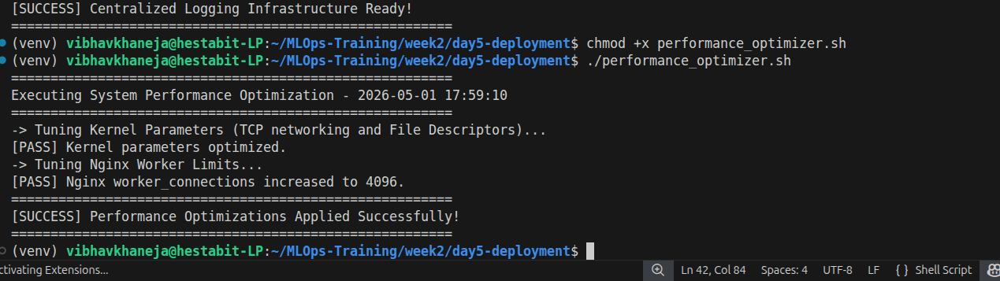

##  Conclusion
By the end of Day 5, the infrastructure transitioned from a collection of applications to a hardened, enterprise-ready architecture. It is resilient against traffic spikes, protected against deployment failures via Blue-Green and automated rollbacks, and deeply observable through centralized logging and real-time monitoring.