# Week 3 - Day 1 Docker Bootcamp

## Overview

This day was focused on understanding Docker practically by building, containerizing, optimizing, and managing multiple types of applications.

Instead of only learning commands, the goal was to understand:
- how containers actually work
- how images are built
- why optimization matters
- how production-ready Docker setups are designed

We worked with:
- Node.js applications
- FastAPI applications
- React + Nginx deployment
- Multi-stage Docker builds
- Container lifecycle management

This day felt much closer to real DevOps and production engineering compared to earlier exercises because every small issue forced deeper understanding of Docker internals.

## Exercise 1 — Docker Installation Verification

We first verified the Docker setup already available on the system instead of reinstalling everything unnecessarily.

Commands used:

```
docker info
docker images
docker network ls
docker volume ls
```

### Learning

This exercise helped in understanding that Docker is not just about containers.

Docker internally manages:
- images
- networks
- volumes
- container layers
- storage drivers

One important realization was that previous work from older exercises still existed in the system and Docker maintains all those resources unless explicitly removed.

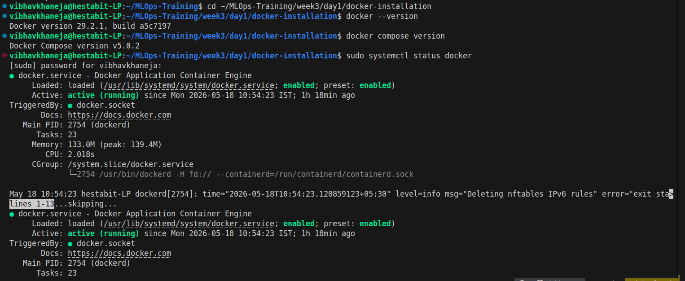
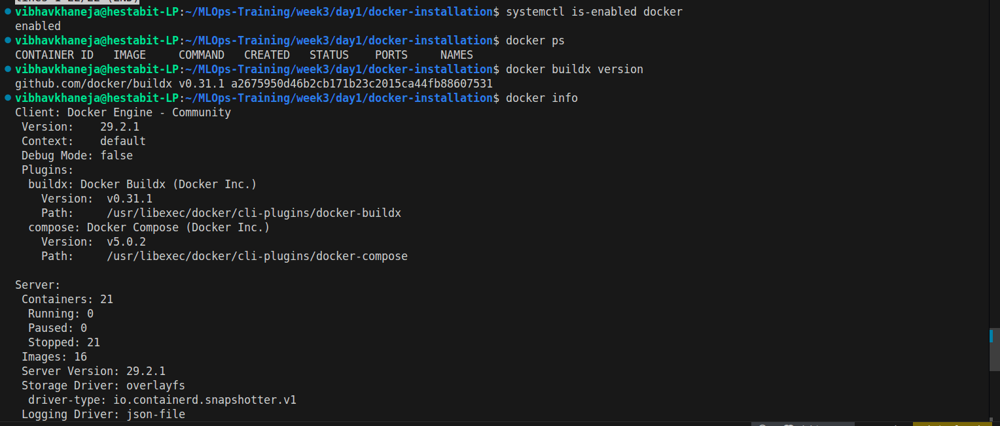
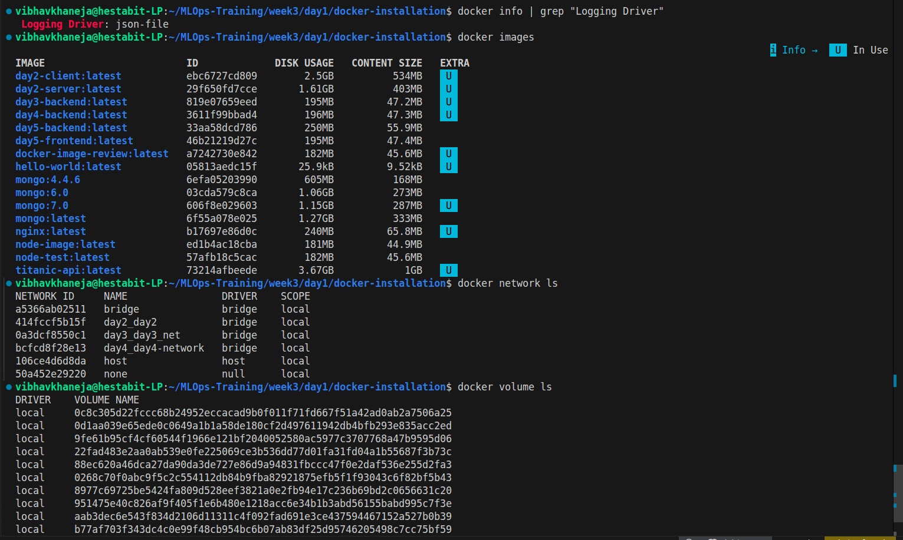

## Exercise 2 — Basic Node.js Dockerfile

We created a simple Dockerfile for a Node.js application.

Main concepts covered:
- selecting a base image
- setting working directory
- copying files
- installing dependencies
- exposing ports
- starting application using CMD

### Learning

Initially Dockerfiles looked very linear, but this exercise showed how every line creates a separate image layer.

We also understood why Docker layer caching is important. Separating dependency installation from source code copying improves rebuild speed significantly.

Example:

```
COPY package*.json ./
RUN npm install
```
This prevents reinstalling dependencies every time source code changes.

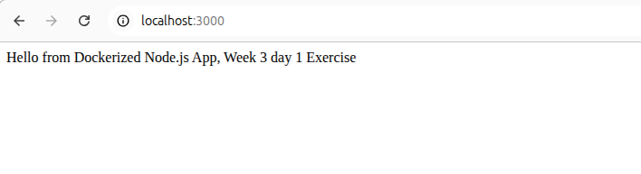
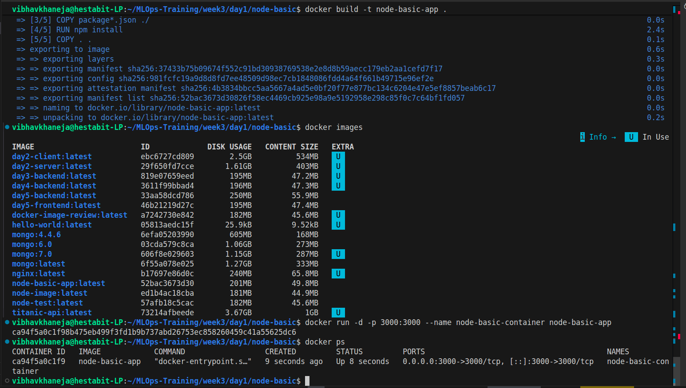
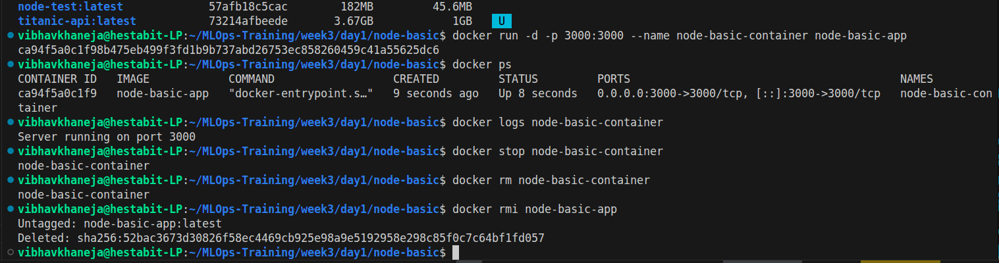
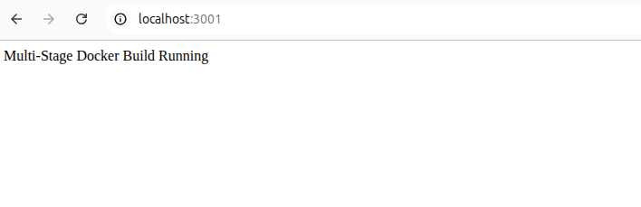
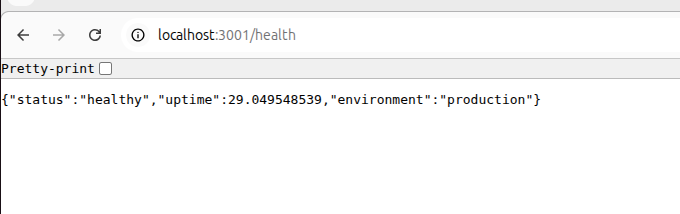

## Exercise 3 — Multi-Stage Node.js Build

This was the first introduction to production-style optimization.

Instead of using a single Docker image for everything, we separated:
1. build environment
2. runtime environment

### Learning

This exercise introduced one of the most important Docker concepts:

1) multi-stage builds

The runtime container should only contain what is required to run the application.

Even though our sample application was small and the image reduction was minor:

```
201MB → 198MB
```
the architectural understanding was extremely valuable.

In large real-world applications, this optimization becomes massive.

We also understood:
1. smaller images deploy faster
2. smaller images improve security
3. unnecessary tooling should never exist in production containers

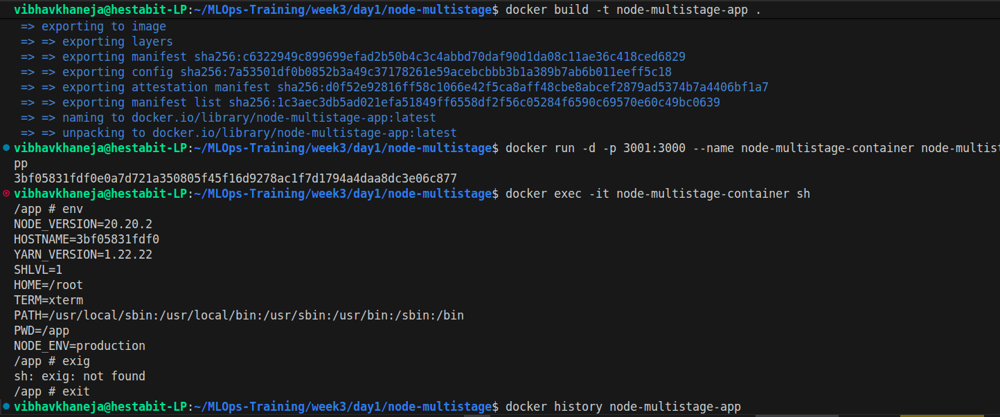
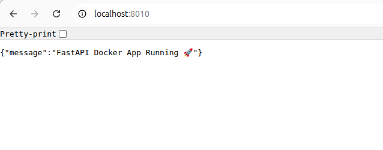
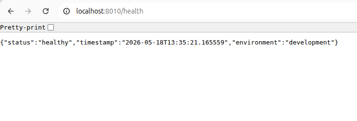

## Exercise 4 — FastAPI Production Container

We containerized a Python FastAPI application using a production-focused Dockerfile.

Technologies used:
* FastAPI
* Uvicorn
* Python slim image

### Learning

This exercise taught multiple production practices together.

We used:
- `python:3.11-slim`
- `.dockerignore`
- `pip --no-cache-dir`
- non-root container user

One major learning was security hardening.

Instead of running as root:

```
USER appuser
```

was used.

This small change is considered extremely important in production environments because containers should never run with unnecessary privileges.

We also encountered port conflicts during this exercise, which helped understand host-to-container port mapping much more clearly.

Example:

```
docker run -p 8010:8000
```

meaning:
- host machine → 8010
- container → 8000

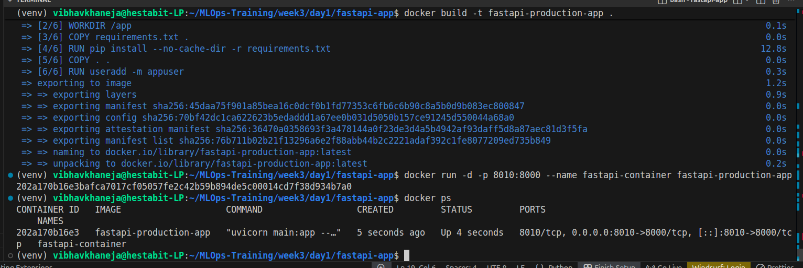
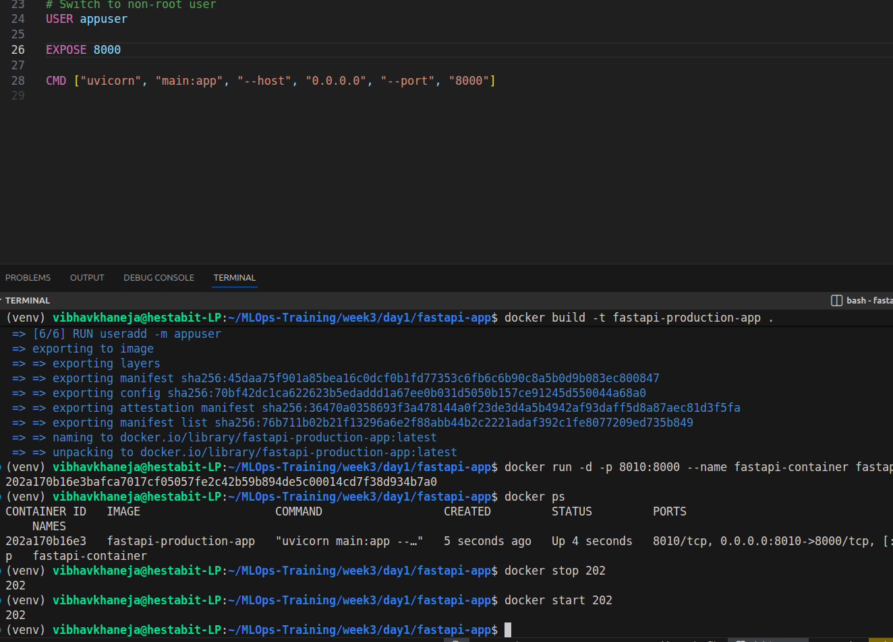
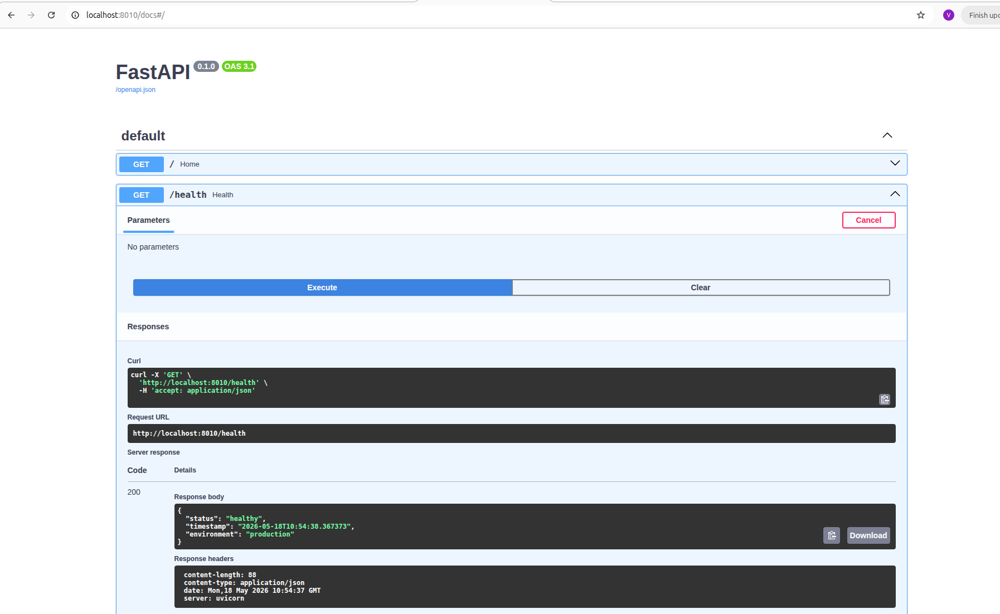

## Exercise 5 — React + Nginx Multi-Stage Deployment

This was one of the most interesting exercises of the day.

We first built the React application using Node.js and then served the final static files using Nginx.

The architecture was divided into:
- builder stage
- runtime stage

### Learning

This exercise clearly demonstrated the true power of multi-stage builds.

The final image size became:

```
93MB
```

because the production image only contained:
- Nginx
- compiled static files

and excluded:
- source code
- node_modules
- npm
- development dependencies

This was probably the cleanest and most production-like setup created during the day.

We also faced:
- Node version compatibility issues
- port conflicts
- container naming conflicts

and solved them practically.

Those debugging moments made Docker behavior much easier to understand compared to theoretical explanations.

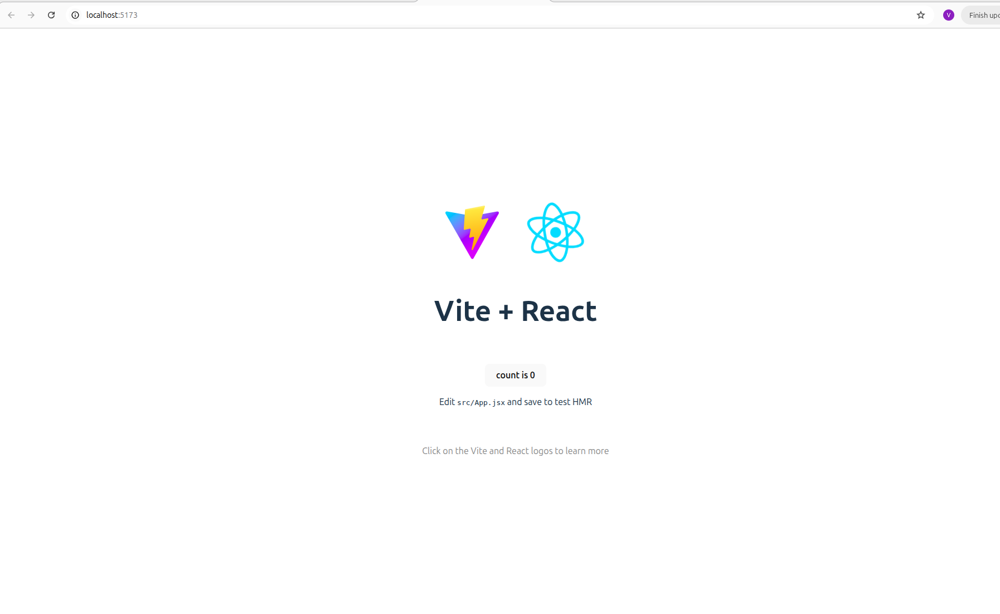
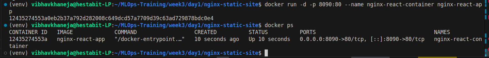
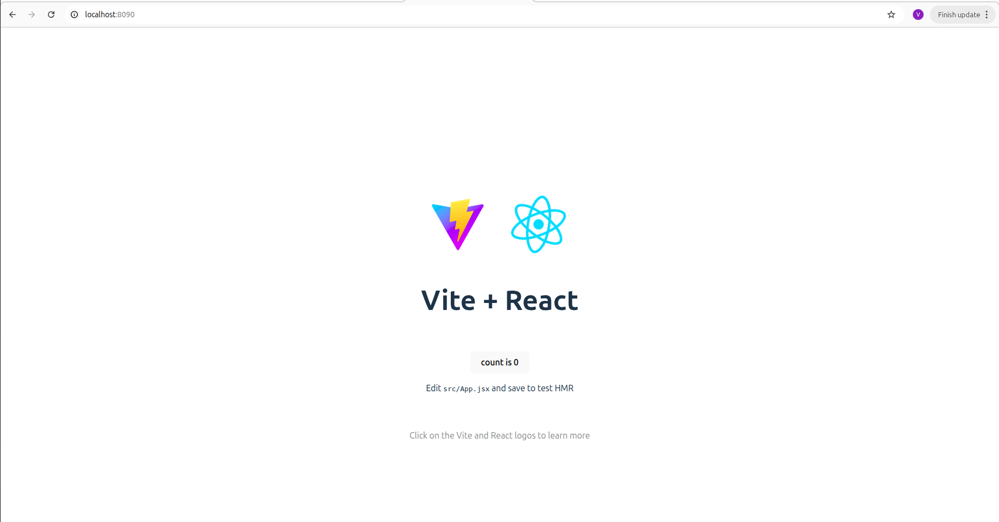
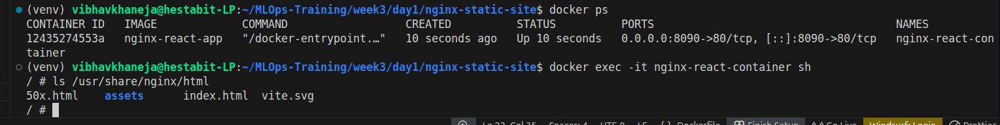

## Exercise 6 — Container Management Practice

This section focused entirely on working with running containers.

Commands practiced:

```
docker ps
docker ps -a
docker logs
docker exec
docker inspect
docker stop
docker start
docker restart
docker rm
```

### Learning

This exercise made Docker feel much more operational.

A very important concept learned was the difference between:

```
docker ps
```

and

```
docker ps -a
```

where:
- `docker ps` shows only running containers
- `docker ps -a` shows all containers including exited and created ones

We also understood container lifecycle states:
- Created
- Running
- Exited
- Removed

Another useful learning was that container names remain reserved even if container startup fails, unless explicitly removed.

## Image Size Comparison Summary

| Image | Size |
|---|---|
| node-basic-app | 201MB |
| node-multistage-app | 198MB |
| fastapi-production-app | 209MB |
| nginx-react-app | 93MB |

### Key Observation

The React + Nginx setup was the most optimized because it separated build and runtime responsibilities very cleanly.


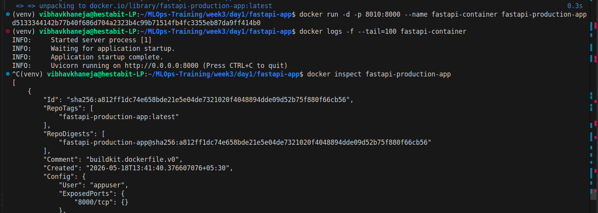
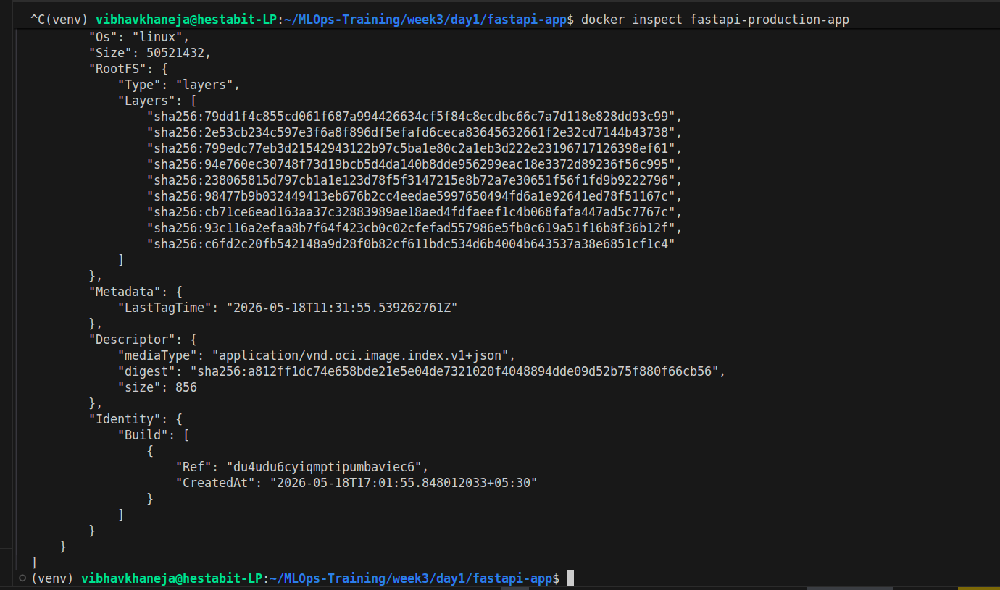
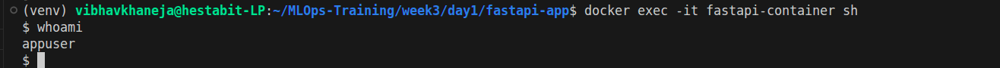

## Major Concepts Learned Throughout the Day

### 1. Docker Layers

Every Dockerfile instruction creates a layer. Proper layer ordering improves caching and rebuild speed.

### 2. Multi-Stage Builds

Probably the most important learning of the day.

Multi-stage builds help:
- reduce image size
- improve security
- separate build/runtime concerns
- create production-ready containers

### 3. Port Mapping

Understanding:

```
host_port:container_port
```

helped clear confusion around Docker networking.

### 4. Non-Root Containers

- Security best practice learned during FastAPI setup.
- Production containers should avoid running as root whenever possible.

### 5. Docker Debugging

The day involved multiple real-world issues:
- address already in use
- Node version mismatch
- container conflicts
- exited containers
- failed bindings

Solving these practically helped build confidence with Docker troubleshooting.

## Final Reflection

This day moved beyond simply running containers.

The exercises helped build understanding around:
- production deployment
- optimization
- container security
- runtime isolation
- debugging workflows
- image efficiency

The biggest takeaway was that Docker is not only about packaging applications.

It is about creating:
- reproducible environments
- portable deployments
- efficient infrastructure
- production-ready systems

This was one of the first days where DevOps concepts started feeling practical instead of theoretical.
