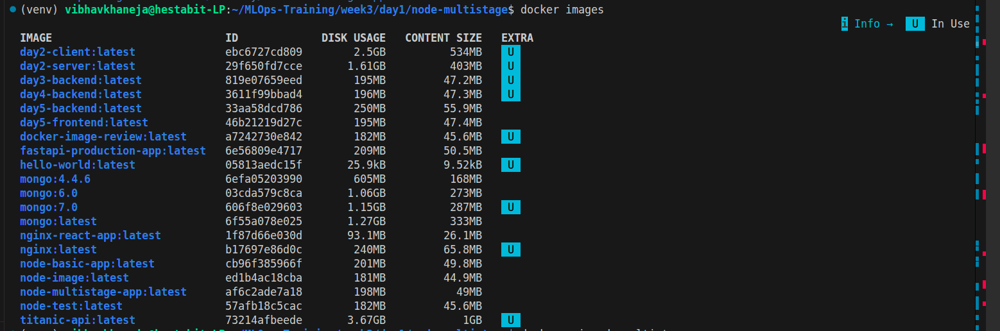

# Image Size Comparison Report — Week 3 Day 1

## Objective

The objective of this exercise was to understand Docker image optimization using:
- Multi-stage builds
- Slim base images
- Runtime-only containers
- Production-focused Docker practices



## 1. Node.js Application Comparison

| Image | Size |
|---|---|
| node-basic-app | 201MB |
| node-multistage-app | 198MB |

### Observation
The multi-stage build slightly reduced the image size:

```text
201MB → 198MB
```

### Key Learning
Although the reduction was small due to the lightweight application, the multi-stage build improved:
- runtime cleanliness
- security
- production isolation


## 2. FastAPI Production Image

| Image | Size |
|---|---|
| fastapi-production-app | 209MB |

### Optimizations Used
- `python:3.11-slim`
- `pip --no-cache-dir`
- `.dockerignore`
- non-root user
- dependency layer caching

### Key Learning
Using slim images and non-root execution improves:
- security
- efficiency
- production readiness

## 3. React + Nginx Multi-Stage Image

| Image | Size |
|---|---|
| nginx-react-app | 93MB |

### Observation
This was the most optimized image created during the exercise.

### Reason
The final image contained only:
- Nginx server
- compiled React static files

Excluded:
- source code
- node_modules
- npm/build tools

### Key Learning
Multi-stage builds significantly reduce frontend deployment size.

## 4. Base Image Comparison

| Image | Size |
|---|---|
| nginx:latest | 240MB |
| mongo:7.0 | 1.15GB |
| titanic-api | 3.67GB |

### Observation
Container size heavily depends on:
- base image
- dependencies
- included runtime tools
- application complexity

## 5. Major Learnings

- Multi-stage builds reduce runtime image size
- Slim/alpine images improve efficiency
- `.dockerignore` reduces build context
- Runtime-only containers improve security
- Non-root users are a production best practice
- Frontend static serving with Nginx is highly optimized


## Conclusion

This exercise demonstrated how Docker optimization techniques improve:
- image efficiency
- deployment speed
- runtime security
- maintainability

The most effective optimization observed was the React + Nginx multi-stage deployment, which produced the smallest and cleanest production image.
