# Week 3 - Day 3 Docker Bootcamp

## Overview

Day 3 focused on Docker networking and persistent storage management.

Day 1 taught how containers work individually.  
Day 2 taught how multiple containers work together.  
Day 3 taught how containers communicate securely, how data persists beyond container lifecycles, and how infrastructure engineers design production-grade container networking architectures.

The major shift today was understanding that containers are not just isolated processes — they are distributed systems components that require:
- secure communication
- network segmentation
- persistent storage
- controlled data sharing
- operational backup strategies
- runtime isolation

We worked with:
- Custom bridge networks
- Internal-only networks
- Multi-network container architectures
- Named volumes and bind mounts
- tmpfs memory-backed storage
- Docker DNS and service discovery
- Overlay networking with Docker Swarm
- Volume backup automation
- Shared volume communication patterns
- Network troubleshooting and debugging

This day felt like the transition from application-level Docker usage into infrastructure engineering and platform operations.

---

# Exercise 1 — Custom Networks for Application Tiers

We created isolated Docker networks for:
- frontend services
- backend APIs
- database services

The architecture implemented:
- frontend-network
- backend-network
- database-network

The goal was to enforce strict communication boundaries between services.

## Learning

This exercise introduced one of the most important production architecture concepts:

```text
Network segmentation
```

Not every service should communicate with every other service.

The frontend container could communicate with the API container:

```bash
docker exec frontend ping -c 2 api
```

But it could NOT directly access the database container:

```bash
docker exec frontend ping -c 2 postgres
```

This failed intentionally.

The API container acted as the only bridge between frontend and database layers.

This architecture mirrors real production systems:
- frontend tier
- application tier
- data tier

Each tier has controlled access boundaries.

We also learned that Docker containers can connect to multiple networks simultaneously:

```bash
docker network connect frontend-network api
docker network connect database-network api
```

This allowed the API container to communicate with both layers while keeping the frontend isolated from the database.

Another major learning was Docker DNS.

Containers do not need static IP addresses. Docker automatically resolves container names to IPs internally.

So:

```text
postgres
```

became a resolvable hostname inside the network automatically.

This is how service discovery works in real containerized systems.

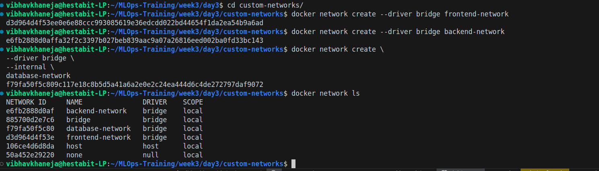
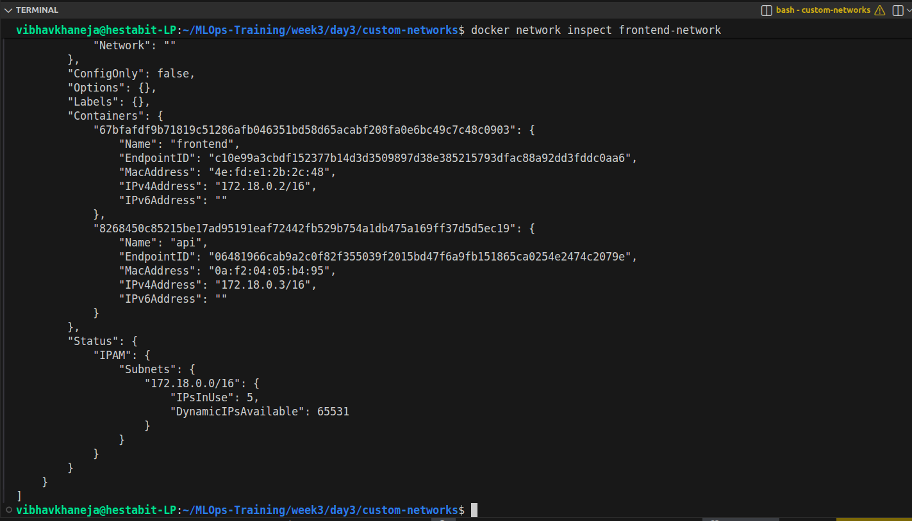

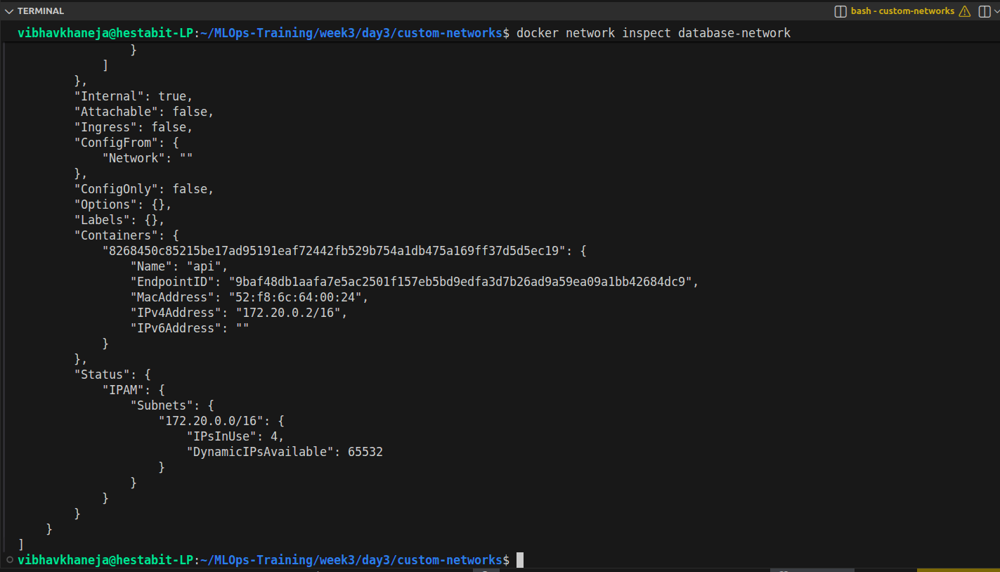
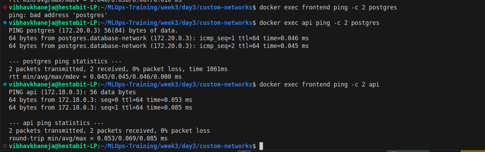

---

# Exercise 2 — Network Isolation with Docker Compose

We implemented the same isolation architecture using Docker Compose.

The setup included:
- frontend-net
- backend-net
- db-net

with internal isolation rules defined directly inside `docker-compose.yml`.

## Learning

This exercise demonstrated that networking becomes dramatically easier when managed declaratively through Compose.

The most important configuration was:

```yaml
internal: true
```

on the database network:

```yaml
db-net:
  driver: bridge
  internal: true
```

This prevented external access to the database network entirely.

The frontend container was attached only to:
- frontend-net
- backend-net

while the database remained isolated on:
- db-net

This created a secure multi-tier architecture entirely through Docker networking.

We also learned how Compose automatically prefixes network names using the project directory:

```text
compose-isolation_backend-net
compose-isolation_db-net
```

rather than the raw names defined in YAML.

This explained why direct inspection commands initially failed until we used the actual generated network names.

Another key realization was that Docker Compose is effectively an infrastructure-as-code system for local environments.

Instead of manually creating networks and connecting containers, the entire topology was reproducible through one file.

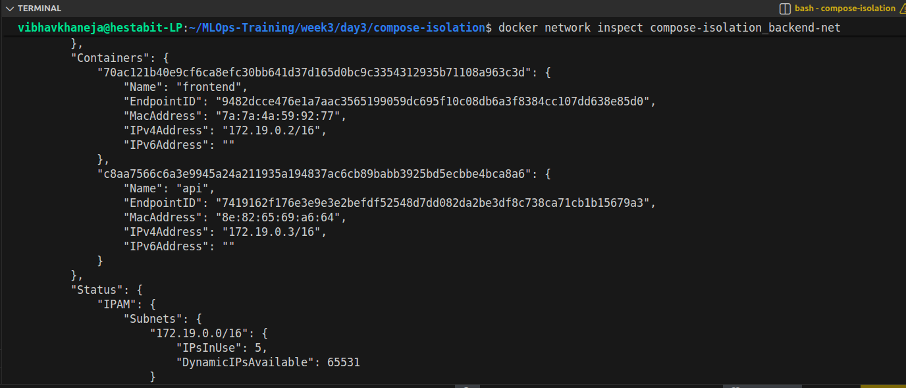
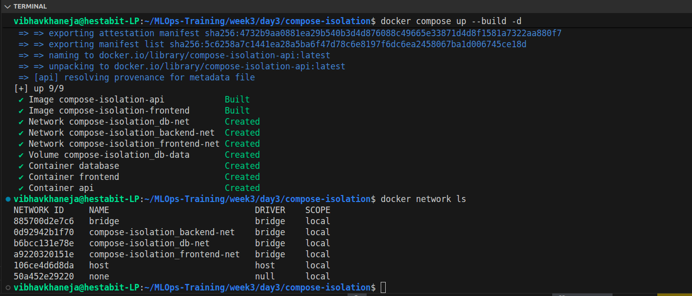
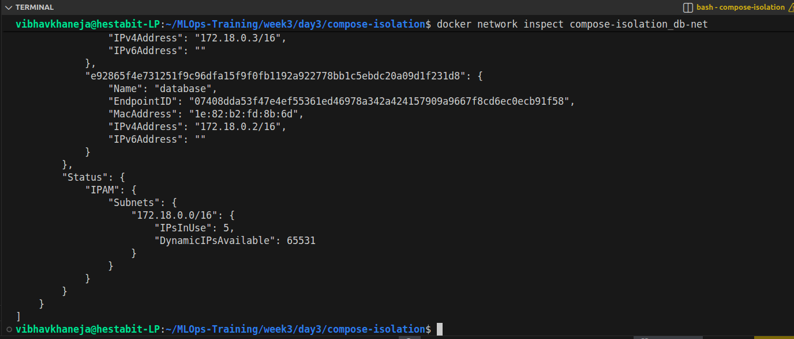
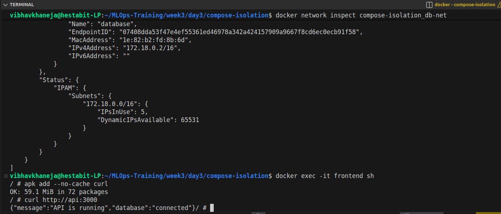
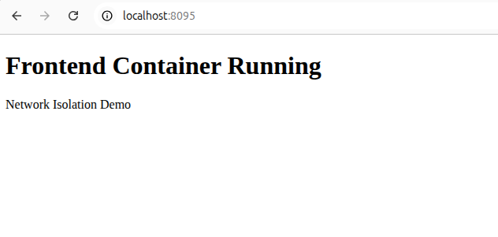
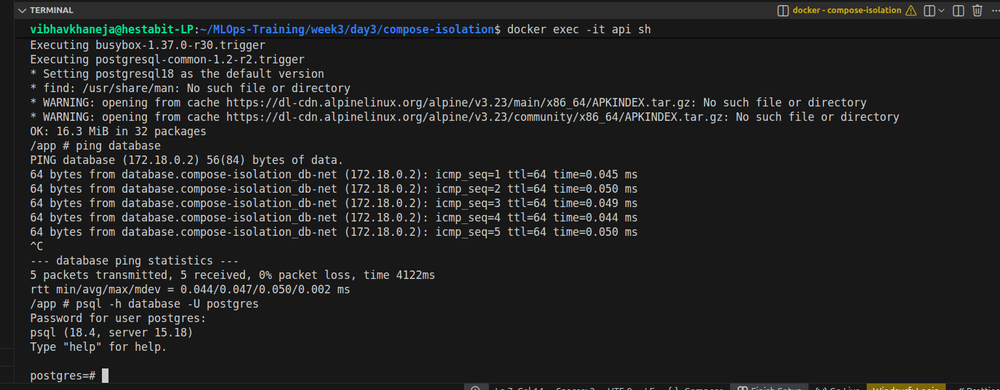

---

# Exercise 3 — Named Volumes for Database Persistence

We implemented named volumes for persistent database storage using:
- PostgreSQL
- MySQL
- MongoDB

The goal was to verify that data survives container deletion.

## Learning

This exercise introduced the critical distinction between:
- containers
- data

Containers are ephemeral.

Volumes are persistent.

Without a volume:

```text
Container removed = data lost
```

With a named volume:

```text
Container removed ≠ data lost
```

We created named volumes:

```bash
docker volume create postgres-data
docker volume create mysql-data
docker volume create mongo-data
```

and mounted them into database containers:

```bash
-v postgres-data:/var/lib/postgresql/data
```

The most important realization was that databases inside containers are useless without persistent volumes.

Removing the PostgreSQL container:

```bash
docker rm -f postgres
```

did NOT remove the volume.

Recreating the container with the same volume restored the database automatically.

We also explored:
- volume lifecycle management
- volume cleanup
- dangling volumes
- anonymous volumes

and learned the difference between:
- named volumes
- anonymous volumes

Another important operational lesson came from port conflicts:

```text
bind: address already in use
```

This demonstrated that containers cannot share the same host port simultaneously.

We also learned how to:
- backup volume data
- compress backups
- restore volume archives

using temporary Alpine containers and `tar`.

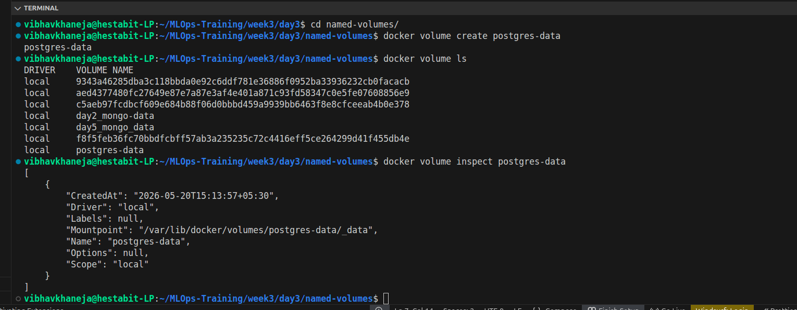
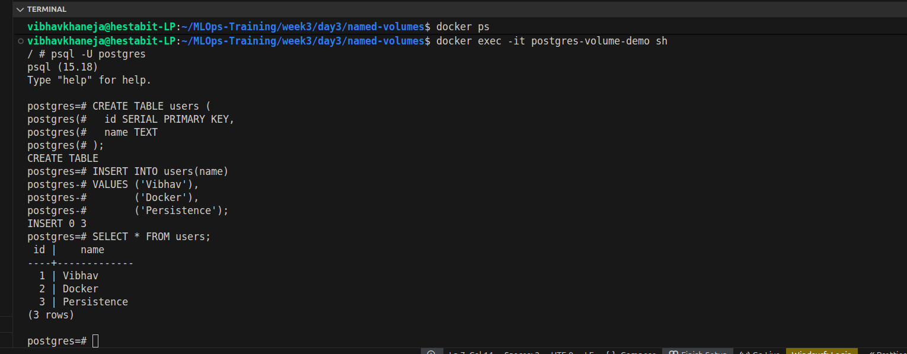
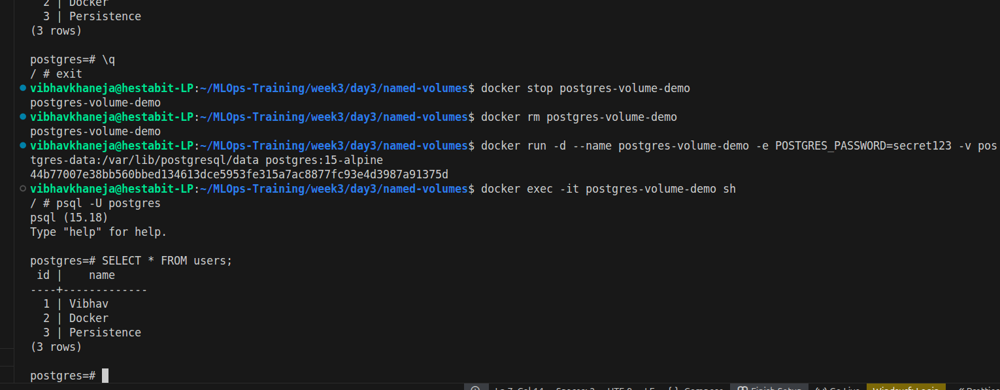

---

# Exercise 4 — Bind Mounts for Development

We configured bind mounts for:
- live source code synchronization
- hot reload workflows
- development environments

using Node.js and Nodemon.

## Learning

This exercise introduced the difference between:
- development containers
- production containers

Production containers prioritize:
- immutability
- optimized builds
- isolation

Development containers prioritize:
- rapid iteration
- live sync
- hot reload

Bind mounts allowed the host filesystem to directly appear inside the container:

```bash
-v $(pwd):/app
```

This enabled code changes on the host to instantly reflect inside the container.

The biggest issue encountered was:

```text
node_modules overwrite problem
```

The bind mount replaced container-installed dependencies with the host filesystem contents.

This demonstrated why many Node.js Docker setups use:

```yaml
- /app/node_modules
```

as a separate volume.

We also encountered one of the most realistic Linux + Docker development issues:

```text
EACCES permission denied
```

because the container created files as `root`, which the host user could not modify.

This was an extremely valuable operational lesson because permission problems are among the most common Docker development issues on Linux systems.

We ultimately rebuilt the setup cleanly using:
- local dependency installation
- bind mounts
- Nodemon-based hot reload

This created a real production-style developer workflow.

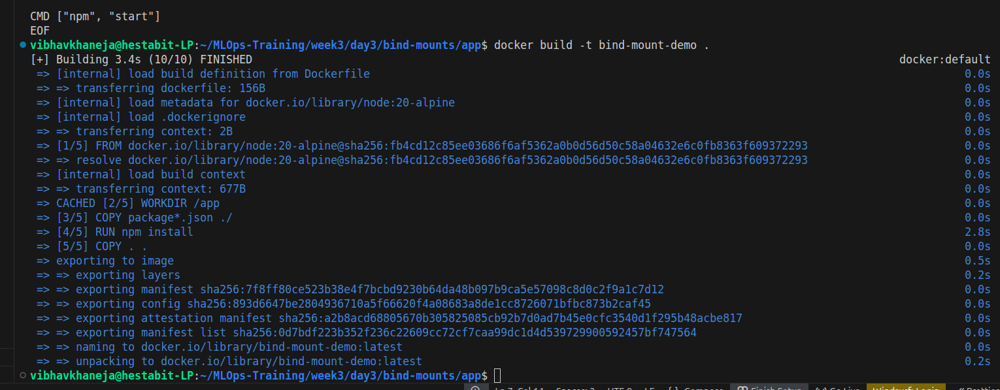
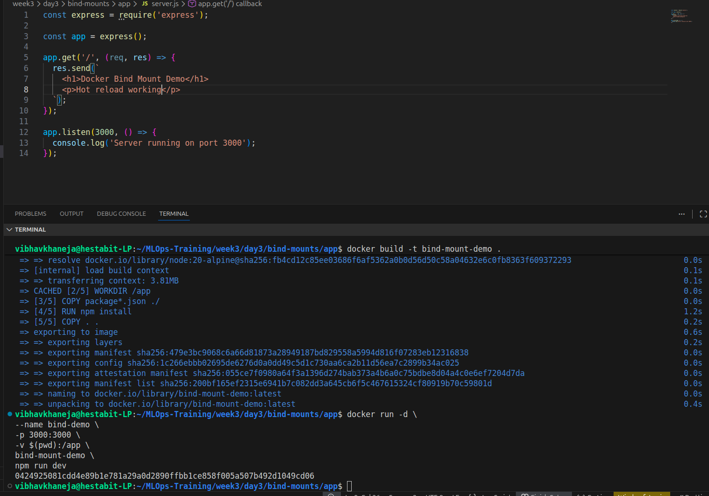
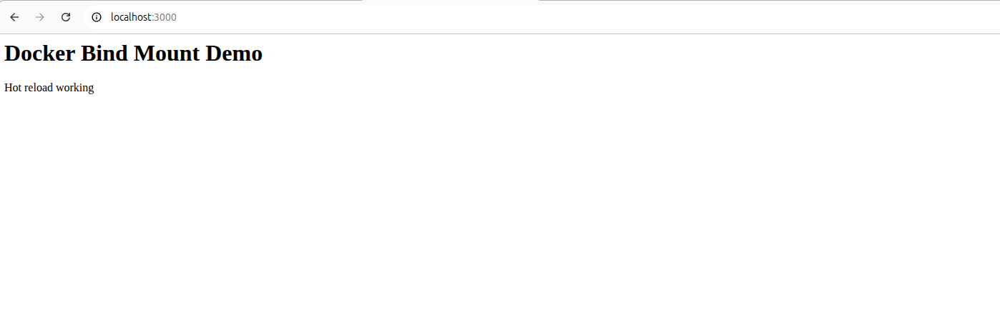

---

# Exercise 5 — tmpfs Mounts for Sensitive Data

We implemented memory-backed storage using tmpfs mounts.

The goal was to understand:
- ephemeral storage
- sensitive runtime data
- RAM-based filesystems

## Learning

tmpfs mounts store data in:
- memory
NOT
- disk

We created mounts like:

```bash
--tmpfs /run/secrets:size=10m
```

This created:
- temporary storage
- non-persistent runtime data
- memory-only filesystems

The most important realization was:

```text
Container restart = tmpfs data disappears
```

This behavior makes tmpfs ideal for:
- secrets
- tokens
- temporary credentials
- cryptographic operations
- high-speed caches

We verified:
- tmpfs mount existence
- RAM allocation
- automatic data disappearance after restart

using:
- `mount`
- `df -h`
- `docker inspect`

We also learned that tmpfs maps conceptually to Kubernetes:

```text
emptyDir(memory)
```

which is heavily used in cloud-native infrastructure.

Another key learning was security.

Because tmpfs never writes data to disk:
- forensic recovery becomes harder
- sensitive data exposure decreases

This is a major production security advantage.

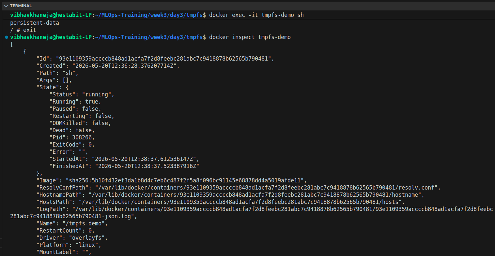

---

# Exercise 6 — Network Troubleshooting & Debugging

We practiced production-style network debugging using:
- ping
- curl
- nslookup
- nc
- ip addr
- ip route
- docker inspect

## Learning

This exercise introduced real infrastructure troubleshooting workflows.

We learned the difference between:
- connectivity
- service availability

`ping` only proves:
- network reachability

It does NOT prove:
- application availability

For that we used:

```bash
curl
```

and:

```bash
nc -zv
```

to verify actual open ports and services.

Docker DNS resolution was tested using:

```bash
nslookup debug-api
```

which demonstrated Docker's built-in service discovery.

We also explored Linux networking inside containers:
- interfaces
- routing tables
- gateways
- namespaces

using:

```bash
ip addr
ip route
```

This exercise simulated real production outage debugging:
- dead services
- wrong ports
- DNS failures
- broken connectivity

One major realization was that most infrastructure failures are not application bugs — they are networking problems.

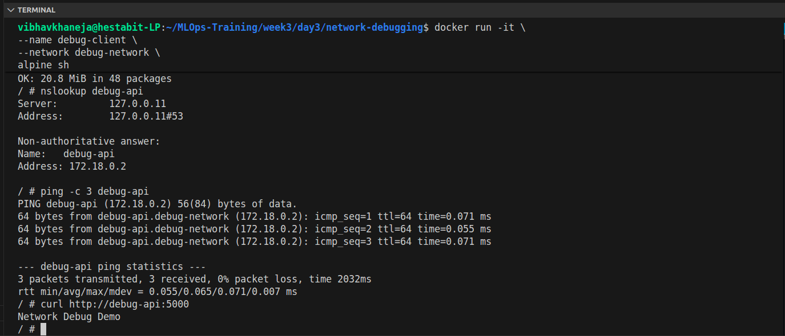
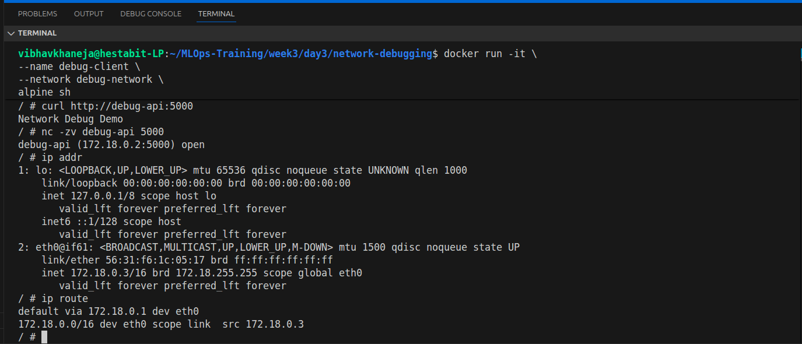

---

# Exercise 7 — Overlay Networks & Docker Swarm

We explored distributed container networking using:
- Docker Swarm
- overlay networks
- swarm services
- service scaling

## Learning

This exercise introduced the transition from:
- single-host networking
to:
- distributed orchestration

Bridge networks only work on one Docker host.

Overlay networks allow containers to communicate across multiple machines.

We initialized Docker Swarm:

```bash
docker swarm init
```

and created an overlay network:

```bash
docker network create --driver overlay overlay-demo
```

The biggest architectural shift was understanding that in Swarm:

```text
You manage services, not containers.
```

We deployed services:

```bash
docker service create
```

instead of manually running containers.

Swarm automatically handled:
- scheduling
- networking
- service discovery
- scaling
- self-healing

We scaled services dynamically:

```bash
docker service scale web1=3
```

and observed multiple replicas being created automatically.

Another extremely important learning was built-in service discovery.

Swarm DNS resolves:
- service names
NOT
- container names

This is foundational to Kubernetes and distributed systems architecture.

We also observed:
- internal load balancing
- automatic recovery after failure
- desired-state orchestration

which are all core orchestration concepts.

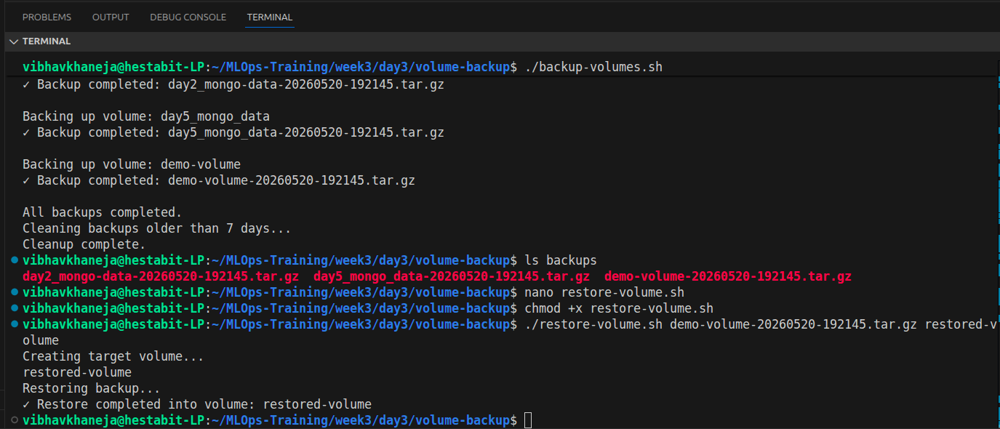

---

# Exercise 8 — Volume Backup Automation & Shared Volumes

This final section focused on operational storage workflows:
- automated backups
- restoration
- shared inter-container storage

## Learning

### Volume Backup Automation

We created:
- `backup-volumes.sh`
- `restore-volume.sh`

to automate:
- compressed backups
- timestamp management
- disaster recovery workflows

The backup process mounted:
- source volume
- backup destination

into a temporary Alpine container and compressed the data using `tar`.

Example:

```bash
tar czf volume-backup.tar.gz
```

This demonstrated how infrastructure teams implement:
- backup pipelines
- disaster recovery
- retention strategies

We also implemented automatic cleanup of old backups:

```bash
find backups -mtime +7 -delete
```

which mirrors real production retention policies.

### Shared Volumes Between Containers

We implemented a producer/consumer pattern using:
- writer container
- reader container
- processor container

all sharing the same Docker volume.

This demonstrated that containers can communicate through:
- filesystems
NOT only networking.

The writer continuously updated:
- `timestamp.txt`

The reader consumed the file in read-only mode:

```yaml
/data:ro
```

while the processor analyzed the same shared data.

This exercise introduced:
- inter-container shared storage
- read-only volume security
- file-based communication patterns

which are heavily used in:
- logging systems
- ETL pipelines
- analytics workflows
- batch processing systems

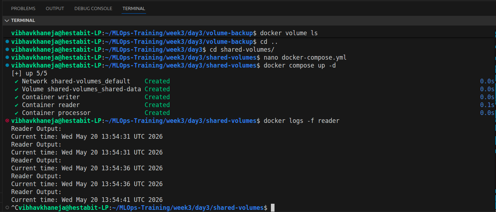

---

# Major Concepts Learned Throughout the Day

## 1. Network Segmentation

Services should only communicate with the layers they actually need.

Frontend containers should never directly access databases.

Isolation reduces:
- attack surface
- accidental access
- lateral movement risk

---

## 2. Docker DNS & Service Discovery

Containers communicate using:
- container names
- service names

Docker automatically resolves these names internally.

Static IP management is unnecessary.

---

## 3. Persistent vs Ephemeral Storage

Containers are temporary.

Volumes persist independently.

tmpfs is memory-only and disappears after restart.

Choosing the correct storage strategy depends entirely on workload requirements.

---

## 4. Bind Mounts vs Named Volumes

Bind mounts:
- ideal for development
- live host synchronization

Named volumes:
- ideal for production persistence
- Docker-managed storage

Both solve different problems.

---

## 5. Infrastructure Troubleshooting

Debugging networking requires:
- DNS inspection
- route inspection
- port testing
- connectivity testing
- service verification

Operational debugging is a critical DevOps skill.

---

## 6. Overlay Networking & Orchestration

Overlay networking enables distributed systems communication.

Docker Swarm introduced:
- orchestration
- scaling
- self-healing
- desired-state management

These concepts directly map to Kubernetes.

---

## 7. Backup & Disaster Recovery

Volumes require:
- backup automation
- retention management
- restoration workflows

Persistent storage without backup is incomplete infrastructure design.

---

# Architecture Summary

| Exercise | Main Topic | Key Learning |
|---|---|---|
| Ex1 | Custom Networks | Service isolation and segmentation |
| Ex2 | Compose Isolation | Declarative network topology |
| Ex3 | Named Volumes | Persistent database storage |
| Ex4 | Bind Mounts | Development hot reload workflows |
| Ex5 | tmpfs | Memory-only sensitive storage |
| Ex6 | Network Debugging | Infrastructure troubleshooting |
| Ex7 | Overlay Networks | Distributed orchestration concepts |
| Ex8 | Backup + Shared Volumes | Disaster recovery and shared storage |

---

# Final Reflection

Day 3 transformed Docker from:
- application packaging
into:
- infrastructure engineering

Networking and storage are the two foundational pillars of distributed systems.

This day demonstrated how:
- services communicate securely
- applications persist data
- infrastructure isolates workloads
- orchestration manages distributed services
- operators debug failures
- backups protect stateful systems

The most important realization of the day was that containers are not just lightweight VMs.

They are building blocks for:
- distributed systems
- microservice architectures
- cloud-native platforms

The troubleshooting exercises, permission issues, network isolation failures, and backup workflows were the most valuable parts because they mirrored real production operational challenges.

By the end of Day 3, Docker no longer felt like a development tool.

It felt like a platform for designing and operating modern infrastructure.
