# Week 3 — Day 4: Container Security & Image Scanning

## Overview

Day 4 focused on securing Docker containers and container images using industry-standard security practices.  
The implementation covered vulnerability scanning, secure Dockerfile design, runtime hardening, automation, and image trust concepts.

This day was divided into 8 practical exercises:

1. Trivy Installation & Vulnerability Scanning
2. Scanning Custom Node.js Images
3. Secure Dockerfiles with Non-Root Users
4. Python Container Hardening
5. Runtime Container Security
6. Automated Vulnerability Scanning
7. Image Signing & Verification
8. Security Baseline Checklist

---

# Learning Outcomes

By the end of Day 4 we learned how to:

- Implement Docker container security best practices
- Scan images for vulnerabilities using Trivy
- Configure non-root users inside containers
- Harden containers at runtime
- Reduce container attack surface
- Apply least privilege principles
- Automate image scanning
- Understand image trust and signing
- Build secure production-ready Docker images

---

# Core Security Concepts Learned

## 1. Principle of Least Privilege

Containers should run with only the permissions they absolutely require.

Examples:
- Run as non-root users
- Drop Linux capabilities
- Use read-only filesystems
- Restrict privileges

---

## 2. Defense in Depth

Security should exist in multiple layers:

- Secure Dockerfile
- Secure runtime configuration
- Vulnerability scanning
- Resource restrictions
- Security policies
- Runtime isolation

---

## 3. Attack Surface Reduction

Smaller images are safer images.

Techniques used:
- Alpine base images
- Slim images
- Multi-stage builds
- Removing unnecessary tools
- Minimal packages installed

---

## 4. Runtime Security

Security does not end after building images.

Runtime protection includes:
- Read-only filesystem
- no-new-privileges
- Capability dropping
- AppArmor
- Resource limits

---

# Exercise 1 — Install & Configure Trivy

## What Trivy Does

Trivy scans:
- OS packages
- Application dependencies
- Secrets
- Misconfigurations
- Known CVEs

---

## Vulnerability Severity Levels

| Severity | Meaning |
|---|---|
| CRITICAL | Immediate exploitation risk |
| HIGH | Serious vulnerabilities |
| MEDIUM | Moderate risk |
| LOW | Minor risk |
| UNKNOWN | Severity not assigned |

---

## Important Insight

Even official images like nginx:latest contain vulnerabilities.

This taught us:
- Never assume official images are secure
- Always scan images before production use
- Continuously rescan images

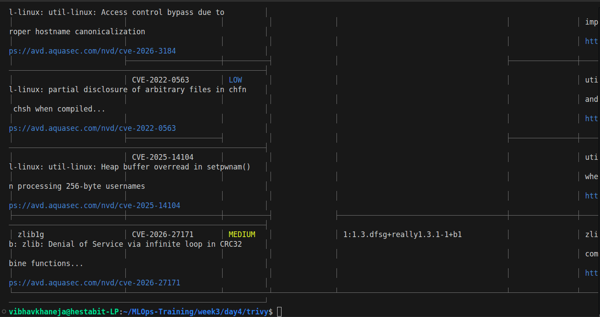
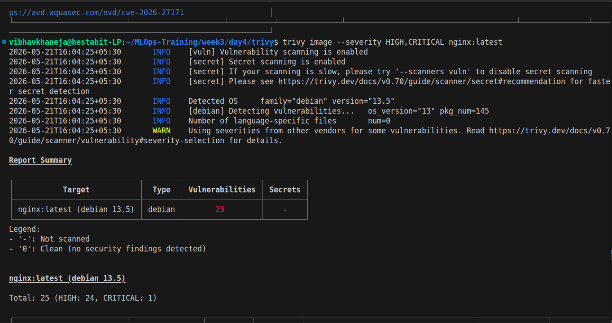
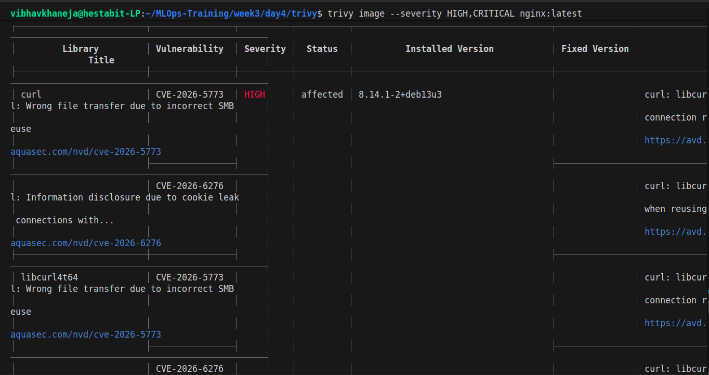

---

# Exercise 2 — Scan Custom Node.js Images

## Goal

Build a custom Node.js image and scan it.

---

## Directory Used

```bash
cd ~/MLOps-Training/week3/day4/node-scan
```

---

## Results Observed

The insecure image produced:

- 31 CRITICAL vulnerabilities
- 398 HIGH vulnerabilities
- Large image size (~1.59GB)

---

# Key Learnings from Exercise 2

## Why So Many Vulnerabilities?

Reasons:
- Large Debian-based image
- Many installed packages
- Full Node runtime
- Development dependencies included

---

## Why Image Size Matters

Larger images:
- Increase attack surface
- Slow deployments
- Use more storage
- Contain more vulnerable packages

---

## Important Observation

The insecure image used:
- Root user
- Large base image
- No hardening
- No multi-stage build

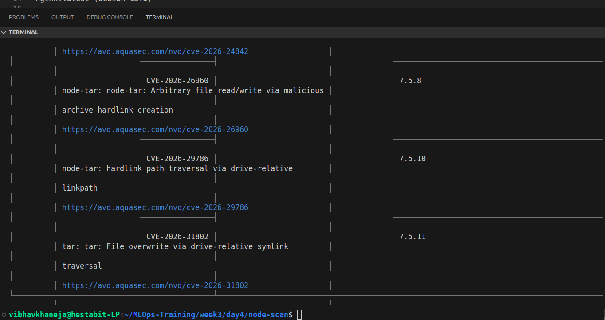
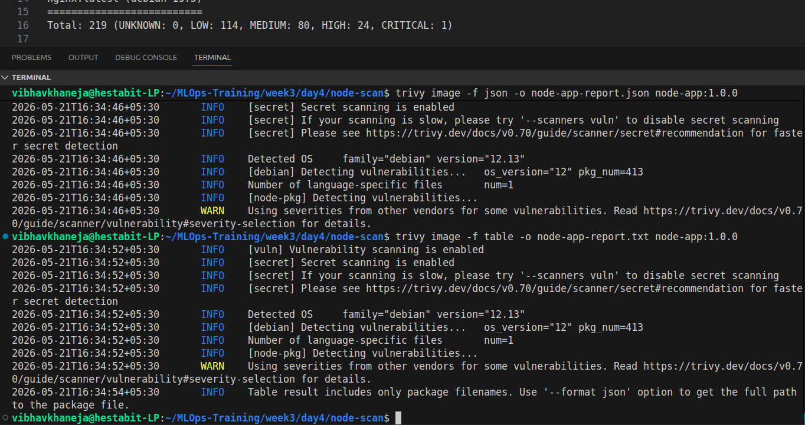

---

# Exercise 3 — Secure Dockerfiles with Non-Root Users

## Results Observed

Secure image results:

- 0 CRITICAL vulnerabilities
- 11 HIGH vulnerabilities
- Image size reduced to ~203MB

---

# Key Learnings from Exercise 3

## Why Alpine Images Matter

Benefits:
- Smaller image size
- Fewer installed packages
- Reduced vulnerabilities
- Faster downloads

---

## Why Non-Root Users Matter

If attacker compromises container:
- Limited permissions
- Cannot modify system files
- Harder privilege escalation

---

## Multi-Stage Build Benefits

Builder stage:
- Installs dependencies
- Compiles app

Final stage:
- Contains only runtime files
- Smaller attack surface


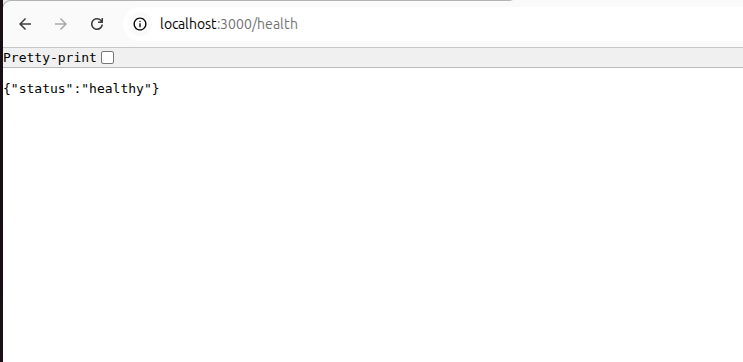
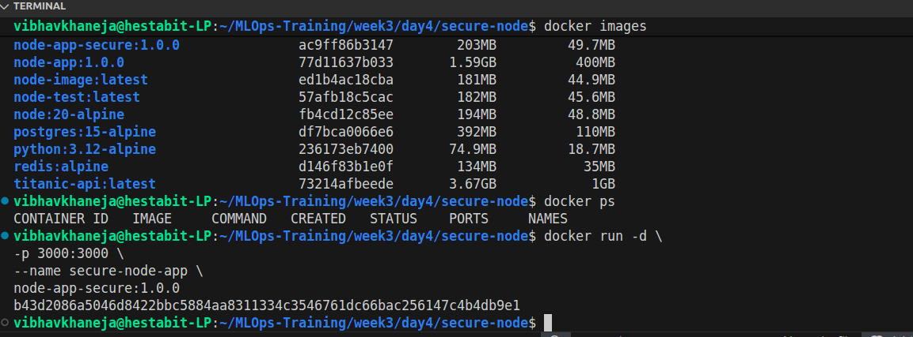
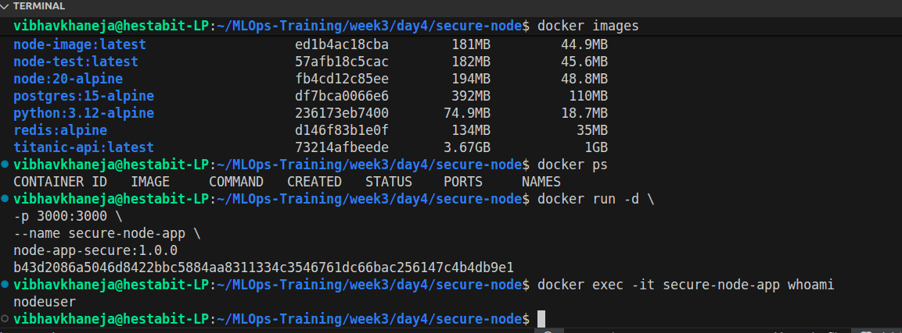

---

# Exercise 4 — Secure Python Application

## Results Observed

Results:
- 0 CRITICAL vulnerabilities
- 4 HIGH OS vulnerabilities
- 3 HIGH Python package vulnerabilities

---

# Key Learnings from Exercise 4

## Why Slim Images Matter

Slim images:
- Remove unnecessary packages
- Reduce vulnerabilities
- Improve startup time

---

## Why File Ownership Matters

```dockerfile
COPY --chown=appuser:appuser . .
```

This prevents:
- Root-owned files
- Permission problems
- Accidental privilege issues

---

## Why --no-cache-dir Matters

Prevents pip cache storage:
- Smaller image size
- Cleaner images
- Reduced attack surface

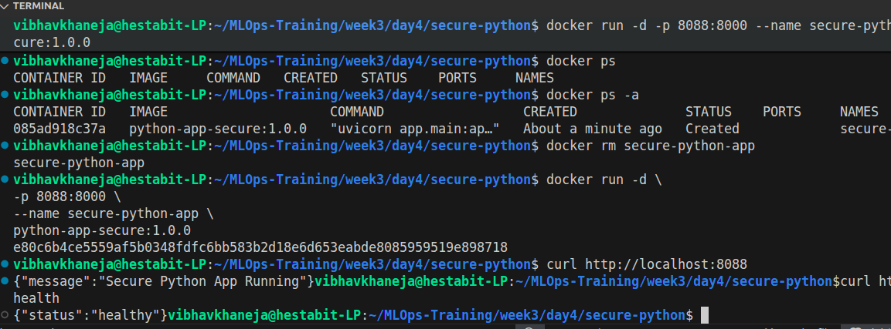
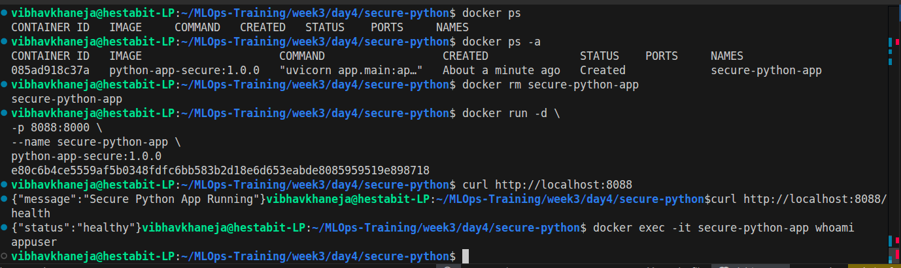

---

# Exercise 5 — Runtime Security Hardening

## Hardened Runtime Command

```bash
docker run -d \
--name secure-runtime \
--read-only \
--cap-drop ALL \
--security-opt no-new-privileges:true \
--memory="512m" \
--cpus="1.0" \
--tmpfs /tmp:rw,noexec,nosuid,size=100m \
-p 3002:3000 \
node-app-secure:1.0.0
```

---

## Inspect Security Settings

```bash
docker inspect secure-runtime
```

---

# Key Learnings from Exercise 5

## Read-Only Filesystem

```bash
--read-only
```

Benefits:
- Prevents file tampering
- Prevents malware persistence
- Protects container integrity

---

## Capability Dropping

```bash
--cap-drop ALL
```

Removes Linux capabilities:
- Network administration
- Kernel module loading
- Mounting filesystems

---

## no-new-privileges

```bash
--security-opt no-new-privileges:true
```

Prevents:
- Privilege escalation
- setuid exploitation

---

## Resource Limits

```bash
--memory="512m"
--cpus="1.0"
```

Benefits:
- Prevent DoS attacks
- Prevent resource exhaustion
- Improve cluster stability

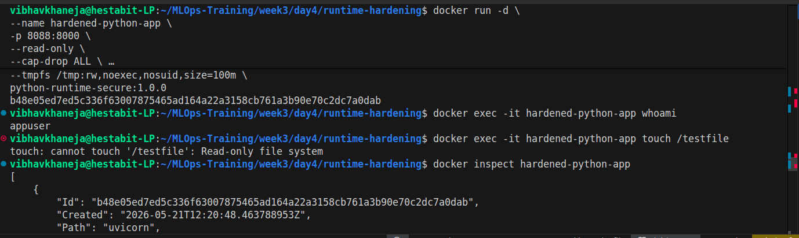
---

# Exercise 6 — Automated Vulnerability Scanning

## Goal

Automate Trivy scans for local images.

# Key Learnings from Exercise 6

## Why Automation Matters

Manual scanning:
- Is slow
- Is inconsistent
- Gets forgotten

Automation ensures:
- Continuous security checks
- Consistent policies
- Faster detection

---

## Important Observation

Scanning ALL images was very slow.

We improved the script by:
- Filtering specific images
- Reducing scan scope
- Using severity filters

---

# Exercise 7 — Image Signing & Verification

## Goal

Understand Docker Content Trust.

---

## Directory Used

```bash
cd ~/MLOps-Training/week3/day4/image-signing
```

---

## Enable Docker Content Trust

```bash
export DOCKER_CONTENT_TRUST=1
```

---

## Pull Signed Image

```bash
docker pull nginx:latest
```

---

## Attempt Trust Inspection

```bash
docker trust inspect nginx:latest
```

---

## Important Observation

The local Docker installation did not support:
- docker trust

This depends on:
- Docker version
- Docker distribution
- Docker CLI plugins

---

# Key Learnings from Exercise 7

## What Image Signing Solves

Ensures:
- Image authenticity
- Publisher verification
- Tamper protection

---

## Why This Matters

Without signing:
- Malicious images can be injected
- Supply chain attacks become easier

---

## Industry Trend

Modern alternatives include:
- Cosign
- Sigstore
- Notary v2

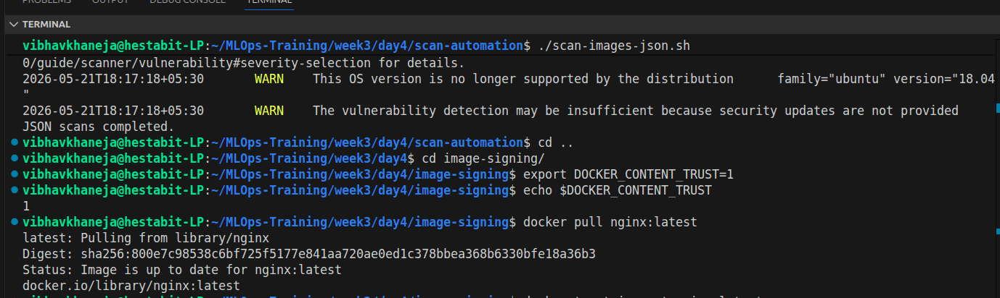

---

# Exercise 8 — Security Baseline Checklist

## Goal

Create reusable security review standards.

---

# Dockerfile Security Checklist

- Uses minimal base image
- Uses pinned image versions
- Uses multi-stage builds
- Runs as non-root user
- Avoids hardcoded secrets
- Uses COPY instead of ADD
- Implements health checks
- Exposes only required ports
- Uses proper file permissions

---

# Runtime Security Checklist

- Uses read-only filesystem
- Drops Linux capabilities
- Uses no-new-privileges
- Applies resource limits
- Uses tmpfs where needed
- Restricts networking
- Uses AppArmor/SELinux
- Prevents privilege escalation

---

# Image Scanning Checklist

- Scanned using Trivy
- No CRITICAL vulnerabilities
- HIGH vulnerabilities documented
- Reports stored safely
- Automated scanning enabled
- Regular rescanning configured

---

# Before vs After Security Improvements

| Area | Insecure | Secure |
|---|---|---|
| Base Image | node:20 | node:20-alpine |
| User | root | non-root |
| Image Size | 1.59GB | 203MB |
| CRITICAL Vulns | 31 | 0 |
| HIGH Vulns | 398 | 11 |
| Runtime Hardening | No | Yes |
| Resource Limits | No | Yes |
| Read-only FS | No | Yes |

---

# Major Tools Learned

## Trivy

Purpose:
- Vulnerability scanning
- Secret scanning
- Misconfiguration scanning

---

## Docker Security Options

Learned:
- --read-only
- --cap-drop
- --security-opt
- --memory
- --cpus
- --tmpfs

---

# Real Production Best Practices Learned

## Always Use Minimal Images

Prefer:
- alpine
- slim
- distroless

Avoid:
- huge general-purpose images

---

## Never Run as Root

Always:
```dockerfile
USER appuser
```

---

## Continuously Scan Images

Security is continuous.

Scan:
- During development
- During CI/CD
- Before deployment
- Regularly in production

---

## Apply Runtime Restrictions

Even secure images need runtime protection.

---

# Final Deliverables Completed

- Trivy installation
- Vulnerability scan reports
- Secure Node.js Dockerfile
- Secure Python Dockerfile
- Runtime hardening examples
- Automated scan script
- Security checklist
- Before/after comparison
- Container hardening documentation

---

# Final Summary

Day 4 provided hands-on experience with real-world container security practices.

The biggest lessons learned were:

1. Official images are not automatically secure
2. Running containers as root is dangerous
3. Smaller images reduce attack surface
4. Runtime hardening is critical
5. Vulnerability scanning must be automated
6. Security should exist in multiple layers
7. Least privilege is essential
8. Security is a continuous process

This day transformed basic Docker usage into production-grade secure container practices.
