# DAY 5 — Docker Registry & Production Deployment

# Overview
Day 5 focused on taking Docker from local development into real-world production-style deployment workflows.  
The goal was to understand how containerized applications are stored, distributed, deployed, monitored, backed up, and maintained in production environments.

This day introduced:
- Docker Hub and image registries
- Private Docker Registry setup
- Multi-environment deployments
- Blue-Green deployment strategy
- Monitoring with Prometheus + Grafana + cAdvisor
- Automated backup systems
- Deployment playbooks
- Performance analysis and optimization

---

# 1. Docker Hub & Public Registries

## What is Docker Hub?
Docker Hub is a cloud-based registry where Docker images are stored and shared.

It works like:
- GitHub → for source code
- Docker Hub → for Docker images

You can:
- Push your images
- Pull images anywhere
- Share images publicly/private
- Integrate with CI/CD

---

## Image Naming Convention

Format:

```bash
username/repository:tag
```

Example:

```bash
vibhavkhaneja/node-app:1.0.0
```

Breakdown:
- `vibhavkhaneja` → Docker Hub username
- `node-app` → repository name
- `1.0.0` → image tag/version

---

## Important Docker Commands

### Login

```bash
docker login
```

### Tag an image

```bash
docker tag node-app:latest yourusername/node-app:1.0.0
```

### Push image

```bash
docker push yourusername/node-app:1.0.0
```

### Pull image

```bash
docker pull yourusername/node-app:1.0.0
```

### Run pulled image

```bash
docker run -d -p 3000:3000 yourusername/node-app:1.0.0
```

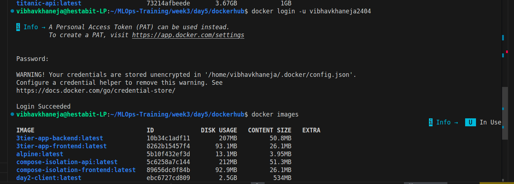
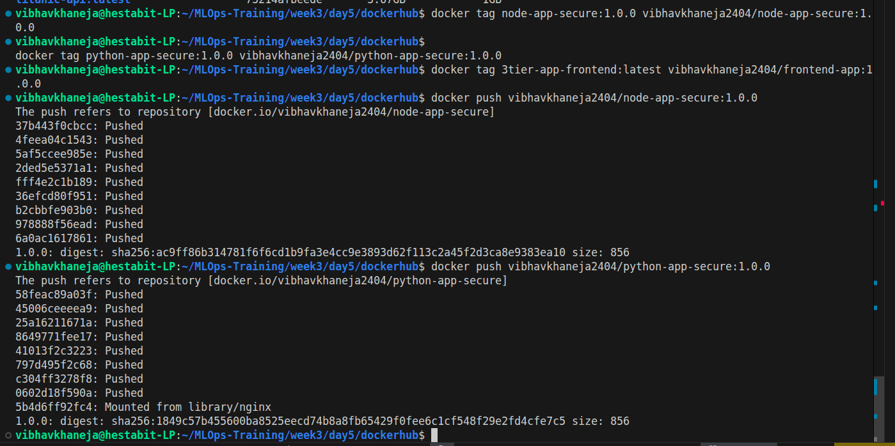
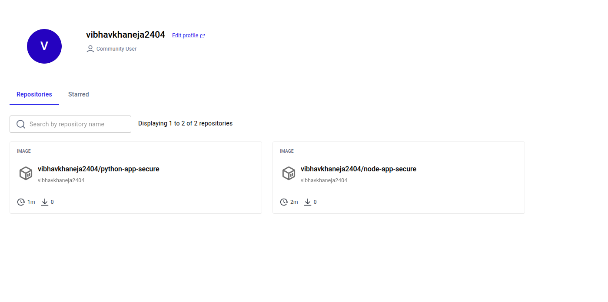
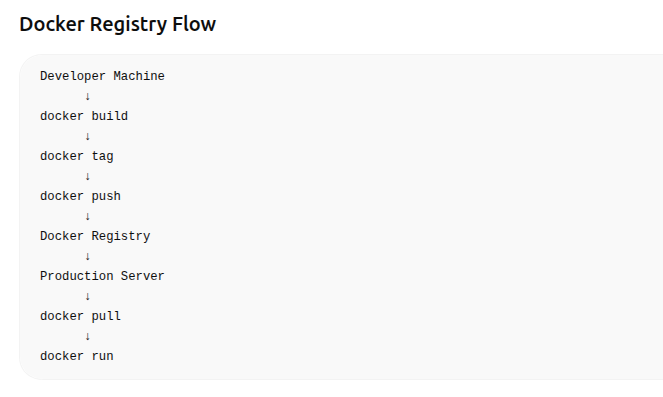

---

# 2. Private Docker Registry

## Why Private Registry?
Organizations often use private registries because:
- Internal images should remain private
- Better security
- Faster local deployments
- Full control over storage

---

## Registry Architecture

```text
Developer Machine
       ↓
Private Registry (registry:2)
       ↓
Production Servers
```

---

## Running Registry Container

```bash
docker run -d \
--name registry \
-p 5000:5000 \
registry:2
```

Registry becomes accessible at:

```text
http://localhost:5000
```

---

## Pushing Images to Private Registry

### Tag image

```bash
docker tag node-app:latest localhost:5000/node-app:1.0.0
```

### Push image

```bash
docker push localhost:5000/node-app:1.0.0
```

### Pull image

```bash
docker pull localhost:5000/node-app:1.0.0
```

---

## Important Concepts

### Authentication
Controls who can push/pull images.

### SSL/TLS
Encrypts registry communication.

### Storage Persistence
Ensures registry data survives container restart.

### Garbage Collection
Removes unused image layers.


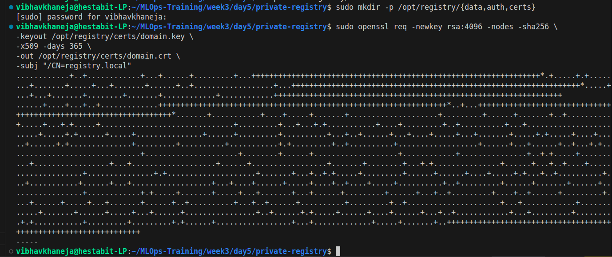
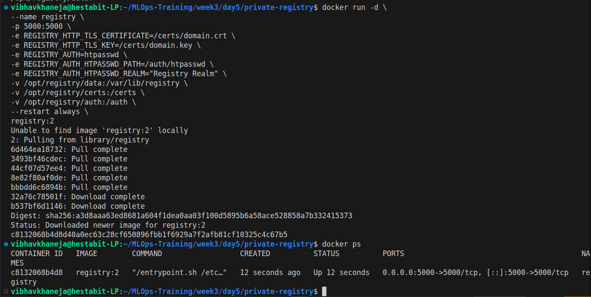
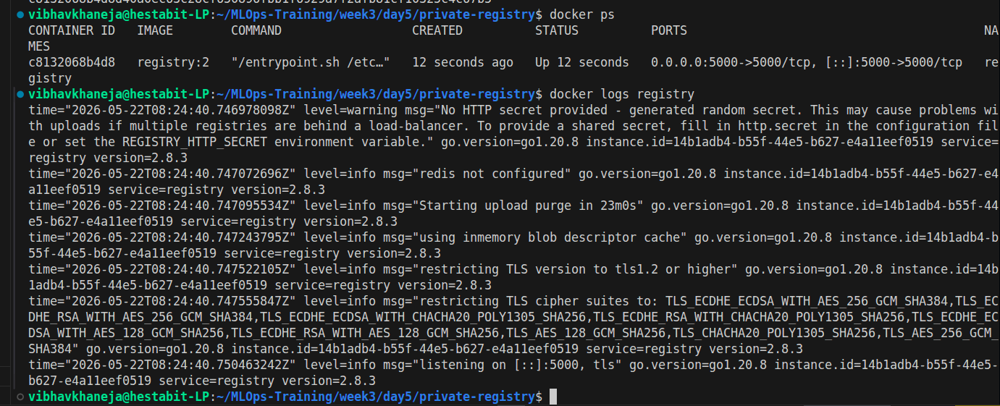
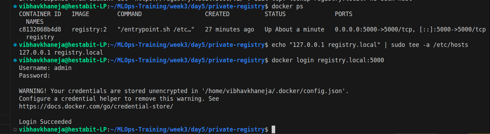
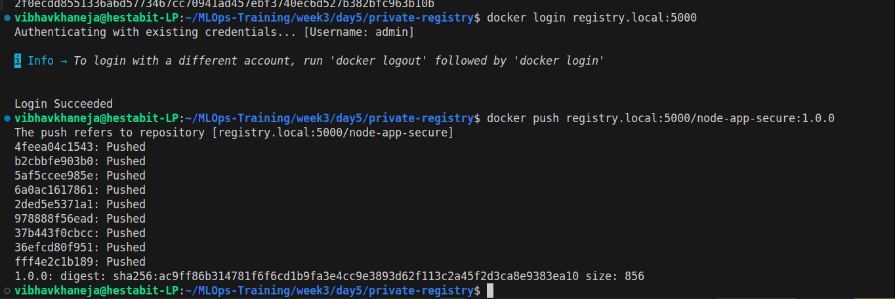
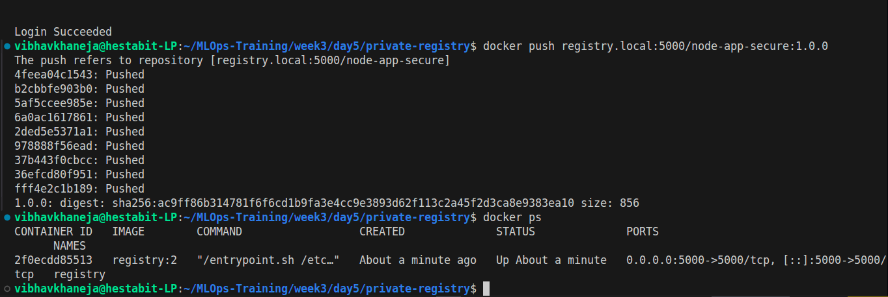

---

# 3. Multi-Environment Deployment

## Why Multiple Environments?

Applications usually run in:
- Development
- Staging
- Production

Each environment has:
- Different ports
- Different configs
- Different debugging levels
- Different environment variables

---

# Multi-Environment Structure

```text
project/
├── docker-compose.yml
├── docker-compose.dev.yml
├── docker-compose.staging.yml
├── docker-compose.prod.yml
├── .env.dev
├── .env.staging
├── .env.prod
└── deploy.sh
```

---

## Compose File Strategy

### Base File

Contains common services.

```yaml
docker-compose.yml
```

### Override Files

Environment-specific changes:

```yaml
docker-compose.dev.yml
docker-compose.staging.yml
docker-compose.prod.yml
```

---

## Deployment Script Logic

The script:
1. Accepts environment name
2. Loads correct `.env` file
3. Uses matching compose override
4. Builds containers
5. Starts services

Example:

```bash
./deploy.sh prod
```

---

## Real Learning

You learned:
- How environment isolation works
- Why production differs from development
- How compose overrides work
- How deployments become automated


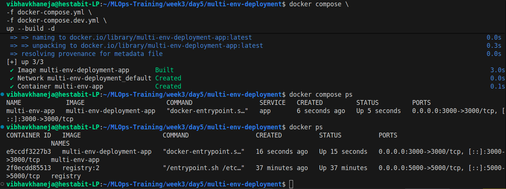
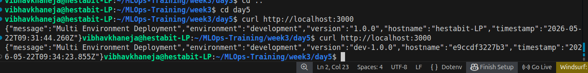
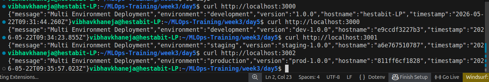
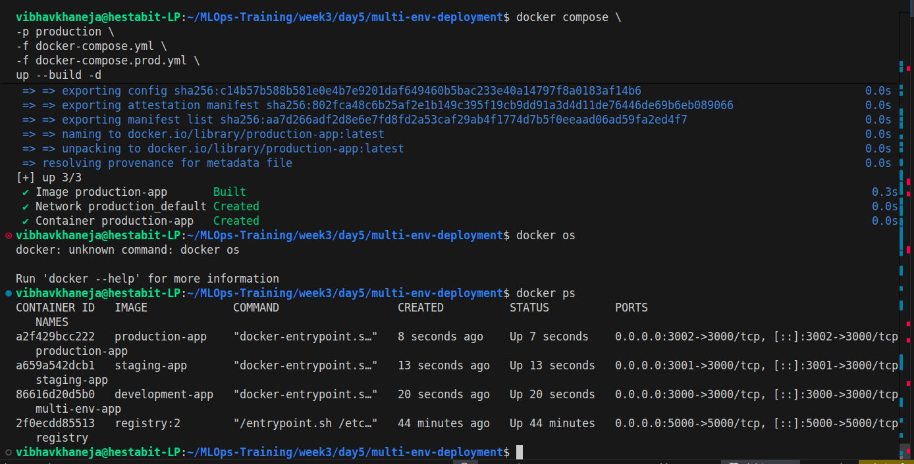
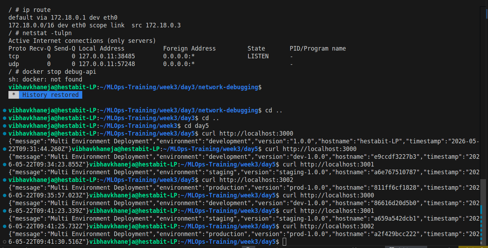
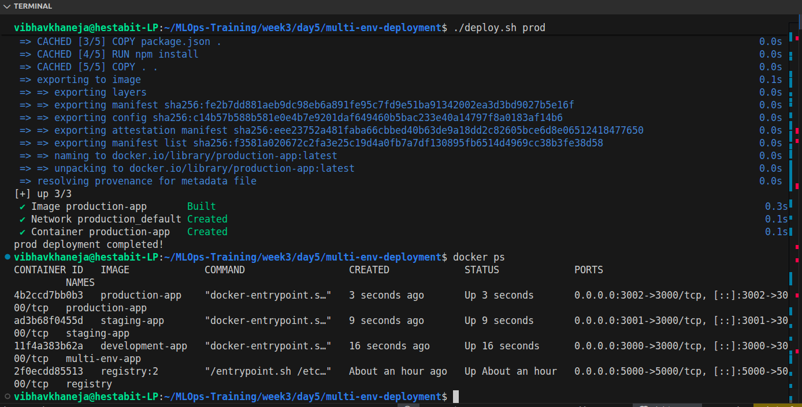

---

# 4. Blue-Green Deployment

## Problem Solved

Traditional deployment causes downtime.

Blue-Green deployment avoids downtime by maintaining:
- Current version (Blue)
- New version (Green)

---

# Deployment Flow

```text
Users
  ↓
Nginx Reverse Proxy
  ↓
Blue OR Green Environment
```

---

## How It Works

### Step 1
Blue is active.

### Step 2
Deploy Green separately.

### Step 3
Test Green environment.

### Step 4
Switch Nginx traffic to Green.

### Step 5
Keep Blue running for rollback.

---

## Advantages

### Zero Downtime
Users experience uninterrupted service.

### Easy Rollback
Switch traffic back instantly.

### Safer Deployments
New version tested before traffic shift.

---

## Nginx Role

Nginx acts as:
- Reverse proxy
- Traffic switcher
- Load balancer

Example:

```nginx
upstream backend {
    server app-blue:3000;
    # server app-green:3000;
}
```

Switching deployment means:
- Comment Blue
- Uncomment Green
- Reload Nginx

---

## Important Learning

You experienced:
- Reverse proxy networking
- Traffic switching
- Health checks
- Rollback strategy
- Zero-downtime deployment concept

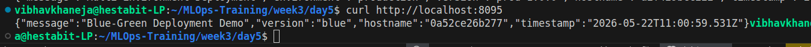
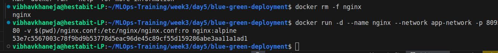
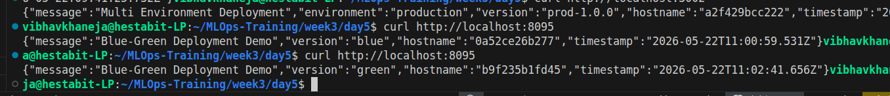
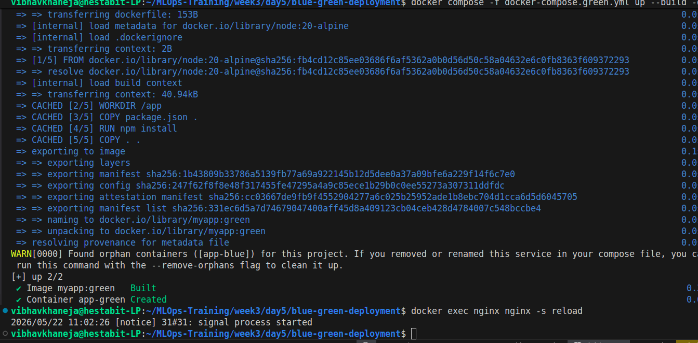
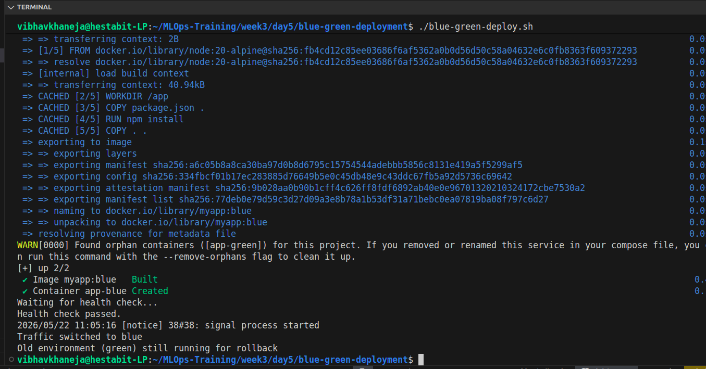

---

# 5. Monitoring Stack

Monitoring is critical in production.

Without monitoring:
- Failures go unnoticed
- Resource spikes remain hidden
- Performance problems become dangerous

---

# Monitoring Components

## cAdvisor

Collects:
- CPU usage
- Memory usage
- Network I/O
- Disk I/O

---

## Prometheus

Prometheus:
- Scrapes metrics
- Stores time-series data
- Executes queries

---

## Grafana

Grafana:
- Visualizes metrics
- Creates dashboards
- Shows graphs/charts

---

# Monitoring Architecture

```text
Containers
   ↓
cAdvisor
   ↓
Prometheus
   ↓
Grafana Dashboard
```

---

# Prometheus Configuration

```yaml
scrape_configs:
  - job_name: 'cadvisor'
    static_configs:
      - targets: ['cadvisor:8080']
```

---

# Useful Prometheus Queries

## CPU Usage

```promql
rate(container_cpu_usage_seconds_total[1m])
```

## Memory Usage

```promql
container_memory_usage_bytes
```

## Network Traffic

```promql
rate(container_network_receive_bytes_total[1m])
```

---

# Grafana Workflow

1. Add Prometheus datasource
2. Create dashboard
3. Add panels
4. Use PromQL queries
5. Visualize metrics

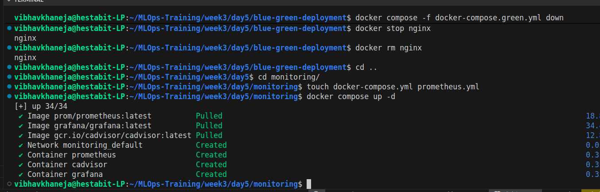
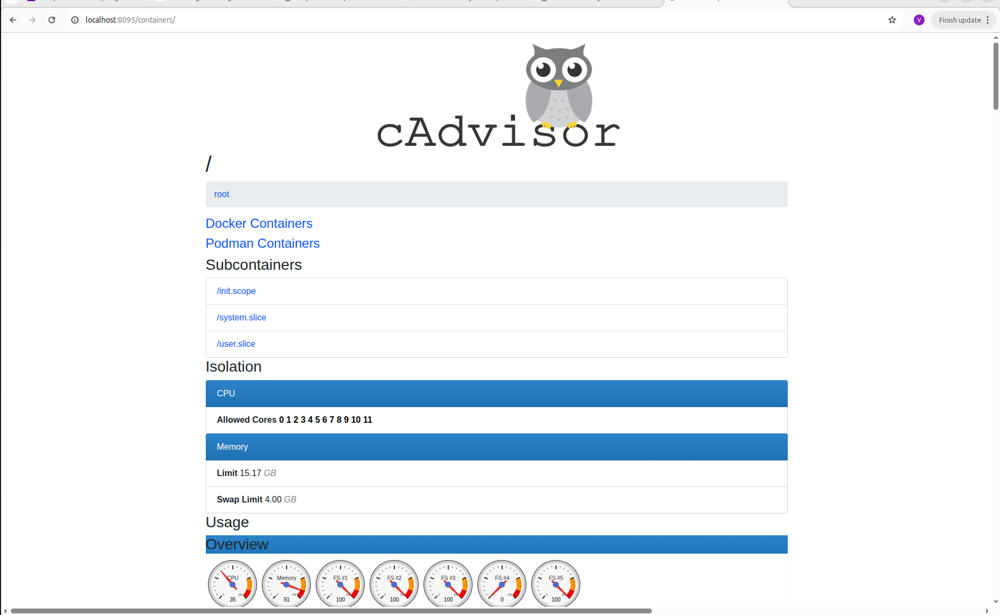
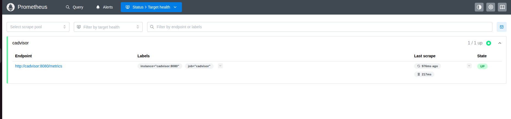
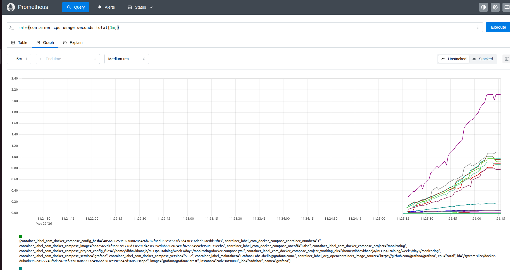
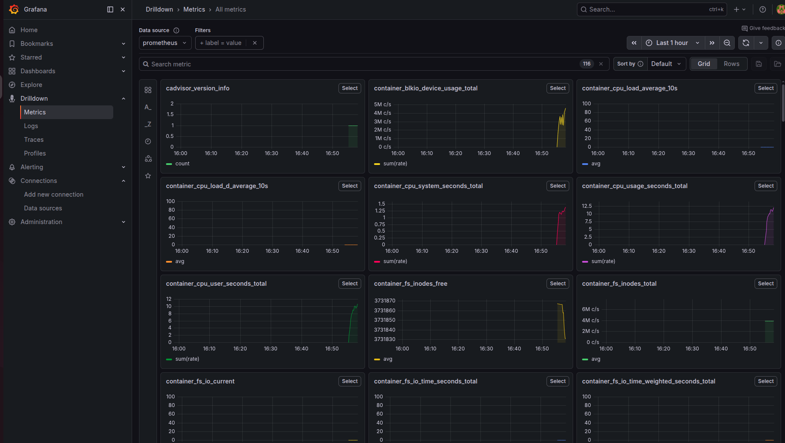
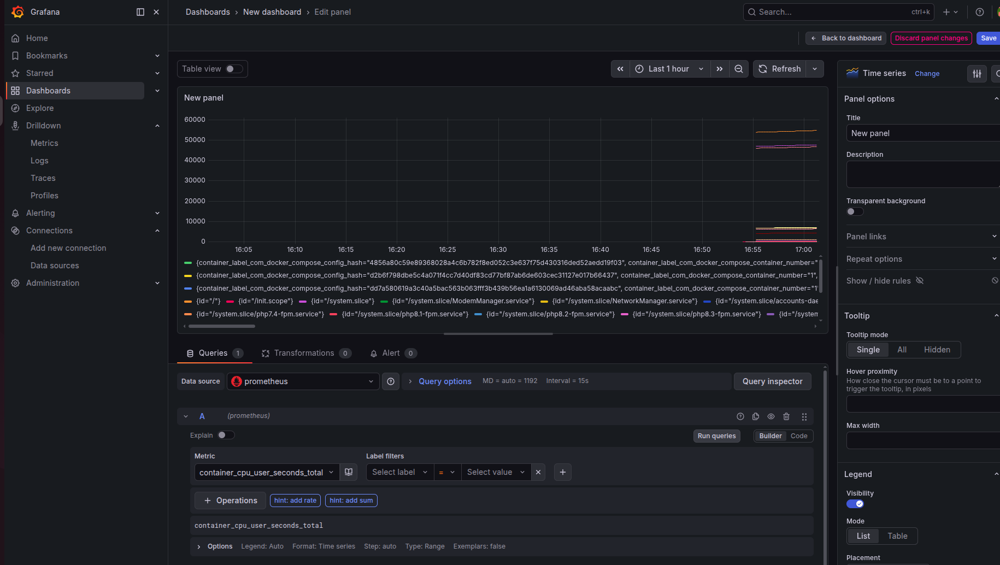

---

# 6. Backup & Disaster Recovery

Production systems must be recoverable.

If:
- Server crashes
- Volume gets corrupted
- Data is deleted

You need backups.

---

# Backup Targets

## Volumes
Persistent data.

## Images
Application builds.

## Configurations
Compose files + environment files.

---

# Backup Strategy

The backup script:
1. Creates timestamped directory
2. Backs up volumes
3. Backs up compose configs
4. Saves Docker images
5. Generates manifest
6. Deletes backups older than 7 days

---

# Important Concepts

## Backup Rotation

Keeps storage clean by removing old backups.

## Disaster Recovery

Ability to restore system after failure.

## Restore Procedure

Testing restoration is as important as backups.

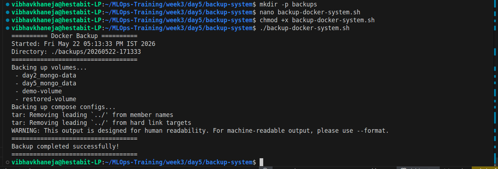
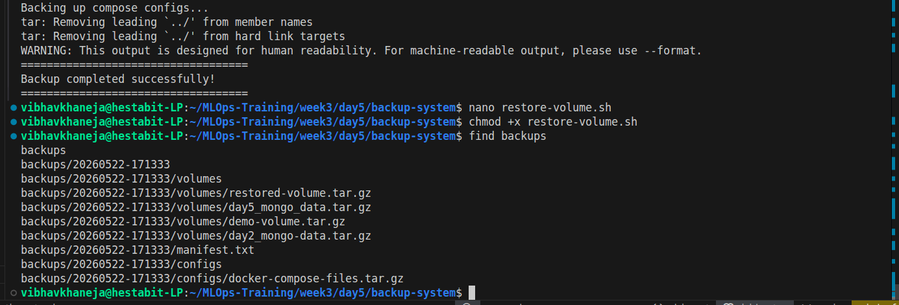

---

# 7. Deployment Playbook

A deployment playbook is:
- A standardized deployment guide
- A production checklist
- A rollback procedure

---

# Sections of Playbook

## Pre-Deployment Checklist

Ensures:
- Tests pass
- Security scan passes
- Backup completed

---

## Deployment Steps

Typical flow:

```bash
git pull
docker compose build
docker compose up -d
```

---

## Verification

Check:
- Container health
- Logs
- API responses
- Monitoring metrics

---

## Rollback Procedure

If deployment fails:
1. Stop new containers
2. Restore backup
3. Start old version

---

# 8. Performance Optimization & Analysis

Production systems must be optimized.

---

# What Was Analyzed?

## Image Size

Smaller images:
- Build faster
- Deploy faster
- Use less storage

---

## Resource Usage

Measured:
- CPU
- Memory
- Network
- Disk

Using:

```bash
docker stats
```

---

## Startup Times

Analyzed:
- Container boot speed
- Service readiness

---

## Disk Usage

Checked:
- Volumes
- Images
- Cache

Using:

```bash
docker system df
```

---

# Important Real-World Learnings

## Why Alpine Images Matter

Smaller images:
- Faster downloads
- Better security
- Less attack surface

---

## Why Monitoring Matters

Without visibility:
- Scaling becomes difficult
- Performance tuning becomes impossible

---

## Why Blue-Green Matters

It enables:
- Safer production deployments
- Fast rollback
- Near-zero downtime

---

# Key Production Concepts Learned

## Dev vs Staging vs Production

| Environment | Purpose |
|---|---|
| Development | Local testing |
| Staging | Pre-production validation |
| Production | Live application |

---

## CI/CD Understanding

CI/CD pipeline generally:
1. Build image
2. Run tests
3. Scan vulnerabilities
4. Push image
5. Deploy automatically

---

# Commands You Practiced Frequently

## Container Management

```bash
docker ps
docker logs
docker exec
docker stop
docker rm
```

---

## Compose Operations

```bash
docker compose up -d
docker compose down
docker compose build
docker compose ps
```

---

## Monitoring Commands

```bash
docker stats
docker system df
```

---

# Overall Understanding of Day 5

By the end of Day 5, you learned how real production container systems work.

You moved from:
- Basic containers
→ to complete production deployment workflows.

You implemented:
- Public registries
- Private registries
- Environment-based deployments
- Blue-green deployment
- Monitoring stack
- Backup systems
- Deployment automation
- Performance analysis

This day was important because it connected Docker development knowledge with actual production operations and DevOps practices.

---

# Final Takeaway

Day 5 was about understanding:

> “How containers are managed safely and reliably in production.”

You now understand:
- How applications are distributed
- How deployments happen
- How traffic is switched
- How monitoring works
- How backups protect systems
- How rollback prevents outages
- How production reliability is achieved
