# Week 3 Final Project — Enterprise Microservices Platform

# Introduction

This project is a complete enterprise-style microservices application built during Week 3 of the MLOps and DevOps training program. The objective of the project was not just to containerize applications, but to simulate how real production systems are designed, deployed, monitored, secured, and maintained.

The application was designed using a distributed microservices architecture where multiple independent services communicate with each other through APIs and message queues. Every service was containerized using Docker and orchestrated using Docker Compose.

The project also focused heavily on production engineering practices such as:

- Multi-stage Docker builds
- Non-root containers
- Container security scanning
- Monitoring and observability
- Automated deployment
- Automated backup systems
- Health checks
- Network isolation
- Environment-based deployments
- Persistent data storage

---

# Project Goals

The primary goals of this project were:

1. Learn how enterprise microservices are structured.
2. Understand Docker and container orchestration deeply.
3. Learn monitoring using Prometheus and Grafana.
4. Implement secure Docker practices.
5. Build deployment-ready applications.
6. Understand networking between containers.
7. Simulate production deployment scenarios.

---

# Complete Technology Stack

## Frontend
- React
- Vite
- Nginx

## Backend
- Node.js Express
- Python FastAPI

## Databases
- PostgreSQL
- MongoDB
- Redis

## Messaging Queue
- RabbitMQ

## Monitoring Stack
- Prometheus
- Grafana
- cAdvisor

## Security Tools
- Trivy

## Containerization
- Docker
- Docker Compose

---

# Application Architecture

The project follows a microservices architecture.

Client requests first reach the frontend application. The frontend communicates with the API Gateway. The API Gateway acts as a central routing layer and forwards requests to the appropriate backend microservice.

Each service has its own responsibility:

- User Service manages user-related operations.
- Product Service manages product-related operations.
- Order Service manages order processing.
- Redis handles caching.
- RabbitMQ handles asynchronous communication.
- PostgreSQL stores relational data.
- MongoDB stores product data.

---

# Services and Ports

| Service | Technology | Internal Port | External Port |
|---|---|---|---|
| Frontend | React + Nginx | 80 | 3000 |
| API Gateway | Node.js | 5000 | 5000 |
| User Service | FastAPI | 8001 | 8010 |
| Product Service | Express | 8002 | 8011 |
| Order Service | FastAPI | 8003 | 8012 |
| PostgreSQL | PostgreSQL | 5432 | Internal |
| MongoDB | MongoDB | 27017 | Internal |
| Redis | Redis | 6379 | 6380 |
| RabbitMQ | RabbitMQ | 5672 | 5672 |
| RabbitMQ Dashboard | RabbitMQ Mgmt | 15672 | 15672 |
| Prometheus | Prometheus | 9090 | 9090 |
| Grafana | Grafana | 3000 | 3001 |
| cAdvisor | cAdvisor | 8080 | 8081 |

---

# Docker Networking

Three isolated Docker networks were created:

## frontend-net
Used by:
- Frontend
- API Gateway

Purpose:
- Frontend communication layer.

## backend-net
Used by:
- API Gateway
- All microservices
- Monitoring stack

Purpose:
- Internal service communication.

## database-net
Used by:
- PostgreSQL
- MongoDB
- Redis
- RabbitMQ
- Microservices

Purpose:
- Database isolation and security.

This architecture ensured proper network segmentation and reduced unnecessary exposure between services.

---

# Monitoring and Observability

A complete monitoring stack was implemented.

## Prometheus

Prometheus was used for metrics scraping and storage. Every backend service exposed a `/metrics` endpoint.

Prometheus continuously scraped metrics from:
- API Gateway
- User Service
- Product Service
- Order Service
- cAdvisor

Metrics included:
- Request counts
- Response times
- CPU usage
- Memory usage
- Container statistics

---

## Grafana

Grafana was integrated with Prometheus to visualize metrics.

Dashboards displayed:
- Container CPU usage
- Memory usage
- Network traffic
- Service health
- Request monitoring

---

## cAdvisor

cAdvisor monitored Docker containers directly.

It provided:
- Container CPU metrics
- Memory metrics
- Filesystem metrics
- Network metrics

---

# Security Implementation

Security was one of the major focus areas.

## Non-Root Containers

All custom containers were modified to run using non-root users.

Benefits:
- Reduced attack surface
- Better container isolation
- Improved security compliance

---

## Multi-Stage Builds

Frontend container used a multi-stage build approach.

Stage 1:
- Build React application.

Stage 2:
- Serve optimized static files using Nginx.

Benefits:
- Smaller image size
- Cleaner runtime image
- Better performance

---

## Vulnerability Scanning

Trivy was used to scan all container images.

Reports were stored in:
- JSON format
- Table/text format

Path:
`security/scan-reports/`

The goal was to ensure:
- No critical vulnerabilities
- Safer production images

---

# Health Checks

Health checks were configured for services.

Each microservice exposed:
`/health`

Docker Compose continuously monitored container health.

Benefits:
- Automatic health verification
- Better orchestration
- Improved reliability

---

# Backup System

An automated backup system was implemented.

The backup script:
- Dumps PostgreSQL databases
- Dumps MongoDB data
- Stores compose files
- Creates timestamped backups

Backup location:
`backups/`

This simulates enterprise disaster recovery practices.

---

# Deployment System

A deployment script was implemented.

Supported environments:
- Development
- Production

Separate compose files were used:
- docker-compose.yml
- docker-compose.dev.yml
- docker-compose.prod.yml

Benefits:
- Environment separation
- Easier deployment management
- Production optimization

---

# Learning Outcomes

This project helped in understanding:

- Enterprise container orchestration
- Docker Compose deeply
- Service dependencies
- Production container security
- Monitoring systems
- Metrics collection
- Infrastructure automation
- Backup strategies
- Networking concepts
- Observability pipelines

---

# Future Improvements

Possible future upgrades include:

- Kubernetes deployment
- CI/CD pipelines
- HTTPS reverse proxy
- JWT authentication
- Auto-scaling
- Centralized logging
- Service mesh
- Kubernetes Helm charts

---

# Screenshots

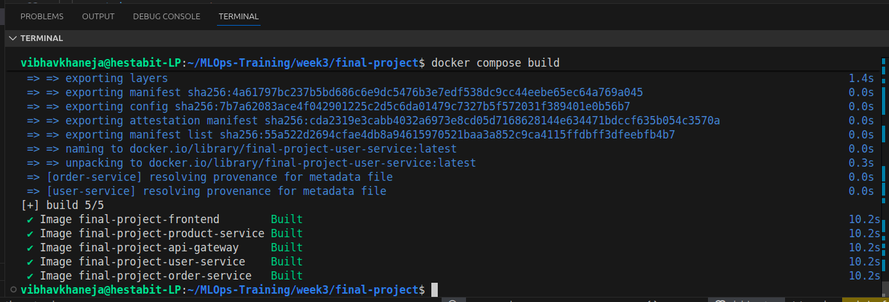
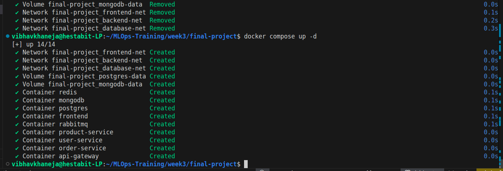
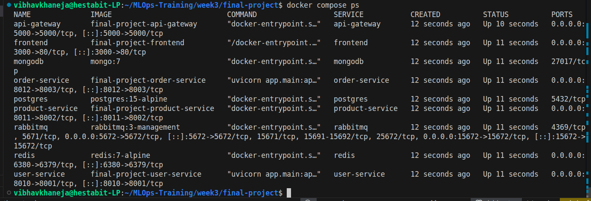
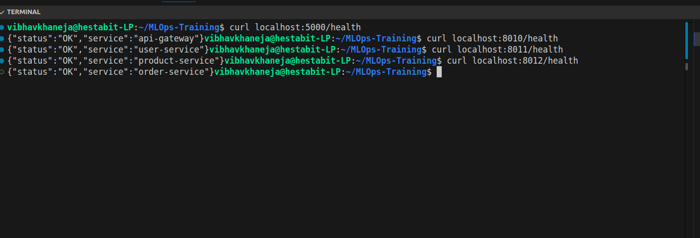
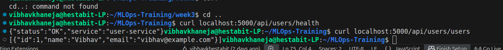
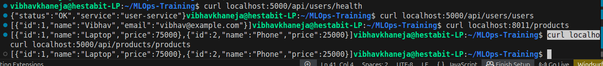
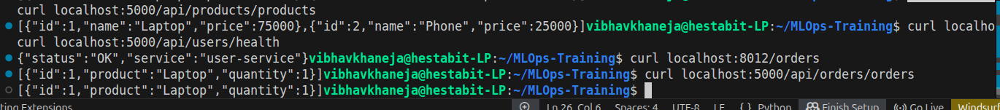
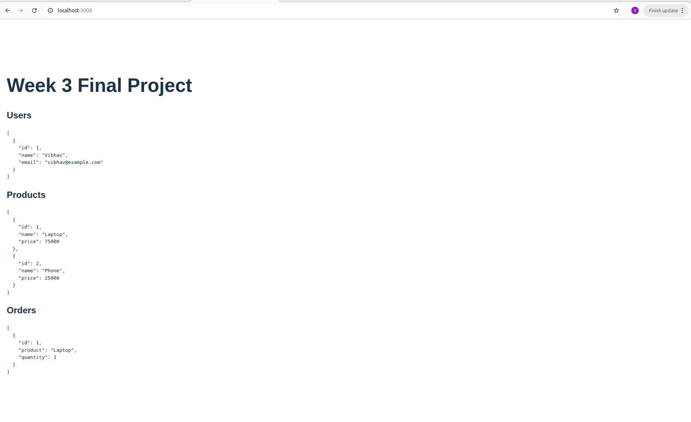
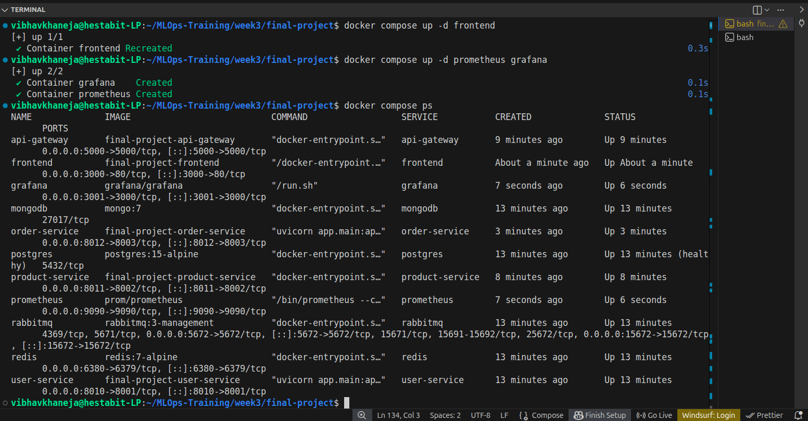
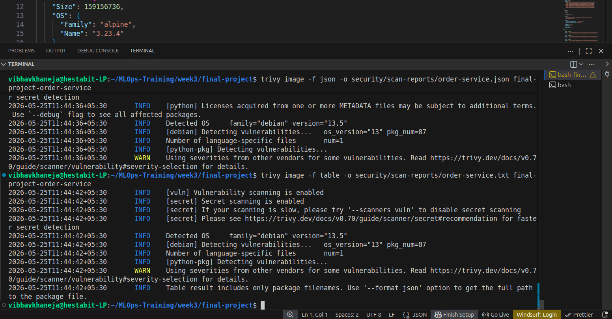
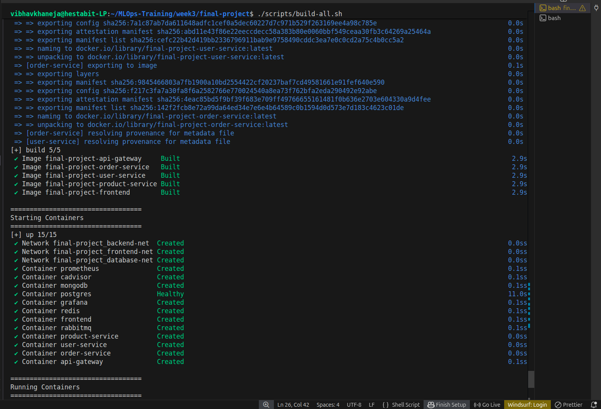
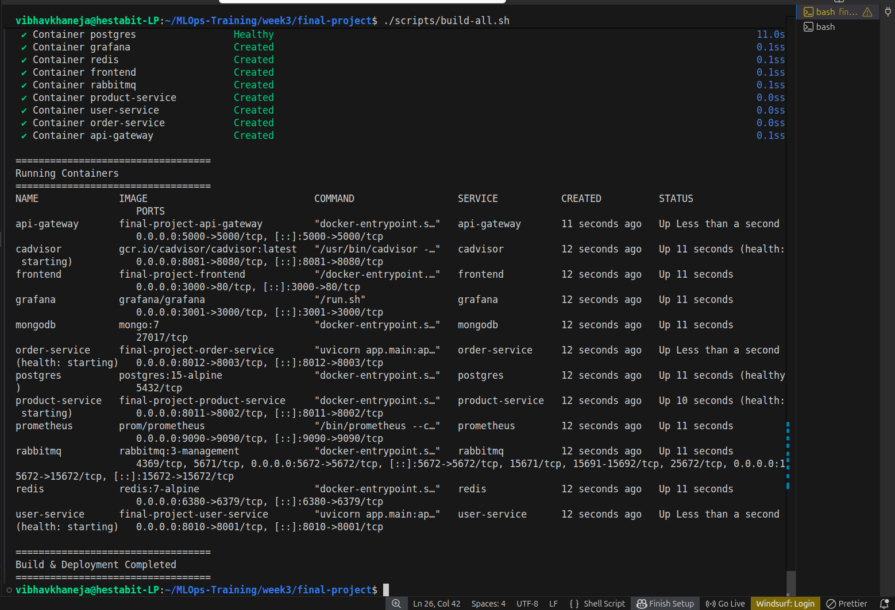
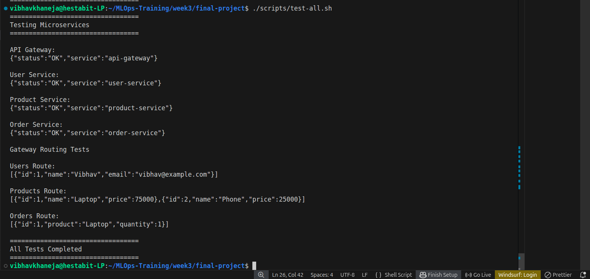
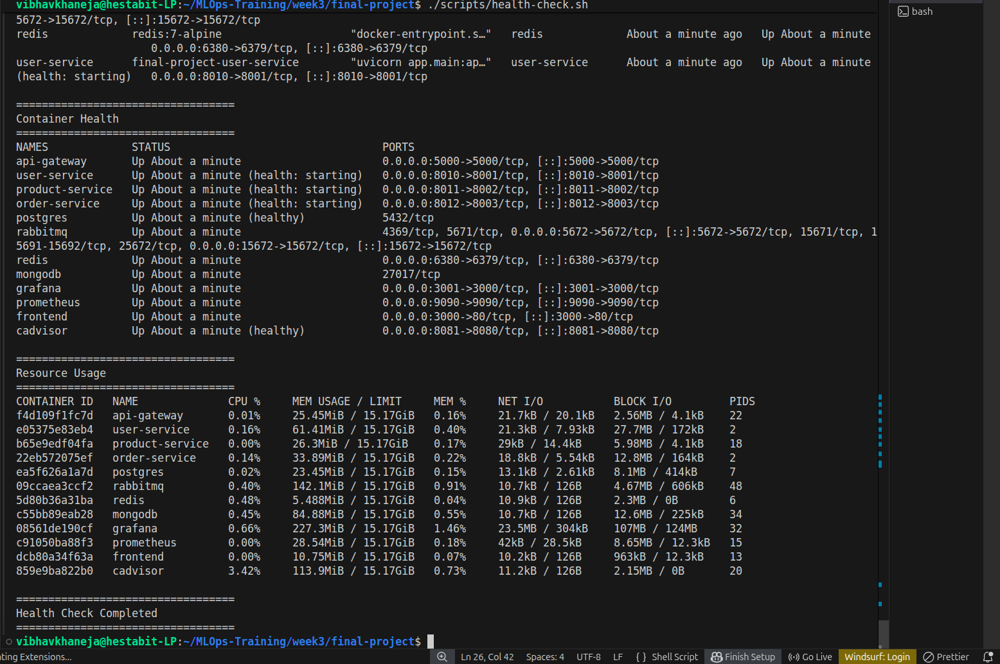
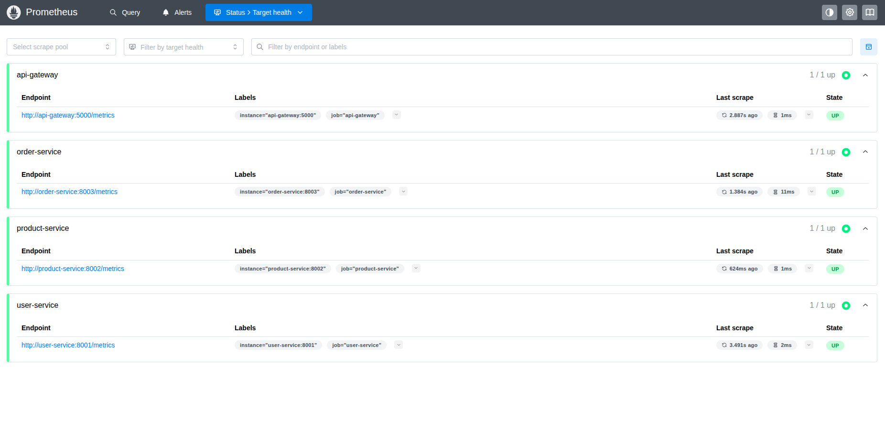
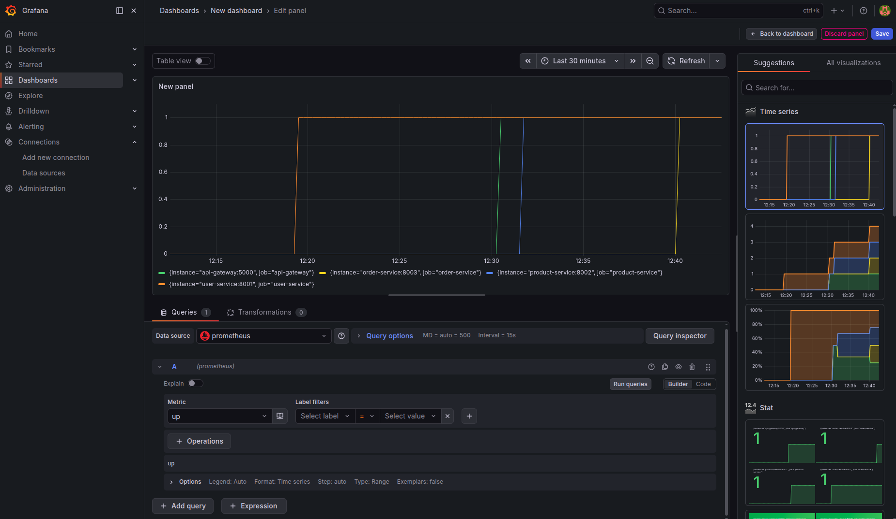
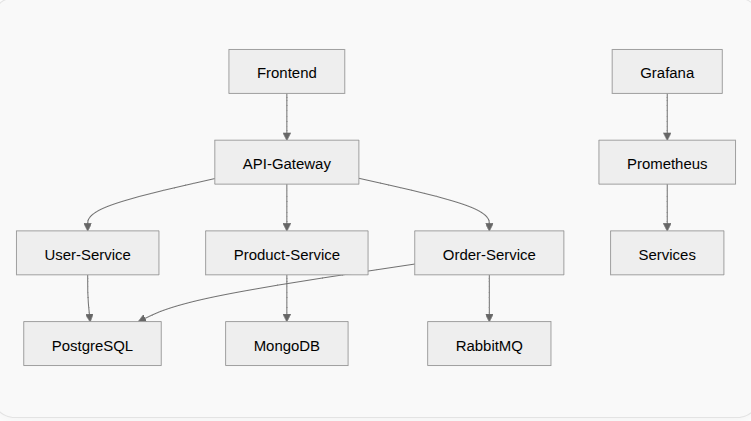
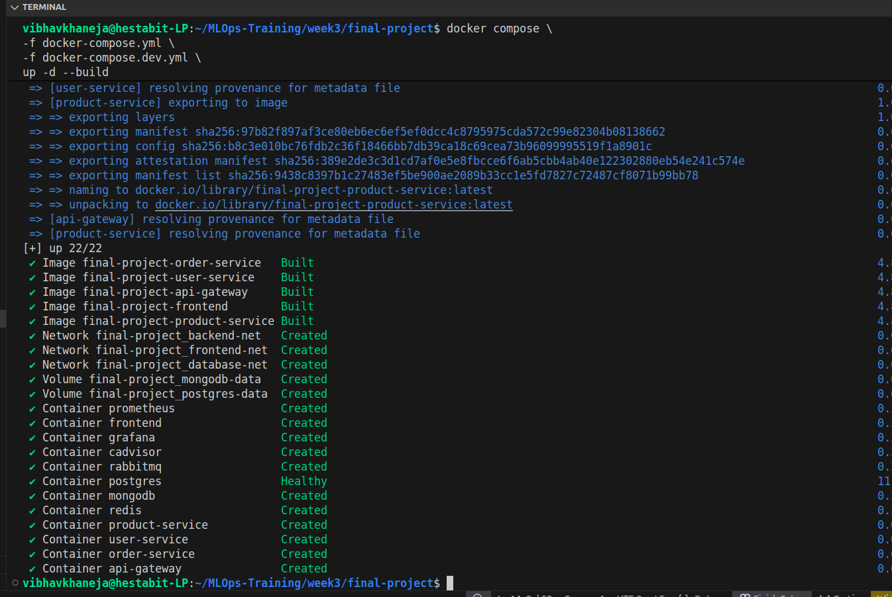
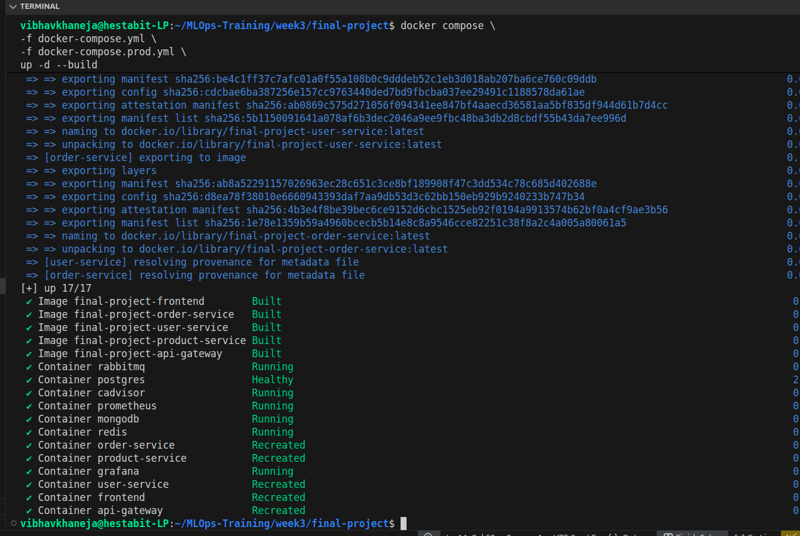
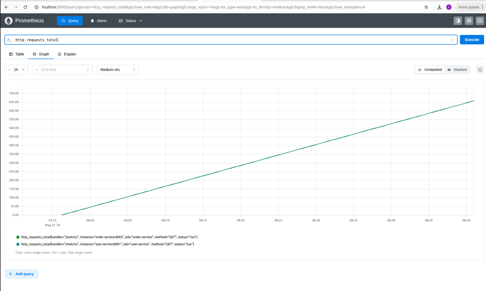

# Conclusion

This project successfully demonstrated a production-style microservices deployment environment using Docker and modern DevOps tools.

The implementation covered not only application deployment but also security, monitoring, networking, backups, observability, and operational reliability.
