# Week 4 — Kubernetes Bootcamp

## Introduction

This repository contains all exercises, scripts, manifests, notes, and practical implementations completed during Week 4 of the DevOps Bootcamp focused entirely on Kubernetes.

The primary goal of this week is to understand Kubernetes architecture, workload orchestration, container lifecycle management, service discovery, scaling, networking, and ingress-based routing using a local Minikube cluster.

---

# Why Kubernetes?

Docker helps us run containers.

However, managing containers manually becomes difficult when applications grow large and distributed.

Problems with managing containers manually:

* Container crashes
* Scaling applications
* Networking between containers
* Load balancing
* Rolling updates
* Service discovery
* Self-healing

Kubernetes solves these problems through orchestration.

---

# What is Kubernetes?

Kubernetes (K8s) is a container orchestration platform that automates:

* deployment
* scaling
* recovery
* networking
* service discovery
* container lifecycle management

Kubernetes follows a **desired state model**.

Instead of manually managing containers, we declare:

> “This is the state I want.”

Kubernetes continuously works to maintain that state automatically.

---

# Day 1 — Kubernetes Architecture & Local Cluster Setup

## Objectives

The purpose of Day 1 was to:

* Understand Kubernetes architecture
* Install a local Kubernetes cluster using Minikube
* Learn kubectl fundamentals
* Explore cluster internals
* Understand namespaces and pods
* Learn Kubernetes resource inspection
* Create and manage the first pod
* Build a cluster health-check utility script

---

# Local Environment Setup

## Tools Installed

| Tool     | Purpose                  |
| -------- | ------------------------ |
| Docker   | Container runtime        |
| kubectl  | Kubernetes CLI           |
| Minikube | Local Kubernetes cluster |

---

# Minikube Architecture

Minikube creates a lightweight local Kubernetes cluster.

In this setup:

* Docker acts as the container runtime
* Minikube creates a Kubernetes node inside Docker
* Kubernetes control plane components run inside the node

Architecture:

```
Laptop
   ↓
Docker Engine
   ↓
Minikube Container
   ↓
Kubernetes Cluster
   ↓
Pods
   ↓
Containers
```

---

# Kubernetes Architecture Learned

Kubernetes is divided into two major sections:

## 1. Control Plane (Brain of Kubernetes)

The control plane manages the entire cluster.

### Components

| Component               | Purpose                   |
| ----------------------- | ------------------------- |
| kube-apiserver          | Entry point to Kubernetes |
| etcd                    | Cluster database          |
| kube-scheduler          | Assigns pods to nodes     |
| kube-controller-manager | Maintains desired state   |

### Responsibilities

* Scheduling workloads
* Monitoring cluster state
* Maintaining desired replicas
* API communication
* Cluster coordination

---

## 2. Worker Node Components

Worker nodes run application workloads.

### Components

| Component         | Purpose                                     |
| ----------------- | ------------------------------------------- |
| kubelet           | Node agent communicating with control plane |
| kube-proxy        | Handles networking                          |
| Container Runtime | Runs containers                             |

---

# Core Kubernetes Concepts Learned

## Cluster

A Kubernetes cluster is the complete Kubernetes environment containing:

* control plane
* worker nodes
* workloads
* networking
* storage

---

## Node

A node is a machine that runs workloads.

In this project:

* Minikube node runs inside Docker
* Single-node cluster setup was used

---

## Namespace

Namespaces provide logical separation inside a cluster.

Used for:

* isolation
* organization
* multi-team environments

### Important Namespaces

| Namespace       | Purpose                        |
| --------------- | ------------------------------ |
| default         | User workloads                 |
| kube-system     | Kubernetes internal components |
| kube-public     | Public cluster data            |
| kube-node-lease | Node heartbeat tracking        |

---

## Pod

A Pod is the smallest deployable unit in Kubernetes.

A pod contains:

* one or more containers
* networking
* storage definitions

Important learning:

> Kubernetes manages Pods, not containers directly.

---

# Commands Practiced

## Cluster Exploration

```
kubectl cluster-info
kubectl get nodes
kubectl get nodes -o wide
kubectl get namespaces
kubectl get pods -A
kubectl get pods -n kube-system
```

---

## Resource Inspection

```
kubectl describe node minikube
kubectl get events -A
kubectl get componentstatuses
```

---

## kubectl Basics

```
kubectl get pods
kubectl get pods -o wide
kubectl get pods -o yaml
kubectl get pods -o json
```

---

## Kubernetes Documentation Commands

```
kubectl explain pod
kubectl explain pod.spec
kubectl explain pod.spec.containers
```

---

# Kubernetes Dashboard

The Kubernetes dashboard was enabled using Minikube addons.

## Addons Enabled

```
minikube addons enable dashboard
minikube addons enable metrics-server
```

The dashboard provides:

* workload visualization
* cluster inspection
* metrics
* namespace monitoring
* pod management

---

# First Kubernetes Pod

A first pod was created imperatively using kubectl.

## Pod Creation

```
kubectl run my-first-pod --image=nginx:alpine
```

---

## Pod Operations Practiced

### Monitor Pod

```
kubectl get pods
kubectl get pods -w
```

### Inspect Pod

```
kubectl describe pod my-first-pod
```

### View Logs

```
kubectl logs my-first-pod
```

### Execute Commands Inside Pod

```
kubectl exec my-first-pod -- ls /usr/share/nginx/html
kubectl exec -it my-first-pod -- /bin/sh
```

### Delete Pod

```
kubectl delete pod my-first-pod
```

---

# Important Kubernetes Learning

## Desired State Management

Kubernetes continuously compares:

* desired state (`spec`)
* actual state (`status`)

and automatically reconciles differences.

---

## Kubernetes Self-Healing

If a managed pod crashes:

* Kubernetes recreates it automatically

This is one of Kubernetes’ most powerful features.

---

## Imperative vs Declarative Management

### Imperative

Direct command-based management.

Example:

```
kubectl run nginx --image=nginx
```

### Declarative

YAML-based desired state definition.

Example:

* Deployment YAML
* Service YAML
* Ingress YAML

Most production Kubernetes environments use declarative management.

---

# Scripts Created

## install_k8s_local.sh

Purpose:

* Install kubectl
* Install Minikube
* Start cluster
* Verify installation

---

## cluster_status.sh

Purpose:

* Cluster health validation
* Node inspection
* Pod summary
* Metrics verification
* Warning detection

---

## Output

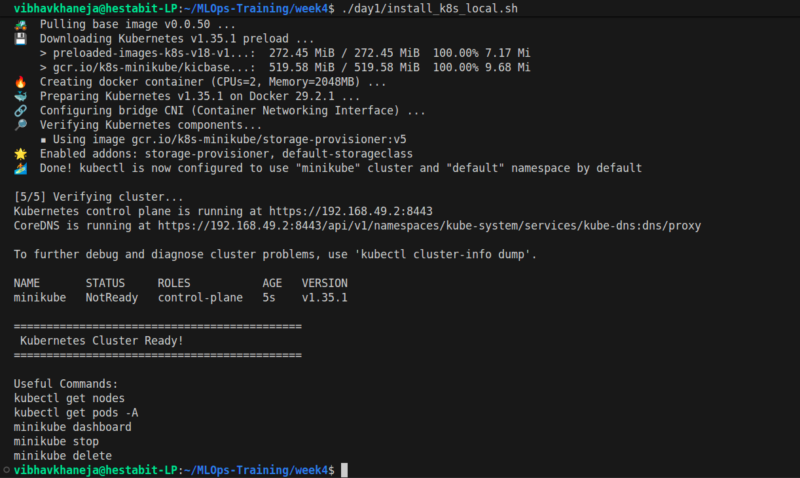
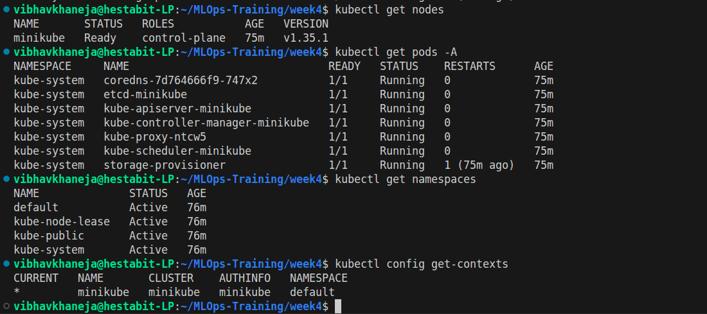
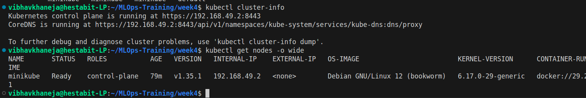
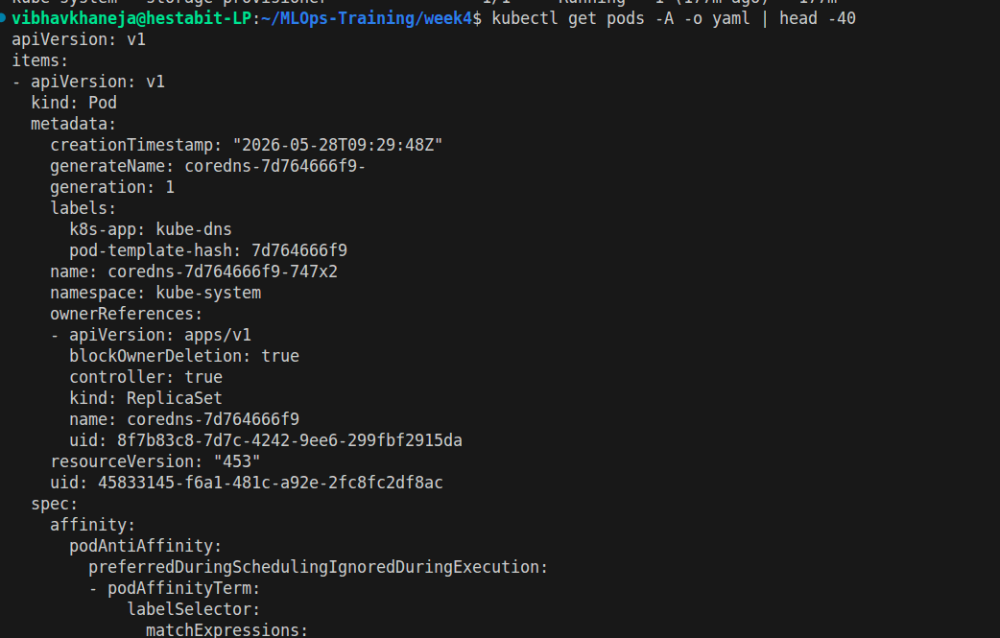
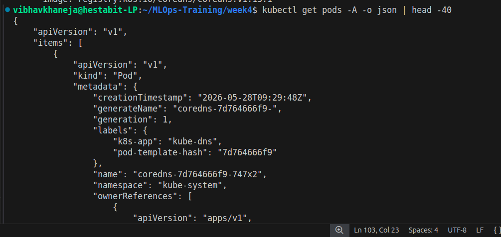
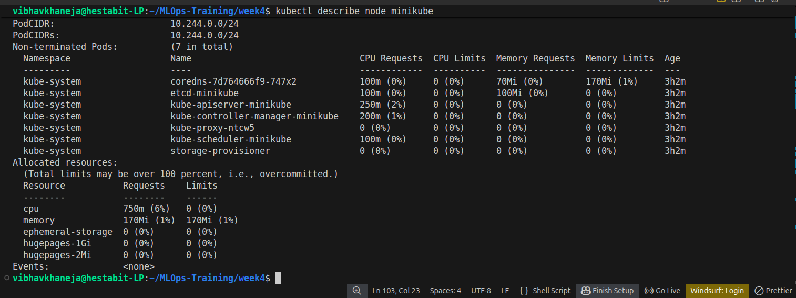
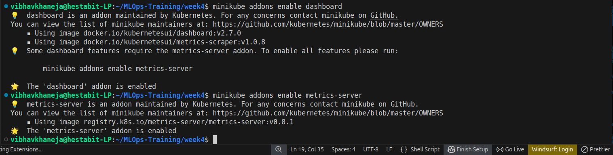
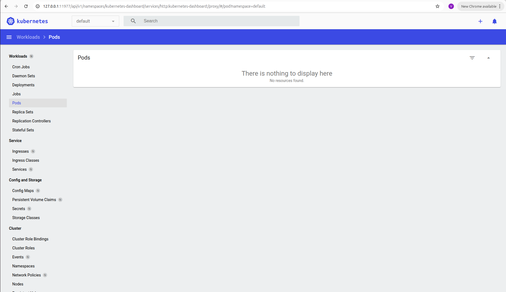
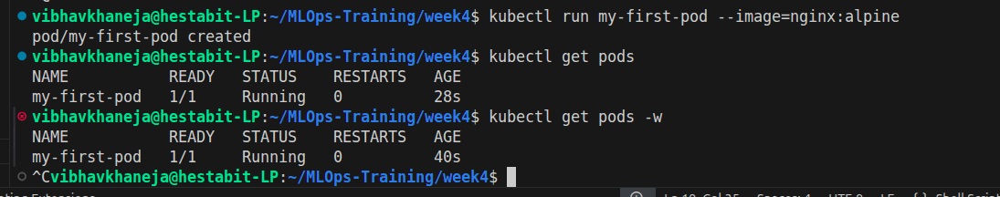
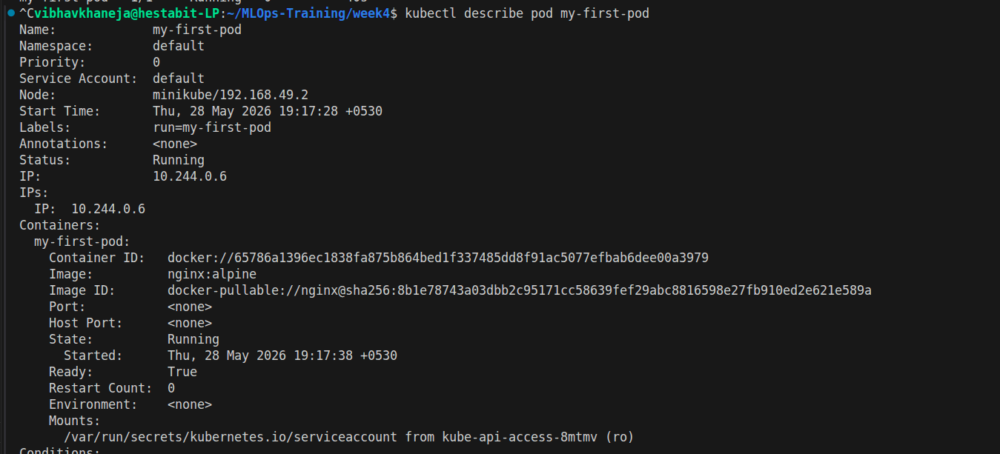
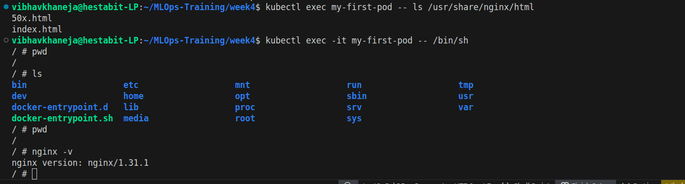
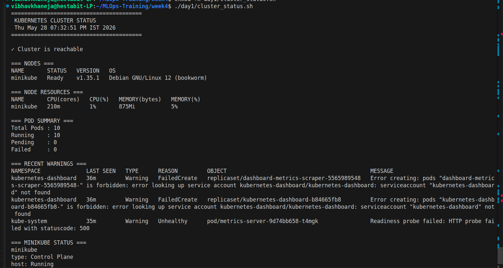

# Key Learnings From Day 1

By the end of Day 1, the following concepts were clearly understood:

* Kubernetes architecture
* Control plane components
* Worker node components
* Cluster and node relationship
* Namespaces
* Pods
* kubectl usage
* Cluster inspection
* Dashboard visualization
* Pod lifecycle
* Kubernetes debugging basics

