# DAY 2 — Kubernetes Pods & Pod Management

## Overview

Day 2 focused on understanding Kubernetes Pods, which are the smallest deployable units in Kubernetes. The exercises covered pod creation, resource management, health probes, multi-container pod architecture, init containers, and debugging techniques.

This day established the foundational operational concepts required for managing workloads inside Kubernetes clusters.

---

# Learning Objectives

* Understand Kubernetes Pod architecture
* Deploy workloads using declarative YAML manifests
* Configure CPU and memory requests/limits
* Implement liveness and readiness probes
* Work with multi-container pod patterns
* Use init containers for pre-start initialization
* Debug failing and crashing pods
* Build reusable pod debugging utilities

---

# Exercises Completed

## 1. Simple Pod Creation

Created and managed a basic NGINX pod using YAML manifests.

### Concepts Learned

* Declarative Kubernetes workflow
* Pod lifecycle
* kubectl apply
* kubectl logs
* kubectl exec
* Port forwarding
* Pod networking basics

### Manifest

```text
manifests/day2/simple-pod.yaml
```

---

## 2. Resource Requests & Limits

Configured CPU and memory constraints for containers.

### Concepts Learned

* Requests vs limits
* Scheduler behavior
* CPU throttling
* OOMKilled scenarios
* Resource monitoring

### Manifest

```text
manifests/day2/pod-with-resources.yaml
```

---

## 3. Liveness & Readiness Probes

Implemented health checks for Kubernetes self-healing and traffic management.

### Concepts Learned

* Liveness probes
* Readiness probes
* Restart behavior
* Self-healing
* Probe timing configuration

### Manifest

```text
manifests/day2/pod-with-probes.yaml
```

---

## 4. Multi-Container Pod (Sidecar Pattern)

Built a pod containing:

* Main NGINX application
* Busybox sidecar log reader

### Concepts Learned

* Sidecar architecture
* Shared volumes
* Shared networking
* emptyDir volumes
* Container collaboration

### Manifest

```text
manifests/day2/multi-container-pod.yaml
```

---

## 5. Init Containers

Implemented init containers for pre-start setup tasks.

### Concepts Learned

* Sequential container initialization
* Shared setup volumes
* Startup dependency handling
* Configuration preparation

### Manifest

```text
manifests/day2/pod-with-init.yaml
```

---

## 6. Pod Debugging

Simulated and analyzed common pod failures.

### Failure Scenarios

* ImagePullBackOff
* ErrImagePull
* CrashLoopBackOff

### Debugging Commands Used

```bash
kubectl describe
kubectl logs
kubectl logs --previous
kubectl exec
kubectl get events
```

---

## 7. Pod Debug Helper Script

Built a reusable shell script for pod troubleshooting.

### Features

* Pod status inspection
* Container listing
* Condition checks
* Event analysis
* Log retrieval
* Resource monitoring

### Script

```text
day2/pod_debug.sh
```

---

# Important Kubernetes Concepts Learned

## Pods

Smallest deployable unit in Kubernetes containing one or more containers.

---

## Requests vs Limits

### Requests

Minimum guaranteed resources used for scheduling.

### Limits

Maximum resources allowed for container execution.

---

## Liveness Probe

Checks whether a container should be restarted.

---

## Readiness Probe

Checks whether a pod can receive traffic.

---

## Sidecar Pattern

A helper container running alongside the main application container.

---

## Init Containers

Containers that run before application containers start.

---

# Key kubectl Commands

## Resource Overview

```bash
kubectl get pods
kubectl get pods -o wide
```

## Detailed Inspection

```bash
kubectl describe pod <pod-name>
```

## Logs

```bash
kubectl logs <pod-name>
kubectl logs <pod-name> --previous
```

## Execute Inside Container

```bash
kubectl exec -it <pod-name> -- /bin/sh
```

## Resource Monitoring

```bash
kubectl top pod
```

---

# Deliverables

Completed deliverables for Day 2:

* manifests/day2/simple-pod.yaml
* manifests/day2/pod-with-resources.yaml
* manifests/day2/pod-with-probes.yaml
* manifests/day2/multi-container-pod.yaml
* manifests/day2/pod-with-init.yaml
* day2/pod_debug.sh
* day2/commands.md
* day2/README.md

---

# Screenshots Collected

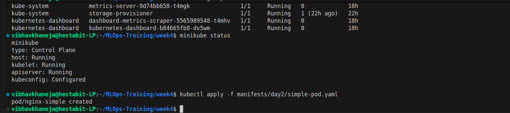
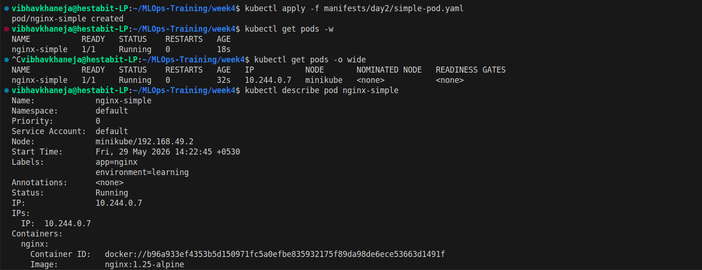
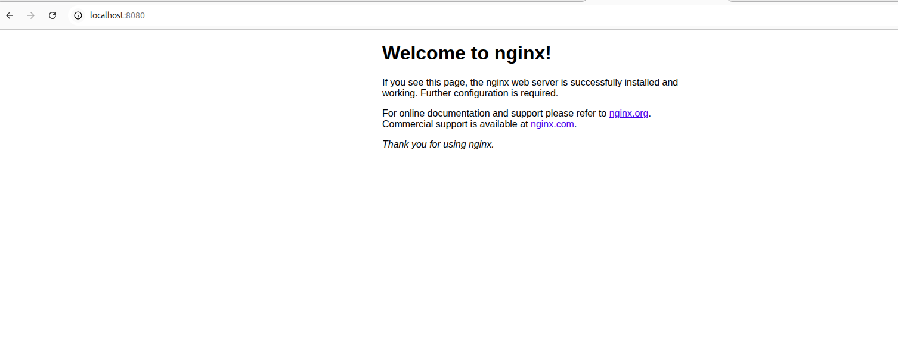
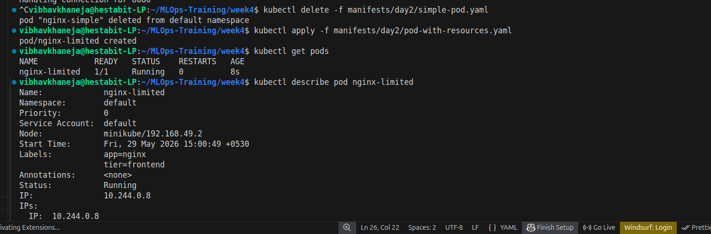
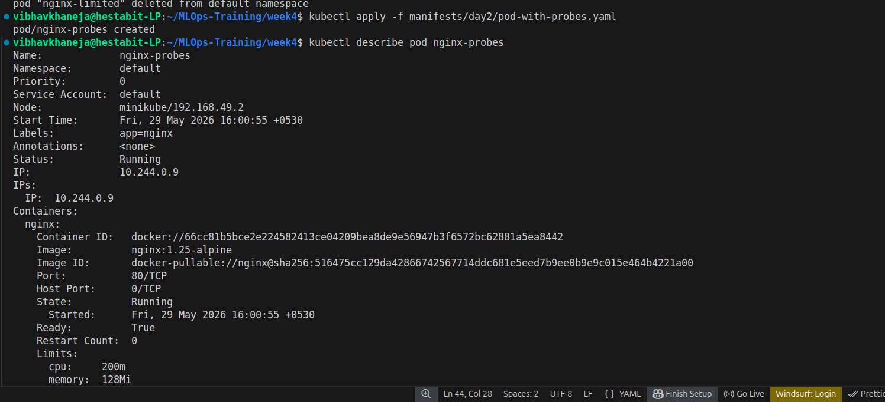
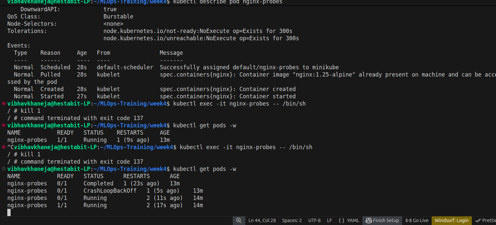
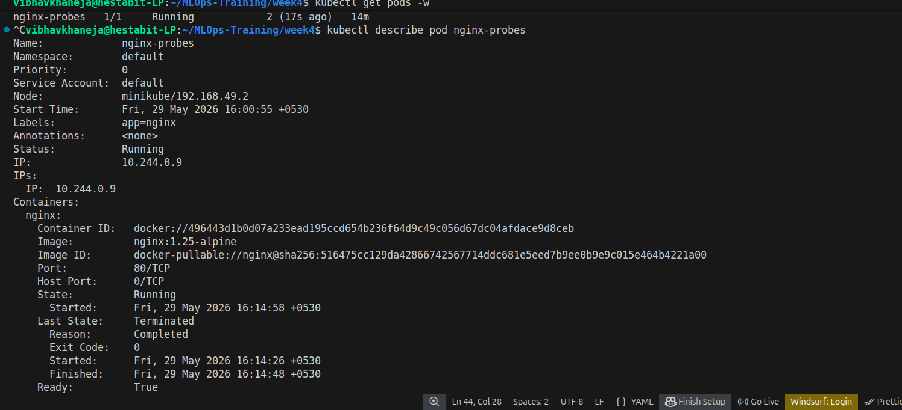
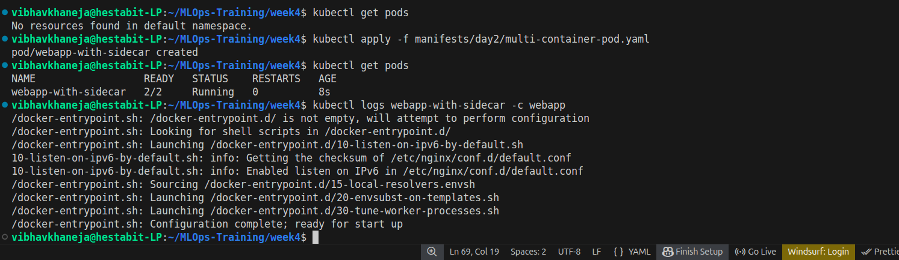
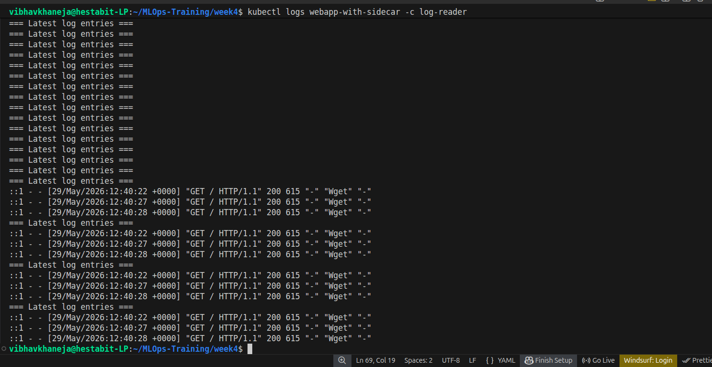
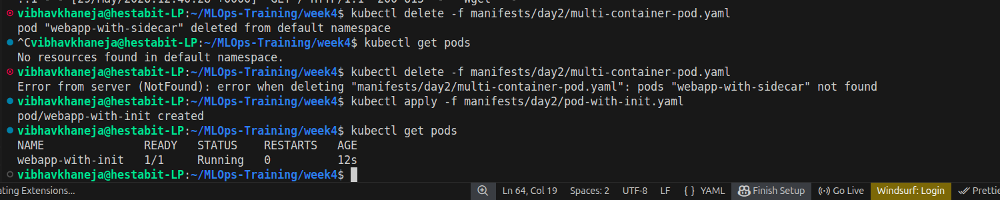
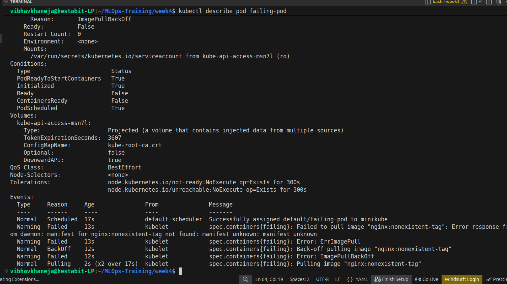
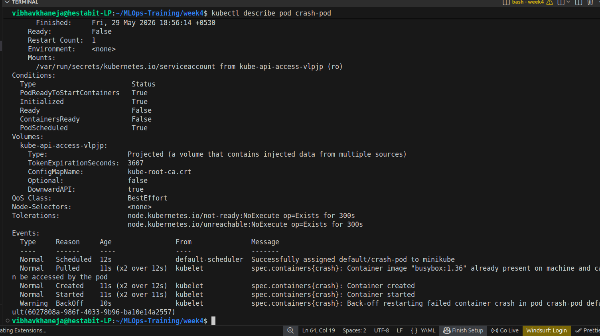
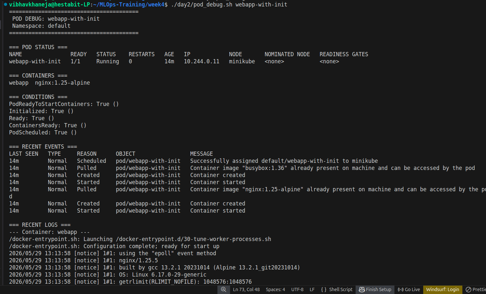

---

# Real-World Relevance

The concepts covered in Day 2 are heavily used in production Kubernetes environments for:

* Microservices deployments
* Application health management
* Monitoring and logging
* Service mesh architecture
* CI/CD pipelines
* Platform engineering
* DevOps automation
* Site Reliability Engineering (SRE)

---

# Conclusion

Day 2 established a strong understanding of Kubernetes Pods, container lifecycle management, health monitoring, resource allocation, and operational debugging workflows.

These concepts form the foundation for higher-level Kubernetes objects such as Deployments, Services, Ingress, and Stateful workloads.
