# DAY 3 — Deployments & Application Lifecycle Management

## Learning Outcomes

By the end of Day 3, you will be able to:

- Understand Kubernetes Deployments and ReplicaSets
- Manage application replicas using Deployments
- Scale applications up and down dynamically
- Perform rolling updates with zero downtime
- Roll back failed deployments safely
- Update container images without modifying manifests
- Deploy complex applications using Init Containers and Volumes
- Automate deployment monitoring and management

---

# Architecture Overview

```text
Deployment
    │
    ▼
ReplicaSet
    │
    ▼
Pods
```

A Deployment manages ReplicaSets, and ReplicaSets ensure the desired number of Pods are running.

---

# Topics Covered

## 1. Deployments

Deployment is a higher-level Kubernetes object that manages Pods through ReplicaSets.

Benefits:

- Self-healing
- Scaling
- Rolling Updates
- Rollbacks
- Version Management

---

## 2. ReplicaSets

ReplicaSets ensure the desired number of Pod replicas are always running.

Example:

Desired Replicas = 3

If one Pod crashes:

ReplicaSet automatically creates a replacement Pod.

---

## 3. Scaling Applications

Scaling changes the number of running Pods.

Example:

```bash
kubectl scale deployment nginx-deployment --replicas=5
```

Scale Up:

```text
3 Pods → 5 Pods
```

Scale Down:

```text
5 Pods → 2 Pods
```

---

## 4. Rolling Updates

Rolling updates allow application upgrades without downtime.

Process:

```text
Old Pod
   ↓
Create New Pod
   ↓
Wait Until Ready
   ↓
Remove Old Pod
```

Benefits:

- Zero downtime
- Safer deployments
- Automatic replacement

---

## 5. Rollout Strategy

```yaml
strategy:
  type: RollingUpdate

  rollingUpdate:
    maxSurge: 1
    maxUnavailable: 0
```

### maxSurge

Additional Pods allowed during updates.

Example:

```text
Desired Replicas = 3
maxSurge = 1

Maximum Pods During Update = 4
```

### maxUnavailable

Number of Pods allowed to be unavailable during updates.

```text
maxUnavailable = 0
```

Guarantees full application availability.

---

## 6. Rollbacks

Rollback restores the previous application version.

Example:

```bash
kubectl rollout undo deployment/nginx-deployment
```

Useful when:

- Bugs are introduced
- Deployment fails
- Application becomes unstable

---

## 7. Image Updates

Update container images without modifying YAML files.

Example:

```bash
kubectl set image deployment/nginx-deployment nginx=nginx:1.26-alpine
```

Triggers a rolling update automatically.

---

## 8. Custom Web Application Deployment

Combined concepts:

- Deployment
- Init Container
- Shared Volume
- Nginx Web Server

Workflow:

```text
Init Container
      │
      ▼
Generate HTML
      │
      ▼
Shared Volume
      │
      ▼
Nginx Serves Content
```

---

# Files Created

## Deployment Manifests

```text
manifests/day3/
├── nginx-deployment.yaml
├── nginx-deployment-v2.yaml
└── webapp-deployment.yaml
```

## Scripts

```text
day3/
└── deployment_manager.sh
```

---

# Deployment Lifecycle

```text
Create Deployment
        │
        ▼
Scale Application
        │
        ▼
Update Image
        │
        ▼
Rolling Update
        │
        ▼
Monitor Rollout
        │
        ▼
Rollback if Needed
```

---

# Screenshots

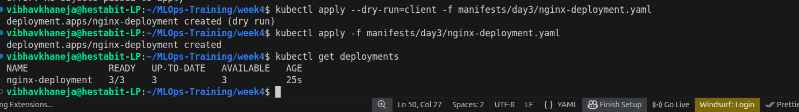
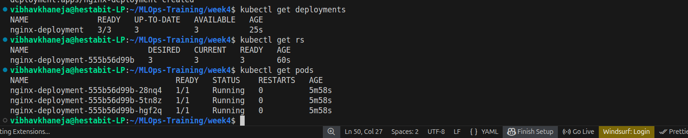
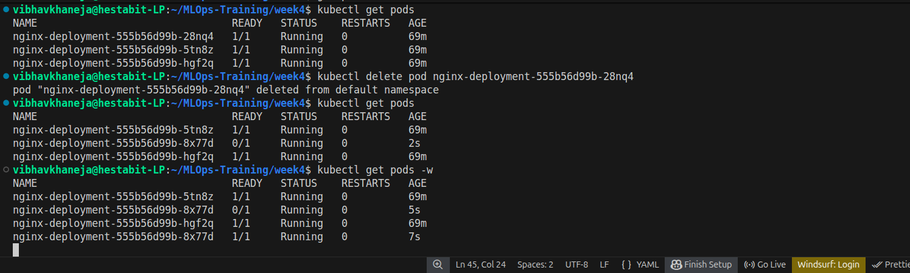
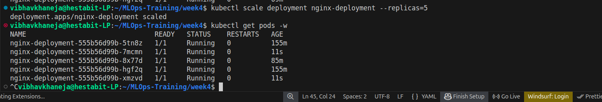
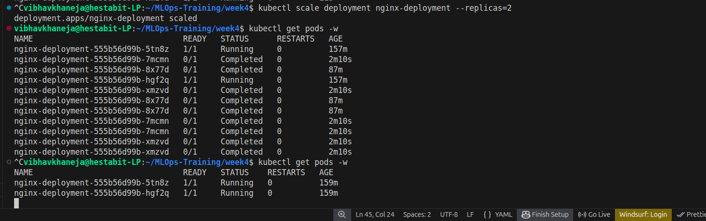
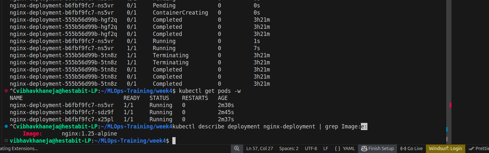
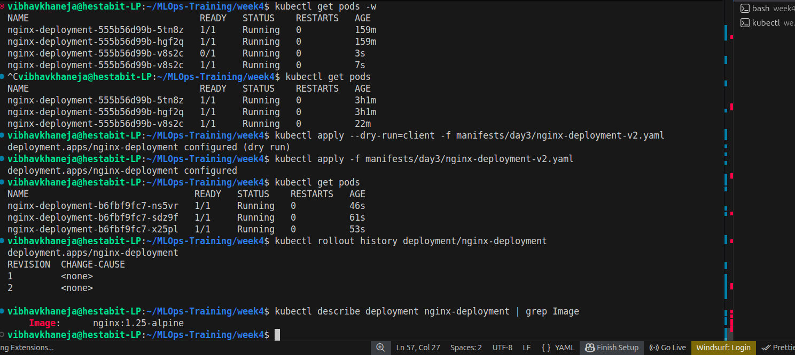
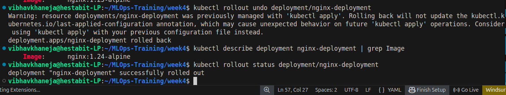
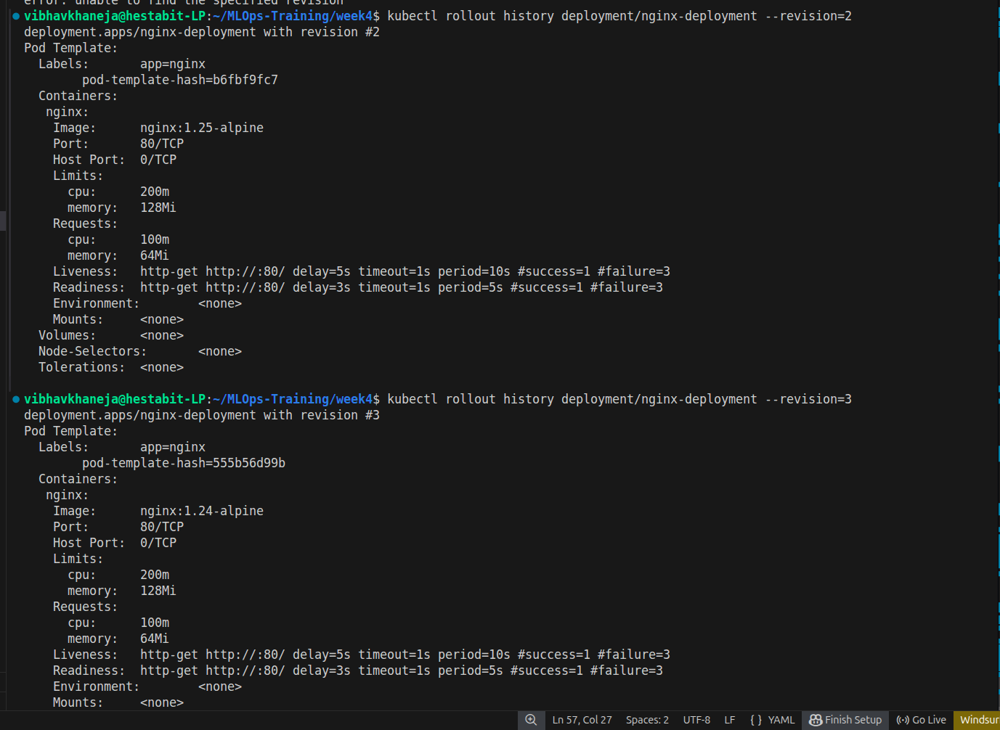
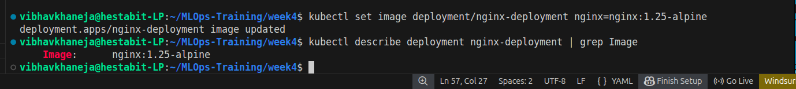
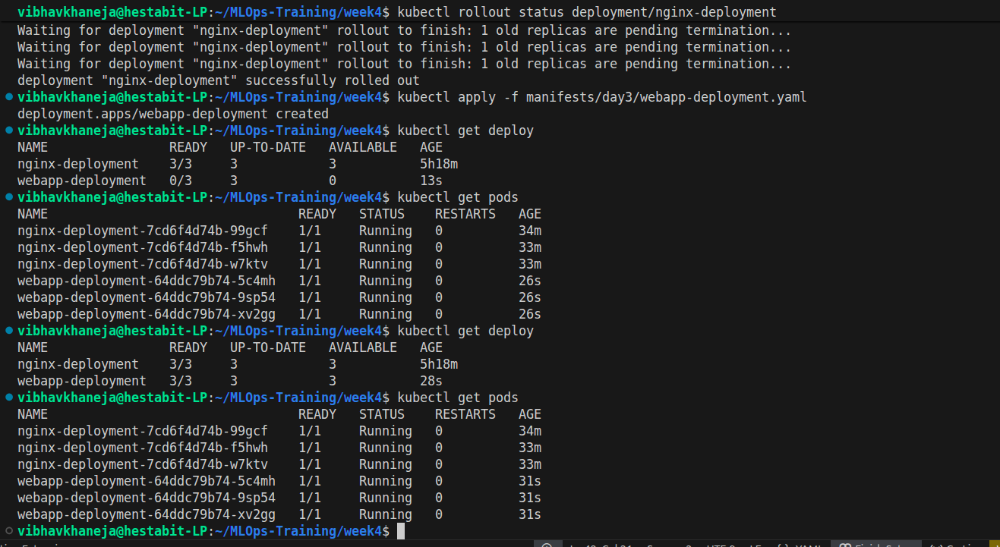
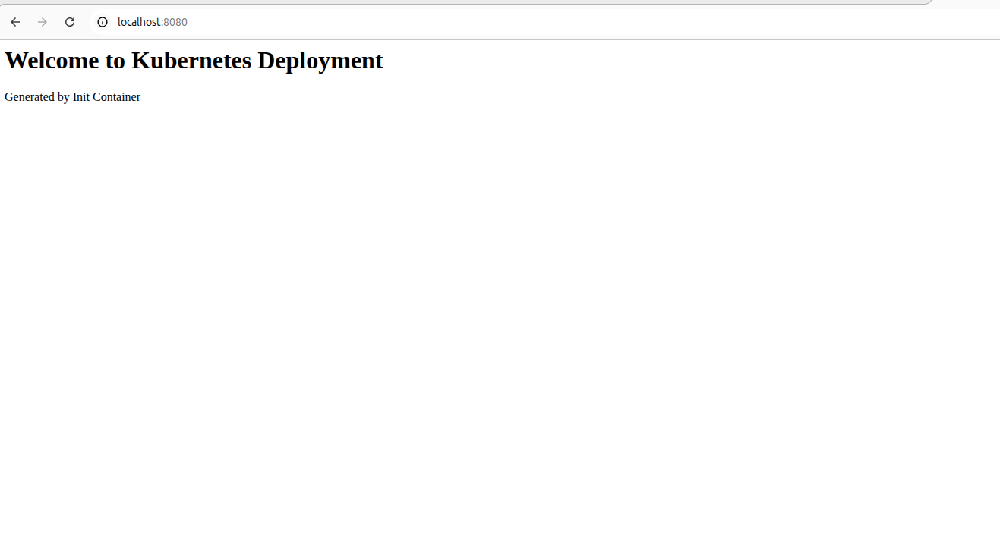


Recommended screenshots:

- deployment-created.png
- replicasets.png
- scaling-up.png
- scaling-down.png
- rolling-update.png
- rollout-history.png
- rollback.png
- webapp-deployment.png
- deployment-manager.png

---

# Key Learnings

- Deployments manage ReplicaSets
- ReplicaSets manage Pods
- Scaling changes Pod count
- Rolling Updates change Pod versions
- Rollbacks restore previous versions
- Image updates create new ReplicaSets
- Deployments provide self-healing and lifecycle management

---

# Interview Questions

### What is the difference between a Pod and a Deployment?

Pod:
- Runs containers

Deployment:
- Manages Pods
- Supports scaling
- Supports rolling updates
- Supports rollbacks

---

### What is a ReplicaSet?

A controller that maintains the desired number of Pod replicas.

---

### What triggers a new ReplicaSet?

Changes inside:

```yaml
spec:
  template:
```

Examples:

- Image changes
- Environment variable changes
- Resource changes

---

### What is a Rolling Update?

A deployment strategy that gradually replaces old Pods with new Pods while keeping the application available.

---

### What is maxSurge?

Extra Pods allowed above the desired replica count during an update.

---

### What is maxUnavailable?

Maximum Pods allowed to be unavailable during an update.

---

### What is Rollback?

Restoring a Deployment to a previous working revision.

---

# Day 3 Status

 Deployments

 ReplicaSets

 Scaling

 Rolling Updates

 Rollbacks

 Image Updates

 Init Containers with Deployments

 Deployment Automation Script

Day 3 Complete