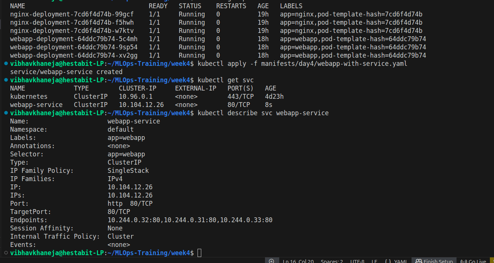
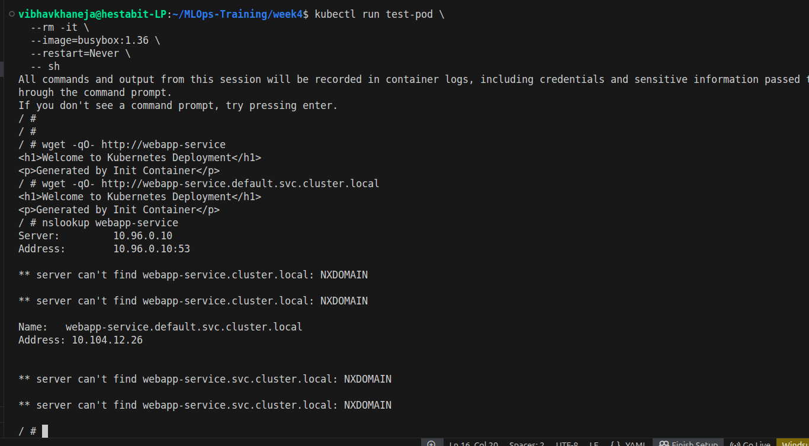
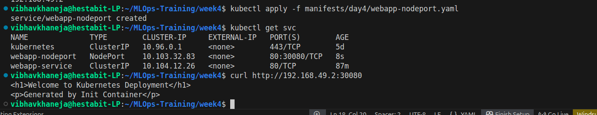
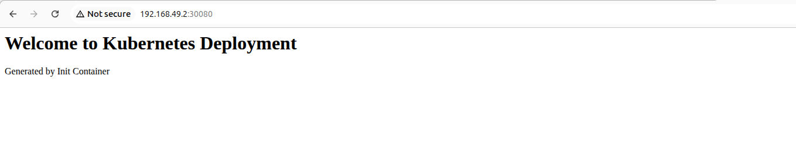
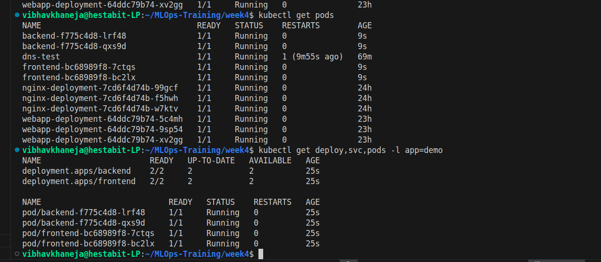
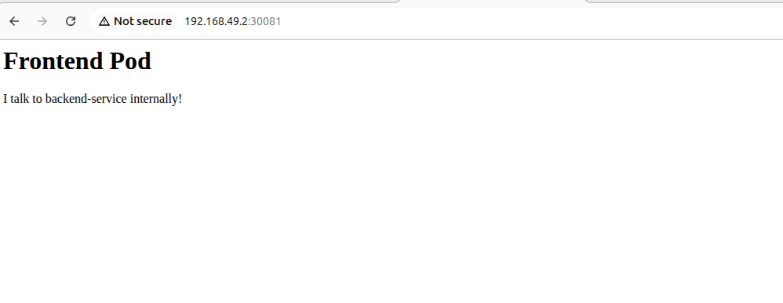
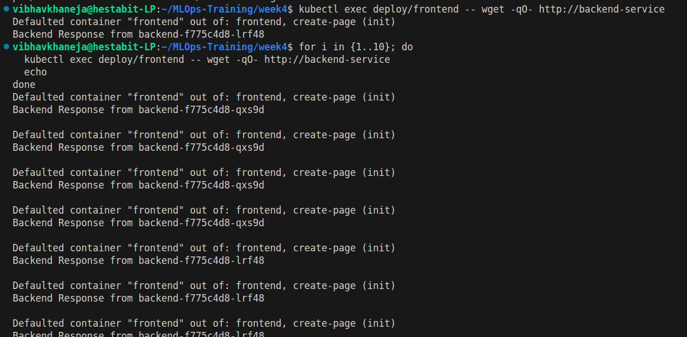
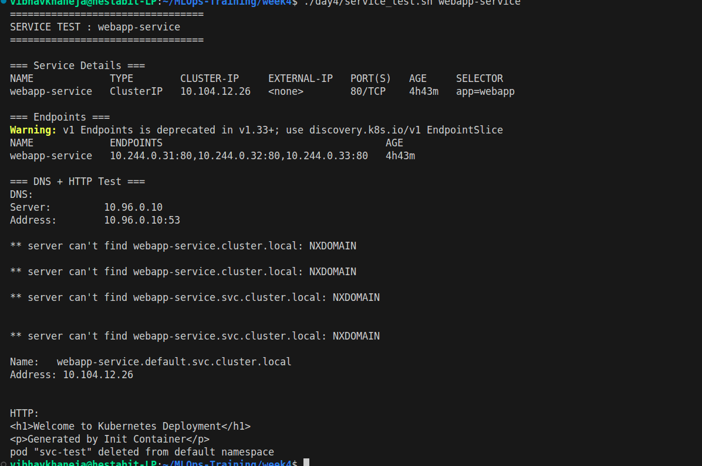
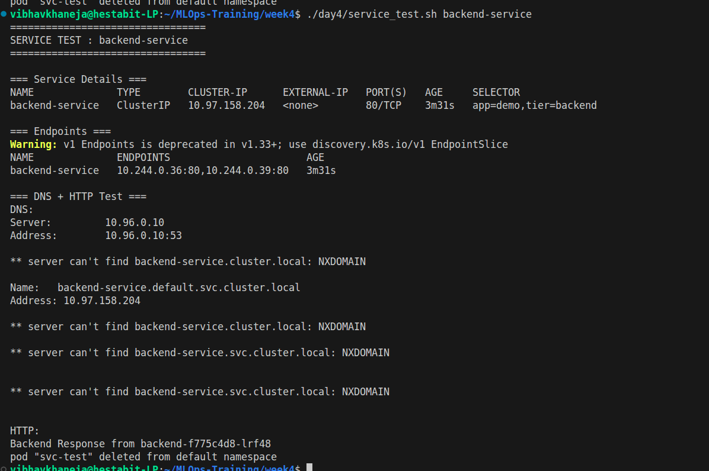

# Day 4 — Kubernetes Services & Networking

## Objective

The goal of Day 4 was to understand how Kubernetes enables communication between applications using Services, DNS-based service discovery, and multi-tier application architectures.

---

# Learning Outcomes

By the end of Day 4, I was able to:

* Create and manage Kubernetes Services
* Understand ClusterIP networking
* Expose applications using NodePort
* Use Kubernetes DNS for service discovery
* Build a multi-tier application architecture
* Verify internal service-to-service communication
* Observe Kubernetes load balancing behavior
* Automate service validation through scripts

---

# Exercise 1 — ClusterIP Service

## Problem

Pods receive dynamic IP addresses.

Example:

```text
Pod A -> 10.244.0.31
Pod B -> 10.244.0.32
Pod C -> 10.244.0.33
```

If a pod is recreated, its IP changes.

Applications cannot reliably communicate using Pod IPs.

---

## Solution

A Kubernetes Service provides:

* Stable virtual IP
* DNS name
* Automatic endpoint management
* Built-in load balancing

Created:

```text
webapp-service
```

Architecture:

```text
Client
   │
   ▼
webapp-service
   │
   ▼
WebApp Pods
```

---

## Key Learning

Services decouple applications from Pod lifecycle events.

Applications communicate with Services instead of individual Pods.

---

# Exercise 2 — NodePort Service

## Objective

Expose a Kubernetes application outside the cluster.

Created:

```text
webapp-nodeport
```

NodePort:

```text
30080
```

Access:

```text
http://<minikube-ip>:30080
```

Architecture:

```text
Browser
   │
   ▼
NodePort Service
   │
   ▼
Application Pods
```

---

## Key Learning

NodePort allows external traffic to reach applications running inside Kubernetes.

Useful for development and testing environments.

---

# Exercise 3 — DNS Discovery

## Objective

Understand how Kubernetes applications locate Services.

Created:

```text
dns-test
```

BusyBox pod used to perform DNS lookups.

Examples:

```text
webapp-service

webapp-service.default.svc.cluster.local
```

DNS Flow:

```text
Service Name
      │
      ▼
CoreDNS
      │
      ▼
ClusterIP
      │
      ▼
Application Pods
```

---

## Key Learning

Applications should use Service names rather than Pod IPs or Service IPs.

Kubernetes DNS automatically resolves Service names to the correct destination.

---

# Exercise 4 — Multi-Tier Application

## Objective

Build a realistic application architecture.

Components:

### Frontend

* Deployment
* NodePort Service

### Backend

* Deployment
* ClusterIP Service

Architecture:

```text
User
   │
   ▼
Frontend Service
   │
   ▼
Frontend Pods
   │
   ▼
Backend Service
   │
   ▼
Backend Pods
```

---

## Service-to-Service Communication

Frontend accessed Backend using:

```text
http://backend-service
```

No Pod IPs were used.

Communication relied entirely on:

* Service abstraction
* Kubernetes DNS

---

## Key Learning

This is the foundation of microservice communication in Kubernetes.

Applications interact through Services rather than direct Pod networking.

---

# Exercise 5 — Service Testing Script

Created:

```text
service_test.sh
```

Purpose:

* Validate Services
* Check Endpoints
* Verify DNS resolution
* Test HTTP connectivity

Benefits:

* Faster troubleshooting
* Repeatable validation process
* Automation of common checks

---

# Important Concepts Learned

## ClusterIP

Internal-only Service.

Used for communication within the cluster.

---

## NodePort

Exposes application externally using:

```text
<NodeIP>:<NodePort>
```

---

## DNS Service Discovery

Applications communicate using:

```text
backend-service
database-service
redis-service
```

instead of IP addresses.

---

## Endpoints

Services automatically maintain a list of matching Pod IPs.

Example:

```text
webapp-service
 ├─ 10.244.0.31
 ├─ 10.244.0.32
 └─ 10.244.0.33
```

---

## Load Balancing

Traffic sent to a Service is distributed across healthy Pods.

Kubernetes handles this automatically.

---

# Deliverables

```text
day4/
├── service_test.sh
├── README.md
├── commands.md
└── screenshots/

manifests/day4/
├── webapp-with-service.yaml
├── webapp-nodeport.yaml
├── dns-test.yaml
└── multi-tier-app.yaml
```

---

# Screenshots Captured











---

# Summary

Day 4 introduced the networking layer of Kubernetes.

Services provided stable communication endpoints, DNS enabled service discovery, NodePort exposed workloads externally, and multi-tier applications demonstrated how microservices communicate within a Kubernetes cluster.

These concepts form the foundation for Ingress controllers, API gateways, and production-grade Kubernetes application architectures.
